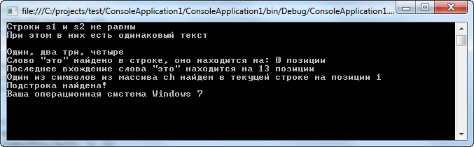
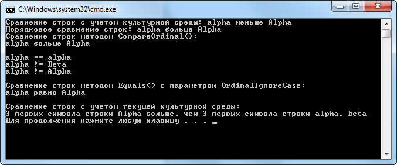
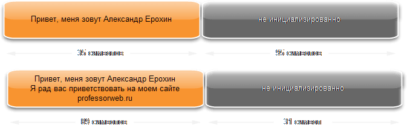
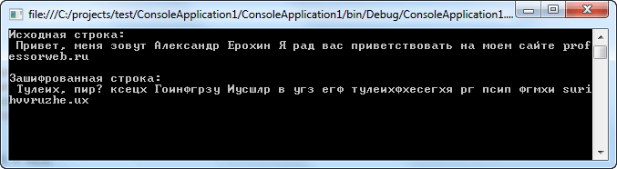
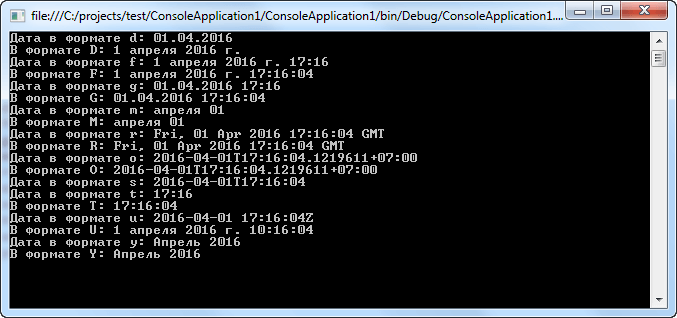

<table style="width: 100%;"><tr><td style="width: 40%;">
<a href="../articles/t3l1_3.md">Массивы
</a></td><td style="width: 20%;">
<a href="../readme.md">Содержание
</a></td><td style="width: 40%;">
<a href="../articles/cs_misc_types.md">Множества. Кортежи. Работа с типом DataTime.
</a></td><tr></table>

# Строки. Объявление строковых типов данных. Поиск, удаление, замена и добавление символов в строке. Операции со строками. Стандартные функции и процедуры работы со строками.

## Строки

С точки зрения регулярного программирования строковый тип данных *string* относится к числу самых важных в C#. Этот тип определяет и поддерживает символьные строки. В целом ряде других языков программирования строка представляет собой массив символов. А в C# строки являются объектами. Следовательно, тип *string* относится к числу ссылочных.

### Построение строк

Самый простой способ построить символьную строку — воспользоваться строковым литералом. Например, в следующей строке кода переменной ссылки на строку *Stroka* присваивается ссылка на строковый литерал:

```c#
string Stroka = "Пример строки";
```

В данном случае переменная *Stroka* инициализируется последовательностью символов "Пример строки". Объект типа *string* можно также создать из массива типа *char*. Например:

```c#
char[] CharArray = {'e', 'x', 'a', 'm', 'p', 'l', 'e'};
string Stroka = new string(chararray);
```

Как только объект типа *string* будет создан, его можно использовать везде, где только требуется строка текста, заключенного в кавычки.

### Постоянство строк

Как ни странно, содержимое объекта типа *string* не подлежит изменению. Это означает, что однажды созданную последовательность символов изменить нельзя. Но данное ограничение способствует более эффективной реализации символьных строк. Поэтому этот, на первый взгляд, очевидный недостаток на самом деле превращается в преимущество. Так, если требуется строка в качестве разновидности уже имеющейся строки, то для этой цели следует создать новую строку, содержащую все необходимые изменения. А поскольку неиспользуемые строковые объекты автоматически собираются в "мусор", то о дальнейшей судьбе ненужных строк можно даже не беспокоиться.

Следует, однако, подчеркнуть, что переменные ссылки на строки (т.е. объекты типа *string*) подлежат изменению, а следовательно, они могут ссылаться на другой объект. Но содержимое самого объекта типа *string* не меняется после его создания.

### Работа со строками

В классе *System.String* предоставляется набор методов для определения длины символьных данных, поиска подстроки в текущей строке, преобразования символов из верхнего регистра в нижний и наоборот, и т.д. Далее мы рассмотрим этот класс более подробно.

### Поле, индексатор и свойство класса String

В классе String определено единственное поле:

```c#
public static readonly string Empty;
```

Поле *Empty* обозначает пустую строку, т.е. такую строку, которая не содержит символы. Этим оно отличается от пустой ссылки типа *String*, которая просто делается на несуществующий объект.

Помимо этого, в классе *String* определен единственный индексатор, доступный только для чтения:

```cs
public char this[int index] { get; }
```

Этот индексатор позволяет получить символ по указанному индексу. Индексация строк, как и массивов, начинается с нуля. Объекты типа *String* отличаются постоянством и не изменяются, поэтому вполне логично, что в классе *String* поддерживается индексатор, доступный только для чтения.

И наконец, в классе *String* определено единственное свойство, доступное только для чтения:

```cs
public int Length { get; }
```

Свойство *Length* возвращает количество символов в строке. В примере ниже показано использование индексатора и свойства *Length*:

```cs
using System;

class Example
{
    static void Main()
    {
        string Stroka = "Простая строка";

        // Получить длину строки и 6й символ в строке используя индексатор
        Console.WriteLine("Длина строки - {0}, 6й символ - '{1}'",
            Stroka.Length, Stroka[5]);
    }
}
```

### Операторы класса String

В классе *String* перегружаются два следующих оператора: `==` и `!=`. Оператор `==` служит для проверки двух символьных строк на равенство. Когда оператор `==` применяется к ссылкам на объекты, он обычно проверяет, делаются ли обе ссылки на один и тот же объект. А когда оператор `==` применяется к ссылкам на объекты типа *String*, то на предмет равенства сравнивается содержимое самих строк. Это же относится и к оператору `!=`. Когда он применяется к ссылкам на объекты типа *String*, то на предмет неравенства сравнивается содержимое самих строк. В то же время другие операторы отношения, в том числе `<` и `>=`, сравнивают ссылки на объекты типа String таким же образом, как и на объекты других типов. А для того чтобы проверить, является ли одна строка больше другой, следует вызвать метод *Compare()*, определенный в классе *String*.

Как станет ясно дальше, во многих видах сравнения символьных строк используются сведения о культурной среде. Но это не относится к операторам `==` и `!=`. Ведь они просто сравнивают порядковые значения символов в строках. (Иными словами, они сравнивают двоичные значения символов, не видоизмененные нормами культурной среды, т.е. региональными стандартами.) Следовательно, эти операторы выполняют сравнение строк без учета регистра и настроек культурной среды.

### Методы класса String

#### Compare()	

Сравнение строк

* ``public static int Compare(string strA, string strB)``

    Статический метод, сравнивает строку strA со строкой strB. Возвращает положительное значение, если строка strA больше строки strB; отрицательное значение, если строка strA меньше строки strB; и нуль, если строки strA и strB равны. Сравнение выполняется с учетом регистра и культурной среды.

* ``public static int Compare(string strA, string strB, bool ignoreCase)``

    Если параметр ignoreCase принимает логическое значение true, то при сравнении не учитываются различия между прописным и строчным вариантами букв. В противном случае эти различия учитываются.

* ``public static int Compare(string strA, string strB, StringComparison comparisonType)``

    Параметр comparisonType определяет конкретный способ сравнения строк (перечисление: *CurrentCulture, CurrentCultureIgnoreCase, InvariantCulture, InvariantCultureIgnoreCase, Ordinal, OrdinalIgnoreCase*). 

* ``public static int Compare(string strA, string strB, bool ignoreCase, CultureInfo culture)``

    Класс CultureInfo определен в пространстве имен System.Globalization.

* ``public static int Compare(string strA, int indexA, string strB, int indexB, int length)``

    Сравнивает части строк strA и strB. Сравнение начинается со строковых элементов strA[indexA] и strB[indexB] и включает количество символов, определяемых параметром *length*. Метод возвращает положительное значение, если часть строки strA больше части строки strB; отрицательное значение, если часть строки strA меньше части строки strB; и нуль, если сравниваемые части строк strA и strB равны. Сравнение выполняется с учетом регистра и культурной среды.

* ``public static int Compare(string strA, int indexA, string strB, int indexB, int length, bool ignoreCase)``

* ``public static int Compare(string strA, int indexA, string strB, int indexB, int length, StringComparison comparisonType)``

* ``public static int Compare(string strA, int indexA, string strB, int indexB, int length, bool ignoreCase, CultureInfo culture)``


#### CompareOrdinal()	

Делает то же, что и метод Compare(), но без учета локальных установок

* ``public static int CompareOrdinal(string strA, string strB)``

* ``public static int CompareOrdinal(string strA, int indexA, string strB, int indexB, int count)``


#### CompareTo()	

* ``public int CompareTo(object value)``

    Сравнивает вызывающую строку со строковым представлением объекта value. Возвращает положительное значение, если вызывающая строка больше строки value; отрицательное значение, если вызывающая строка меньше строки value; и нуль, если сравниваемые строки равны

* ``public int CompareTo(string strB)``

    Сравнивает вызывающую строку со строкой strB

#### Equals()	

* ``public override bool Equals(object obj)``

    Возвращает логическое значение true, если вызывающая строка содержит ту же последовательность символов, что и строковое представление объекта obj. Выполняется порядковое сравнение с учетом регистра, но без учета культурной среды

* ``public bool Equals(string value)``

* ``public bool Equals(string value, StringComparison comparisonType)``

    Возвращает логическое значение true, если вызывающая строка содержит ту же последовательность символов, что и строка value. Выполняется порядковое сравнение с учетом регистра, но без учета культурной среды. Параметр comparisonType определяет конкретный способ сравнения строк

* ``public static bool Equals(string a, string b)``

* ``public static bool Equals(string a, string b, StringComparison comparisonType)``

    Возвращает логическое значение true, если строка a содержит ту же последовательность символов, что и строка b. Выполняется порядковое сравнение с учетом регистра, но без учета культурной среды. Параметр comparisonType определяет конкретный способ сравнения строк

#### Concat()	

Конкатенация (соединение) строк

* ``public static string Concat(string str0, string str1);``
* ``public static string Concat(params string[] values);``


#### Contains()

Поиск в строке

* ``public bool Contains(string value)``

	Метод, который позволяет определить, содержится ли в строке определенная подстрока (value)

#### StartsWith()	

Возвращает логическое значение true, если вызывающая строка начинается с подстроки value. В противном случае возвращается логическое значение false. Параметр comparisonType определяет конкретный способ выполнения поиска

* ``public bool StartsWith(string value)``
* ``public bool StartsWith(string value, StringComparison comparisonType)``


#### EndsWith()	

Возвращает логическое значение true, если вызывающая строка оканчивается подстрокой value. В противном случае возвращает логическое значение false. Параметр comparisonType определяет конкретный способ поиска

* public bool EndsWith(string value)
* public bool EndsWith(string value, StringComparison comparisonType)	

#### IndexOf()

Находит **первое** вхождение заданной подстроки или символа в строке. Если искомый символ или подстрока не обнаружены, то возвращается значение -1

* public int IndexOf(char value)
* public int IndexOf(string value)	

Возвращает индекс первого вхождения символа или подстроки value в вызывающей строке. Поиск начинается с элемента, указываемого по индексу startIndex, и охватывает число элементов, определяемых параметром count (если указан). Метод возвращает значение -1, если искомый символ или подстрока не обнаружен

* public int IndexOf(char value, int startIndex)
* public int IndexOf(string value, int startIndex)
* public int IndexOf(char value, int startIndex, int count)
* public int IndexOf(string value, int startIndex, int count)	

#### LastIndexOf()	

Перегруженные версии аналогичны методу IndexOf()	

То же, что IndexOf, но находит последнее вхождение символа или подстроки, а не первое

#### IndexOfAny()	

Возвращает индекс первого вхождения любого символа из массива anyOf, обнаруженного в вызывающей строке. Поиск начинается с элемента, указываемого по индексу startIndex, и охватывает число элементов, определяемых параметром count (если они указаны). Метод возвращает значение -1, если не обнаружено совпадение ни с одним из символов из массива anyOf. Поиск осуществляется порядковым способом

* public int IndexOfAny(char[] anyOf)
* public int IndexOfAny(char[] anyOf, int startIndex)
* public int IndexOfAny(char[] anyOf, int startIndex, int count)

#### LastIndexOfAny	

Перегруженные версии аналогичны методу IndexOfAny()	

Возвращает индекс последнего вхождения любого символа из массива anyOf, обнаруженного в вызывающей строке

#### Разделение и соединение строк

#### Split	

Метод, возвращающий массив string с присутствующими в данном экземпляре подстроками внутри, которые отделяются друг от друга элементами из указанного массива char или string.

* public string[] Split(params char[] separator)
* public string[] Split(params char[] separator, int count)	

В первой форме метода Split() вызывающая строка разделяется на составные части. В итоге возвращается массив, содержащий подстроки, полученные из вызывающей строки. Символы, ограничивающие эти подстроки, передаются в массиве separator. Если массив separator пуст или ссылается на пустую строку, то в качестве разделителя подстрок используется пробел. А во второй форме данного метода возвращается количество подстрок, определяемых параметром count.

---

* public string[] Split(params char[] separator, StringSplitOptions options)

* public string[] Split(string[] separator, StringSplitOptions options)

* public string[] Split(params char[] separator, int count, StringSplitOptions options)

* public string[] Split(string[] separator, int count, StringSplitOptions options)	

В двух первых формах метода Split() вызывающая строка разделяется на части и возвращается массив, содержащий подстроки, полученные из вызывающей строки. Символы, разделяющие эти подстроки, передаются в массиве separator. Если массив separator пуст, то в качестве разделителя используется пробел. А в третьей и четвертой формах данного метода возвращается количество строк, ограничиваемое параметром count.

Но во всех формах параметр options обозначает конкретный способ обработки пустых строк, которые образуются в том случае, если два разделителя оказываются рядом. В перечислении StringSplitOptions определяются только два значения: None и RemoveEmptyEntries. Если параметр options принимает значение None, то пустые строки включаются в конечный результат разделения исходной строки. А если параметр options принимает значение RemoveEmptyEntries, то пустые строки исключаются из конечного результата разделения исходной строки.

#### Join()	

Строит новую строку, комбинируя содержимое массива строк.

* public static string Join(string separator, string[] value)
* public static string Join(string separator, string[] value, int startIndex, int count)	

В первой форме метода Join() возвращается строка, состоящая из сцепляемых подстрок, передаваемых в массиве value. Во второй форме также возвращается строка, состоящая из подстрок, передаваемых в масс*иве value, но они сцепляются в определенном количестве count, начиная с элемента массива value[startIndex]. В обеих формах каждая последующая строка отделяется от предыдущей разделительной строкой, определяемой параметром separator.

#### Заполнение и обрезка строк

#### Trim()	

Метод, который позволяет удалять все вхождения определенного набора символов с начала и конца текущей строки.

* public string Trim()
* public string Trim(params char[] trimChars)	

В первой форме метода Trim() из вызывающей строки удаляются начальные и конечные пробелы. А во второй форме этого метода удаляются начальные и конечные вхождения в вызывающей строке символов из массива trimChars. В обеих формах возвращается получающаяся в итоге строка.

#### PadLeft()	

Позволяет дополнить строку символами слева.

* public string PadLeft(int totalWidth)
* public string PadLeft(int totalWidth, char paddingChar)	

В первой форме метода PadLeft() вводятся пробелы с левой стороны вызывающей строки, чтобы ее общая длина стала равной значению параметра totalWidth. А во второй форме данного метода символы, обозначаемые параметром paddingChar, вводятся с левой стороны вызывающей строки, чтобы ее общая длина стала равной значению параметра totalWidth. В обеих формах возвращается получающаяся в итоге строка. Если значение параметра totalWidth меньше длины вызывающей строки, то возвращается копия неизмененной вызывающей строки.

#### PadRight()	

Аналогично PadLeft()	

Позволяет дополнить строку символами справа.

#### Вставка, удаление и замена строк

#### Insert()	

* public string Insert(int startIndex, string value)	

Используется для вставки одной строки в другую, где value обозначает строку, вставляемую в вызывающую строку по индексу startIndex. Метод возвращает получившуюся в итоге строку.

#### Remove()	

* public string Remove(int startIndex)
* public string Remove(int startIndex, int count)	

Используется для удаления части строки. В первой форме метода Remove() удаление выполняется, начиная с места, указываемого по индексу startIndex, и продолжается до конца строки. А во второй форме данного метода из строки удаляется количество символов, определяемое параметром count, начиная с места, указываемого по индексу startIndex.

#### Replace()	

* public string Replace(char oldChar, char newChar)
* public string Replace(string oldValue, string newValue)	

Используется для замены части строки. В первой форме метода Replace() все вхождения символа oldChar в вызывающей строке заменяются символом newChar. А во второй форме данного метода все вхождения строки oldValue в вызывающей строке заменяются строкой newValue.

#### Смена регистра

#### ToUpper()	

* public string ToUpper()	

Делает заглавными все буквы в вызывающей строке.

#### ToLower()	

* public string ToLower()	

Делает строчными все буквы в вызывающей строке.

#### Получение подстроки из строки
#### Substring()	

* public string Substring(int startIndex)
* public string Substring(int startIndex, int length)	

В первой форме метода Substring() подстрока извлекается, начиная с места, обозначаемого параметром startIndex, и до конца вызывающей строки. А во второй форме данного метода извлекается подстрока, состоящая из количества символов, определяемых параметром length, начиная с места, обозначаемого параметром startIndex.

Пример следующей программы использует несколько из вышеуказанных методов:

```cs
using System;
using System.Collections.Generic;
using System.Linq;
using System.Text;

namespace ConsoleApplication1
{
    class Program
    {
        static void Main(string[] args)
        {
            // Сравним первые две строки
            string s1 = "это строка";
            string s2 = "это текст, а это строка";

            if (String.CompareOrdinal(s1, s2) != 0)
                Console.WriteLine("Строки s1 и s2 не равны");

            if (String.Compare(s1, 0, s2, 13, 10, true) == 0)
                Console.WriteLine("При этом в них есть одинаковый текст");

            // Конкатенация строк
            Console.WriteLine(String.Concat("\n" + "Один, два ","три, четыре"));

            // Поиск в строке
             // Первое вхождение подстроки
             if (s2.IndexOf("это") != -1)
                Console.WriteLine("Слово \"это\" найдено в строке, оно "+ 
                 "находится на: {0} позиции", s2.IndexOf("это"));

             // Последнее вхождение подстроки
             if (s2.LastIndexOf("это") != -1)
                 Console.WriteLine("Последнее вхождение слова \"это\" находится "
                     + "на {0} позиции", s2.LastIndexOf("это"));

             // Поиск из массива символов
             char[] myCh = {'Ы','х','т'};
             if (s2.IndexOfAny(myCh) != -1)
                 Console.WriteLine("Один из символов из массива ch "+
                     "найден в текущей строке на позиции {0}", s2.IndexOfAny(myCh));
             
             // Определяем начинается ли строка с заданной подстроки
             if (s2.StartsWith("это текст") == true)
                 Console.WriteLine("Подстрока найдена!");

             // Определяем содержится ли в строке подстрока
             // на примере определения ОС пользователя
             string myOS = Environment.OSVersion.ToString();
             if (myOS.Contains("NT 5.1"))
                 Console.WriteLine("Ваша операционная система Windows XP");
             else if (myOS.Contains("NT 6.1"))
                Console.WriteLine("Ваша операционная система Windows 7");
            
            Console.ReadLine();
        }

    }
}
```



### Немного о сравнении строк в C#

Вероятно, из всех операций обработки символьных строк чаще всего выполняется сравнение одной строки с другой. Прежде чем рассматривать какие-либо методы сравнения строк, следует подчеркнуть следующее: сравнение строк может быть выполнено в среде .NET Framework двумя основными способами:

**Во-первых**, сравнение может отражать обычаи и нормы отдельной культурной среды, которые зачастую представляют собой настройки культурной среды, вступающие в силу при выполнении программы. Это стандартное поведение некоторых, хотя и не всех методов сравнения.

И **во-вторых**, сравнение может быть выполнено независимо от настроек культурной среды только по порядковым значениям символов, составляющих строку. Вообще говоря, при сравнении строк без учета культурной среды используется лексикографический порядок (и лингвистические особенности), чтобы определить, является ли одна строка больше, меньше или равной другой строке. При порядковом сравнении строки просто упорядочиваются на основании невидоизмененного значения каждого символа.

В силу отличий способов сравнения строк с учетом культурной среды и порядкового сравнения, а также последствий каждого такого сравнения настоятельно рекомендуется руководствоваться лучшими методиками, предлагаемыми в настоящее время корпорацией Microsoft. Ведь выбор неверного способа сравнения строк может привести к неправильной работе программы, когда она эксплуатируется в среде, отличающей от той, в которой она разработана.

Выбор способа сравнения символьных строк представляет собой весьма ответственное решение. Как правило и без всяких исключений, следует выбирать сравнение строк с учетом культурной среды, если это делается для целей отображения результата пользователю (например, для вывода на экран ряда строк, отсортированных в лексикографическом порядке). Но если строки содержат фиксированную информацию, не предназначенную для видоизменения с учетом отличий в культурных средах, например, имя файла, ключевое слово, адрес веб-сайта или значение, связанное с обеспечением безопасности, то следует выбрать порядковое сравнение строк. Разумеется, особенности конкретного разрабатываемого приложения будут диктовать выбор подходящего способа сравнения символьных строк.

В классе String предоставляются самые разные методы сравнения строк, которые перечислены выше. Наиболее универсальным среди них является метод Compare(). Он позволяет сравнивать две строки полностью или частично, с учетом или без учета регистра, способа сравнения, определяемого параметром типа StringComparison, а также сведений о культурной среде, предоставляемых с помощью параметра типа CultureInfo.

Те перегружаемые варианты метода Compare(), которые не содержат параметр типа StringComparison, выполняют сравнение символьных строк с учетом регистра и культурной среды. А в тех перегружаемых его вариантах, которые не содержат параметр типа CultureInfo, сведения о культурной среде определяются текущей средой выполнения.

Тип StringComparison представляет собой перечисление, в котором определяются значения, приведенные в таблице ниже. Используя эти значения, можно организовать сравнение строк, удовлетворяющее потребностям конкретного приложения. Следовательно, добавление параметра типа StringComparison расширяет возможности метода Compare() и других методов сравнения, например, Equals(). Это дает также возможность однозначно указывать способ предполагаемого сравнения строк.

В силу имеющих отличий между сравнением строк с учетом культурной среды и порядковым сравнением очень важно быть предельно точным в этом отношении.

Значения, определяемые в перечислении StringComparison

Значение | Описание
---------|--------
CurrentCulture | Сравнение строк производится с использованием текущих настроек параметров культурной среды
CurrentCultureIgnoreCase | Сравнение строк производится с использованием текущих настроек параметров культурной среды, но без учета регистра
InvariantCulture | Сравнение строк производится с использованием неизменяемых, т.е. универсальных данных о культурной среде
InvariantCultureIgnoreCase | Сравнение строк производится с использованием неизменяемых, т.е. универсальных данных о культурной среде и без учета регистра
Ordinal | Сравнение строк производится с использованием порядковых значений символов в строке. При этом лексикографический порядок может нарушиться, а условные обозначения, принятые в отдельной культурной среде, игнорируются
OrdinalIgnoreCase | Сравнение строк производится с использованием порядковых значений символов в строке, но без учета регистра


В любом случае метод Compare() возвращает отрицательное значение, если первая сравниваемая строка оказывается меньше второй; положительное значение, если первая сравниваемая строка больше второй; и наконец, нуль, если обе сравниваемые строки равны. Несмотря на то что метод Compare() возвращает нуль, если сравниваемые строки равны, для определения равенства символьных строк, как правило, лучше пользоваться методом Equals() или же оператором ==.

Дело в том, что метод Compare() определяет равенство сравниваемых строк на основании порядка их сортировки. Так, если выполняется сравнение строк с учетом культурной среды, то обе строки могут оказаться одинаковыми по порядку их сортировки, но не равными по существу. По умолчанию равенство строк определяется в методе Equals(), исходя из порядковых значений символов и без учета культурной среды. Следовательно, по умолчанию обе строки сравниваются в этом методе на абсолютное, посимвольное равенство подобно тому, как это делается в операторе ==.

Несмотря на большую универсальность метода Compare(), для простого порядкового сравнения символьных строк проще пользоваться методом CompareOrdinal(). И наконец, следует иметь в виду, что метод CompareTo() выполняет сравнение строк только с учетом культурной среды.

В приведенной ниже программе демонстрируется применение методов Compare(), Equals(), CompareOrdinal(), а также операторов == и != для сравнения символьных строк. Обратите внимание на то, что два первых примера сравнения наглядно демонстрируют отличия между сравнением строк с учетом культурной среды и порядковым сравнением в англоязычной среде:

```cs
using System;

class Example
{
    static void Main()
    {
        string str1 = "alpha";
        string str2 = "Alpha";
        string str3 = "Beta";
        string str4 = "alpha";
        string str5 = "alpha, beta";
        int result;
        
        // Сначала продемонстрировать отличия между сравнением строк
        // с учетом культурной среды и порядковым сравнением
        result = String.Compare(str1, str2, StringComparison.CurrentCulture);
        Console.Write("Сравнение строк с учетом культурной среды: ");
        
        if (result < 0)
            Console.WriteLine(str1 + " меньше " + str2);
        else if(result > 0)
            Console.WriteLine(str1 + " больше " + str2);
        else
            Console.WriteLine(str1 + " равно " + str2);
        
        result = String.Compare(str1, str2, StringComparison.Ordinal);
        Console.Write("Порядковое сравнение строк: ");
        if (result < 0)
            Console.WriteLine(str1 + " меньше " + str2);
        else if(result > 0)
            Console.WriteLine(str1 + " больше " + str2);
        else 
            Console.WriteLine(str1 + " равно " + str4);

        // Использовать метод CompareOrdinal()
        result = String.CompareOrdinal(str1, str2);
        Console.Write("Сравнение строк методом CompareOrdinal():\n");
        if (result < 0)
            Console.WriteLine(str1 + " меньше " + str2);
        else if(result > 0)
            Console.WriteLine(str1 + " больше " + str2);
        else
            Console.WriteLine(str1 + " равно " + str4);
        Console.WriteLine();

        // Определить равенство строк с помощью оператора ==
        // Это порядковое сравнение символьных строк
        if (str1 == str4) 
            Console.WriteLine(str1 + " == " + str4);

        // Определить неравенство строк с помощью оператора !=
        if(str1 != str3) 
            Console.WriteLine(str1 + " != " + str3);
        
        if(str1 != str2) 
            Console.WriteLine(str1 + " != " + str2);
        Console.WriteLine();
        
        // Выполнить порядковое сравнение строк без учета регистра,
        // используя метод Equals()
        if(String.Equals(str1, str2, StringComparison.OrdinalIgnoreCase))
            Console.WriteLine("Сравнение строк методом Equals() с " + 
                "параметром OrdinalIgnoreCase:\n" + 
                str1 + " равно " + str2);
        Console.WriteLine ();

        // Сравнить части строк
        if(String.Compare(str2, 0, str5, 0, 3,
            StringComparison.CurrentCulture) > 0) {
            Console.WriteLine("Сравнение строк с учетом текущей культурной среды:" + 
                "\n3 первых символа строки " + str2 + 
                " больше, чем 3 первых символа строки " + str5);
        }
    }
}
```

Выполнение этой программы приводит к следующему результату:



## Класс StringBuilder

Когда строка конструируется классом String, выделяется ровно столько памяти, сколько необходимо для хранения данной строки. Однако, в пространстве имен System.Text имеется класс StringBuilder, который поступает лучше и обычно выделяет больше памяти, чем нужно в данный момент. У вас, как разработчика, есть возможность указать, сколько именно памяти должен выделить StringBuilder, но если вы этого не сделаете, то будет выбран объем по умолчанию, который зависит от размера начального текста, инициализирующего экземпляр StringBuilder. Класс StringBuilder имеет два главных свойства:

**Length**, показывающее длину строки, содержащуюся в объекте в данный момент

**Capacity**, указывающее максимальную длину строки, которая может поместиться в выделенную для объекта память

Любые модификации строки происходят внутри блока памяти, выделенного экземпляру StringBuilder. Это делает добавление подстрок и замену индивидуальных символов строки очень эффективными. Удаление или вставка подстрок неизбежно остаются менее эффективными, потому что при этих операциях приходится перемещать в памяти части строки. Выделять новую память и, возможно, полностью перемещать ее содержимое приходится только при выполнении ряда действий, которые приводят к превышению выделенной емкости строки. В дополнение к избыточной памяти, выделяемой изначально на основе экспериментов, StringBuilder имеет свойство удваивать свою емкость, когда происходит переполнение, а новое значение емкости не установлено явно.

Рассмотрим пример:

```cs
using System;
using System.Collections.Generic;
using System.Linq;
using System.Text;

namespace ConsoleApplication1
{
    class Program
    {
        static void Main(string[] args)
        {
            StringBuilder hello = new StringBuilder("Привет, меня зовут Александр Ерохин",120);
            hello.AppendFormat("Я рад вас приветствовать на моем сайте professorweb.ru");
        }        
    }
}
```

В данном примере начальная емкость StringBuilder равна 120. Всегда лучше сразу указывать емкость, превышающую предполагаемую длину строки, чтобы объекту StringBuilder не приходилось заново выделять память при переполнении. По умолчанию устанавливается емкость в 16 символов. Схематически данный пример работает следующим образом:



Т.е. при вызове метода AppendFormat() остаток текста помещается в пустое пространство без необходимости перераспределения памяти. Однако реальная эффективность, которую несет с собой применение StringBuilder, проявляется при выполнении повторных подстановок текста.

В следующей таблице перечислены основные методы класса StringBuilder:

Метод | Назначение
------|-----------
Append() | Добавляет строку к текущей строке
AppendFormat() | Добавляет строку, сформированную в соответствии со спецификатором формата
Insert() | Вставляет подстроку в строку
Remove() | Удаляет символ из текущей строки
Replace() | Заменяет все вхождения символа другим символом или вхождения подстроки другой подстрокой
ToString() | Возвращает текущую строку в виде объекта System.String (переопределение метода класса System.Object)


Давайте рассмотрим практический пример использования класса StringBuilder:

```cs
using System;
using System.Collections.Generic;
using System.Linq;
using System.Text;

namespace ConsoleApplication1
{
    class Program
    {
        static void Main(string[] args)
        {
            StringBuilder hello = new StringBuilder("Привет, меня зовут Александр Ерохин",120);
            hello.AppendFormat(" Я рад вас приветствовать на моем сайте professorweb.ru");
            // Зашифруем строку, хранящуюся в переменной hello
            Console.WriteLine("Исходная строка: \n {0}\n",hello);

            for (int i = 'я'; i >= 'a'; i--)
                hello = hello.Replace((char)i,(char)(i+3));
            

            Console.WriteLine("Зашифрованная строка:\n {0}",hello);

            Console.ReadLine();
        }        
    }
}
```



## Форматирующие строки

Если вы хотите, чтобы разрабатываемые классы были дружественными к пользователю, они должны предлагать средства для отображения своих строковых представлений в любом из форматов, которые могут понадобиться пользователю. В исполняющей среде .NET определен стандартный способ достижения этого — интерфейс IFormattable. 

Начнем с рассмотрения того, что происходит, когда форматная строка применяется к примитивному типу, а отсюда станет ясно, как следует включать спецификаторы формата для пользовательских классов и структур:

```cs
decimal d = 12.05667m;
int i = 5;

Console.WriteLine("Значение переменной d = {0:C}, а i = {1}",d,i);
```

Сама строка формата содержит большую часть отображаемого текста, но всякий раз, когда в нее должно быть вставлено значение переменной, в фигурных скобках указывается индекс. В фигурные скобки может быть включена и другая информация, относящаяся к формату данного элемента, например, та, что описана ниже:

* Количество символов, которое займет представление элемента, снабженное префиксом-запятой. Отрицательное число указывает, что элемент должен быть выровнен по левой границе, а положительное — по правой. Если элемент на самом деле занимает больше символов, чем ему отведено форматом, он отображается полностью.

* Спецификатор формата предваряется двоеточием. Это указывает, каким образом необходимо отформатировать элемент. Например, можно указать, должно ли число быть форматировано как денежное значение, либо его следует отобразить в научной нотации.

В следующей таблице перечислены часто используемые спецификаторы формата для числовых типов:

Спецификатор | Применяется к | Значение | Пример
:-----------:|---------------|----------|----
C | Числовым типам | Символ местной валюты | $835.50 (США) £835.50 (Великобритания) 835.50р.(Россия)
D | Только к целочисленным типам | Обычное целое | 835
E | Числовым типам | Экспоненциальная нотация | 8.35Е+002
F | Числовым типам | С фиксированной десятичной точкой | 835.50
G | Числовым типам | Обычные числа | 835.5
N | Числовым типам | Формат чисел, принятый в данной местности	4,384.50 (Великобритания/США), 4 384,50 (континентальная Европа)
P | Числовым типам | Процентная нотация | 835,000.00%
X | Только к целочисленным типам | Шестнадцатеричный формат | 1a1f

Стоит отметить, что полный список спецификаторов формата значительно длинее, поскольку другие типы данных добавляют собственные спецификаторы.

### Форматирование даты и времени

Помимо числовых значений, форматированию нередко подлежит и другой тип данных: DateTime. Это структура, представляющая дату и время. Значения даты и времени могут отображаться самыми разными способами.

Форматирование даты и времени осуществляется с помощью спецификаторов формата. Конкретное представление даты и времени может отличаться в силу региональных и языковых особенностей и поэтому зависит от настройки параметров культурной среды. Спецификаторы формата даты и времени сведены в следующей таблице:

Спецификатор | Формат
:-----------:|------
D | Дата в длинной форме
d | Дата в краткой форме
F | Дата и время в длинной форме
f | Дата и время в краткой форме
G | Дата — в краткой форме, время — в длинной
g | Дата и время — в краткой форме
М | Месяц и день
m | То же, что и М
O | Формат даты и времени, включая часовой пояс. Строка, составленная в формате О, может быть преобразована обратно в эквивалентную форму вывода даты и времени. Это так называемый "круговой" формат
R | Дата и время в стандартной форме по Гринвичу
s | Сортируемый формат представления даты и времени
T | Время в длинной форме
t | Время в краткой форме
U | Длинная форма универсального представления даты и времени; время отображается как универсальное синхронизированное время (UTC)
u | Краткая форма универсального представления даты и времени
Y | Месяц и год

В приведенном ниже примере программы демонстрируется применение спецификаторов формата даты и времени:

```cs
using System;
using System.Collections.Generic;
using System.Linq;
using System.Text;

namespace ConsoleApplication1
{
    class Program
    {
        static void Main(string[] args)
        {
            DateTime myDate = DateTime.Now;
            Console.WriteLine("Дата в формате d: {0:d}\nВ формате D: {0:D}",myDate);
            Console.WriteLine("Дата в формате f: {0:f}\nВ формате F: {0:F}", myDate);
            Console.WriteLine("Дата в формате g: {0:g}\nВ формате G: {0:G}", myDate);
            Console.WriteLine("Дата в формате m: {0:m}\nВ формате M: {0:M}", myDate);
            Console.WriteLine("Дата в формате r: {0:r}\nВ формате R: {0:R}", myDate);
            Console.WriteLine("Дата в формате o: {0:o}\nВ формате O: {0:O}", myDate);
            Console.WriteLine("Дата в формате s: {0:s}", myDate);
            Console.WriteLine("Дата в формате t: {0:t}\nВ формате T: {0:T}", myDate);
            Console.WriteLine("Дата в формате u: {0:u}\nВ формате U: {0:U}", myDate);
            Console.WriteLine("Дата в формате y: {0:y}\nВ формате Y: {0:Y}", myDate);

            Console.ReadLine();
        }
    }
}
```



<table style="width: 100%;"><tr><td style="width: 40%;">
<a href="../articles/t3l1_3.md">Массивы
</a></td><td style="width: 20%;">
<a href="../readme.md">Содержание
</a></td><td style="width: 40%;">
<a href="../articles/cs_misc_types.md">Множества. Кортежи. Работа с типом DataTime.
</a></td><tr></table>