&nbsp; | &nbsp; | &nbsp; 
:-:|:-:|:-:
[Основы алгоритмизации](../articles/t1l1.md) | [На главную](../readme.md) | [Основные элементы языка...](../articles/t2l3.md)

# Языки программирования.

**Язык программирования** — это способ записи программ решения различных задач на компьютере в понятной для компьютера форме.

Процессор компьютера непосредственно понимает **язык машинных команд**.

Программы на таких языках программисты писали лишь для самых первых ламповых машин — ЭВМ первого поколения.

В 1950-х гг. появляются первые средства автоматизации программирования — языки Автокоды. Позднее для языков этого уровня стало применяться название «Ассемблеры».

Появление языков типа Ассемблер облегчило участь программистов.
Переменные величины стали изображаться символическими именами. Числовые коды операций заменились на мнемонические (словесные) обозначения, которые легче запомнить.

Язык программирования стал понятнее для человека, но при этом удалился от языка машинных команд.

Чтобы компьютер мог исполнять программы на Ассемблере, потребовался специальный переводчик — транслятор. **Транслятор** — это системная программа, переводящая текст программы на Ассемблере в текст эквивалентной программы на язык машинных команд.

## Классификация языков программирования.

Язык машинных команд и ассемблер являются **языками низкого уровня**.

**Язык низкого уровня** – это язык программирования, предназначенный для определенного типа компьютера и отражающий его внутренний машинный код; языки низкого уровня часто называют машинно-ориентированными языками. Их сложно конвертировать для использования на компьютерах с разными центральными процессорами, а также довольно сложно изучать, поскольку для этого требуется хорошо знать внутренние принципы работы компьютера.

**Язык высокого уровня** – это язык программирования, предназначенный для программиста; он не зависит от внутренних машинных кодов компьютера. Каждая команда языка высокого уровня эквивалентна нескольким командам в машинных кодах, поэтому программы, написанные на языках высокого уровня, более компактны, чем аналогичные программы в машинных кодах.

Реализовать тот или иной язык программирования на ЭВМ — это значит создать **транслятор** с этого языка для данной ЭВМ (тут имеется в виду не конкретный экземпляр ЭВМ, а архитектура процессора и поддерживаемая им система команд).

Существуют два принципиально различных метода трансляции. Они называются соответственно **компиляция** и **интерпретация**.

**Компилятор** читает всю программу целиком, делает ее перевод и создает законченный вариант программы на машинном языке, который затем и выполняется.

**Интерпретатор** переводит и выполняет программу строка за строкой (при этом на компьютере должен быть установлен интерпретатор языка).

# Интегрированная среда программирования (IDE).

IDE - комплекс программных средств, используемый программистами для разработки программного обеспечения.

Среда разработки включает в себя:

* текстовый редактор,
* Транслятор (компилятор и/или интерпретатор),
* средства автоматизации сборки,
* отладчик.

# Типы приложений

Традиционно приложения делят на две большие группы (по способу взаимодействия с пользователем):

* консольные, ввод и вывод информации в которых производится при помощи стандартных потоков ввода (stdin), поток вывода (stdout) и поток ошибок (stderr).

  Стандартные потоки открываются автоматически при запуске программы и связаны по умолчанию с монитором. Хотя вывод может быть перенаправлен в файл (или из файла) средствами операционной системы (>>, <<, >, <).

  Взаимодействие с программой сводится к передаче параметров командную строку или интерактивно через поток ввода и выдачи программой текстовой и символьной информации через поток вывода или ошибок.

  Одним из недостатков консольных приложений считается необходимость ввода команд, достоинством - лёгкое встраивание в скрипты и автоматизация действий. В графических операционных системах (Windows, Mac), консольные программы хоть и играют достаточно важную роль, но практически не развиваются.

  Широкое развитие консольные программы получили в UNIX-подобных операционных системах, где консольные инструменты развиваются и совершенствуются до сих пор.

* оконные приложения позволяют выводить информацию посредством растровых изображений с интенсивным использованием событийной модели.

Мы в рамках этого курса будем рассматривать только консольные приложения.

# Установка Python 2.7

Последняя версия питона 3.8, но так как ваш курс ориентирован на сети, а в дистрибутивах линукса по-умолчанию установлен питон версии 2.7, то его и будем устанавливать:

1. скачайте последнюю сборку версии 2.7 (на момент написания лекции это 2.7.17)

    * перейдите по [ссылке](https://www.python.org/downloads/) и прокрутите страницу вниз до таблички *Looking for a specific release?*. Нажмите ссылку *Download* у нужной версии:

      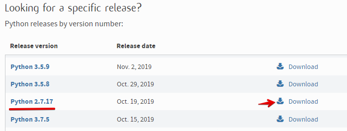

    * на странице загрузке выберите дистрибутив для своей операционной системы:

      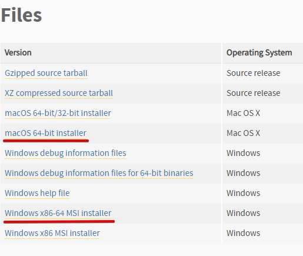

2. Установите скачанную версию

    * путь по умолчанию не меняйте, либо учтите, что питон не переваривает кириллицу в путях:

    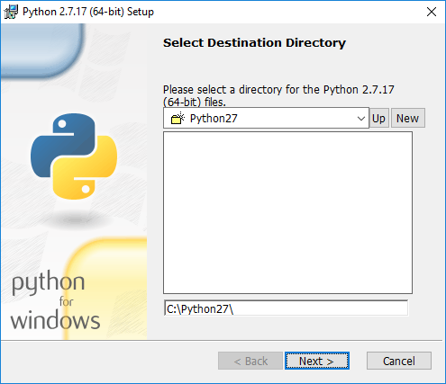

# Знакомство с Visual Studio Code. Настройка. Выполнение и отладка кода.

Питон не имеет своей IDE. Мы, в дальнейшем, будем использовать **Visual Studio Code** — активно развивающийся, бесплатный редактор кода, разработанный Microsoft для Windows, Linux и macOS. Позиционируется как «лёгкий» редактор кода для кроссплатформенной разработки веб- и облачных приложений. Включает в себя *отладчик*, инструменты для работы с Git (*контроль версий*), *подсветку синтаксиса*, *IntelliSense* и средства для рефакторинга. Т.е. это не полноценная IDE, но вполне подходит для разработки на скриптовых ЯП, имеет систему плагинов, т.е. может быть добавлена поддержка и других языков.

## Установка VSC

1. [Скачайте](https://code.visualstudio.com/download) и установите VSC для свой операционной системы (в 253 кабинете VSC уже должен быть установлен - проверьте)

Итак, "из коробки" мы имеем редактор кода с подсветкой, технологией IntelliSense (автоподстановка переменных, методов и т.п.), поддержкой GIT, встроенным отладчиком.

Если хотите русифицировать интерфейс, то установите пакет языковой поддержки:

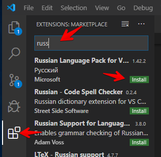

1. Перейдите на закладку **Extensions** (расширения)
2. Введите в строке поиска первые буквы языка **russ**
3. Установите расширение **Russian Language Pack for VSC**

Посмотрим как он работает с Python.

Откроем какой-нибудь проект на питоне (можно найти в интернете) или создадим папку для нового проекта: в главном меню выберем *Файл* - *Открыть папку* и откроем папку с нашим проектом. В папке выберем файл с расширением `*.py` (или создадим новый)

> Для начала нужно выбрать каталог, в котором будет наш проект, его можно открыть (и при необходимости создать) в меню: *File* - *Open Folder*. Затем создать файл с расширением `*.py`:
>
> 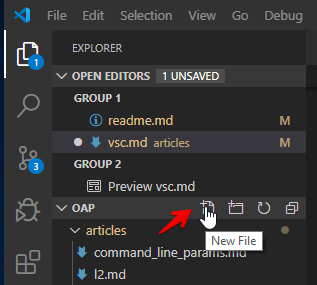

При первом открытии файлов такого типа VSC выдаст сообщение:

VSC определил что сам с этим форматом работать не умеет и предложил установить расширение. Жмём **Установить**

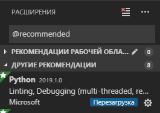

VSC автоматически установит рекомендуемое расширение (на один и тот же тип файлов может быть несколько расширений от разных разработчиков, но нам пока достаточно рекомендуемого, тем более что разработчик сама Microsoft, значит несовместимостей с VSC не должно быть) и предложит перезагрузить VSC, чтобы расширение заработало - перезагружаемся.

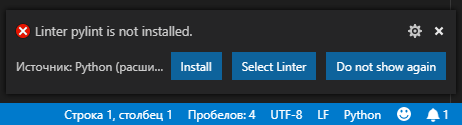

После перезагрузки видим что VSC не хватает какого-то линтера, смотрим что это такое: "статический анализатор для языка программирования, который сообщает о подозрительных или непереносимых на другие платформы выражениях... Как инструмент программа лишь анализирует статический исходный код"

Дело вроде нужное - тоже ставим.

Теперь все готово чтобы попробовать запустить с отладкой наш проект.

1. Переключаем левую панель в режим отладки (тут потом появятся видимые переменные)
2. Ставим точку останова (у меня открыта программа - калькулятор, по нажатию цифровой кнопки мы должны перехватить управление)
3. Запускаем проект

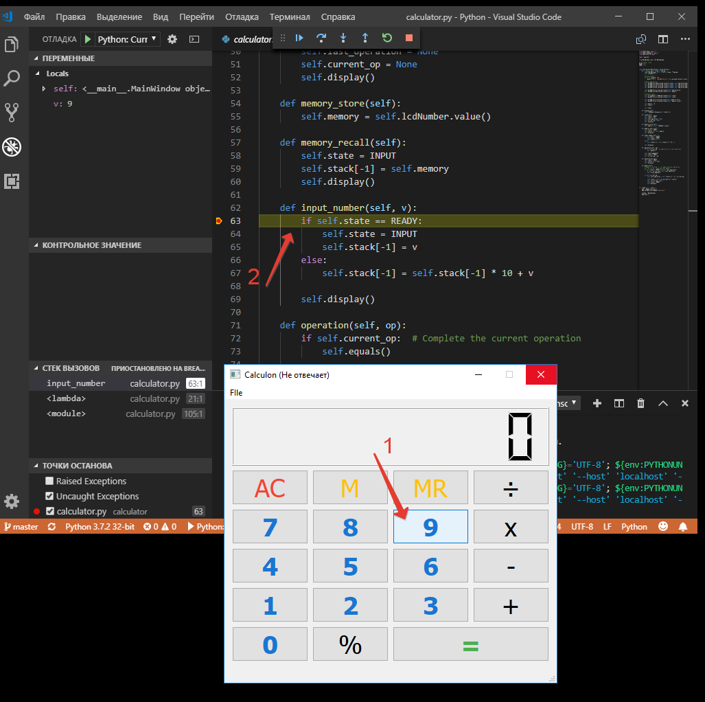

После нажатия на цифру "9" в программе, отладчик остановится на нашей точке останова (в окне приложения видно что оно "не отвечает", т.к. отладчик остановил выполнение программы), в панели отладки (слева) видно локальные переменные и стек вызовов, т.е. мы знаем что и откуда пришло в нашу точку останова. Если нужно, то мы можем пошагово (по командам) выполнить программу и посмотреть как меняются переменные или где возникает ошибка. Управлять отладкой можно либо кнопками (сверху), либо клавишами (показывает при наведении на кнопки).

При входе в режим отладки VSC предложит создать файл настроек для проекта, соглашаемся:

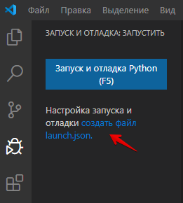

и выбираем режим отладки для активного файла:

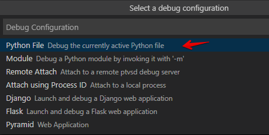

VSC создаст и покажет файл *launch.json*. Отредактировать его, при необходимости, можно кликнув иконку с шестеренкой. В этом файле можно прописать и параметры командной строки:

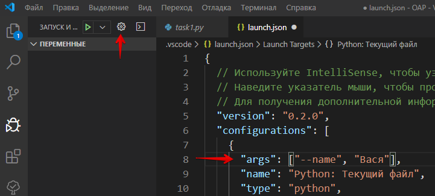

&nbsp; | &nbsp; | &nbsp; 
:-:|:-:|:-:
[Основы алгоритмизации](../articles/t1l1.md) | [На главную](../readme.md) | [Основные элементы языка...](../articles/t2l3.md)
