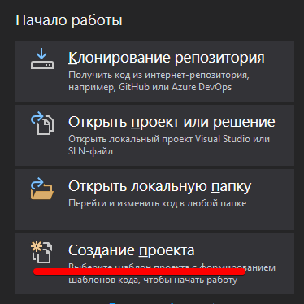
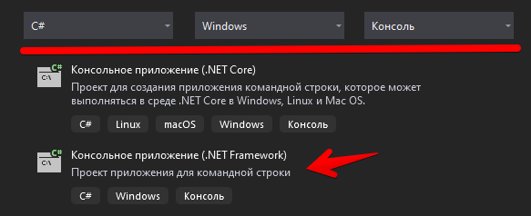
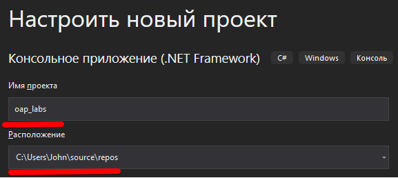
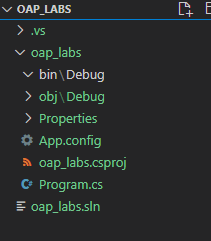

# Лабораторная работа №1 (тема №4)

## Знакомство со средой программирования и структурой проекта. 

1. Установите [JetBrains Rider](https://www.jetbrains.com/ru-ru/rider/)

    Программа платная, но в гугле легко ищутся ключи активации (они действуют год, поэтому сюда я рабочий не привожу)

    > Можно сначала установить **JetBrains Toolbox**

1. Запустите *Visual Stidio 2019* и выберите пункт *Создание проекта*

    

2. Установите фильтры и найдите шаблон проекта *Консольное приложение (.NET Framework)*

    

3. В Настройках нового проекта введите название и запомните/поменяйте, если нужно, расположение проекта

    

    >У вас будет один репозиторий на все лабораторные работы в рамках этого курса, поэтому номер лабораторной в названии не нужен. Переключаться между лабораторными работами мы будем с помощью *веток* GIT-а

На основном экране проекта у нас расположен код программы, который система сгенерировала для нас автоматически:

```cs
// подключены какие-то библиотеки
using System;
using System.Collections.Generic;
using System.Linq;
using System.Text;
using System.Threading.Tasks;

// namespace такой же как и название проекта
namespace oap_labs
{
    // про классы мы пока не говорили...
    class Program
    {
        // точка входа в программу
        static void Main(string[] args)
        {
            // при запуске программы будет выполняться код, который вы напишете тут
        }
    }
}
```

Файловая структура проекта (вид из VSCode):



В каталоге проекта есть директории **bin**, **obj** и **.vs**, которые содержат скомпилированную программу и настройки *Visual Studio* и значит сохранять эти каталоги в репозитории не нужно.

## Создание репозитория с ветками. 

Сначала создайте новый репозиторий и инициализируйте его в верхнем каталоге **oap_labs**

Затем создайте в корне репозитория файл **.gitignore**, в который добавьте каталоги, которые не нужно сохранять в репозитории:

```
*/bin/
*/obj/
.vs
```

Знак "*" перед названиями каталогов **bin** и **obj** обозначает "любой каталог", т.е. этот фильтр будет работать не зависимо от названия вашего проекта.

После того, как мы сохраним файл, будет видно, что перечисленные каталоги больше не отслеживаются GIT-ом:


Создайте файл `readme.md` с описанием проекта и ФИО исполнителя (титульный лист из прошлой лабораторной работы).

Сохраните текущее состояние проекта в репозитории (`git add .`, `git commit ...`, `git remote add ...`, `git push ...`)

Теперь создайте ветку *lab1* и переключитесь на неё:

```
git checkout -b lab4_1
```

Таким образом, у вас в главной ветке будет пустой шаблон приложения с титульным листом, а в ветках реализации для отдельных лабораторных.

## Составление программ линейной структуры.

Например, вычислить периметр и площадь прямоугольного треугольника по длинам двух катетов (получить из консоли)

Мы ещё не проходили команды работы с консолью, поэтому приведу кусок кода с комментариями:

```cs
// команда Console.Write выводит текст в консоль
Console.Write("Input katet1: ");
// команда Console.ReadLine читает СТРОКУ из консоли
var Katet1 = Console.ReadLine();

Console.Write("Input katet2: ");
var Katet2 = Console.ReadLine();

// команда Math.Sqrt - квадратный корень
// Math.Pow - возведение в степень
// Convert.ToDouble - преобразует строку в число
var Gipotenuza = Math.Sqrt(Math.Pow(Convert.ToDouble(Katet1), 2) + Math.Pow(Convert.ToDouble(Katet2), 2));

// выводим результат
// знак $ перед строкой указывает, что внутри строки в фигурных скобках названия переменных
Console.WriteLine($"Gipotenuza = {Gipotenuza}");

// читаем строку, чтобы консольное окно сразу не закрылось
Console.Write("Press ENTER to continue...");
Console.ReadLine();
```

В некоторых заданиях требуется ввести числа в одной строке, но т.к. функция **ReadLine** возвращает **строку** (например, "2 2"), то такая строка будет не валидным числом.

Для разбиения строки на подстроки можно воспользоваться методом **Split**:

```cs
var Numbers = Console.ReadLine();
var NumberList = Numbers.Split(' ');
var Number1 = Convert.ToInt32(NumberList[0]);
var Number2 = Convert.ToInt32(NumberList[1]);
```

# Задание

1. Выполните задание, выданное преподавателем
2. Опубликуйте результаты в удаленном репозитории и скиньте ссылку преподавателю.
