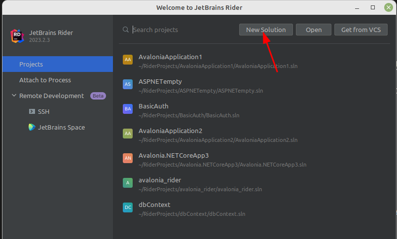
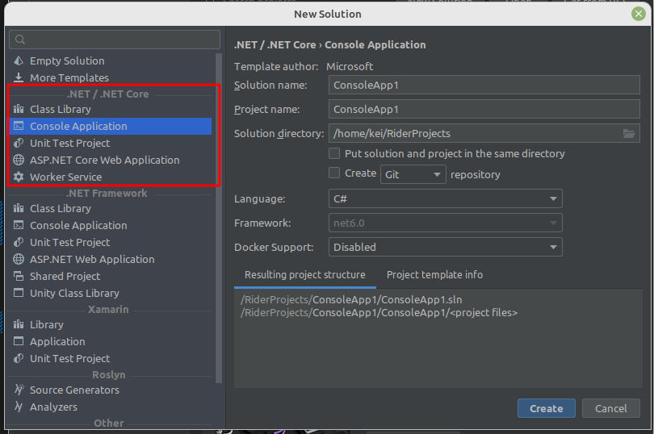
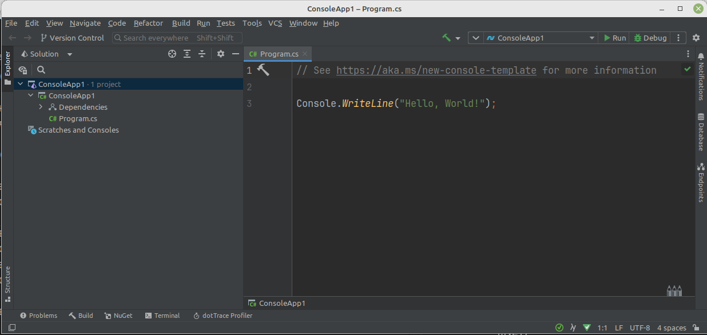
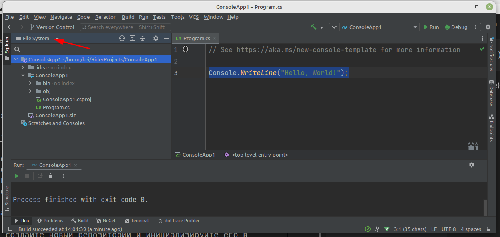

# Лабораторная работа №1 (тема №4)

## Знакомство со средой программирования и структурой проекта. 

1. Установите [JetBrains Rider](https://www.jetbrains.com/ru-ru/rider/)

    Программа платная, но в гугле легко ищутся ключи активации (они действуют год, поэтому сюда я рабочий не привожу)

    > Можно сначала установить **JetBrains Toolbox**

1. Запустите *Rider* и выберите пункт *New Solution* ("новое решение", решение - это группа програм для одного проекта)

    

1. Найдите шаблон проекта *Консольное приложение (.NET)*

    

    В Настройках нового проекта введите название и запомните/поменяйте, если нужно, расположение проекта

    >У вас будет один репозиторий на все лабораторные работы в рамках этого курса, поэтому номер лабораторной в названии не нужен. Переключаться между лабораторными работами мы будем с помощью *веток* GIT-а

На основном экране проекта у нас расположен код программы, который система сгенерировала для нас автоматически:



```cs
Console.WriteLine("Hello, World!");
```

Переключитесь в режим "Файловая система" (по-умолчанию отображается режим "Solution"):



В каталоге проекта есть директории **bin**, **obj** и **.idea**, которые содержат скомпилированную программу и настройки *Rider* и значит сохранять эти каталоги в репозитории не нужно (добавить в `.gitignore`).

## Создание репозитория с ветками. 

Сначала создайте новый репозиторий и инициализируйте его в верхнем каталоге **oap_labs**

Затем создайте в корне репозитория файл **.gitignore**, в который добавьте каталоги, которые не нужно сохранять в репозитории:

```
*/bin/
*/obj/
.idea
```

Знак "*" перед названиями каталогов **bin** и **obj** обозначает "любой каталог", т.е. этот фильтр будет работать не зависимо от названия вашего проекта.

После того, как мы сохраним файл, будет видно, что перечисленные каталоги больше не отслеживаются GIT-ом:


Создайте файл `readme.md` (в корне "решения") с описанием проекта и ФИО исполнителя.

Сохраните текущее состояние проекта в репозитории

Теперь создайте ветку *lab1* и переключитесь на неё:

```
git checkout -b lab4_1
```

Таким образом, у вас в главной ветке будет пустой шаблон приложения с описанием, а в ветках реализации для отдельных лабораторных.

## Составление программ линейной структуры.

Например, вычислить периметр и площадь прямоугольного треугольника по длинам двух катетов (получить из консоли)

Мы ещё не проходили команды работы с консолью, поэтому приведу кусок кода с комментариями:

```cs
// команда Console.Write выводит текст в консоль
Console.Write("Input katet1: ");
// команда Console.ReadLine читает СТРОКУ из консоли
var katet1 = Console.ReadLine();

Console.Write("Input katet2: ");
var katet2 = Console.ReadLine();

// команда Math.Sqrt - квадратный корень
// Math.Pow - возведение в степень
// Convert.ToDouble - преобразует строку в число
var gipotenuza = Math.Sqrt(
    Math.Pow(
        Convert.ToDouble(katet1), 2) + 
    Math.Pow(
        Convert.ToDouble(katet2), 2));

// выводим результат
// знак $ перед строкой указывает, 
// что внутри строки в фигурных скобках названия переменных
Console.WriteLine(
    $"Gipotenuza = {gipotenuza}");

// читаем строку, чтобы консольное окно сразу не закрылось
Console.Write("Press ENTER to continue...");
Console.ReadLine();
```

В некоторых заданиях требуется ввести числа в одной строке (например, "2 2"), но т.к. функция **ReadLine** возвращает **строку**, то такая строка будет не валидным числом.

Для разбиения строки на подстроки можно воспользоваться методом **Split**:

```cs
var numbers = Console.ReadLine();
var numberList = numbers.Split(' ');
var number1 = Convert.ToInt32(numberList[0]);
var number2 = Convert.ToInt32(numberList[1]);
```

## Задание

1. Выполните задание, выданное преподавателем

    Задания берите с сайта [Школа программиста](https://acmp.ru/index.asp?main=tasks), из темы "Задачи для начинающих" 

1. Опубликуйте результаты в удаленном репозитории и скиньте ссылку преподавателю.
