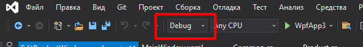
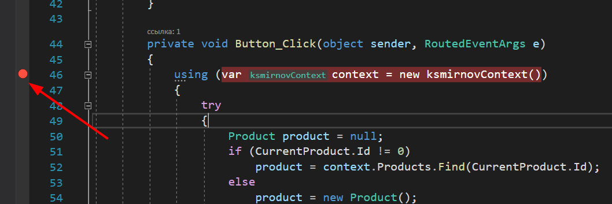
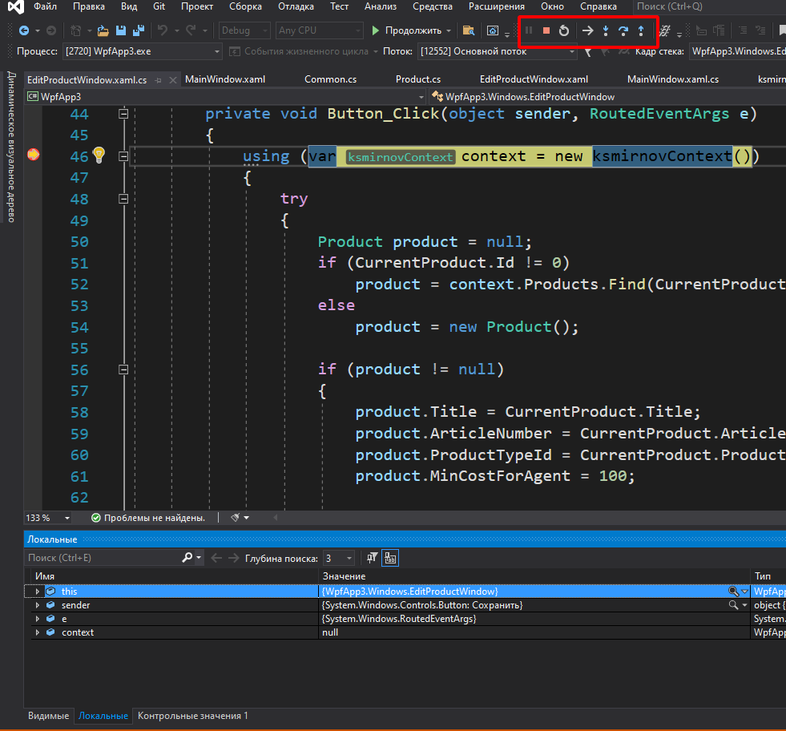
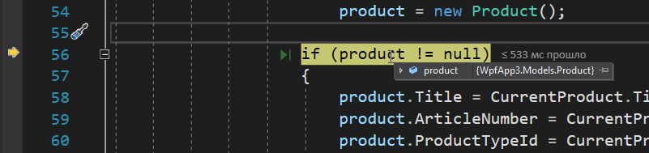
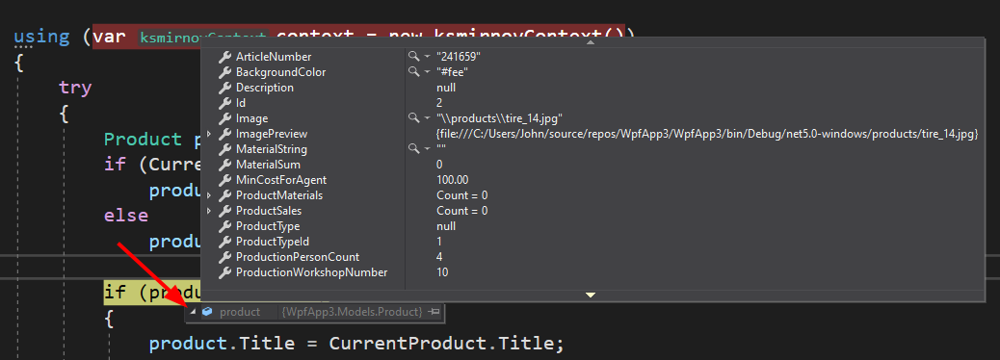
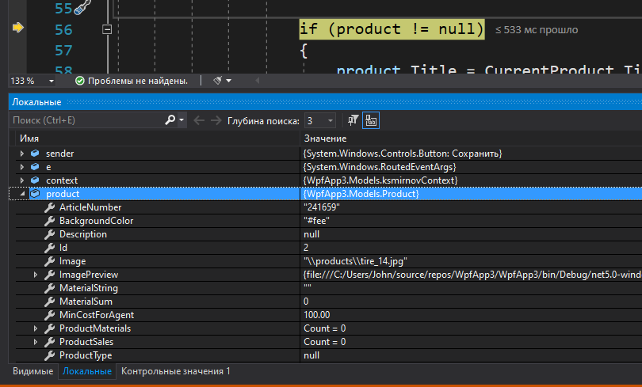
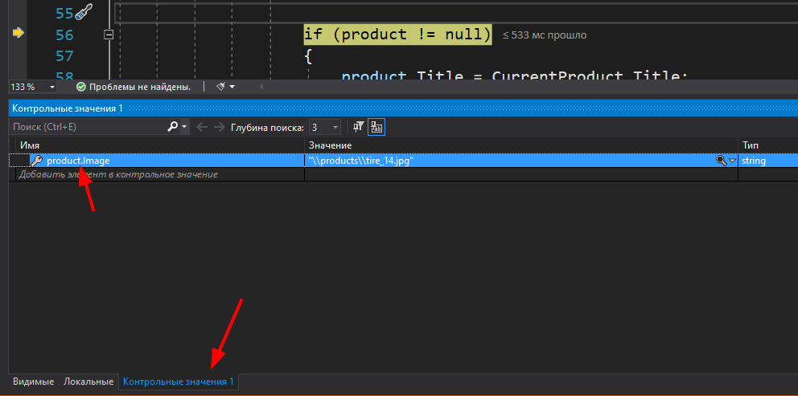

# Отладка приложения

При написании кода неизбежно возникают ошибки и если синтаксические ошибки нам помогает обнаружить среда разработки (IDE), то часть ошибок могут проявиться только при работе приложения (**Run Time Error** - ошибки времени выполнения). Это могут быть как логические ошибки программиста, так и неверные входные данные.

Поиск ошибок выполняется двумя способами: *отладка* и *тестирование*. Тестирование отдельная большая тема и мы будем изучать его в следующем году.

Все IDE позволяют производить отладку приложения, т.е. пошаговое выполнение кода с просмотром значений переменных (для компилируемых приложений есть специальный режим сборки- **debug**, когда в код программы включается отладочная информация, позволяющая связать двоичный код с исходным). 

Перед началом отладки нужно убедиться, что в IDE установлен режим сборки **Debug**:

Затем установить **точку остановки** в том месте кода, где возникает ошибка (просто кликнув кнопкой по левому полю):

Когда выполнение приложения дойдет до этой точки, выполнение приостановится и мы сможем исследовать состояние и пошагово выполнить код:

* желтая стрелка слева показывает в каком месте кода мы находимся
* в верхней панели есть кнопки, позволяющие выполнять код по шагам. эти кнопки имеют и быстрые клавиши
    * *шаг с заходом* (F11) - используется, если мы хотим "зайти" в функцию, которая находится в текущей строке
    * *шаг с обходом* (F10) - выражение в текущей строке выполняется за один шаг, без захода
    * *шаг с выходом* (Shift + F11) - выход из функции на код, который следует сразу за вызовом функции
* значение переменной можно посмотреть 
    * либо просто наведя курсор на неё:

        

        Если переменная не скалярного типа, а объект, то содержимое объекта можно посмотреть кликнув по треугольнику слева от содержимого:

        

    * либо, если нам нужно отслеживать её значение на каждом шаге, внизу экрана 

        

        Можно на вкладке "контрольные значения" добавить сложное выражение (цепочку свойств объекта+- или даже вызов функции)

        
