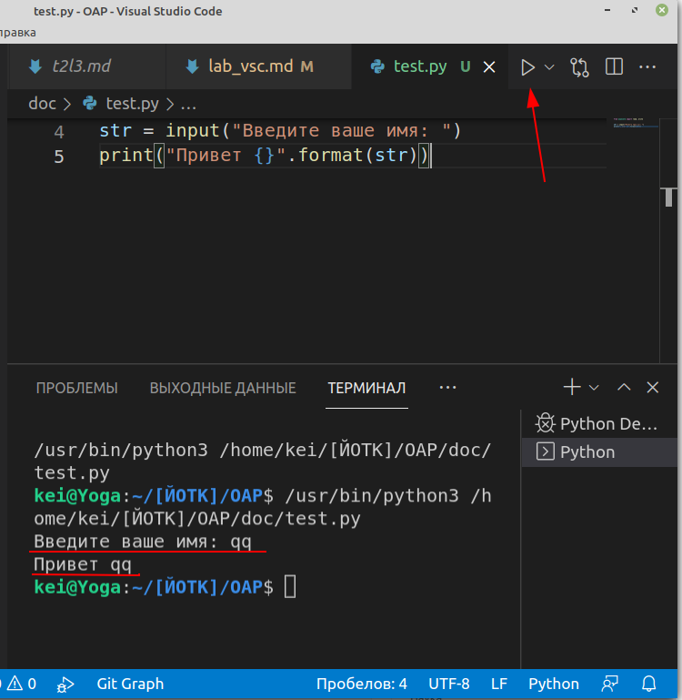

# Знакомство с Visual Studio Code

1. Используя материалы лекции ["Знакомство с Visual Studio Code"](../articles/l2.md) открыть личный проект (каталог) в VSC. Создать в нём файл `test.py`.

2. Решите несколько **"задач для начинающих"** с сайта [Школа программиста](https://acmp.ru/index.asp?main=tasks) на языке **pyton** (используя материал пройденных лекций). Решенные задачи показывайте преподавателю - каждая задача 1 балл (т.е. за лабу надо сделать не менее 3-х задач).

Например, разберём задачу "Неглухой телефон": нужно прочитать с консоли строку и вывести её обратно в консоль.

```py
str = input("Введите ваше имя: ")
print("\nПривет {}!\n\n".format(str))
```

В первой строке мы считываем **строку** из консоли (функция **input**) в переменную *str*. В функцию **input** передаем параметр - текст, которай будет показан в консоли перед вводом данных.

Во второй строке мы выводим полученную строку в консоль функцией **print**, немного отформатировав её.

Для запуска программы из **VSC** используйте кнопку **Run**

Ввод и вывод данных происходит в окне "терминала":



Нужно учитывать, что функция **input** возвращает **строку**. И если нам по условию задачи нужны целые числа, то преобразовать строку в число можно функцией **int**

```py
number = int( input("Введите число: ") )
```

В некоторых заданиях требуется ввести числа в одной строке, но т.к. функция **input** возвращает **строку** (например, "2 2"), то такая строка будет не валидным числом.

Для разбиения строки на подстроки можно воспользоваться методом **split**:

```py
x,y = input("Введите два числа: ").split()
```

эта хитрая конструкция разбивает полученную строку на подстроки и присваивает полученные значения переменным x и y. Но они всё ещё строки, поэтому при дальнейших операциях надо делать преобразование типов: `int(x) + int(y)`

## Задания для 1-й подгруппы

* [A+B](https://acmp.ru/index.asp?main=task&id_task=1)
<!-- просто сложить числа -->
* [Эния](https://acmp.ru/index.asp?main=task&id_task=195)
<!-- перемножить все числа -->
* [Два бандита](https://acmp.ru/index.asp?main=task&id_task=33)
<!-- (сумма чисел - 1) = всего банок -->
* [Журавлики](https://acmp.ru/index.asp?main=task&id_task=92)
<!-- число разделить на 6 -->
* [Внеземные гости](https://acmp.ru/index.asp?main=task&id_task=597)

    В этой задаче условие пока не делаем - выводим числа
    <!-- r1 - (r2+r3) -->

## Задания для 2-й подгруппы

* [Бисер](https://acmp.ru/index.asp?main=task&id_task=903)
<!-- число + 1 -->
* [Гулливер](https://acmp.ru/index.asp?main=task&id_task=773)
<!-- x^2 * y -->
* [Сбор земляники](https://acmp.ru/index.asp?main=task&id_task=755)

    В этой задаче условие пока не делаем - выводим отрицательные числа
    <!-- x+y-z -->

* [Пятью пять - двадцать пять!](https://acmp.ru/index.asp?main=task&id_task=3)
<!-- string((n//10) * (1 + n//10))+'25' -->
* [Прямоугольный параллелепипед](https://acmp.ru/index.asp?main=task&id_task=819)

## Дополнительные задания (кто не смог сделать одно из своих)

* [Длина отрезка](https://acmp.ru/index.asp?main=task&id_task=529)