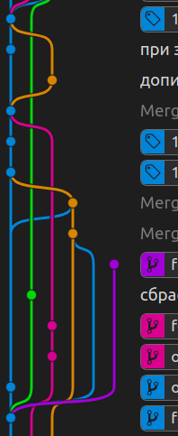

# Системы контроля версий

## Что такое контроль версий, и зачем он нужен? 

Система контроля версий (СКВ) — это система, регистрирующая изменения в одном или нескольких файлах с тем, чтобы в дальнейшем была возможность вернуться к определённым старым версиям этих файлов (типичный пример: выложили версию в проду, начали работу над новыми фичами и вдруг обнаружились ошибки. Нужно не потеряв новых наработок вернуться к рабочей версии, исправить ошибки).

Можно просто копировать проект в другой каталог, такой подход часто применяется из-за своей простоты, но имеет множество недостатков: 
- избыточность (дублируется весь код, а не только изменения)
- нет механизмов для распределения работы между несколькими разработчиками
- нет данных о том что именно изменилось (обычно пишут history файл с общей информацией об изменениях)

>## Локальные системы контроля версий (для самостоятельного ознакомления )
>Для решения части из этих проблем были разработаны локальные СКВ.  
Одной из первых и наиболее популярных СКВ такого типа являлась *RCS*, которая была разработана в 1985 году.  
Для каждого файла, зарегистрированного в системе, она хранит полную историю изменений, причём для текстовых файлов используется эффективный алгоритм дельта-компрессии, когда хранится только последняя версия и все межверсионные изменения.  
Такие СКВ решали только первую проблему - избыточность данных.  
Современные СКВ можно разделить на две группы: централизованные и распределенные.

## Централизованные системы контроля версий

Следующей основной проблемой оказалась необходимость сотрудничать с разработчиками за другими компьютерами. Чтобы решить её, были созданы централизованные системы контроля версий (ЦСКВ). В таких системах, например CVS, Subversion и Perforce, есть центральный сервер, на котором хранятся все файлы под версионным контролем, и ряд клиентов, которые получают копии файлов из него.  Много лет это было стандартом для систем контроля версий.

Такой подход имеет множество преимуществ, особенно перед локальными СКВ. К примеру, все знают, кто и чем занимается в проекте. У администраторов есть чёткий контроль над тем, кто и что может делать, и, конечно, администрировать ЦСКВ намного легче, чем локальные базы на каждом клиенте.

Однако при таком подходе есть и несколько серьёзных недостатков. Наиболее очевидный — централизованный сервер является уязвимым местом всей системы. Если сервер выключается на час, то в течение часа разработчики не могут взаимодействовать, и никто не может сохранить новой версии своей работы. Если же повреждается диск с центральной базой данных и нет резервной копии, вы теряете абсолютно всё — всю историю проекта, разве что за исключением нескольких рабочих версий, сохранившихся на рабочих машинах пользователей. Локальные системы контроля версий подвержены той же проблеме: если вся история проекта хранится в одном месте, вы рискуете потерять всё.

## Распределённые системы контроля версий

И в этой ситуации в игру вступают распределённые системы контроля версий. В таких системах как Git, Mercurial, Bazaar или Darcs клиенты не просто выгружают последние версии файлов, а полностью копируют весь репозиторий (репозиторий, в простонародье репа, это место, где хранятся и поддерживаются какие-либо данные). При этом можно выделить центральный репозиторий (условно), в который будут отправляться изменения из локальных и, с ним же эти локальные репозитории будут синхронизироваться. Поэтому в случае, когда "умирает" сервер, через который шла работа, любой клиентский репозиторий может быть скопирован обратно на сервер, чтобы восстановить базу данных. Каждый раз, когда клиент забирает свежую версию файлов, он создаёт себе полную копию всех данных.  
Кроме того, в большей части этих систем можно работать с несколькими удалёнными репозиториями.

На сегодняшний день стандартом де-факто стала распределенная система контроля версий - *GIT*, но в старых больших проектах вполне могут встретиться устаревшие СКВ (например, популярная в свое время Subversion).

В дальнейшем, все изложение будет касаться только *GIT*.

## Основы GIT

### Почти все операции — локальные

Для совершения большинства операций в Git'е необходимы только локальные файлы и ресурсы, т.е. обычно информация с других компьютеров в сети не нужна.

К примеру, чтобы показать историю проекта, Git'у не нужно скачивать её с сервера, он просто читает её прямо из вашего локального репозитория. Поэтому историю вы увидите практически мгновенно. Если вам нужно просмотреть изменения между текущей версией файла и версией, сделанной месяц назад, Git может взять файл месячной давности и вычислить разницу на месте, вместо того чтобы запрашивать разницу у СКВ-сервера или качать с него старую версию файла и делать локальное сравнение.

Кроме того, работа локально означает, что практически все можно сделать без доступа к Сети. Если вы в самолёте или в поезде и хотите немного поработать, можно спокойно делать коммиты, а отправить их, как только станет доступна сеть. Во многих других системах это невозможно или же крайне неудобно. Например, используя Perforce, вы мало что можете сделать без соединения с сервером. Работая с Subversion и CVS, вы можете редактировать файлы, но сохранить изменения в вашу базу данных нельзя (потому что она отключена от репозитория). 

### Git следит за целостностью данных

Перед сохранением любого файла Git вычисляет контрольную сумму, и она становится индексом этого файла. Поэтому невозможно изменить содержимое файла или каталога так,чтобы Git не узнал об этом. Эта функциональность встроена в сам фундамент Git'а и является важной составляющей его философии. Если информация потеряется при передаче или повредится на диске, Git всегда это выявит.

### Чаще всего данные в Git только добавляются

Практически все действия, которые вы совершаете в Git'е, только добавляют данные в базу. Очень сложно заставить систему удалить данные или сделать что-то неотменяемое. Можно, как и в любой другой СКВ, потерять данные, которые вы ещё не сохранили, но как только они зафиксированы, их очень сложно потерять, особенно если вы регулярно отправляете изменения в другой репозиторий.

### Три состояния файлов

Теперь внимание. Это самое важное, что нужно помнить про Git, если вы хотите, чтобы дальше изучение шло гладко. В Git'е файлы могут находиться в одном из трёх состояний: зафиксированном, изменённом и подготовленном. "Зафиксированный" значит, что файл уже сохранён в вашей локальной базе. К изменённым относятся файлы, которые поменялись, но ещё не были зафиксированы. Подготовленные файлы — это изменённые файлы, отмеченные для включения в следующий коммит.

Стандартный рабочий процесс с использованием Git'а выглядит примерно так:

- Вы вносите изменения в файлы в своём рабочем каталоге.
- Подготавливаете файлы, добавляя их слепки в область подготовленных файлов.
- Делаете коммит, который берёт подготовленные файлы и помещает их в каталог Git'а на постоянное хранение.

## Установка *GIT* (Windows)

Установить Git в Windows очень просто. Просто скачайте дистрибутив и запустите его:

* [Git для Windows](https://gitforwindows.org)
* [Git для Mac (но на маках он вроде уже должен быть)](https://git-scm.com/download/mac)

После установки у вас будет как консольная версия (включающая SSH-клиент, который пригодится позднее), так и стандартная графическая.

## Первоначальная настройка Git

Теперь, когда Git установлен в Вашей системе, нужно настроить среду для работы с Git'ом под себя. Это необходимо сделать только один раз — при обновлении версии Git'а настройки сохранятся. Но вы можете поменять их в любой момент, выполнив те же команды снова.

В состав Git'а входит утилита git config, которая позволяет просматривать и устанавливать параметры, контролирующие все аспекты работы Git'а и его внешний вид. 

### Имя пользователя

Первое, что вам следует сделать после установки Git'а, — указать ваше имя и адрес электронной почты. Это важно, потому что каждый коммит в Git'е содержит эту информацию, и она включена в коммиты, передаваемые вами, и не может быть далее изменена (команды выполняются из командной строки):

Перейдите в каталог с проектом (создайте, если его еще нет).

```
git config user.name "Вася Пупкин"
git config user.email vpupkin@example.com
```

Если добавить опцию `--global`, то эти настройки запишутся в настройки пользователя и будут действовать на все проекты. Мы выполняем эту команду без параметра `--global`, чтобы настройки касались только вашего проекта.

Перед началом работы с командами *GIT* определимся с сервером для центрального репозитория.

## Выбор сервера для центрального репозитория

Есть два варианта: 
- собственный сервер в локальной сети, обычно используется в крупных компаниях или из-за режима секретности (например, gitlab, mercurial-server)
- сервер в Сети, например github, bitbucket (atlassian), gitlab. На таких серверах обычно есть бесплатные аккаунты для публичных репозиториев (публичный репозиторий доступен всем), в последнее время в бесплатных аккаунтах появляется возможность создания и приватных репозиториев (с приватным репозиторием может работать только создатель (администратор) и пользователи, которых назначатет администратор. Администратор имеет полные права на репозторий, пользователи могут иметь права на запись или только на чтение). На сервере atlassian поддерживаются репозитории для git и mercurial, в бесплатном аккаунте есть возможность создавать приватные репозитории (количество не ограничено, но ограничено общее дисковое пространство под репозитории и количество разработчиков - не более 5). На гитхабе возможность создания бесплатных аккаунтов появилась совсем недавно (январь 2019 года), приватных репозиториев можно создать только 3.

~~Мы будем использовать локальный сервер GOGS, расположенный по адресу 192.168.0.153~~ Из-за коронавируса мы часто стали работать удаленно, поэтому заведите себе аккаунт на github.com (или другом, поддерживающем протокол GIT).

## Базовые команды Git

Здесь рассмотрены базовые команды, необходимые вам для решения подавляющего большинства задач возникающих при работе с Git'ом. После изучения этой части вы научитесь настраивать и инициализировать репозиторий, начинать и прекращать версионный контроль файлов, а также подготавливать и фиксировать изменения. Мы также узнаем как настроить в Git'е игнорирование отдельных файлов или их групп, как быстро и просто отменить ошибочные изменения, как просмотреть историю вашего проекта и изменения между отдельными коммитами (commit), а также как отправлять (push) и получать (pull) изменения в/из удалённого (remote) репозитория.

### Создание Git-репозитория

Для создания Git-репозитория существуют два основных подхода. Первый подход — импорт в Git уже существующего проекта или каталога. Второй — клонирование уже существующего репозитория с сервера (этот вариант мы рассматривать не будем, т.к. некоторые программы не могут создать проект в существующем каталоге).

#### Создание репозитория в существующем каталоге

Если вы собираетесь начать использовать Git для существующего проекта, то вам необходимо перейти в каталог проекта и в командной строке ввести

```
git init
```

>Запоминать эти команды не нужно - они показываются в GIT-е при создании нового репозитория.

Эта команда создаёт в текущем каталоге новый подкаталог с именем .git содержащий все необходимые файлы репозитория — основу Git-репозитория. На этом этапе ваш проект ещё не находится под версионным контролем.

Если вы хотите добавить под версионный контроль существующие файлы (в отличие от пустого каталога), вам стоит проиндексировать эти файлы и осуществить первую фиксацию изменений. Осуществить это вы можете с помощью нескольких команд git add указывающих индексируемые файлы, а затем commit:

```
git add .
git commit -m "initial project version"
```

Мы разберём, что делают эти команды чуть позже. На данном этапе, у вас есть Git-репозиторий с добавленными файлами и начальным коммитом.

#### Клонирование существующего репозитория

Если вы хотите получить копию существующего репозитория Git, например, проекта, в котором вы хотите поучаствовать, то вам нужна команда `git clone`.

Клонирование репозитория осуществляется командой git clone [url]. Для примера склонируем репозиторий с этими лекциями:

```
git clone https://github.com/kolei/oap
```

Эта команда создаёт каталог с именем *OAP*, инициализирует в нём каталог .git, скачивает все данные для этого репозитория и создаёт (checks out) рабочую копию последней версии. Если вы зайдёте в новый каталог *OAP*, вы увидите в нём файлы, пригодные для работы и использования. 

Если вы хотите клонировать репозиторий в каталог, отличный от *OAP*, то можно это указать в следующем параметре командной строки:

```
git clone https://github.com/kolei/oap mydir
```

Эта команда делает всё то же самое, что и предыдущая, только результирующий каталог будет назван `mydir`.

#### Запись изменений в репозиторий

Итак, у вас имеется Git-репозиторий и рабочая копия файлов для некоторого проекта. Вам нужно делать некоторые изменения и фиксировать “снимки” состояния (snapshots) этих изменений в вашем репозитории каждый раз, когда проект достигает состояния, которое вам хотелось бы сохранить (обычно рекомендуют фиксировать каждое атомарное изменение, т.е. функцию, класс или законченный алгорим).

Каждый файл в вашем рабочем каталоге может находиться в одном из двух состояний: под версионным контролем (отслеживаемые) и нет (неотслеживаемые). Отслеживаемые файлы — это те файлы, которые были в последнем слепке состояния проекта; они могут быть неизменёнными, изменёнными или подготовленными к коммиту. Неотслеживаемые файлы — это всё остальное, любые файлы в вашем рабочем каталоге, которые не входили в ваш последний слепок состояния и не подготовлены к коммиту. Когда вы впервые клонируете репозиторий, все файлы будут отслеживаемыми и неизменёнными, потому что вы только взяли их из хранилища и ничего пока не редактировали.

Как только вы отредактируете файлы, Git будет рассматривать их как изменённые, т.к. вы изменили их с момента последнего коммита. Вы индексируете эти изменения и затем фиксируете все индексированные изменения, а затем цикл повторяется.

#### Определение состояния файлов

Основной инструмент, используемый для определения, какие файлы в каком состоянии находятся — это команда `git status`. Если вы выполните эту команду сразу после клонирования, вы увидите что-то вроде этого:

```
git status
On branch master
nothing to commit
```

Это означает, что у вас чистый рабочий каталог, другими словами — в нём нет отслеживаемых изменённых файлов. Git также не обнаружил неотслеживаемых файлов, в противном случае они бы были перечислены здесь. И наконец, команда сообщает вам на какой ветке (branch) вы сейчас находитесь. Пока что это всегда ветка master — это ветка по умолчанию.

Предположим, вы добавили в свой проект новый файл, простой файл README. Если этого файла раньше не было, и вы выполните git status, вы увидите свой неотслеживаемый файл вот так:

```
git status
On branch master
Untracked files:
  (use "git add <file>..." to include in what will be committed)

README
nothing added to commit but untracked files present (use "git add" to track)
```

Понять, что новый файл README неотслеживаемый можно по тому, что он находится в секции "Untracked files" в выводе команды status. Статус "неотслеживаемый файл", по сути, означает, что Git видит файл, отсутствующий в предыдущем снимке состояния (коммите); Git не станет добавлять его в ваши коммиты, пока вы его явно об этом не попросите. Это предохранит вас от случайного добавления в репозиторий сгенерированных бинарных файлов или каких-либо других, которые вы и не думали добавлять. Мы хотели добавить README, так давайте сделаем это.

#### Отслеживание новых файлов

Для того чтобы начать отслеживать (добавить под версионный контроль) новый файл, используется команда `git add`. Чтобы начать отслеживание файла README, вы можете выполнить следующее:

```
git add README
```

Если вы снова выполните команду `git status`, то увидите, что файл README теперь отслеживаемый и индексированный:

```
git status
On branch master
Changes to be committed:
  (use "git reset HEAD <file>..." to unstage)

  new file:   README
```

Вы можете видеть, что файл проиндексирован по тому, что он находится в секции “Changes to be committed”. Если вы выполните коммит в этот момент, то версия файла, существовавшая на момент выполнения вами команды git add, будет добавлена в историю снимков состояния. Как вы помните, когда вы ранее выполнили git init, вы затем выполнили git add (файлы) — это было сделано для того, чтобы добавить файлы в вашем каталоге под версионный контроль. Команда git add принимает параметром путь к файлу или каталогу, если это каталог, команда рекурсивно добавляет (индексирует) все файлы в данном каталоге.

#### Игнорирование файлов

Зачастую, имеется группа файлов, которые вы не только не хотите автоматически добавлять в репозиторий, но и видеть в списках неотслеживаемых. К таким файлам обычно относятся автоматически генерируемые файлы (различные логи, результаты сборки программ и т.п.). В таком случае, вы можете создать в корне проекта файл `.gitignore` с перечислением шаблонов соответствующих таким файлам. Вот пример файла .gitignore:

```
*.log
*.~*
```

Первая строка предписывает Git'у игнорировать любые файлы заканчивающиеся на .log — файлы логов. Вторая строка предписывает игнорировать все файлы расширение которых начинается на тильду (~), такие расширения обычно используются для обозначения временных файлов. Вы можете также включить каталоги log, tmp. Хорошая практика заключается в настройке файла `.gitignore` до того, как начать серьёзно работать, это защитит вас от случайного добавления в репозиторий файлов, которых вы там видеть не хотите.

К шаблонам в файле .gitignore применяются следующие правила:  

* Пустые строки, а также строки, начинающиеся с #, игнорируются.
* Можно использовать стандартные glob шаблоны.
* Можно заканчивать шаблон символом слэша (/) для указания каталога.
* Можно инвертировать шаблон, использовав восклицательный знак (!) в качестве первого символа.

Glob-шаблоны представляют собой упрощённые регулярные выражения используемые командными интерпретаторами. Символ `*` соответствует 0 или более символам; последовательность [abc] — любому символу из указанных в скобках (в данном примере a, b или c); знак вопроса (?) соответствует одному символу; [0-9] соответствует любому символу из интервала (в данном случае от 0 до 9).  

Вот ещё один пример файла .gitignore:

```
# комментарий — эта строка игнорируется
# не обрабатывать файлы, имя которых заканчивается на .a
*.a
# НО отслеживать файл lib.a, несмотря на то, что мы игнорируем все .a файлы с помощью предыдущего правила
!lib.a
# игнорировать только файл TODO находящийся в корневом каталоге, не относится к файлам вида subdir/TODO
/TODO
# игнорировать все файлы в каталоге build/
build/
# игнорировать doc/notes.txt, но не doc/server/arch.txt
doc/*.txt
# игнорировать все .txt файлы в каталоге doc/
doc/**/*.txt
```

#### Просмотр индексированных и неиндексированных изменений

Если результат работы команды `git status` недостаточно информативен для вас — вам хочется знать, что конкретно поменялось, а не только какие файлы были изменены — вы можете использовать команду `git diff`.  
Подробно на этой команде останавливаться не будем, так как многие современные средства разработки (IDE - Интегрированная среда разработки) имеют встроенную поддержку команд *GIT* и изменения в файлах там наглядно отображаются.

#### Фиксация изменений

Теперь, когда ваш индекс настроен так, как вам и хотелось, вы можете зафиксировать свои изменения. Запомните, всё, что до сих пор не проиндексировано — любые файлы, созданные или изменённые вами, и для которых вы не выполнили `git add` после момента редактирования — не войдут в этот коммит. Они останутся изменёнными файлами на вашем диске. В нашем случае,когда вы в последний раз выполняли `git status`, вы видели что всё проиндексировано, и вот, вы готовы к коммиту. Простейший способ зафиксировать изменения — это выполнить команду `git commit`. Так же можно воспользоваться встроенными в IDE средствами.

```
git commit   
```

Эта команда откроет выбранный вами текстовый редактор. (Редактор устанавливается системной переменной $EDITOR, вы можете установить ваш любимый с помощью команды git config  core.editor).  

В редакторе будет отображён следующий текст (это пример окна Vim'а):  
```
# Please enter the commit message for your changes. Lines starting  
# with '#' will be ignored, and an empty message aborts the commit.  
# On branch master  
# Changes to be committed:  
#   (use "git reset HEAD <file>..." to unstage)  
#  
#       new file:   README  
#       modified:   benchmarks.rb  
~  
~  
~  
".git/COMMIT_EDITMSG" 10L, 283C  
```

Вы можете видеть, что комментарий по умолчанию для коммита содержит закомментированный результат работы ("выхлоп") команды `git status` и ещё одну пустую строку сверху. Вы можете удалить эти комментарии и набрать своё сообщение или же оставить их для напоминания о том, что вы фиксируете. (Для ещё более подробного напоминания, что же именно вы поменяли, можете передать аргумент -v в команду `git commit`. Это приведёт к тому, что в комментарий будет также помещена дельта/diff изменений, таким образом вы сможете точно увидеть всё, что сделано.) Когда вы выходите из редактора, Git создаёт для вас коммит с этим сообщением (удаляя комментарии и вывод diff'а).  

Можно сразу набрать свой комментарий к коммиту в командной строке вместе с командой commit, указав его после параметра -m:

```
git commit -m "мой первый коммит"
[master]: created 463dc4f: "мой первый коммит"
 2 files changed, 3 insertions(+), 0 deletions(-)
 create mode 100644 README
```

Итак, вы создали свой первый коммит! Вы можете видеть, что коммит вывел вам немного информации о себе: на какую ветку вы выполнили коммит (master), какая контрольная сумма SHA-1 у этого коммита (463dc4f), сколько файлов было изменено, а также статистику по добавленным/удалённым строкам в этом коммите.

Запомните, что коммит сохраняет снимок состояния вашего индекса. Всё, что вы не проиндексировали, так и торчит в рабочем каталоге как изменённое; вы можете сделать ещё один коммит, чтобы добавить эти изменения в репозиторий. Каждый раз, когда вы делаете коммит, вы сохраняете снимок состояния вашего проекта, который позже вы можете восстановить или с которым можно сравнить текущее состояние.

#### Удаление файлов

Для того чтобы удалить файл из Git'а, вам необходимо удалить его из отслеживаемых файлов (точнее, удалить его из вашего индекса) а затем выполнить коммит. Это позволяет сделать команда git rm, которая также удаляет файл из вашего рабочего каталога, так что вы в следующий раз не увидите его как “неотслеживаемый”.

Если вы просто удалите файл из своего рабочего каталога, он будет показан в секции “Changes not staged for commit” (“Изменённые но не обновлённые” — читай не проиндексированные) вывода команды `git status`:

```
rm grit.gemspec
git status
On branch master

Changes not staged for commit:
  (use "git add/rm <file>..." to update what will be committed)

      deleted:    grit.gemspec
```

Затем, если вы выполните команду `git rm`, удаление файла попадёт в индекс:

```
git rm grit.gemspec
rm 'grit.gemspec'
git status
On branch master

Changes to be committed:
  (use "git reset HEAD <file>..." to unstage)

    deleted:    grit.gemspec
```

После следующего коммита файл исчезнет и больше не будет отслеживаться. Если вы изменили файл и уже проиндексировали его, вы должны использовать принудительное удаление с помощью параметра -f. Это сделано для повышения безопасности, чтобы предотвратить ошибочное удаление данных, которые ещё не были записаны в снимок состояния и которые нельзя восстановить из Git'а.

Другая полезная штука, которую вы можете захотеть сделать — это удалить файл из индекса, оставив его при этом в рабочем каталоге. Другими словами, вы можете захотеть оставить файл на винчестере, и убрать его из-под бдительного ока Git'а. Это особенно полезно, если вы забыли добавить что-то в файл .gitignore и по ошибке проиндексировали, например, большой файл с логами, или кучу промежуточных файлов компиляции. Чтобы сделать это, используйте опцию --cached:

```
git rm --cached readme.txt
```

В команду git rm можно передавать файлы, каталоги или glob-шаблоны. Это означает, что вы можете вытворять что-то вроде:

```
git rm log/\*.log
```

Обратите внимание на обратный слэш (\\) перед *. Он необходим из-за того, что Git использует свой собственный обработчик имён файлов вдобавок к обработчику вашего командного интерпретатора. Эта команда удаляет все файлы, которые имеют расширение .log в каталоге log/. Или же вы можете сделать вот так:

```
git rm \*~
```

Эта команда удаляет все файлы, чьи имена заканчиваются на ~.

#### Просмотр истории коммитов

После того как вы создадите несколько коммитов, или же вы склонируете репозиторий с уже существующей историей коммитов, вы, при желании, можете узнать, что же происходило с этим репозиторием. Наиболее простой и в то же время мощный инструмент для этого — команда `git log`.

По умолчанию, `git log` выводит список коммитов созданных в данном репозитории в обратном хронологическом порядке. То есть самые последние коммиты показываются первыми.

### Работа с удалёнными репозиториями

Чтобы иметь возможность совместной работы над каким-либо Git-проектом, необходимо знать, как управлять удалёнными репозиториями. Удалённые репозитории — это модификации проекта, которые хранятся в интернете или ещё где-то в сети. Их может быть несколько, каждый из которых, как правило, доступен для вас либо только на чтение, либо на чтение и запись. Совместная работа включает в себя управление удалёнными репозиториями и помещение (push) и получение (pull) данных в и из них тогда, когда нужно обменяться результатами работы.

#### Отображение удалённых репозиториев

Чтобы просмотреть, какие удалённые серверы у вас уже настроены, следует выполнить команду `git remote`. Она перечисляет список имён-сокращений (алиасов) для всех уже указанных удалённых репозиториев. Если вы склонировали ваш репозиторий, у вас должен отобразиться, по крайней мере, origin — это имя по умолчанию, которое Git присваивает серверу, с которого вы склонировали.

#### Добавление удалённых репозиториев

Чтобы добавить новый удалённый Git-репозиторий под алиасом, к которому будет проще обращаться, выполните `git remote add [алиас] [url]`:

```
git remote add pb https://github.com/kolei/some_repo
```

Теперь вы можете использовать в командной строке имя `pb` вместо полного URL. Например, если вы хотите извлечь (fetch) всю информацию, которая есть в удаленном репозитории, но нет в вашем, вы можете выполнить `git fetch pb`.

#### Fetch и Pull

Как вы только что узнали, для получения данных из удалённых проектов, следует выполнить:

```
git fetch [имя удал. сервера]
```

Данная команда связывается с указанным удалённым проектом и забирает все те данные проекта, которых у вас ещё нет.

Когда вы клонируете репозиторий, команда clone автоматически добавляет этот удалённый репозиторий под именем *origin*. Таким образом, `git fetch origin` извлекает все наработки, отправленные (push) на этот сервер после того, как вы склонировали его (или получили изменения с помощью fetch). Важно отметить, что команда fetch забирает данные в ваш локальный репозиторий, но не сливает их с какими-либо вашими наработками и не модифицирует то, над чем вы работаете в данный момент. Вам необходимо вручную слить эти данные с вашими, когда вы будете готовы.

Если вы хотите слить новые данные с вашими, то вы можете использовать команду `git pull`. Она автоматически извлекает и затем сливает данные из удалённой ветки в вашу текущую ветку. Этот способ может для вас оказаться более простым или более удобным. К тому же по умолчанию команда `git clone` автоматически настраивает вашу локальную ветку master на отслеживание удалённой ветки master на сервере, с которого вы клонировали (подразумевается, что на удалённом сервере есть ветка master). Выполнение `git pull`, как правило, извлекает (fetch) данные с сервера, с которого вы изначально склонировали, и автоматически пытается слить (merge) их с кодом, над которым вы в данный момент работаете.

#### Push

Когда вы хотите поделиться своими наработками, вам необходимо отправить (push) их в главный репозиторий. Команда для этого действия простая: `git push [удал. сервер] [ветка]`. Чтобы отправить вашу ветку master на сервер origin (повторимся, что клонирование, как правило, настраивает оба этих имени автоматически), вы можете выполнить следующую команду для отправки наработок на сервер:

```
git push origin master
```

Эта команда срабатывает только в случае, если вы клонировали с сервера, на котором у вас есть права на запись, и если никто другой с тех пор не выполнял команду push. Если вы и кто-то ещё одновременно клонируете, затем он выполняет команду push, а затем команду push выполняете вы, то ваш push точно будет отклонён. Вам придётся сначала вытянуть (pull) их изменения и объединить с вашими. Только после этого вам будет позволено выполнить push.

#### Итоги

К этому моменту вы умеете выполнять все базовые локальные операции с Git'ом: создавать или клонировать репозиторий, вносить изменения, индексировать и фиксировать эти изменения, а также просматривать историю всех изменений в репозитории. Дальше мы рассмотрим самую убийственную особенность Git'а — его модель ветвления.

### Ветвление в Git

Почти каждая СКВ имеет в какой-то форме поддержку ветвления. Ветвление означает, что вы отклоняетесь от основной линии разработки и продолжаете работу, не вмешиваясь в основную линию. 

Пример ветвления из реального проекта:



Глубоко в теорию я не полезу, только опишу главные команды.

#### **git checkout [название ветки]**

Эта команда переключает ваш локальный репозитория на указанную ветку. 

Тут нужно учитывать, что если в текущей ветке есть измененные файлы, то поменять ветку нельзя. Нужно либо зафиксировать изменения командами `git add` и `git commit`, либо отложить их командой `git stash`. Учитывая, что фиксировать нужно законченные действия, второй вариант бывает предпочтительнее.

#### **git stash**

Команда `git stash` сохраняет незафиксированные изменения (подготовленные и неподготовленные) в отдельном хранилище, чтобы вы могли вернуться к ним позже. Затем происходит откат до исходной рабочей копии.

Теперь вы можете вносить изменения, создавать новые коммиты, переключаться между ветками и выполнять другие операции Git. По необходимости отложенные изменения можно будет применить позже.

Отложенные изменения сохраняются в локальном репозитории Git и не передаются на сервер при выполнении команды push.

Чтобы вернуть отложенные изменения нужно выполнить команду `git stash pop`.

При извлечении отложенных изменений они удаляются из набора и применяются к рабочей копии.

Вы также можете применить изменения к рабочей копии без удаления из набора отложенных изменений. Для этого воспользуйтесь командой `git stash apply`

Это полезно, если вам нужно применить одни и те же отложенные изменения к нескольким веткам.

Вы можете создать несколько наборов отложенных изменений. Команду `git stash` можно выполнить несколько раз, после чего у вас будет возможность просмотреть список наборов с помощью команды `git stash list`.

Рекомендуем добавлять к отложенным изменениям описание в качестве подсказки. Для этого используется команда `git stash save "сообщение"`

По умолчанию команда `git stash pop` применяет последний набор отложенных изменений: `stash@{0}`

Если вам нужно применить определенный набор ранее отложенных изменений, укажите его идентификатор в качестве последнего аргумента.

#### Создание новой ветки

Просто создать ветку можно командой `git branch название_ветки`. 

После этого вы можете продолжить работу в текущей ветке или переключитсья на созданную командой `git checkout название_ветки`.

Можно сразу создать ветку и переключиться на неё командой `git checkout -b название_ветки`.

#### Завершение работы с веткой

Когда работа над новой фичей (в ветке) закончена, необходимо перенести изменния в основную ветку. Для этого используется команда `git merge название_ветки`. Т.е. Вы сначала переключаетесь на ту ветку, в которую хотите слить изменения, а затем объединяете их:

```
git checkout master
git merge название_ветки
```

Если кто-то менял те же файлы что и Вы (возможно даже Вы сами что-то меняли в другой ветке) и GIT не может автоматически определить куда вставить изменения, то возникнет ошибка слияния. 

Для разрешения конфликта слияния вы должны либо выбрать один из вариантов (старая ветка или новая) или объединить оба варианта.