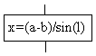
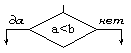
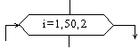
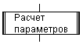
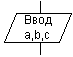
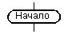
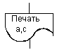
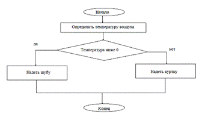

<table style="width: 100%;">
<tr><td style="width: 40%;"></td>
<td style="width: 20%;">
<a href="../readme.md">Содержание</a></td>
<td style="width: 40%;">
<a href="../articles/t1l2.md">Основные алгоритмические конструкции</a></td>
<tr></table>

# Основные понятия алгоритмизации

<a name="q1"></a>

Работа по решению любой задачи с использованием компьютера делится на следующие этапы:

1. Постановка задачи.
2. Формализация задачи.
3. Построение алгоритма.
4. Составление программы на языке программирования.
5. Отладка и тестирование программы.
6. Использование программы.

Часто эту последовательность называют технологической цепочкой решения задачи.   Непосредственно к программированию в этом списке относятся пункты 3, 4, 5. 

На этапе постановки задачи должно быть четко сформулировано, что дано и что требуется найти. Здесь очень важно определить полный набор исходных данных, необходимых для получения решения.

Второй этап — формализация задачи. Здесь чаще всего задача переводится на язык математических формул, уравнений, отношений. Если решение требует математического описания какого-то реального объекта, явления или процесса, то формализация равносильна получению соответствующей математической модели.

Третий этап — построение алгоритма. Опытные программисты часто сразу пишут программы на языках, не прибегая к каким-либо специальным способам описания алгоритмов (блок-схемам, псевдокодам). Однако в учебных целях полезно использовать эти средства, а затем переводить полученный алгоритм на язык программирования.

Первые три этапа предусматривают работу без компьютера. Дальше следует собственно программирование на определенном языке, в определенной системе программирования. Последний (шестой) этап — это использование уже разработанной программы в практических целях.

Таким образом, программист должен обладать следующими знаниями и навыками:

* уметь строить алгоритмы;
* знать языки программирования;
* уметь работать в соответствующей системе программирования.
 
## Понятие алгоритма

Одним из фундаментальных понятий в информатике является понятие алгоритма. Происхождение самого термина «алгоритм» связано с математикой. Это слово происходит от Algorithmi — латинского написания имени Мухаммеда альХорезми (787 — 850), выдающегося математика средневекового Востока. В XII в. был выполнен латинский перевод его математического трактата, из которого европейцы узнали о десятичной позиционной системе счисления и правилах арифметики многозначных чисел. Именно эти правила в то время называли алгоритмами. Сложение, вычитание, умножение столбиком, деление уголком многозначных чисел — вот первые алгоритмы в математике.

<a name="q2"></a>

В наше время понятие алгоритма трактуется шире. ***Алгоритм — это последовательность команд управления каким-либо исполнителем.***

Алгоритм может быть предназначен для выполнения его человеком или автоматическим устройством — формальным исполнителем. Задача исполнителя — точная реализация уже имеющегося алгоритма. Формальный исполнитель не обязан вникать в сущность алгоритма, а возможно, и неспособен его понять.

Примером формального исполнителя может служить автоматическая стиральная машина, которая неукоснительно исполняет предписанные ей действия, даже если вы забыли положить в нее порошок. Человек тоже может выступать в роли формального исполнителя, но в первую очередь формальными исполнителями являются различные автоматические устройства, и компьютер в том числе.

В разделе информатики под названием **Программирование** изучаются методы программного управления работой ЭВМ. Следовательно, в качестве исполнителя выступает компьютер. 

Компьютер работает с величинами — различными информационными объектами: числами, символами, кодами и т.п. Поэтому алгоритмы, предназначенные для управления компьютером, принято называть *алгоритмами работы с величинами*.

**Данные и величины**. ***Совокупность величин, с которыми работает компьютер, принято называть данными***. По отношению к программе данные делятся на исходные, результаты (окончательные данные) и промежуточные, которые получаются в процессе вычислений.


Например, при решении квадратного уравнения ах<sup>2</sup> + Ьх + с = 0
исходными данными являются коэффициенты а, Ь, с; результатами — корни уравнения х1, х2; промежуточным данным — дискриминант уравнения D = b<sup>2</sup> - 4ас.

Для успешного освоения программирования необходимо усвоить следующее правило: *всякая величина занимает свое определенное место в памяти ЭВМ* (иногда говорят — ячейку памяти). Хотя термин «ячейка» с точки зрения архитектуры современных ЭВМ несколько устарел, однако в учебных целях его удобно использовать.

У всякой величины имеются ***три основных свойства***: ***имя, значение и тип*** (на самом деле многие современные языки, такие как PHP или JS, обходятся без явного указания типа, интерпретируя тип переменной в зависимости от контекста операции). На уровне команд процессора величина идентифицируется при помощи адреса ячейки памяти, в которой она хранится. В алгоритмах и языках программирования величины делятся на *константы и переменные*. Константа — неизменная величина, и в алгоритме она представляется собственным значением, например: 15, 34.7, k, true и т.д. Переменные величины могут изменять свои значения в ходе выполнения программы и представляются символическими именами — идентификаторами, например: X, S2, cod15. Любая константа, как и переменная, занимает ячейку памяти, а значение этих величин определяется двоичным кодом в этой ячейке.

Теперь о типах величин — *типах данных*. С понятием типа данных вы уже, возможно, встречались, изучая в курсе информатики базы данных и электронные таблицы. Это понятие является фундаментальным для программирования.

<a name="q3"></a>

В каждом языке программирования существует своя концепция типов данных, своя система типов. Тем не менее в любой язык входит ***минимально необходимый набор основных типов данных***, к которому относятся: ***целый, вещественный, логический и символьный*** типы. С типом величины связаны три ее характеристики: множество допустимых значений, множество допустимых операций, форма внутреннего представления. Ниже представлены эти характеристики для основных типов данных.

 Тип   | Значения | Операции | Внутреннее представление
 ------|----------|----------|-------------------------
 Целый | Целые положительные и отрицательные числа в некотором диапазоне.<br/> Примеры: 23, —12, 387 | Арифметические операции с целыми числами: +, —, *,  целое деление и остаток от деления.<br/>Операции отношений (<, >, = и др.) | Формат с фиксированной точкой
 Вещественный | Любые (целые и дробные) числа в некотором диапазоне.<br/> Примеры: 2.5, -0.01, 45.0, 3.6-109 | Арифметические операции: +, —, *, /.<br/>Операции отношений | Формат с плавающей точкой
 Логический | True (истина),<br/>False (ложь) | Логические операции: И (&), ИЛИ (\|), HE (~). Операции отношений | 1 бит:<br/>1 - true;<br/>0 - false
Символьный | Любые символы компьютерного алфавита.<br/>Примеры: 'а', '5', '+', '$' | Операции отношений | Коды таблицы символьной кодировки. 1 символ - 1 байт (Сейчас используются многобайтные кодировки: UTF-8, UTF-16...)

Типы констант определяются по контексту (т.е. по форме записи в тексте), а типы переменных устанавливаются в описаниях переменных (не во всех языках; Python, например, не имеет явного определения типа, тип переменной определяетя при первом присваивании).

Есть еще один вариант классификации данных — классификация по структуре. Данные делятся на *простые и структурированные*. Для простых величин (их еще называют скалярными) справедливо утверждение: одна величина — одно значение, для структурированных: одна величина — множество значений. К структурированным величинам относятся массивы, строки, множества и т.д.

## Свойства алгоритма

<a name="q4"></a>

**Массовость** — алгоритм решения задачи разрабатывается в общем виде, то есть он должен быть применим для некоторого класса задач, различающихся только исходными данными. При этом исходные данные могут выбираться из некоторой области, которая называется областью применимости алгоритма.

**Понятность** - команды, используемые в алгоритме, должны быть понятны исполнителю.

**Дискретность** (прерывность, раздельность) — алгоритм должен представлять процесс решения задачи как последовательное выполнение простых шагов. Каждое действие, предусмотренное алгоритмом, исполняется только после того, как закончилось исполнение предыдущего.

**Определенность** (детерминнированность) — предполагает получение однозначного результата вычислительного процecca при заданных исходных данных. Благодаря этому свойству процесс выполнения алгоритма носит механический характер.

**Результативность** (конечность) — алгоритм должен приводить к решению задачи за конечное число шагов.

## Формы записи алгоритмов

<a name="q5"></a>

На практике наиболее распространены следующие формы представления алгоритмов:
- словесная (запись на естественном языке)
- графическая (изображения из графических символов)
- псевдокоды (полуформализованные описания алгоритмов на условном алгоритмическом языке, включающие в себя как элементы языка программирования, так и фразы естественного языка, общепринятые математические обозначения и др.
- программная (тексты на языках программирования)

**Пример:** написать алгоритм "Одеться по погоде". Если на улице температура ниже 0, то необходимо надеть шубу, иначе – куртку.

### Словесный способ записи алгоритма

Словесный способ записи алгоритмов представляет собой описание последовательных этапов обработки данных. Алгоритм задается в произвольном изложении на естественном языке.

```
Алгоритм ПОГОДА  
Начало  
определить температуру воздуха  
если температура ниже 0, то надеть шубу, иначе надеть куртку  
Конец.
```

Словесный способ не имеет широкого распространения, так как такие описания:
- строго не формализуемы;
- страдают многословностью записей;
- допускают неоднозначность толкования отдельных предписаний.

### Графический способ записи алгоритмов

Наибольшее распространение благодаря своей наглядности получил графический способ записи алгоритмов. При графическом представлении алгоритм изображается в виде последовательности связанных между собой функциональных блоков, каждый из которых соответствует выполнению одного или нескольких действий.

Такое графическое представление называется схемой алгоритма или блок-схемой. В блок-схеме каждому типу действий (вводу исходных данных, вычислению значений выражений, проверке условий, управлению повторением действий, окончанию обработки и т.п.) соответствует геометрическая фигура, представленная в виде блочного символа. Блочные символы соединяются линиями переходов, определяющими очередность выполнения действий. В таблице приведены наиболее часто употребляемые символы.

Название символа | Обозначение и пример заполнения | Пояснение
-----------------|---------------------------------|------------
Процесс		       |           |Вычислительное действие или последовательность действий
Решение          | 		       | Проверка условий
Модификация	     |           | Начало цикла
Предопределенный процесс |   | Вычисления по подпрограмме, стандартной подпрограмме
Ввод-вывод       |           | Ввод-вывод в общем виде
Пуск-останов     |           | Начало, конец алгоритма, вход и выход в подпрограмму
Документ         |           | Вывод результатов на печать

Блок **процесс** применяется для обозначения действия или последовательности действий,изменяющих значение, форму представления или размещения данных. Для улучшения наглядности схемы несколько отдельных блоков обработки можно объединять в один блок. Представление отдельных операций достаточно свободно.

Блок **решение** используется для обозначения переходов управления по условию. В каждом блоке **решение** должны быть указаны вопрос, условие или сравнение, которые он определяет.

Блок **модификация** используется для организации циклических конструкций. (Слово модификация означает видоизменение, преобразование). Внутри блока записывается параметр цикла, для которого указываются его начальное значение, граничное условие и шаг изменения значения параметра для каждого повторения.

Блок **предопределенный процесс** используется для указания обращений к вспомогательным алгоритмам, существующим автономно в виде некоторых самостоятельных модулей, и для обращений к библиотечным подпрограммам.

Блок **Ввод-вывод** используется для преобразования данных в фор­му, пригодную для обработки (ввод) или отображения результатов обработки (вывод). Отдельным логическим устройствам компьютера или отдельным функциям об­мена соответствуют определенные блочные символы. В каждом из них указыва­ются тип устройства или файла данных, тип информации, участвующий в обме­не, а также вид операции обмена.

Блок **Пуск-останов** используется для обозначения начала, конца, прерывания процесса обработки данных или выполнения программы.

Блок **Документ** предназначен для ввода-вывода данных, носителем которых служит бумага.



### Псевдокод

Псевдокод представляет собой систему обозначений и правил, предназначенную для единообразной записи алгоритмов.

Псевдокод занимает промежуточное место между естественным и формальным языками. С одной стороны, он близок к обычному естественному языку, поэтому алгоритмы могут на нем записываться и читаться как обычный текст. С другой стороны, в псевдокоде используются некоторые формальные конструкции и математическая символика, что приближает запись алгоритма к общепринятой математической записи.

В псевдокоде не приняты строгие синтаксические правила для записи команд, присущие формальным языкам, что облегчает запись алгоритма на стадии его проектирования и дает возможность использовать более широкий набор команд, рассчитанный на абстрактного исполнителя.

Однако в псевдокоде обычно имеются некоторые конструкции, присущие формальным языкам, что облегчает переход от записи на псевдокоде к записи алгоритма на формальном языке. В частности, в псевдокоде, так же, как и в формальных языках, есть служебные слова, смысл которых определен раз и навсегда. Они выделяются в печатном тексте жирным шрифтом, а в рукописном тексте подчеркиваются.

Единого или формального определения псевдокода не существует, поэтому возможны различные псевдокоды, отличающиеся набором служебных слов и основных (базовых) конструкций.

### Программный способ записи алгоритмов

При записи алгоритма в словесной форме, в виде блок-схемы или на псевдокоде допускается определенный произвол при изображении команд. Вместе с тем такая запись точна настолько, что позволяет человеку понять суть дела и исполнить алгоритм.

Однако на практике в качестве исполнителей алгоритмов используются специальные автоматы - компьютеры. Поэтому алгоритм, предназначенный для исполнения на компьютере, должен быть записан на понятном ему языке. И здесь на первый план выдвигается необходимость точной записи команд, не оставляющей места для произвольного толкования их исполнителем.

Следовательно, язык для записи алгоритмов должен быть формализован. Такой язык принято называть языком программирования, а запись алгоритма на этом языке - программой для компьютера.

Программа, создаваемая человеком - программистом, представляет собой текст, состоящий из знаков, как правило букв, цифр и специальных знаков. Знаки в тексте программы часто объединены в последовательности - ключевые слова, слова объединены в предложения языка программирования - операторы. Каждый оператор, как правило, записывается в отдельную строку текста программы.

Таким образом текстовое программирование представляет собой иерархическую последовательность знаков, слов, операторов, записываемых и читаемых последовательно, как обычный текст человеческой письменности.

```cs
//Пример программы на языке C#
namespace oap
{
  class Program
  {
    static void Main(string[] args)
    {
      Console.WriteLine("введите температуру воздуха t: ");
      var t = int.Parse( Console.ReadLine() );
      if (t < 0)
        Console.WriteLine("одеть шубу");
      else
        Console.WriteLine("одеть куртку");
    }
  }
}
```

### Структурное программирование

<a name="q6"></a>

Запись алгоритмов решения сложных задач в любой форме, в том числе в виде блок-схемы, может быть слишком объемной и сложной. Поэтому на практике используют некоторые методы, облегчающие построение и реализацию алгоритмов.

Одним из наиболее распространенных является ***метод структурного программирования***, или ***конструирование алгоритмов методом последовательной детализации***. При пошаговой детализации алгоритмы записываются в виде множества вспомогательных алгоритмов, решающих вспомогательные подзадачи, а каждая из них требует получения определенных промежуточных результатов.

Разработав основной алгоритм, можно приступить к разработке алгоритмов «второго уровня», которые, в свою очередь, могут требовать дальнейшей детализации. Процесс детализации продолжается до тех пор, пока не будут написаны все нужные вспомогательные алгоритмы. Таким образом, основной алгоритм представляет собой план действий, которые необходимо выполнить для достижения поставленной цели, а суть каждого действия расшифровывается в соответствующем вспомогательном алгоритме.

Каждый вспомогательный алгоритм описывает способ решения некоторой вспомогательной задачи или даже общий способ решения некоторого класса вспомогательных подзадач.

Для реализации вспомогательных алгоритмов служат подпрограммы, или процедуры. Подпрограмма — часть алгоритма (программы), оформленная в виде, допускающем многократное обращение к ней из разных точек программы. Обращение к подпрограмме — переход к выполнению подпрограммы с заданием информации, необходимой для ее выполнения и возврата.

## Общие принципы построения алгоритмов

При разработке алгоритма используют следующие основные принципы.

Принцип поэтапной детализации алгоритма (другое название — "проектирование сверху-вниз"). Этот принцип предполагает первоначальную разработку алгоритма в виде укрупненных блоков (разбиение задачи на подзадачи) и их постепенную детализацию.

Принцип "от главного к второстепенному", предполагающий составление алгоритма, начиная с главной конструкции. При этом, часто, приходится "достраивать" алгоритм в обратную сторону, например, от середины к началу.

Принцип структурирования, т.е. использования только типовых алгоритмических структур при построении алгоритма. Нетиповой структурой считается, например, циклическая конструкция, содержащая в теле цикла дополнительные выходы из цикла. В программировании нетиповые структуры появляются в результате злоупотребления командой безусловного перехода (GoTo). При этом программа хуже читается и труднее отлаживается.

## Определение сложности работы алгоритмов

Существует несколько способов измерения сложности алгоритма. Программисты обычно сосредотачивают внимание на скорости алгоритма, но не менее важны и другие показатели – требования к объёму памяти, свободному месте на диске. Использование быстрого алгоритма не приведёт к ожидаемым результатам, если для его работы понадобится больше памяти, чем есть у компьютера.

### Память или время

Многие алгоритмы предлагают выбор между объёмом памяти и скоростью. Задачу можно решить быстро, использую большой объём памяти, или медленнее, занимая меньший объём.
Типичным примером в данном случае служит алгоритм поиска кратчайшего пути. Представив карту города в виде сети, можно написать алгоритм для определения кратчайшего расстояния между двумя любыми точками этой сети. Чтобы не вычислять эти расстояния всякий раз, когда они нам нужны, мы можем вывести кратчайшие расстояния между всеми точками и сохранить результаты в таблице. Когда нам понадобится узнать кратчайшее расстояние между двумя заданными точками, мы можем просто взять готовое расстояние из таблицы.  

Результат будет получен мгновенно, но это потребует огромного объёма памяти. Карта большого города может содержать десятки тысяч точек. Тогда, описанная выше таблица, должна содержать более 10 млрд. ячеек. Т.е. для того, чтобы повысить быстродействие алгоритма, необходимо использовать дополнительные 10 Гб памяти.  

Из этой зависимости проистекает идея объёмно-временной сложности. При таком подходе алгоритм оценивается, как с точки зрении скорости выполнения, так и с точки зрения потреблённой памяти.

Мы будем уделять основное внимание временной сложности, но, тем не менее, обязательно будем оговаривать и объём потребляемой памяти.

### Оценка порядка

При сравнении различных алгоритмов важно знать, как их сложность зависит от объёма входных данных. Допустим, при сортировке одним методом обработка тысячи чисел занимает 1 с., а обработка миллиона чисел – 10 с., при использовании другого алгоритма может потребоваться 2 с. и 5 с. соответственно. В таких условиях нельзя однозначно сказать, какой алгоритм лучше.

В общем случае сложность алгоритма можно оценить по порядку величины. Алгоритм имеет сложность ``O(f(n))``, если при увеличении размерности входных данных N, время выполнения алгоритма возрастает с той же скоростью, что и функция ``f(N)``. Рассмотрим код, который для матрицы A[NxN] находит максимальный элемент в каждой строке.

```pas
for i:=1 to N do
begin
  max:=A[i,1];
  for j:=1 to N do
  begin
    if A[i,j]>max then
      max:=A[i,j]
  end;
  writeln(max);
end;
```

В этом алгоритме переменная i меняется от 1 до N. При каждом изменении i, переменная j тоже меняется от 1 до N. Во время каждой из N итераций внешнего цикла, внутренний цикл тоже выполняется N раз. Общее количество итераций внутреннего цикла равно N*N. Это определяет сложность алгоритма O(N<sup>2</sup>).

Оценивая порядок сложности алгоритма, необходимо использовать только ту часть, которая возрастает быстрее всего. Предположим, что рабочий цикл описывается выражением N<sup>3</sup>+N. В таком случае его сложность будет равна O(N<sup>3</sup>). Рассмотрение быстро растущей части функции позволяет оценить поведение алгоритма при увеличении N. Например, при N=100, то разница между N<sup>3</sup>+N=1000100 и N=1000000 равна всего лишь 100, что составляет 0,01%.

При вычислении O можно не учитывать постоянные множители в выражениях. Алгоритм с рабочим шагом 3N<sup>3</sup> рассматривается, как O(N<sup>3</sup>). Это делает зависимость отношения O(N) от изменения размера задачи более очевидной.

### Определение сложности

Наиболее сложными частями программы обычно является выполнение циклов и вызов процедур. В предыдущем примере весь алгоритм выполнен с помощью двух циклов.

Если одна процедура вызывает другую, то необходимо более тщательно оценить сложность последней. Если в ней выполняется определённое число инструкций (например, вывод на печать),то на оценку сложности это практически не влияет. Если же в вызываемой процедуре выполняется O(N) шагов, то функция может значительно усложнить алгоритм. Если же процедура вызывается внутри цикла, то влияние может быть намного больше.

В качестве примера рассмотрим две процедуры: Slow со сложностью O(N<sup>3</sup>) и Fast со сложностью O(N<sup>2</sup>).

```pas
procedure Slow;
var
  i,j,k: integer;
begin
  for i:=1 to N do
    for j:=1 to N do
      for k:=1 to N do
        //какое-то действие
end;

procedure Fast;
var
  i,j: integer;
begin
  for i:=1 to N do
    for j:=1 to N do
      Slow;
end;

procedure Both;
begin
  Fast;
end;
```

Если во внутренних циклах процедуры Fast происходит вызов процедуры Slow, то сложности процедур перемножаются. В данном случае сложность алгоритма составляет O(N<sup>2</sup>)*O(N<sup>3</sup>)=O(N<sup>5</sup>).

Если же основная программа вызывает процедуры по очереди, то их сложности складываются: 

O(N<sup>2</sup>)+O(N<sup>3</sup>)=O(N<sup>3</sup>). 

Следующий фрагмент имеет именно такую сложность:

```pas
procedure Slow;
var
  i,j,k: integer;
begin
  for i:=1 to N do
    for j:=1 to N do
      for k:=1 to N do
        {какое-то действие}
end;

procedure Fast;
var
  i,j: integer;
begin
  for i:=1 to N do
    for j:=1 to N do
      {какое-то действие}
end;

procedure Both;
begin
  Fast;
  Slow;
end;
```

### Сложность рекурсивных алгоритмов

#### Простая рекурсия

Рекурсивными процедурами называются процедуры, которые вызывают сами себя. Их сложность определить довольно тяжело. Сложность этих алгоритмов зависит не только от сложности внутренних циклов, но и от количества итераций рекурсии. Рекурсивная процедура может выглядеть достаточно простой, но она может серьёзно усложнить программу, многократно вызывая себя.

Рассмотрим рекурсивную реализацию вычисления факториала:

```pas
function Factorial(n: Word): integer;
begin
  if n > 1 then
    Factorial:=n*Factorial(n-1)
  else
    Factorial:=1;
end;
```

Эта процедура выполняется N раз, таким образом, вычислительная сложность этого алгоритма равна O(N).

#### Многократная рекурсия

Рекурсивный алгоритм, который вызывает себя несколько раз, называется многократной рекурсией. Такие процедуры гораздо сложнее анализировать, кроме того, они могут сделать алгоритм гораздо сложнее.

Рассмотрим такую процедуру:

```pas
procedure DoubleRecursive(N: integer);
begin
  if N>0 then
  begin
    DoubleRecursive(N-1);
    DoubleRecursive(N-1);
  end;
end;
```

Поскольку процедура вызывается дважды, можно было бы предположить, что её рабочий цикл будет равен O(2N)=O(N). Но на самом деле ситуация гораздо сложнее. Если внимательно исследовать этот алгоритм, то станет очевидно, что его сложность равна O(2<sup>(N+1)</sup>-1)=O(2<sup>N</sup>). 

Всегда надо помнить, что анализ сложности рекурсивных алгоритмов весьма нетривиальная задача.

#### Объёмная сложность рекурсивных алгоритмов

Для всех рекурсивных алгоритмов очень важно понятие объёмной сложности. При каждом вызове процедура запрашивает небольшой объём памяти, но этот объём может значительно увеличиваться в процессе рекурсивных вызовов. По этой причине всегда необходимо проводить хотя бы поверхностный анализ объёмной сложности рекурсивных процедур.

### Средний и наихудший случай

Оценка сложности алгоритма до порядка является верхней границей сложности алгоритмов. Если программа имеет большой порядок сложности, это вовсе не означает, что алгоритм будет выполняться действительно долго. На некоторых наборах данных выполнение алгоритма занимает намного меньше времени, чем можно предположить на основе их сложности. Например, рассмотрим код, который ищет заданный элемент в векторе A.

```pas
function Locate(data: integer): integer;
var
  i: integer;
  fl: boolean;
begin
  fl:=false; i:=1;
  while (not fl) and (i<=N) do
  begin
    if A[i]=data then
      fl:=true
    else
      i:=i+1;
  end;
  if not fl then
    i:=0;
  Locate:=i;
end;
```

Если искомый элемент находится в конце списка, то программе придётся выполнить N шагов. В таком случае сложность алгоритма составит O(N). В этом наихудшем случае время работы алгоритма будем максимальным.

С другой стороны, искомый элемент может находится в списке на первой позиции. Алгоритму придётся сделать всего один шаг. Такой случай называется наилучшим и его сложность можно оценить, как O(1).

Оба эти случая маловероятны. Нас больше всего интересует ожидаемый вариант. Если элемента списка изначально беспорядочно смешаны, то искомый элемент может оказаться в любом месте списка. В среднем потребуется сделать N/2 сравнений, чтобы найти требуемый элемент. Значит сложность этого алгоритма в среднем составляет O(N/2)=O(N).

В данном случае средняя и ожидаемая сложность совпадают, но для многих алгоритмов наихудший случай сильно отличается от ожидаемого. Например, алгоритм быстрой сортировки в наихудшем случае имеет сложность порядка O(N<sup>2</sup>), в то время как ожидаемое поведение описывается оценкой O(N*log(N)), что много быстрее.

### Общие функции оценки сложности

Сейчас мы перечислим некоторые функции, которые чаще всего используются для вычисления сложности. Функции перечислены в порядке возрастания сложности. Чем выше в этом списке находится функция, тем быстрее будет выполняться алгоритм с такой оценкой.

1. C – константа (время выполнения алгоритма не зависит от входных параметров, линейные алгоритмы)
2. log(log(N))
3. log(N) - (поиск в сортированном массиве)
4. N<sup>C</sup>, 0<C<1
5. N - линейная сложность (поиск в не сортированном массиве)
6. N*log(N)
7. N<sup>C</sup>, C>1
8. C<sup>N</sup>, C>1
9. N!

Если мы хотим оценить сложность алгоритма, уравнение сложности которого содержит несколько этих функций, то уравнение можно сократить до функции, расположенной ниже в таблице. Например, O(log(N)+N!)=O(N!).

Если алгоритм вызывается редко и для небольших объёмов данных, то приемлемой можно считать сложность O(N<sup>2</sup>), если же алгоритм работает в реальном времени, то не всегда достаточно производительности O(N).

Обычно алгоритмы со сложностью N*log(N) работают с хорошей скоростью. Алгоритмы со сложностью N<sup>C</sup> можно использовать только при небольших значениях C. Вычислительная сложность алгоритмов, порядок которых определяется функциями C<sup>N</sup> и N! очень велика, поэтому такие алгоритмы могут использоваться только для обработки небольшого объёма данных.

В заключение приведём таблицу, которая показывает, как долго компьютер, осуществляющий миллион операций в секунду, будет выполнять некоторые медленные алгоритмы.

Сложность    | N=10    |   N=20  | N=30    | N=40           | N=50
:-----------:|:-------:|:-------:|:-------:|:--------------:|:-:
 N<sup>3     | 0.001 c | 0.008 c | 0.027 c | 0.064 c        | 0.125 c
 2<sup>N     | 0.001 c | 1.05 c  | 17.9 мин|1.29 дней       |35.7 лет
 3<sup>N     | 0.059 c | 58.1 мин| 6.53 лет| 3.86\*10<sup>5</sup> лет | 2.28\*10<sup>10</sup> лет
 N!          | 3.63 c  | 7.71\*10<sup>4</sup> лет | 8.41\*10<sup>18</sup> лет | 2.59\*10<sup>34</sup> лет | 9.64\*10<sup>50</sup> лет

[Википедия: Временная сложность алгоритма](https://ru.wikipedia.org/wiki/%D0%92%D1%80%D0%B5%D0%BC%D0%B5%D0%BD%D0%BD%D0%B0%D1%8F_%D1%81%D0%BB%D0%BE%D0%B6%D0%BD%D0%BE%D1%81%D1%82%D1%8C_%D0%B0%D0%BB%D0%B3%D0%BE%D1%80%D0%B8%D1%82%D0%BC%D0%B0)

***
КОНТРОЛЬНЫЕ ВОПРОСЫ

1. [Этапы решения задачи на компьютере? Охарактеризуйте их. Проиллюстрируйте этапы постановки и формализации на примере задачи: вычислить время движения моторной лодки между двумя пунктами.](#q1)

2. [Понятие алгоритма.](#q2)

3. [Основные типы данных.](#q3)

4. [Свойства алгоритма.](#q4)

5. [Формы записи алгоритмов.](#q5)

6. [Что такое структурное программирование? Каковы основные прнципы структурной методики построения алгоритмов? ](#q6)

<table style="width: 100%;">
<tr><td style="width: 40%;"></td>
<td style="width: 20%;">
<a href="../readme.md">Содержание</a></td>
<td style="width: 40%;">
<a href="../articles/t1l2.md">Основные алгоритмические конструкции</a></td>
<tr></table>
