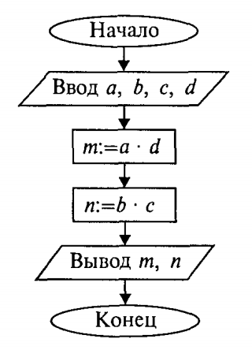
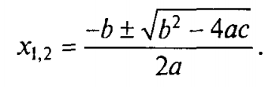
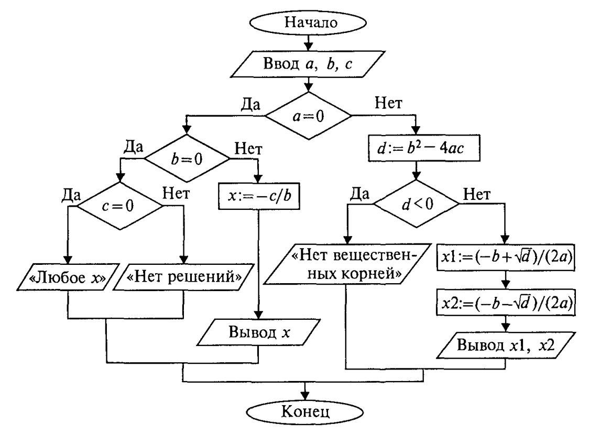
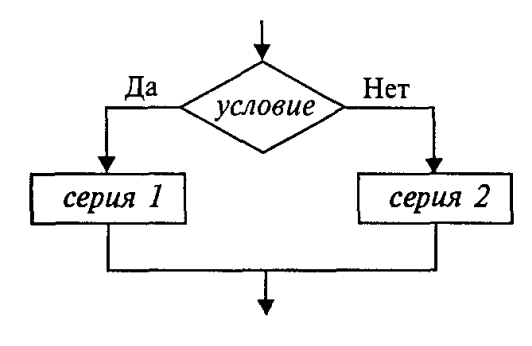
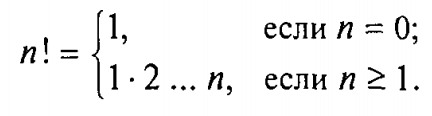
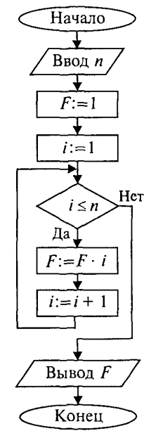
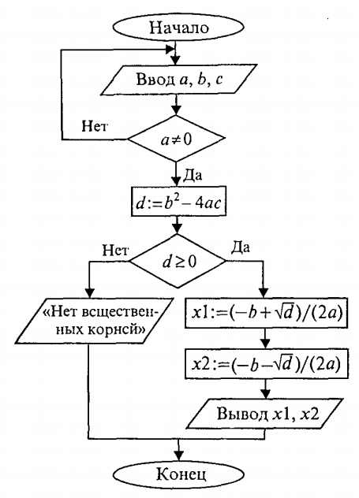
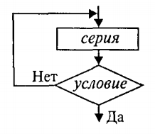
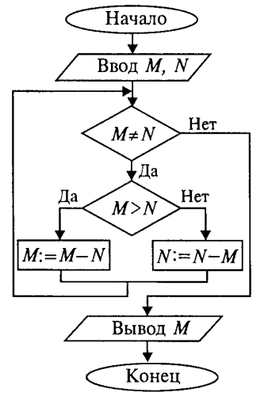
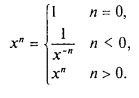

[содержание](/readme.md)  

# Основные алгоритмические конструкции

Алгоритм применительно к вычислительной машине — точное предписание, т.е. набор операций и правил их чередования, при помощи которого, начиная с некоторых исходных данных, можно решить любую задачу фиксированного типа.

Алгоритмы в зависимости от цели, начальных условий задачи, путей ее решения, определения действий исполнителя подразделяются следующим образом:

<a name="q1"></a>

**Линейный алгоритм** — набор команд (указаний), выполняемых последовательно друг за другом.

Основным элементарным действием в линейных алгоритмах является присваивание значения переменной величине. Если значение константы определено видом ее записи, то переменная величина получает конкретное значение только в результате присваивания. Присваивание может осуществляться двумя способами: с помощью команды присваивания и с помощью команды ввода.

Рассмотрим пример. В школьном учебнике математики правила деления обыкновенных дробей описаны так:

1. Числитель первой дроби умножить на знаменатель второй дроби.
2. Знаменатель первой дроби умножить на числитель второй дроби.
3. Записать дробь, числитель которой есть результат выполнения пункта 1, а знаменатель — результат выполнения пункта 2.

В алгебраической форме это выглядит следующим образом:


Построим алгоритм деления дробей для ЭВМ. В этом алгоритме сохраним те же обозначения для переменных, которые использованы в записанной выше формуле. Исходными данными являются целочисленные переменные а, Ь, с, d. Результатом — также целые величины m и n. Блок-схема и текст алгоритма на языке программирования (ЯП) Kotlin приведены ниже.



```kt
fun main(){
    println("Enter a, b, c, d: ")
    val a = readLine()!!
    val b = readLine()!!
    val c = readLine()!!
    val d = readLine()!!
    val m = a.toInt()*d.toInt()
    val n = b.toInt()*c.toInt()
    println("m=$m, n=$n")
}
```

Формат команды присваивания следующий:

```
переменная = выражение  
```    

Знак «=» нужно читать как «присвоить».  

Команда присваивания обозначает следующие действия, выполняемые компьютером:

1. Вычисляется выражение.
2. Полученное значение присваивается переменной.

В приведенном выше алгоритме присутствуют две команды присваивания. В блок-схемах команда присваивания записывается в прямоугольнике. Такой блок называется вычислительным блоком.

В описаниях алгоритмов необязательно соблюдать строгие правила в записи выражений. Их можно писать в обычной математической форме. Это еще не язык программирования со строгим синтаксисом.

В приведенном алгоритме присутствуют команды ввода:

```kt
val a = readLine()!!
val b = readLine()!!
val c = readLine()!!
val d = readLine()!!
```

В блок-схеме команда ввода записывается в параллелограмме — блоке ввода-вывода. При выполнении данной команды процессор прерывает работу и ожидает действий пользователя. Пользователь должен набрать на устройстве ввода (клавиатуре) значения вводимых переменных и нажать на клавишу ввода Enter. Обычно с помощью команды ввода присваиваются значения исходных данных, а команда присваивания используется для получения промежуточных и конечных величин.

Полученные компьютером результаты решения задачи должны быть сообщены пользователю. Для этих целей предназначена команда вывода:

```kt
println("m=$m, n=$n")
```

С помощью этой команды результаты выводятся на экран или на устройство печати на бумагу.

Поскольку присваивание является важнейшей операцией в вычислительных алгоритмах, обсудим ее более подробно.

Рассмотрим последовательное выполнение четырех команд присваивания, в которых участвуют две переменные величины a и b.

В приведенной ниже таблице напротив каждой команды присваивания указываются значения переменных, которые устанавливаются после ее выполнения.

Команда | a | b
--------|---|---
a=1     | 1 | -
b=a*2   | 1 | 2
a=b     | 2 | 2
b=a+b   | 2 | 4


Этот пример иллюстрирует три основных свойства команды присваивания:

* пока переменной не присвоено значение, она остается неопределенной;
* значение, присвоенное переменной, сохраняется в ней вплоть до выполнения следующей команды присваивания этой переменной;
* новое значение, присваиваемое переменной, заменяет ее предыдущее значение.

Рассмотрим один очень полезный алгоритм, который приходится часто использовать при программировании. Даны две величины: Х и Y. Требуется произвести между ними обмен значениями. Например, если первоначально было Х=1, Y=2, то после обмена должно стать: Х=2, Y=1.

Хорошей моделью для решения этой задачи является следующая ситуация: имеются два стакана — один с молоком, другой с водой. Требуется произвести обмен их содержимым. Всякому ясно, что в этом случае нужен дополнительный третий пустой стакан. Последовательность действий будет следующей: 1) перелить из первого стакана в третий; 2) перелить из второго в первый;
3) перелить из третьего во второй. Цель достигнута!


По аналогии для обмена значениями двух переменных нужна третья дополнительная переменная. Назовем ее Z. Тогда задача обмена решается последовательным выполнением трех команд присваивания:

Команда   | X | Y | Z
----------|---|---|---
ввод X, Y | 1 | 2 | -
Z = X     | 1 | 2 | 1
X = Y     | 2 | 2 | 1
Y = Z     | 2 | 1 | 1

Аналогия со стаканами не совсем точна в том смысле, что при переливании из одного стакана в другой первый становится пустым. В результате же присваивания (Х = Y) переменная, стоящая справа (Y), сохраняет свое значение.

Алгоритм для деления дробей имеет линейную структуру. В нем все команды выполняются в строго однозначной последовательности, каждая по одному разу. Линейный алгоритм составляется из команд присваивания, ввода, вывода и обращения к вспомогательным алгоритмам (об этом позже).

При описании алгоритмов в блок-схемах типы, как правило, не указываются (но подразумеваются). В алгоритмах для всех переменных типы указываются явно. В них используются следующие обозначения типов: Int — целый тип, Float — вещественный тип, String — символьный (литерный) тип, Boolean — логический тип. В алгоритме для деления дробей для всех переменных указан тип Int.

<a name="q2"></a>

**Разветвляющийся алгоритм** — алгоритм, содержащий хотя бы одно условие, в результате проверки которого ЭВМ обеспечивает переход на один из двух возможных шагов.

<a name="q3"></a>

**Циклический алгоритм** — алгоритм, предусматривающий многократное повторение одного и того же действия (одних и тех же операций) над новыми исходными данными. К циклическим алгоритмам сводится большинство методов вычислений, перебора вариантов. Цикл программы — последовательность команд (серия, тело цикла), которая может выполняться многократно (для новых исходных данных) до удовлетворения некоторому условию.

Составим алгоритм решения квадратного уравнения: ***ax<sup>2</sup>+bx+c=0***

Задача хорошо знакома из математики. Исходными данными здесь являются коэффициенты а, b, с. Решением в общем случае будут два корня х1 и х2, которые вычисляются по формуле:



Все используемые в этой программе величины вещественного типа. 

```kt
fun main(){
    println("Введите a, b, c:")
    val a = readLine()!!.toInt()
    val b = readLine()!!.toInt()
    val c = readLine()!!.toInt()
    val d = b*b-4*a*c
    val x1 = (-b+sqrt(d.toFloat()))/(2*a)
    val x2 = (-b-sqrt(d.toFloat()))/(2*a)
    println("x1=$x1, x2=$x2")
}
```

```
Введите a, b, c:
3
2
1
x1=NaN, x2=NaN
```

Слабость такого алгоритма видна невооруженным глазом. Он не обладает важнейшим свойством, предъявляемым к качественным алгоритмам, — универсальностью по отношению к исходным данным. *Какими бы ни были значения исходных данных, алгоритм должен приводить к определенному результату и завершать работу.* Результатом может быть число, но может быть и сообщение о том, что при определенных данных задача решения не имеет. Недопустимы остановки в середине алгоритма из-за невозможности выполнить какую-то операцию. Упомянутое свойство называют результативностью алгоритма (в любом случае должен быть получен какой-то результат). 

Чтобы построить универсальный алгоритм, сначала требуется тщательно проанализировать математическое содержание задачи. 

Решение уравнения зависит от значений коэффициентов а, b, с. Вот анализ рассмотренной выше задачи (ограничиваемся только поиском вещественных корней):

если а = 0, b = 0, с = 0, то любое х — решение уравнения;  
если а = 0, b = 0, с <> О, то уравнение действительных решений не имеет;  
если а = 0, b <> О, то это линейное уравнение, которое имеет одно решение х = -c/b;  
если а<>0 и d=b<sup>2</sup>-4ac >= 0, то уравнение имеет два вещественных корня (формулы приведены выше);  
если a<>0 и d<0, то уравнение не имеет вещественных корней.



Этот же алгоритм на Kotlin: 

```kt
fun main(){
    println("Введите a, b, c:")
    val a = readLine()!!.toInt()
    val b = readLine()!!.toInt()
    val c = readLine()!!.toInt()

    var x1: Float

    if(a==0){
        if(b==0){
            if(c==0) println("любое X")
            else println("нет решений")
        } else {
            x1 = -c.toFloat()/b
            println("X=$x1")
        }
    } else {
        val d = b*b-4*a*c
        if(d<0) println("нет вещественных корней")
        else{
            x1 = (-b+sqrt(d.toFloat()))/(2*a)
            val x2 = (-b-sqrt(d.toFloat()))/(2*a)
            println("x1=$x1, x2=$x2")
        }
    }
}
```

В этом алгоритме многократно использована *структурная команда ветвления*. Общий вид команды ветвления в блок-схемах и на ЯП следующий: 



```kt
if(условие) {серия1}
else {серия2}
```

Вначале проверяется условие (вычисляется отношение, логическое выражение). Если условие истинно, то выполняется серия 1 — последовательность команд, на которую указывает стрелка с надписью «да» (положительная ветвь). В противном случае выполняется серия 2 (отрицательная ветвь). В языке Kotlin условие записывается после служебного слова if, положительная ветвь — сразу после условия, отрицательная — после слова else.

Если на ветвях одного ветвления содержатся другие ветвления, то такой алгоритм имеет структуру *вложенных ветвлений*. Именно такую структуру имеет алгоритм «Корни квадратного уравнения».

Рассмотрим следующую задачу: дано целое положительное число n. Требуется вычислить n! (n-факториал). Вспомним определение факториала: 



Ниже приведена блок-схема алгоритма. В нем используются три переменные целого типа: n — аргумент; i — промежуточная переменная; F — результат. Для проверки правильности алгоритма построена трассировочная таблица. В такой таблице для конкретных значений исходных данных по шагам прослеживается изменение переменных, входящих в алгоритм. Данная таблица составлена для случая п = 3. 



Шаг | n |  F  | i | Условие
:--:|:-:|:---:|:-:|---------
1   | 3 |     |   | 
2   |   | 1   |   |    
3   |   |     | 1 |    
4   |   |     |   | 1<=3, да    
5   |   | 1   |   |    
6   |   |     | 2 |    
7   |   |     |   | 2<=3, да
8   |   | 2   |   |    
9   |   |     | 3 | 
10  |   |     |   | 3<=3, да
11  |   | 6   |   |    
12  |   |     | 4 |    
13  |   |     |   | 4<=3, нет
14  |   |вывод|   |    

Трассировка доказывает правильность алгоритма. Теперь запишем этот алгоритм на ЯП. 

```kt
fun main(){
    println("Введите n:")
    val n = readLine()!!.toInt()
    var F = 1
    var i = 1
    while (i<=n){
        F *= i  // F = F*i
        i++     // i = i+1
    }
    println("F=$F")
}
```

Этот алгоритм имеет циклическую структуру. В алгоритме использована структурная команда цикл-пока, или цикл с предусловием. Общий вид команды цикл-пока в блок-схемах и в ЯП следующий: 


```kt
while (условие) {
  //серия
}
```

Выполнение серии команд (тела цикла) повторяется, пока условие цикла истинно. Когда условие становится ложным, цикл заканчивает выполнение.

Цикл с предусловием — это основная, но не единственная форма организации циклических алгоритмов. Другим вариантом является цикл с постусловием. Вернемся к алгоритму решения квадратного уравнения. К нему можно подойти с такой позиции:  

если а = 0, то это уже не квадратное уравнение и его можно не рассматривать. В таком случае будем считать, что пользователь ошибся при вводе данных, и следует предложить ему повторить ввод. Иначе говоря, в алгоритме будет предусмотрен контроль достоверности исходных данных с предоставлением пользователю возможности исправить ошибку. Наличие такого контроля — еще один признак хорошего качества программы. 



```kt
fun main(){
    var a: Int
    do {
        println("Введите a:")
        a = readLine()!!.toInt()
    } while(a!=0)

    val d = b*b-4*a*c
    if(d<0) println("нет вещественных корней")
    else{
        val x1 = (-b+sqrt(d.toFloat()))/(2*a)
        val x2 = (-b-sqrt(d.toFloat()))/(2*a)
        println("x1=$x1, x2=$x2")
    }
}
```

В общем виде структурная команда цикл с постусловием или цикл — до представляется так: 



```kt
do {
  //серия
} while (условие)
```

Здесь используется условие окончания цикла. Когда оно становится истинным, цикл заканчивает работу. 

Составим алгоритм решения следующей задачи: даны два натуральных числа М и N. Требуется вычислить их наибольший общий делитель — НОД(M, N). 

Эта задача решается с помощью метода, известного под названием алгоритма Евклида. Его идея основана на том свойстве, что если M>N, то НОД(М, N) = НОД(М-N,N). Другой факт, лежащий в основе алгоритма, тривиален — НОД(М, М) = М. Для «ручного» выполнения этот алгоритм можно описать в форме следующей инструкции: 

1. Если числа равны, то взять их общее значение в качестве ответа; в противном случае продолжить выполнение алгоритма
2. Определить большее из чисел
3. Заменить большее число разностью большего и меньшего значений
4. Вернуться к выполнению пункта 1



```kt
fun main(){
    println("Введите m, n: ")
    var m = readLine()!!.toInt()
    var n = readLine()!!.toInt()
    while (m!=n){
        if(m>n) m = m-n
        else n = n-m
    }
    println("НОД = $m")
}
```

Алгоритм имеет структуру цикла с вложенным ветвлением. Проделайте самостоятельно трассировку этого алгоритма для случая М = 18, N = 12. В результате получится НОД = 6, что, очевидно, верно. 

<a name="q4"></a>

## Вспомогательные алгоритмы и процедуры

В теории алгоритмов известно понятие вспомогательного алгоритма. Вспомогательным называется алгоритм решения некоторой подзадачи из основной решаемой задачи. В таком случае алгоритм решения исходной задачи называется основным алгоритмом.

В качестве примера рассмотрим следующую задачу: требуется составить алгоритм вычисления степенной функции с целым показателем ***у = х<sup>к</sup>***, где к — целое число, х<>0. В алгебре такая функция определена следующим образом: 



Для данной задачи в качестве подзадачи можно рассматривать возведение числа в целую положительную степень.

Учитывая, что ***1/х<sup>-n</sup> = (1/х)<sup>-n</sup>***, запишем основной алгоритм решения этой задачи. 

```kt
fun main(){
    println("Введите x, n: ")
    var x = readLine()!!.toFloat()
    var n = readLine()!!.toInt()
    var y: Float

    if(n==0) y = 1F
    else {
        if(n>0) y = stepen(x, n)
        else y = stepen(1/x, -n)
    }
   
    println("y = $y")
}
```

Здесь дважды присутствует команда обращения к вспомогательному алгоритму с именем **stepen**. Это алгоритм возведения вещественного основания в целую положительную степень путем его многократного перемножения. Величины, стоящие в скобках в команде обращения к вспомогательному алгоритму, называются фактическими параметрами.

В котлине вспомогательные алгоритмы оформляются в виде функций. Запишем функцию stepen.

```kt
fun stepen(x: Float, n: Int): Float {
    var res = 1F
    var i = 1
    while(i<=n){
        res = res * x
        i++
    }
    return res
}
```

Заголовок вспомогательного алгоритма начинается с ключевого слова **fun**, после которого следует имя функции, в скобках — список формальных параметров и после скобок тип результата (не обязателен). В списке параметров перечисляются переменные-аргументы с указанием их типов. Здесь x и n — формальные параметры-аргументы. Следовательно, процедура **stepen** производит вычисления по формуле ***а<sup>к</sup>***. В основном алгоритме «Степенная функция» обращение к процедуре производится путем указания ее имени с последующим в скобках списком фактических параметров. Между формальными и фактическими параметрами процедуры должны выполняться следующие правила соответствия: 

* по количеству (сколько формальных, столько и фактических параметров)
* по последовательности (первому формальному соответствует первый фактический параметр, второму — второй и т.д.)
* по типам (типы соответствующих формальных и фактических параметров должны совпадать)

Фактические параметры-аргументы могут быть выражениями соответствующего типа.

Обращение к процедуре инициирует следующие действия:

1. Значения параметров-аргументов присваиваются соответствующим формальным параметрам.
2. Выполняется тело процедуры (команды внутри процедуры).
3. Значение результата возвращается командой return, и происходит переход к выполнению следующей команды основного алгоритма.

В функции **stepen** нет команд ввода исходных данных и вывода результатов. Здесь присваивание начальных значений аргументам (x, n) производится через передачу параметров-аргументов. А получение результата происходит командой return. Таким образом, передача значений параметров процедур — это третий способ присваивания (наряду с командой присваивания и командой ввода).

Использование процедур позволяет строить сложные алгоритмы методом *последовательной детализации*.

# Программы для графического отображения алгоритмов
https://draw.io (онлайн)  
Microsoft Visio  
Dia (бесплатная) 

***

КОНТРОЛЬНЫЕ ВОПРОСЫ

1. [Линейный алгоритм](#q1)
2. [Разветвляющийся  алгоритм](#q2)
3. [Циклический алгоритм](#q3)
4. [Вспомогательные алгоритмы и процедуры](#q4)

[содержание](/readme.md)  
