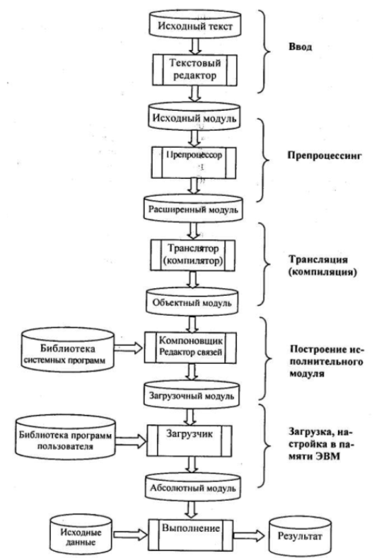

[содержание](/readme.md)  

# Языки программирования

Язык программирования — это способ записи программ решения различных задач на компьютере в понятной для компьютера форме.  
Процессор компьютера непосредственно понимает язык машинных команд.   
Программы на таких языках программисты писали лишь для самых первых ламповых машин — ЭВМ первого поколения.  
Программирование на языке машинных команд — дело непростое. Программист должен знать числовые коды всех машинных команд, должен сам распределять память под команды программы и данные.

## Эволюция языков программирования

В 1950-х гг. появляются первые средства автоматизации программирования — языки Автокоды. Позднее для языков этого уровня стало применяться название «Ассемблеры». 

Появление языков типа Ассемблер облегчило участь программистов.   
Переменные величины стали изображаться символическими именами. Числовые коды операций заменились на мнемонические (словесные) обозначения, которые легче запомнить. 

Язык программирования стал понятнее для человека, но при этом удалился от языка машинных команд.  
Чтобы компьютер мог исполнять программы на Ассемблере, потребовался специальный переводчик — транслятор. Транслятор — это системная программа, переводящая текст программы на Ассемблере в текст эквивалентной программы на язык машинных команд.

```asm
fact:
	push rbp
	mov rbp, rsp
	mov rbx, qword [rbp + 16]
	cmp rbx, 1
	jle fact_set_1
	mov rcx, rbx
	dec rcx
	push rcx
	call fact
	mov rbx, qword [rbp + 16]
	mul rbx
	jmp fact_end
fact_set_1:
	mov rax, 1
fact_end:
	pop rbp
	ret 8
```

Компьютер, оснащенный транслятором с Ассемблера, понимает Ассемблер. В этом случае можно говорить о псевдо-ЭВМ (аппаратура плюс транслятор с Ассемблера), языком которой является Ассемблер.  

Языки типа Ассемблер являются машинно-ориентированными, т.е. они настроены на структуру машинных команд конкретного компьютера. Разные компьютеры с разными типами процессоров имеют разный Ассемблер. 

<a name="q1"></a>

## Классификация языков программирования. 

*Язык машинных команд* и *ассемблер* являются **языками низкого уровня**.   
*Язык низкого уровня* – это язык программирования, предназначенный для определенного типа компьютера и отражающий его внутренний машинный код; языки низкого уровня часто называют машинно-ориентированными языками. Их сложно конвертировать для использования на компьютерах с разными центральными процессорами, а также довольно сложно изучать, поскольку для этого требуется хорошо знать внутренние принципы работы компьютера.

Помучавшись с языками низкого уровня человечество придумало **языки высокого уровня**.

*Язык высокого уровня* – это язык программирования, предназначенный для программиста; он не зависит от внутренних машинных кодов компьютера любого типа. Языки высокого уровня используют для решения проблем, и поэтому их часто называют проблемно-ориентированными языками. Каждая команда языка высокого уровня эквивалентна нескольким командам в машинных кодах, поэтому программы, написанные на языках высокого уровня, более компактны, чем аналогичные программы в машинных кодах.

Одна и та же программа на таком языке может быть выполнена на компьютерах разных типов, оснащенных соответствующим транслятором.

Форма записи программ на языках высокого уровня по сравнению с Ассемблером еще ближе к традиционной математической форме, к естественному языку. Языки высокого уровня легко изучаются, хорошо поддерживают структурную методику программирования.

>Почитать для саморазвития.  
Первыми популярными языками высокого уровня, появившимися в 1950-х гг., были Фортран, Кобол (в США) и Алгол (в Европе). Языки Фортран и Алгол были ориентированы на научно-технические расчеты математического характера. Кобол — язык для программирования экономических задач. В Коболе по сравнению с двумя другими названными языками слабее развиты математические средства, но зато хорошо развиты средства обработки текстов, организация вывода данных в форме требуемого документа. Для первых языков высокого уровня предметная ориентация языков была характерной чертой.  
Большое количество языков программирования появилось в 1960—1970-х гг. А за всю историю ЭВМ их было создано более тысячи. Но распространились, выдержали испытание временем немногие. В 1965 г. в Дартмутском университете был разработан язык Бейсик. По замыслу авторов это простой язык, легко изучаемый,
предназначенный для программирования несложных расчетных задач. Наибольшее распространение Бейсик получил на микроЭВМ и персональных компьютерах. На некоторых моделях школьных компьютеров программировать можно только на Бейсике.   
Однако Бейсик — неструктурный язык, и потому он плохо подходит для обучения качественному программированию. Справедливости ради следует заметить, что последние версии Бейсика для ПК (например, QBasic) стали более структурными и по своим изобразительным возможностям приближаются к таким языкам, как Паскаль.  
В эпоху ЭВМ третьего поколения получил большое распространение язык PL/1 {Program Language One), разработанный фирмой IBM. Это был первый язык, претендовавший на универсальность, т.е. на возможность решать любые задачи: вычислительные, обработки текстов, накопления и поиска информации. Однако PL/1
оказался слишком сложным языком. Для машин типа IBM 360/370 транслятор с него не мог считаться оптимальным, содержал ряд невыявленных ошибок. На ЭВМ класса мини и микро он вообще не получил распространения. Однако тенденция к универсализации языков оказалась перспективной. Старые языки были модернизированы в универсальные варианты — Алгол-68, Фортран-77.

Значительным событием в истории языков программирования стало создание в 1971 г. языка Паскаль. Его автор — швейцарский профессор Никлаус Вирт — разрабатывал Паскаль как учебный язык структурного программирования.

Наибольший успех в распространении этого языка обеспечили персональные компьютеры. Фирма Borland International, Inc (США) разработала систему программирования Турбо Паскаль для ПК (позднее, с добавлением поддержки ООП, язык стал называться Object Pascal, а интегрированная система программирования - Delphi).

Паскаль — это не только язык и транслятор с него, но еще и операционная оболочка, обеспечивающая пользователю удобство работы. Паскаль вышел за рамки учебного предназначения и стал языком профессионального программирования с
универсальными возможностями. Транслятор с Паскаля по оптимальности создаваемых им программ близок наиболее удачному в этом отношении транслятору — транслятору с Фортрана. В силу названных достоинств Паскаль стал основой нескольких других языков программирования, например, таких как Ада, Модула-2 и др.

Несмотря на хороший старт, в настоящее время Паскаль сдал свои позиции как язык коммерческой разработки. Его еще использую как учебный в некоторых вузах и техникумах, но даже тут он постепенно уступает свои позиции, как мало востребованный на рынке.  
Причин этому, на мой взгляд, несколько: и плохая ценовая политика (дистрибутив Дельфи не по карману начинающим разработчикам), так и переход программистского сообщества на открытые языки (open source), во множестве появившиеся в последнее время.

Язык программирования Си (английское название — С) создавался как инструментальный язык для разработки операционных систем, трансляторов, баз данных и других системных и прикладных программ. Так же как и Паскаль, Си — это язык структурного программирования, но, в отличие от Паскаля, в нем
заложены возможности непосредственного обращения к некоторым машинным командам, к определенным участкам памяти компьютера. Дальнейшее развитие Си привело к созданию языка объектно-ориентированного программирования Си++.

>Еще немного для саморазвития.  
Модула-2 — это еще один язык, предложенный Н.Виртом, основанный на языке Паскаль и содержащий средства для создания больших программ.  
Компьютеры будущего, пятого поколения называют машинами «искусственного интеллекта». Но прототипы языков для этих машин были созданы существенно раньше их физического появления. Это языки ЛИСП и Пролог.  
ЛИСП появился в 1965 г. Язык ЛИСП основан на понятии рекурсивно определенных функций. А поскольку доказано, что любой алгоритм может быть описан с помощью некоторого набора рекурсивных функций, то ЛИСП, по сути, является универсальным языком. С его помощью на компьютере можно моделировать достаточно сложные процессы, в частности интеллектуальную деятельность людей.  
Язык Пролог разработан во Франции в 1972 г. также для решения проблемы «искусственного интеллекта». Пролог позволяет в формальном виде описывать различные утверждения, логику рассуждений и заставляет компьютер давать ответы на заданные вопросы.

Реализовать тот или иной язык программирования на ЭВМ — это значит создать транслятор с этого языка для данной ЭВМ (тут имеется в виду не конкретный экземпляр ЭВМ, а архитектура процессора и поддерживаемая им система команд).

<a name="q2"></a>

Существуют два принципиально различных метода трансляции. Они называются соответственно компиляция и интерпретация. Для объяснения их различия можно предложить следующую аналогию: лектор должен выступить перед аудиторией на незнакомом ей языке.

Перевод можно организовать двумя способами:
* полный предварительный перевод — лектор заранее передает текст выступления переводчику, тот записывает перевод, размножает его и раздает слушателям (после чего лектор может и не выступать);
* синхронный перевод — лектор читает доклад, переводчик одновременно с ним слово в слово переводит выступление.

Компиляция является аналогом полного предварительного перевода; интерпретация — аналогом синхронного перевода. Транслятор, работающий по принципу компиляции, называется компилятором; транслятор, работающий методом интерпретации, —
интерпретатором.

При компиляции в память компьютера загружается программа-компилятор. Она воспринимает текст программы на языке высокого уровня как исходную информацию. После завершения компиляции получается программа на языке машинных команд. Затем в памяти остается только программа на языке машинных команд, которая выполняется, и получаются требуемые результаты.

Интерпретатор в течение всего времени работы программы находится во внутренней памяти. В ОЗУ помещается и программа на языке высокого уровня. Интерпретатор в последовательности выполнения алгоритма «читает» очередной оператор программы, переводит его в команды и тут же выполняет эти команды. Затем переходит к переводу и выполнению следующего оператора. При этом результаты предыдущих переводов в памяти не сохраняются. При повторном выполнении одной и той же команды она снова будет транслироваться. При компиляции исполнение программы разбивается на два этапа: трансляцию и выполнение. При интерпретации, поскольку трансляция и выполнение совмещены, программа на ЭВМ проходит в один этап. Однако откомпилированная программа выполняется быстрее, чем интерпретируемая.

Все это было востребовано в эпоху господства Wintel (Windows + Intel), т.е. одна ОС, одна платформа (Apple и сейчас остается нишевым продуктом), но в последние годы значительную часть рынка отвоевал Android (около 40% на 2018 год) и постепенно набирает популярность Linux, а на рынке процессоров теперь господствует архитектура ARM. 

Прикладным программам стала требоваться кроссплатформенность (возможность работать под любой ОС и на любой платформе) и на фоне возросшей мощности компьютерного "железа" востребованы стали интерпретируемые языки, т.к. для обеспечения их кроссплатформенности "достаточно" сделать интерпретатор языка под нужную ОС и платформу.

А теперь посмотрим на TOP-5 самых востребованых языков программирования (критерии оценки могут быть разными, как и получившийся список, но эти чаще всего встречаются):
* Java
* JavaScript
* Python
* C#
* PHP

Как видим все языки интерпретируемые, объектно-ориентированные,  кроссплатформенные, бесплатные (для C# начинающие программисты могут использовать Visual Studio Community Edidion или вообще сторонние IDE). 

Также в современной разработке скоростью выполнения программы пренебрегают в пользу *скорости разработки*. Порог вхождения в разработку в этих языках в целом намного ниже, чем в Си или Паскаль.   
Например, на PHP плюются все разработчики, но из-за чрезвычаной простоты языка сайты, разработанные на нем занимают до 80%.

## Понятие системы программирования

Системы программирования - это комплекс инструментальных программных средств, предназначенный для разработки программ на одном или нескольких языках программирования. Системы программирования предоставляют сервисные возможности программистам для разработки их собственных компьютерных программ.  

Современные системы программирования обычно предоставляют пользователям мощные и удобные средства разработки программ. В них входят:
* компилятор или интерпретатор;
* интегрированная среда разработки;
* средства создания и редактирования текстов программ;
* обширные библиотеки стандартных программ и функций;
* отладочные программы, т.е. программы, помогающие находить и устранять ошибки в программе;
* "дружественная" к пользователю диалоговая среда;
* многооконный режим работы;
* мощные графические библиотеки; утилиты для работы с библиотеками
* встроенный ассемблер;
* встроенная справочная служба;
* другие специфические особенности.

Многие системы программирования включают также средства RAD (RapidApplication Development – быстрая разработка приложений), например, простой и удобный способ разработки графического интерфейса.

## Классификация систем программирования

По набору входных языков различают системы программирования одно- и многоязыковые. Отличительная черта многоязыковых систем состоит в том, что отдельные части программы можно составлять на разных языках и с помощью специальных обрабатывающих программ объединять их в готовую для исполнения на ЭВМ программу.  

По структуре, уровню формализации входного языка и целевому назначению различают системы программирования машинно-ориентированные и машинно-независимые.
Машинно-ориентированные системы программирования имеют входной язык, наборы операторов и изобразительные средства которых существенно зависят от особенностей ЭВМ (внутреннего языка, структуры памяти и т.д.). Машинно-ориентированные системы позволяют использовать все возможности и особенности машинно-зависимых языков:

* высокое качество создаваемых программ;
* возможность использования конкретных аппаратных ресурсов;
* предсказуемость объектного кода и заказов памяти;
* для составления эффективных программ необходимо знать систему команд и особенности функционирования данной ЭВМ;
* трудоемкость процесса составления программ (особенно на машинных языках и ЯСК), плохо защищенного от появления ошибок;
* низкая скорость программирования;
* невозможность непосредственного использования программ, составленных на этих языках, на ЭВМ других типов.

Машинно-независимые системы программирования – это средство описания алгоритмов решения задач и информации, подлежащей обработке. Они удобны в использовании для широкого круга пользователей и не требуют от них знания особенностей организации функционирования ЭВМ. В таких системах программы, составляемые языках, имеющих название высокоуровневых языков программирования, представляют собой последовательности операторов, структурированные согласно правилам рассматривания языка (задачи, сегменты, блоки и т.д.). Операторы языка описывают действия, которые должна выполнять система после трансляции программы на машинном языке. Таким образом, командные последовательности (процедуры, подпрограммы), часто используемые в машинных программах, представлены в высокоуровневых языках отдельными операторами. Программист получил возможность не расписывать в деталях вычислительный процесс на уровне машинных команд, а сосредоточиться на основных особенностях алгоритма.

Транслятор (англ. translator — переводчик) — это программа-переводчик. Она преобразует программу, написанную на одном из языков высокого уровня, в программу,состоящую из машинных команд.

Трансляторы реализуются в виде компиляторов или интерпретаторов. С точки зрения выполнения работы компилятор и интерпретатор существенно различаются.

Компилятор (англ. compiler — составитель, собиратель) читает всю программу целиком, делает ее перевод и создает законченный вариант программы на машинном языке, который затем и выполняется.

Интерпретатор (англ. interpreter — истолкователь, устный переводчик) переводит и выполняет программу строка за строкой.

После того, как программа откомпилирована, ни сама исходная программа, ни компилятор более не нужны. В то же время программа, обрабатываемая интерпретатором, должна заново переводиться на машинный язык при каждом очередном запуске программы.  
Откомпилированные программы работают быстрее, но интерпретируемые проще исправлять и изменять.  
Каждый конкретный язык ориентирован либо на компиляцию, либо на интерпретацию — в зависимости от того, для каких целей он создавался. Например, Паскаль обычно используется для решения довольно сложных задач, в которых важна скорость работы программ. Поэтому данный язык обычно реализуется с помощью компилятора.
С другой стороны, Бейсик создавался как язык для начинающих программистов, для которых построчное выполнение программы имеет неоспоримые преимущества.
Иногда для одного языка имеется и компилятор, и интерпретатор. В этом случае для разработки и тестирования программы можно воспользоваться интерпретатором, а затем откомпилировать отлаженную программу, чтобы повысить скорость ее выполнения.
оздает законченный вариант программы на машинном языке, который затем и выполняется.

Отладчик в системе программирования

Отладка — этап разработки компьютерной программы, на котором обнаруживают, локализуют и устраняют ошибки. Чтобы понять, где возникла ошибка, приходится:
* узнавать текущие значения переменных;
* выяснять, по какому пути выполнялась программа.

Существуют две взаимодополняющие технологии отладки.
* Использование отладчиков — программ, которые включают в себя пользовательский интерфейс для пошагового выполнения программы: оператор за оператором, функция за функцией, с остановками на некоторых строках исходного кода или при достижении определённого условия.
* Вывод текущего состояния программы с помощью расположенных в критических точках программы операторов вывода — на экран, принтер, громкоговоритель или в файл. Вывод отладочных сведений в файл называется журналированием.

Отладчик помогает анализировать поведение отлаживаемой программы, обеспечивая ее трассировку, выполняя остановы в указанных точках или при заданных условиях, позволяя просмотреть текущие значения переменных, содержимое ячеек памяти, а иногда и регистров процессора, и при необходимости изменить эти значения. Отладчик является важной составной частью системы программирования.  
Трассировка программы заключается в выполнении программы или ее участка, сопровождающая выводом на экран, принтер или другой регистрацией в хронологической последовательности информации о событиях, связанных с выполнением программы. Трассировка программы применяется при отладке или тестировании программы, когда программа пользователя или ее отлаживаемый участок выполняется под управлением специальной программы-трассировщика. При этом, например, можно выводить на экран или в некоторый регистрирующий файл все встретившиеся при выполнении программы помеченные операторы в той последовательности, в которой они фактически выполняются. Таким образом может отслеживаться программная логика. При трассировке программы можно контролировать и значения переменных, важных для поиска ошибки, и т.д. Информация об отладочных действиях задается трассировщику, который изменяет объектную программу в опера­тивной памяти, размещая в точках трассировки команды перехода на программу трассировки, выполняющую требуемую регистрацию. Более сложные трассировщики могут также изменять объектную программу,исключать и вставлять операторы, позволяя таким образом программисту в течение одного и того же прогона программы не только локализовать ошибки, но и попытаться исключить их и посмотреть на результат этого исключения.

Популярные системы программирования:
1. **Microsoft Visual Studio** - платная, но есть версия Community Edition для некоммерческой разработки. Поддерживает разработку на языках: Ajax, ASP.NET, DHTML, JavaScript, JScript, Visual Basic, Visual C#, Visual C++, Visual F#, XAML и другие.
2. **NetBeans** - бесплатная, поддерживаемые языки: C, C++, C++ 11, Fortan, HTML 5, Java, PHP и другие.
3. **PyCharm**, есть бесплатная (Community Edition) версия, лучшая среда разработки для Python, поддерживает разработку на языках: AngularJS, Coffee Script, CSS, Cython, HTML, JavaScript, Node.js, Python, TypeScript.
4. **Eclipse** - бесплатный редактор, первоначально создавался для Java-разработки, поддерживаемые языки: C, C++, Java, Perl, PHP, Python, Ruby и другие.
5. **Aptana Studio 3** - IDE с открытым исходным кодом. Поддерживает большинство спецификаций браузеров. Поэтому пользователи этой IDE могут с ее помощью быстро разрабатывать, тестировать и развертывать веб-приложения. Поддерживаемые языки: HTML5, CSS3, JavaScript, Ruby, Rails, PHP и Python.

Хочу обратить внимание на **Visual Studio Code** — активно развивающийся, бесплатный редактор исходного кода, разработанный Microsoft для Windows, Linux и macOS. Позиционируется как «лёгкий» редактор кода для кроссплатформенной разработки веб- и облачных приложений. Включает в себя отладчик, инструменты для работы с Git, подсветку синтаксиса, IntelliSense и средства для рефакторинга. 
Т.е. это не полноценный IDE, но вполне подходит для разработки на PHP, JS, имеет систему плагинов, т.е. может быть добавлена поддержка и других языков.

## Исходный, объектный и загрузочный модули.
Рассмотрим структуру абстрактной многоязыковой, открытой, компилирующей системы программирования и процесс разработки приложений в данной среде.



1. **Ввод**. Программа на исходном языке (исходный модуль) готовится с помощью текстовых редакторов и в виде текстового файла или раздела библиотеки поступает на вход транслятора.
2. **Трансляция**. Трансляция исходной программы есть процедура преобразования исходного модуля в промежуточную, так называемую объектную форму. Трансляция в общем случае включает в себя препроцессинг (предобработку) и компиляцию.
3. **Препроцессинг** — необязательная фаза, состоящая в анализе исходного текста, извлечения из него директив препроцессора и их выполнения. Директивы препроцессора представляют собой помеченные спецсимволами (обычно %, #, &) строки,содержащие аббревиатуры или другие символические обозначения конструкций, включаемых в состав исходной программы перед ее обработкой компилятором.
4. **Компиляция** — в общем случае многоступенчатый процесс, включающий следующие фазы:
- **Синтаксический анализ** — проверка правильности конструкций, использованных программистом при подготовке текста;
- **Семантический анализ** — выявление несоответствий типов и структур переменных, функций и процедур;
- **Генерация объектного кода** — завершающая фаза трансляции.  
Выполнение трансляции (компиляции) может осуществляться в различных режимах, установка которых производится с помощью ключей, параметров или опций. Может быть,например, потребовано только выполнение фазы синтаксического анализа и т.п.  *Объектный модуль* представляет собой текст программы на машинном языке, включающий машинные инструкции, словари, служебную информацию. Объектный модуль не работоспособен, поскольку содержит неразрешенные ссылки на вызываемые подпрограммы библиотеки транслятора (в общем случае — системы программирования), реализующие функции ввода-вывода, обработки числовых и строчных переменных, а также на другие программы пользователей или средства пакетов прикладных программ.
5. **Построение исполнительного модуля**. Построение загрузочного модуля осуществляется специальными программными средствами — редактором связей, построителем задач, компоновщиком, основной функцией которых является объединение объектных и загрузочных модулей в единый загрузочный модуль с последующей записью в библиотеку или файл.
6. **Загрузка программы** (Обычно это делает уже операционная система, но в целях отладки программа может быть запущена и в IDE). Загрузочный модуль после сборки помещается в качестве файла на диске. Выполнение модуля состоит в загрузке его в оперативную память, настройке по месту в памяти и передаче ему управления. Образ загрузочного модуля в памяти называется абсолютным модулем, поскольку все команды ЭВМ здесь приобретают окончательную форму и получают абсолютные адреса в памяти. 

Современные системы программирования позволяют удобно переходить от одного этапа к другому. Это осуществляется в рамках так называемой интегрированной среды программирования, которая содержит в себе текстовый редактор, компилятор, компоновщик, встроенный отладчик и, в зависимости от системы или ее версии, предоставляет программисту дополнительные удобства для написания и отладки программ. 

## Интегрированная среда программирования.

TODO: расписать установку IDEA


Итак, "из коробки" мы имеем редактор кода с подсветкой, технологией  IntelliSense (автоподстановка переменных, методов и т.п.), поддержкой GIT, встроенным отладчиком.

***
КОНТРОЛЬНЫЕ ВОПРОСЫ

- [Классификация языков программирования](#q1)
- [компиляция и интерпретация, основные отличия](#q2)

[содержание](/readme.md)  
