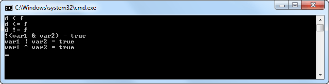
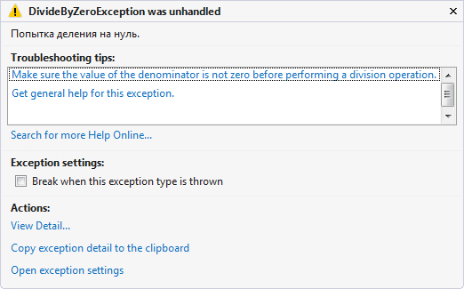
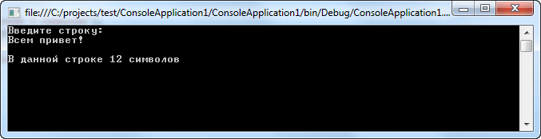
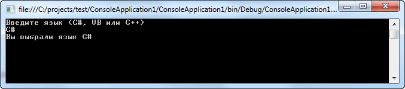
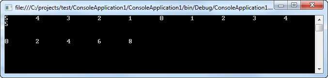
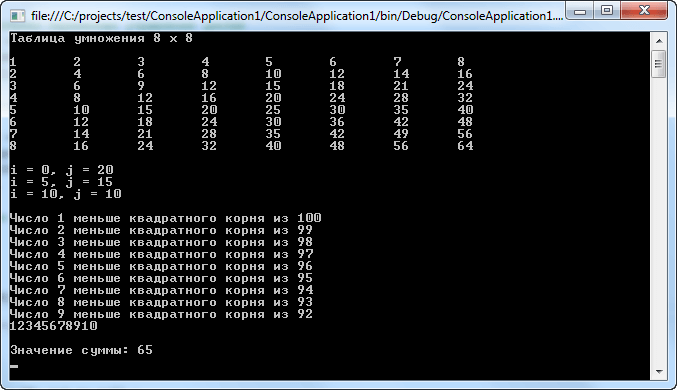
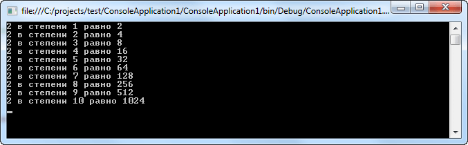

Предыдущая лекция | &nbsp; | Следующая лекция
:----------------:|:----------:|:----------------:
[Основные элементы языка.](./articles/t3l1.md) | [Содержание](../readme.md#тема-4-программирование-на-языке-c-основы) | [Массивы как структурированный тип данных.](./articles/t3l1_3.md)

# Основы языка C#

* [Операторы отношения и логические операторы](#Операторы_отношения_и_логические_операторы)
* [Условные операторы](#Условные_операторы)
* [Циклы](#Циклы)
* [Операторы перехода](#Операторы_перехода)

## Операторы отношения и логические операторы

В обозначениях **оператор отношения** и **логический оператор** термин *отношения* означает взаимосвязь, которая может существовать между двумя значениями, а термин *логический* — взаимосвязь между логическими значениями "истина" и "ложь". И поскольку операторы отношения дают истинные или ложные результаты, то они нередко применяются вместе с логическими операторами. Именно по этой причине они и рассматриваются совместно.

Ниже перечислены операторы отношения:

Оператор | Значение
:-------:|--------
== | Равно
!= | Не равно
`>` | Больше
`<` | Меньше
`>=` | Больше или равно
`<=` | Меньше или равно

К числу логических относятся операторы, приведенные ниже:

Оператор | Значение
:--------:|-------
& | И
\| | ИЛИ
^ | Исключающее ИЛИ
&& | Укороченное И
\|\| | Укороченное ИЛИ
! | НЕ

Результатом выполнения оператора отношения или логического оператора является логическое значение типа *bool*.

В целом, объекты можно сравнивать на равенство или неравенство, используя операторы отношения `==` и `!=`. А операторы сравнения `<`, `>`, `<=` или `>=` могут применяться только к тем типам данных, которые поддерживают отношение порядка. Следовательно, операторы отношения можно применять ко всем числовым типам данных. Но значения типа *bool* могут сравниваться только на равенство или неравенство, поскольку истинные (true) и ложные (false) значения не упорядочиваются. Например, сравнение `true > false` в C# не имеет смысла.

Рассмотрим пример программы, демонстрирующий применение операторов отношения и логических операторов:

```cs
short d = 10, f = 12;
bool var1 = true, var2 = false;

if (d < f) 
    Console.WriteLine("d < f");
if (d <= f)
    Console.WriteLine("d <= f");
if (d != f)
    Console.WriteLine("d != f");

// Следующее условие не выполнится
if (d > f)
    Console.WriteLine("d > f");

// Сравниванием переменные var1 и var2
if (var1 & var2)
    Console.WriteLine("Данный текст не выведется");
if (!(var1 & var2))
    Console.WriteLine("!(var1 & var2) = true");
if (var1 | var2)
    Console.WriteLine("var1 | var2 = true");
if (var1 ^ var2)
    Console.WriteLine("var1 ^ var2 = true");

Console.ReadLine();
```



Логические операторы в C# выполняют наиболее распространенные логические операции. Тем не менее существует ряд операций, выполняемых по правилам формальной логики. Эти логические операции могут быть построены с помощью логических операторов, поддерживаемых в C#. Следовательно, в C# предусмотрен такой набор логических операторов, которого достаточно для построения практически любой логической операции, в том числе импликации. **Импликация** — это двоичная операция, результатом которой является ложное значение только в том случае, если левый ее операнд имеет истинное значение, а правый — ложное. (Операция импликации отражает следующий принцип: истина не может подразумевать ложь.)

Операция импликации может быть построена на основе комбинации логических операторов `!` и `|`:

```cs
!p | q
```

### Укороченные логические операторы

В C# предусмотрены также специальные, *укороченные*, варианты логических операторов И и ИЛИ, предназначенные для получения более эффективного кода. Поясним это на следующих примерах логических операций. Если первый операнд логической операции И имеет ложное значение (false), то ее результат будет иметь ложное значение независимо от значения второго операнда. Если же первый операнд логической операции ИЛИ имеет истинное значение (true), то ее результат будет иметь истинное значение независимо от значения второго операнда. Благодаря тому что значение второго операнда в этих операциях вычислять не нужно, *экономится время и повышается эффективность кода*.

Укороченная логическая операция И выполняется с помощью **оператора &&**, а укороченная логическая операция ИЛИ — с помощью **оператора ||**. Этим укороченным логическим операторам соответствуют обычные логические операторы `&` и `|`. Единственное отличие укороченного логического оператора от обычного заключается в том, что второй его операнд вычисляется только по мере необходимости.

Укороченные логические операторы иногда оказываются более эффективными, чем их обычные аналоги. Так зачем же нужны обычные логические операторы И и ИЛИ? Дело в том, что в некоторых случаях требуется вычислять оба операнда логической операции И либо ИЛИ из-за возникающих побочных эффектов. Пример:

```cs
short d = 12, f = 0, i = 0;
bool b = true;

// В данном случае используется укороченный оператор
// и операции сравнения выполнится в нормальном потоке
if (f != 0 && (d % f) == 0)
    Console.WriteLine("{0} делится нацело на {1}",d,f);

// В этом случае так же используется укороченный оператор
// но при этом возникнет исключительная ситуация
// т.к. первый оператор сравнения содержит деление на 0
if ((d % f) == 0 && f != 0)
    Console.WriteLine("{0} делится нацело на {1}", d, f);

// При использовании целостного оператора в любом
// случае возникнет исключительная ситуация
if (f != 0 & (d % f) == 0)
    Console.WriteLine("{0} делится нацело на {1}", d, f);

//*** Практический пример использования обычных операторов ***//
// При использовании обычного оператора, в данной конструкции 
// i будет инкреминироваться
if (b | (++i < 10))
    Console.WriteLine("i равно {0}", i);   // i = 1

i = 0;
// При использовании укороченного оператора
// значение i останется прежним
if (b || (++i < 10))
    Console.WriteLine("i равно {0}", i);  // i = 0

Console.ReadLine();
```

Стоит отметить, что при возникновении исключительной ситуации во время отладки кода, IDE выводит сообщение следующего характера:



## Условные операторы

Условные операторы позволяют управлять *потоком выполнения* программы, чтобы не выполнялась каждая строка кода, как она следует в программе. Давайте рассмотрим все условные операторы языка C#:

### Оператор if

Для организации условного ветвления язык C# унаследовал от С и С++ конструкцию if...else. Ее синтаксис должен быть интуитивно понятен для любого, кто программировал на процедурных языках:

```cs
if (условие)
  оператор (операторы)
else
  оператор (операторы)
```

Если по каждому из условий нужно выполнить более одного оператора, эти операторы должны быть объединены в блок с помощью фигурных скобок `{...}`. (Это также касается других конструкций C#, в которых операторы могут быть объединены в блок — таких как циклы for и while.)

Стоит обратить внимание, что в отличие от языков С и С++, в C# условный оператор if может работать только с булевскими выражениями, но не с произвольными значениями вроде -1 и 0.

В операторе if могут применяться сложные выражения, и он может содержать операторы else, обеспечивая выполнение более сложных проверок. Синтаксис похож на применяемый в аналогичных ситуациях в языках С (С++) и Java. При построении сложных выражений в C# используется вполне ожидаемый набор логических операторов. Давайте рассмотрим следующий пример:

```cs
string myStr;
Console.WriteLine("Введите строку: ");

myStr = Console.ReadLine();

if (myStr.Length < 5)
    Console.WriteLine("\nВ данной строке меньше 5 символов");
else if ((myStr.Length >= 5) && (myStr.Length <= 12)) 
    Console.WriteLine("\nВ данной строке {0} символов",myStr.Length);
else Console.WriteLine("\nВ данной строке больше 12 символов");

Console.ReadLine();
```



Как видите количество else if, добавляемых к единственному if, не ограничено. Один момент, который следует отметить касательно if: фигурные скобки применять не обязательно, если в условной ветви присутствует только один оператор, как показано в исходном примере.

### Оператор switch

Вторым оператором выбора в C# является оператор **switch**, который обеспечивает многонаправленное ветвление программы. Следовательно, этот оператор позволяет сделать выбор среди нескольких альтернативных вариантов дальнейшего выполнения программы. Несмотря на то что многонаправленная проверка может быть организована с помощью последовательного ряда вложенных операторов if, во многих случаях более эффективным оказывается применение оператора switch. Этот оператор действует следующим образом. Значение выражения последовательно сравнивается с константами выбора из заданного списка. Как только будет обнаружено совпадение с одним из условий выбора, выполняется последовательность операторов, связанных с этим условием. Ниже приведена общая форма оператора switch:

```cs
switch(выражение) {
    case константа1:
        последовательность операторов
        break;
    case константа2:
        последовательность операторов
        break;
    case константаЗ:
        последовательность операторов
        break;

    ...

    default:
        последовательность операторов
        break;
}
```

Хотя оператор `switch...case` должен быть знаком программистам на С и С++, в C# он немного безопаснее, чем его эквивалент С++. В частности, он запрещает "сквозные" условия почти во всех случаях. Это значит, что если часть case вызывается в начале блока, то фрагменты кода за последующими частями case не могут быть выполнены, если только не используется явно оператор **goto** для перехода к ним. Компилятор обеспечивает это ограничение за счет того, что требует, чтобы за каждой частью *case* следовал оператор *break*, в противном случае он выдает ошибку.

Важно отметить, что заданное выражение в операторе *switch* должно быть *целочисленного типа* (char, byte, short или int), *перечислимого* или же *строкового*. А выражения других типов, например с плавающей точкой, в операторе switch не допускаются. Зачастую выражение, управляющее оператором *switch*, просто сводится к одной переменной. Кроме того, константы выбора должны иметь тип, совместимый с типом выражения. В одном операторе *switch* не допускается наличие двух одинаковых по значению констант выбора.

Давайте на примере рассмотрим использование оператора *switch*:

```cs
Console.WriteLine("Введите язык (C#, VB или C++)");
string myLanguage = Console.ReadLine();

sw1(myLanguage);

Console.ReadLine();
// Данный метод выводит выбор пользователя
static void sw1(string s)
{
    switch (s)
    {
        case "C#":
            Console.WriteLine("Вы выбрали язык C#");
            break;
        case "VB":
            Console.WriteLine("Вы выбрали язык Visual Basic");
            break;
        case "C++":
            Console.WriteLine("Вы выбрали язык С++");
            break;
        default:
            Console.WriteLine("Такой язык я не знаю");
            break;
    }
}
```



### Тернарный оператор

Тернарный оператор (?) относится к числу самых примечательных в C#. Он представляет собой условный оператор и часто используется вместо определенных видов конструкций `if-else`. Ниже приведена общая форма этого оператора (в квадратных скобках не обязательная часть):

```
[var Result =] Условие ? Выражение_если_условие_истинно : Выражение_если_условие_ложно;
```

Здесь *Условие* должно относиться к типу bool а *Выражение_если_условие_истинно* и *Выражение_если_условие_ложно* — к одному и тому же типу. Обратите внимание на применение двоеточия и его местоположение в операторе `?`. Значение выражения `?` определяется следующим образом. Сначала вычисляется *Условие*. Если оно истинно, то вычисляется *Выражение_если_условие_истинно*, а полученный результат определяет значение всего выражения `?` в целом. Если же *Условие* оказывается ложным, то вычисляется *Выражение_если_условие_ложно*, и его значение становится общим для всего выражения `?`:

```cs
int b, c;
c = -4;

b = (c >= 0) ? c : c*c;   // b = 16
```

Присваивать переменной результат выполнения оператора `?` совсем не обязательно. Например, значение, которое дает оператор `?`, можно использовать в качестве аргумента при вызове метода. А если все выражения в операторе `?` относятся к типу *bool*, то такой оператор может заменить собой условное выражение в цикле или операторе `if`. Давайте рассмотрим пример использования тернарного оператора:

```cs
int result;

// Реализуем функцию модуля числа
for (int i = 5; i >= -5; i--)
{
    result = i >= 0 ? i : -i;
    Console.Write("{0}\t", result);
}

Console.WriteLine("\n\n");

// Выбор четных чисел
for (int i = 0; i < 10; i++)
{
    if (i % 2 == 0 ? true : false)
        Console.Write("{0}\t",i);
}

Console.ReadLine();
```



## Циклы

В C# имеются четыре различных вида циклов (for, while, do...while и foreach), позволяющие выполнять блок кода повторно до тех пор, пока удовлетворяется определенное условие. В этой лекции мы познакомимся с циклами *for* и *while*.

### Цикл for

Цикл for в C# предоставляет механизм итерации, в котором определенное условие проверяется перед выполнением каждой итерации. Синтаксис этого оператора показан ниже:

```cs
for (инициализатор; условие; итератор)
  оператор (операторы)
```

Здесь:

**инициализатор** это выражение, вычисляемое перед первым выполнением тела цикла (обычно инициализация локальной переменной в качестве счетчика цикла). Инициализация, как правило, представлена оператором присваивания, задающим первоначальное значение переменной, которая выполняет роль счетчика и управляет циклом;

**условие** это выражение, проверяемое перед каждой новой итерацией цикла (должно возвращать true, чтобы была выполнена следующая итерация);

**итератор** - выражение, вычисляемое после каждой итерации (обычно приращение значения счетчика цикла).

Обратите внимание на то, что эти три основные части оператора цикла for должны быть разделены точкой с запятой. Выполнение цикла for будет продолжаться до тех пор, пока проверка условия дает истинный результат. Как только эта проверка даст ложный результат, цикл завершится, а выполнение программы будет продолжено с оператора, следующего после цикла for.

Стоит отметить, что цикл for отлично подходит для повторного выполнения оператора или блока операторов заранее известное количество раз. Давайте рассмотрим практическое применение цикла for на следующем примере:

```cs
// Данный метод выводит таблицу умножения
// размерностью b x b
static void tab(byte b)
{
    Console.WriteLine("Таблица умножения {0} x {0}\n", b);
    // Этот цикл проходит по строкам
    for (int i = 1; i <= b; i++)
    {
        // Этот цикл проходит по столбцам
        for (int j = 1; j <= b; j++)
            Console.Write("{0}\t", j * i);
        Console.WriteLine();
    }
    Console.WriteLine();
}

tab(8);

// Давайте разберем нестандартные возможности цикла for
// ************************************************* //

// Применение нескольких переменных управления циклом
for (byte i = 0, j = 20; i <= j; i += 5, j -= 5)
    Console.WriteLine("i = {0}, j = {1}",i,j);
Console.WriteLine();

// Использование условного выражения в цикле
bool b = false;
for (byte i = 1, j = 100; !b; i++, j--)
    if (i < Math.Sqrt(j))
        Console.WriteLine("Число {0} меньше квадратного корня из {1}", i, j);
    else b = true;

// Отсутствие части цикла
int k = 0;
for (; k < 10; )
{
    k++;
    Console.Write(k);
}
Console.WriteLine("\n");

// Цикл без тела
int sum = 0;
for (int i = 1; i <= 10; sum += ++i);

Console.WriteLine("Значение суммы: {0}",sum);

Console.ReadLine();
```



### Цикл while

Подобно for, while также является циклом с предварительной проверкой. Синтаксис его аналогичен, но циклы while включают только одно выражение:

```cs
while(условие)
    оператор (операторы);
```

где *оператор* — это единственный оператор или же блок операторов, а условие означает конкретное условие управления циклом и может быть любым логическим выражением. В этом цикле оператор выполняется до тех пор, пока условие истинно. Как только условие становится ложным, управление программой передается строке кода, следующей непосредственно после цикла.

Как и в цикле for, в цикле while проверяется условное выражение, указываемое в самом начале цикла. Это означает, что код в теле цикла может вообще не выполняться, а также избавляет от необходимости выполнять отдельную проверку перед самим циклом.

Пример:

```cs
// Пример возведения числа в несколько степеней
byte l = 2, i = 0;
int result = 1;

while (i < 10)
{
    i++;
    result *= l;
    Console.WriteLine("{0} в степени {1} равно {2}",l,i,result);
}

Console.ReadLine();
```



### Цикл do. . . while

Цикл do...while в C# — это версия while с постпроверкой условия. Это значит, что условие цикла проверяется после выполнения тела цикла. Следовательно, циклы do...while удобны в тех ситуациях, когда блок операторов должен быть выполнен как минимум однажды. Ниже приведена общая форма оператора цикла do-while:

```cs
do {
    операторы;
} while (условие);
```

При наличии лишь одного оператора фигурные скобки в данной форме записи необязательны. Тем не менее они зачастую используются для того, чтобы сделать конструкцию do-while более удобочитаемой и не путать ее с конструкцией цикла while. Цикл do-while выполняется до тех пор, пока условное выражение истинно. В качестве примера использования цикла do-while можно привести следующую программу, расчитывающую факториал числа:

```cs
try
{
    // Вычисляем факториал числа
    int i, result = 1, num = 1;

    Console.WriteLine("Введите число:");
    i = int.Parse(Console.ReadLine());

    Console.Write("\n\nФакториал {0} = ", i);
    do
    {
        result *= num;
        num++;
    } while (num <= i);

    Console.Write(result);
}
catch (FormatException ex)
{
    Console.WriteLine("Вы ввели не число. {0}",ex.Message);
}
finally
{
    Console.ReadLine();
}
```

<!-- TODO перенести к массивам -->

### Цикл foreach

Цикл foreach служит для циклического обращения к элементам **коллекции**, представляющей собой группу объектов. В C# определено несколько видов коллекций, каждая из которых является массивом. Ниже приведена общая форма оператора цикла foreach:

```cs
foreach (тип имя_переменной_цикла in коллекция) 
    оператор;
```

Здесь *тип имя_переменной_цикла* обозначает тип и имя переменной управления циклом, которая получает значение следующего элемента коллекции на каждом шаге выполнения цикла foreach. А *коллекция* обозначает циклически опрашиваемую коллекцию, которая здесь и далее представляет собой массив. Следовательно, тип переменной цикла должен соответствовать типу элемента массива. Кроме того, тип может обозначаться ключевым словом var. В этом случае компилятор определяет тип переменной цикла, исходя из типа элемента массива. Это может оказаться полезным для работы с определенного рода запросами. Но, как правило, тип указывается явным образом.

Оператор цикла foreach действует следующим образом. Когда цикл начинается, первый элемент массива выбирается и присваивается переменной цикла. На каждом последующем шаге итерации выбирается следующий элемент массива, который сохраняется в переменной цикла. Цикл завершается, когда все элементы массива окажутся выбранными.

Цикл foreach позволяет проходить по каждому элементу коллекции (объект, представляющий список других объектов). Формально для того, чтобы нечто можно было рассматривать как коллекцию, это нечто должно поддерживать интерфейс IEnumerable. Примерами коллекций могут служить массивы C#, классы коллекций из пространства имен System.Collection, а также пользовательские классы коллекций.

Пример использования цикла foreach:

```cs
// Объявляем два массива
int[] myArr = new int[5];
int[,] myTwoArr = new int[5, 6];
int sum = 0;

Random ran = new Random();

// Инициализируем массивы
for (int i = 1; i <= 5; i++)
{
    myArr[i-1] = ran.Next(1, 20);
    for (int j = 1; j <= 6; j++)
        myTwoArr[i - 1, j - 1] = ran.Next(1, 30);
}

// Вычисляем квадрат каждого элемента одномерного массива
foreach (int fVar in myArr)
    Console.WriteLine("{0} в квадрате равно {1}",fVar,fVar*fVar);

Console.WriteLine();
// Вычислим сумму элементов многомерного массива
foreach (int fTwoVar in myTwoArr)
    sum += fTwoVar;

Console.WriteLine("Сумма элементов многомерного массива: {0}",sum);

Console.ReadLine();
```

## Операторы перехода

Язык C# предлагает несколько операторов, позволяющих немедленно перейти на другую строку программы. Давайте их рассмотрим.

### Оператор goto

Имеющийся в C# оператор goto представляет собой оператор безусловного перехода. Когда в программе встречается оператор goto, ее выполнение переходит непосредственно к тому месту, на которое указывает этот оператор. Он уже давно "вышел из употребления" в программировании, поскольку способствует созданию "макаронного" кода. Хотя в некоторых случаях он оказывается удобным и дает определенные преимущества, если используется благоразумно. Главный недостаток оператора goto с точки зрения программирования заключается в том, что он вносит в программу беспорядок и делает ее практически неудобочитаемой. Но иногда применение оператора goto может, скорее, прояснить, чем запутать ход выполнения программы.

Для выполнения оператора goto требуется метка — действительный в C# идентификатор с двоеточием. Метка должна находиться в том же методе, где и оператор goto, а также в пределах той же самой области действия.

Пример использования оператора goto:

```cs
    // Обычный цикл for выводящий числа от 1 до 5
    Console.WriteLine("Обычный цикл for:");
    for (int i = 1; i <= 5; i++)
        Console.Write("\t{0}",i);

    // Реализуем то же самое с помощью оператора goto
    Console.WriteLine("\n\nА теперь используем goto:");
    int j = 1;
link1:     
    Console.Write("\t{0}",j);
    j++;
    if (j <= 5) goto link1; 


    Console.ReadLine();
```

Репутация оператора goto такова, что в большинстве случаев его применение категорически осуждается. Вообще говоря, он, конечно, не вписывается в рамки хорошей практики объектно-ориентированного программирования.

### Оператор break

С помощью оператора break можно специально организовать немедленный выход из цикла в обход любого кода, оставшегося в теле цикла, а также минуя проверку условия цикла. Когда в теле цикла встречается оператор break, цикл завершается, а выполнение программы возобновляется с оператора, следующего после этого цикла. Оператор break можно применять в любом цикле, предусмотренном в C#.

```cs
// В данном цикле выведутся числа от 1 до 5 вместо 100
for (int i = 1; i < 100; i++)
    if (i <= 5)
        Console.WriteLine(i);
    else break;

Console.ReadLine();
```

Обратите внимание если оператор break применяется в целом ряде вложенных циклов, то он прерывает выполнение только самого внутреннего цикла.

В отношении оператора break необходимо также иметь в виду следующее. Во-первых, в теле цикла может присутствовать несколько операторов break, но применять их следует очень аккуратно, поскольку чрезмерное количество операторов break обычно приводит к нарушению нормальной структуры кода. И во-вторых, оператор break, выполняющий выход из оператора switch, оказывает воздействие только на этот оператор, но не на объемлющие его циклы.

### Оператор continue

С помощью оператора continue можно организовать преждевременное завершение шага итерации цикла в обход обычной структуры управления циклом. Оператор continue осуществляет принудительный переход к следующему шагу цикла, пропуская любой код, оставшийся невыполненным. Таким образом, оператор continue служит своего рода дополнением оператора break.

В циклах while и do-while оператор continue вызывает передачу управления непосредственно условному выражению, после чего продолжается процесс выполнения цикла. А в цикле for сначала вычисляется итерационное выражение, затем условное выражение, после чего цикл продолжается:

```cs
// Выводим числа кратные 5
for (byte i = 1; i <= 100; i++)
{
    if (i % 5 != 0) continue;
    Console.Write("\t{0}", i);
}

Console.ReadLine();
```

Оператор continue редко находит удачное применение, в частности, потому, что в C# предоставляется богатый набор операторов цикла, удовлетворяющих большую часть прикладных потребностей. Но в тех особых случаях, когда требуется преждевременное прерывание шага итерации цикла, оператор continue предоставляет структурированный способ осуществления такого прерывания.

### Оператор return

Оператор return организует возврат из метода. Его можно также использовать для возврата значения. Имеются две формы оператора return: одна — для методов типа void, т.е. тех методов, которые не возвращают значения, а другая — для методов, возвращающих конкретные значения.

Для немедленного завершения метода типа void достаточно воспользоваться следующей формой оператора return:

```cs
return;
```

Когда выполняется этот оператор, управление возвращается вызывающей части программы, а оставшийся в методе код пропускается.

Для возврата значения из метода в вызывающую часть программы служит следующая форма оператора return:

```cs
return значение;
```

Давайте рассмотрим применение оператора return на конкретном примере:

```cs
int result = Sum(230);
Console.WriteLine("Сумма четных чисел от 1 до 230 равна: " + result);

Console.ReadLine();

// Метод, возращающий сумму всех четных чисел
// от 1 до s
static int Sum(int s)
{
    int mySum = 0;
    for (int i = 1; i <= s; i++)
        if (i % 2 == 0)
            mySum += i;
    return mySum;
}
```

---

Предыдущая лекция | &nbsp; | Следующая лекция
:----------------:|:----------:|:----------------:
[Основные элементы языка.](./articles/t3l1.md) | [Содержание](../readme.md#тема-4-программирование-на-языке-c-основы) | [Массивы как структурированный тип данных.](./articles/t3l1_3.md)

