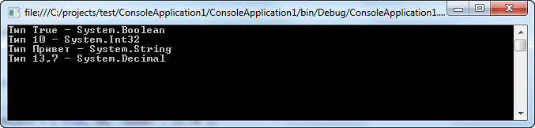
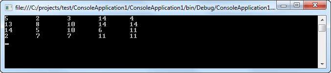
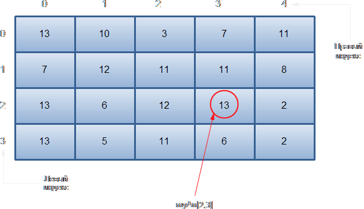
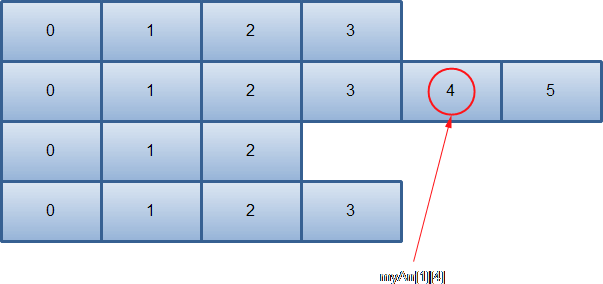
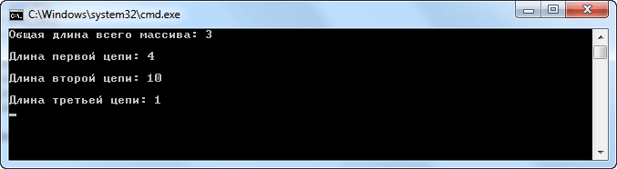
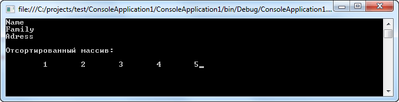

[содержание](/readme.md)  

https://professorweb.ru/my/csharp/charp_theory/level4/4_1.php

# Основы языка C#

* [Массивы](#Массивы)

## Массивы

Массив представляет собой совокупность переменных одного типа с общим для обращения к ним именем. В C# массивы могут быть как одномерными, так и многомерными. Массивы служат самым разным целям, поскольку они предоставляют удобные средства для объединения связанных вместе переменных.

Массивами в C# можно пользоваться практически так же, как и в других языках программирования. Тем не менее у них имеется одна особенность: они реализованы в виде объектов.

Для тoго чтобы воспользоваться массивом в программе, требуется двухэтапная процедура, поскольку в C# массивы реализованы в виде объектов. Во-первых, необходимо объявить переменную, которая может обращаться к массиву. И во-вторых, нужно создать экземпляр массива, используя оператор new.

```c#
using System;
using System.Collections.Generic;
using System.Linq;
using System.Text;

namespace ConsoleApplication1
{
    class Program
    {
        static void Main(string[] args)
        {
            // Объявляем массив
            int[] myArr = new int[5];

            // Инициализируем каждый элемент массива вручную
            myArr[0] = 100;
            myArr[1] = 23;
            myArr[2] = 25;
            myArr[3] = 31;
            myArr[4] = 1;

            foreach (int i in myArr)
                Console.WriteLine(i);

            Console.ReadLine();
        }
    }
}
```

Следует иметь в виду, что если массив только объявляется, но явно не инициализируется, каждый его элемент будет установлен в значение, принятое по умолчанию для соответствующего типа данных (например, элементы массива типа bool будут устанавливаться в false, а элементы массива типа int — в 0).

### Инициализация массива

Помимо заполнения массива элемент за элементом (как показано в предыдущем примере), можно также заполнять его с использованием специального синтаксиса инициализации массивов. Для этого необходимо перечислить включаемые в массив элементы в фигурных скобках { }. Такой синтаксис удобен при создании массива известного размера, когда нужно быстро задать его начальные значения:

```c#
// Синтаксис инициализации массива с использованием
// ключевого слова new
int[] myArr = new int[] {10,20,30,40,50};

// Синтаксис инициализации массива без использования
// ключевого слова new
string[] info = { "Фамилия", "Имя", "Отчество" };

// Используем ключевое слово new и желаемый размер
char[] symbol = new char[4] { 'X','Y','Z','M' };
```

Обратите внимание, что в случае применения синтаксиса с фигурными скобками размер массива указывать не требуется (как видно на примере создания переменной myArr), поскольку этот размер автоматически вычисляется на основе количества элементов внутри фигурных скобок. Кроме того, применять ключевое слово new не обязательно (как при создании массива info).

### Неявно типизированные массивы

*Ключевое слово var* позволяет определить переменную так, чтобы лежащий в ее основе тип выводился компилятором. Аналогичным образом можно также определять неявно типизированные локальные массивы. С использованием такого подхода можно определить новую переменную массива без указания типа элементов, содержащихся в массиве. Давайте рассмотрим пример:

```c#
using System;
using System.Collections.Generic;
using System.Linq;
using System.Text;

namespace ConsoleApplication1
{
    class Program
    {
        static void Main(string[] args)
        {
            var arr1 = new[] { 1, 2, 3 };
            Console.WriteLine("Тип массива arr1 - {0}",arr1.GetType());

            var arr2 = new[] { "One", "Two", "Three" };
            Console.WriteLine("Тип массива arr2 - {0}",arr2.GetType());

            Console.ReadLine();
        }
    }
}
```

Разумеется, как и при создании массива с использованием явного синтаксиса C#, элементы, указываемые в списке инициализации массива, должны обязательно иметь один и тот же базовый тип (т.е. должны все быть int, string или MyCar).

### Определение массива объектов

В большинстве случаев при определении массива тип элемента, содержащегося в массиве, указывается явно. Хотя на первый взгляд это выглядит довольно понятно, существует одна важная особенность. В основе каждого типа в системе типов .NET (в том числе фундаментальных типов данных) в конечном итоге лежит базовый класс System.Object. В результате получается, что в случае определения массива объектов находящиеся внутри него элементы могут представлять собой что угодно:

```c#
using System;
using System.Collections.Generic;
using System.Linq;
using System.Text;

namespace ConsoleApplication1
{
    class Program
    {
        static void Main(string[] args)
        {
            // Объявляем и инициализируем массив объектов
            object[] arrByObject = { true, 10, "Привет", 13.7m };

            // Выведем в консоль тип каждого члена массива
            foreach (object me in arrByObject)
                Console.WriteLine("Тип {0} - {1}",me,me.GetType());

            Console.ReadLine();
        }
    }
}
```



### Свойство Length

Реализация в C# массивов в виде объектов дает целый ряд преимуществ. Одно из них заключается в том, что с каждым массивом связано свойство **Length**, содержащее число элементов, из которых может состоять массив. Следовательно, у каждого массива имеется специальное свойство, позволяющее определить его длину.

Когда запрашивается длина многомерного массива, то возвращается общее число элементов, из которых может состоять массив. Благодаря наличию у массивов свойства Length операции с массивами во многих алгоритмах становятся более простыми, а значит, и более надежными. Давайте рассмотрим пример использования свойства Length:

```c#
using System;
using System.Collections.Generic;
using System.Linq;
using System.Text;

namespace ConsoleApplication1
{
    class Program
    {
        static void Main(string[] args)
        {
            int[] myArr = { 1, 2, 3, 4 };

            for (int i = 0; i < myArr.Length; i++)
                Console.WriteLine(myArr[i]);

            Console.ReadLine();
        }
    }
}
```

## Многомерные массивы

**Многомерным** называется такой массив, который отличается двумя или более измерениями, причем доступ к каждому элементу такого массива осуществляется с помощью определенной комбинации двух или более индексов. Многомерный массив индексируется двумя и более целыми числами.

### Двумерные массивы

Простейшей формой многомерного массива является двумерный массив. Местоположение любого элемента в двумерном массиве обозначается двумя индексами. Такой массив можно представить в виде таблицы, на строки которой указывает один индекс, а на столбцы — другой. Пример объявления и инициализации двумерного массива показан ниже:

```c#
// Объявляем двумерный массив
int[,] myArr = new int[4, 5];

Random ran = new Random();

// Инициализируем данный массив
for (int i = 0; i < 4; i++)
{
    for (int j = 0; j < 5; j++)
    {
       myArr[i, j] = ran.Next(1, 15);
       Console.Write("{0}\t", myArr[i, j]);
    }
    Console.WriteLine();
}
```



Обратите особое внимание на способ объявления двумерного массива. Схематическое представление массива myArr показано ниже:



Если вам приходилось раньше программировать на С, С++ или Java, то будьте особенно внимательны, объявляя или организуя доступ к многомерным массивам в C#. В этих языках программирования размеры массива и индексы указываются в отдельных квадратных скобках, тогда как в C# они разделяются запятой.

### Массивы трех и более измерений

В C# допускаются массивы трех и более измерений. Ниже приведена общая форма объявления многомерного массива:

```
тип[,...,] имя_массива = new тип[размер1, размер2, ... размеры];
```

Ниже приведен пример программы, использующей трехмерный массив:

```c#
int[,,] myArr = new int[5,5,5];

for (int i = 0; i < 5; i++)
   for (int j = 0; j < 5; j++)
      for (int k = 0; k < 5; k++)
         myArr[i, j, k] = i + j + k;
```

### Инициализация многомерных массивов

Для инициализации многомерного массива достаточно заключить в фигурные скобки список инициализаторов каждого его размера:

```
тип[,] имя_массива = {
{val, val, val, ..., val},
{ val, val, val, ..., val},
{val, val, val, ..., val}
};
```

где *val* обозначает инициализирующее значение, а каждый внутренний блок — отдельный ряд. Первое значение в каждом ряду сохраняется на первой позиции в массиве, второе значение — на второй позиции и т.д. Обратите внимание на то, что блоки инициализаторов разделяются запятыми, а после завершающей эти блоки закрывающей фигурной скобки ставится точка с запятой.

Ниже в качестве примера приведена общая форма инициализации двумерного массива:

```c#
int[,] myArr = {
      {1,10},
      {2,20},
      {3,30},
      {4,40}
};
```

## Ступенчатые (зубчатые) массивы

Двумерный массив можно представить в виде таблицы, в которой длина каждой строки остается неизменной по всему массиву. Но в C# можно также создавать специальный тип двумерного массива, называемый ступенчатым массивом. Ступенчатый массив представляет собой массив массивов, в котором длина каждого массива может быть разной. Следовательно, ступенчатый массив может быть использован для составления таблицы из строк разной длины.

Ступенчатые массивы объявляются с помощью ряда квадратных скобок, в которых указывается их размерность. Например, для объявления двумерного ступенчатого массива служит следующая общая форма:

```
тип [][] имя массива = new тип[размер] [];
```

где размер обозначает число строк в массиве. Память для самих строк распределяется индивидуально, и поэтому длина строк может быть разной.

Давайте рассмотрим пример использования ступенчатого массива:

```c#
using System;
using System.Collections.Generic;
using System.Linq;
using System.Text;

namespace ConsoleApplication1
{
    class Program
    {
        static void Main(string[] args)
        {
            int i = 0;
            // Объявляем ступенчатый массив
            int[][] myArr = new int[4][];
            myArr[0] = new int[4];
            myArr[1] = new int[6];
            myArr[2] = new int[3];
            myArr[3] = new int[4];

            // Инициализируем ступенчатый массив
            for (; i < 4; i++)
            {
                myArr[0][i] = i;
                Console.Write("{0}\t",myArr[0][i]);
            }

            Console.WriteLine();
            for (i = 0; i < 6; i++)
            {
                myArr[1][i] = i;
                Console.Write("{0}\t", myArr[1][i]);
            }

            Console.WriteLine();
            for (i = 0; i < 3; i++)
            {
                myArr[2][i] = i;
                Console.Write("{0}\t", myArr[2][i]);
            }

            Console.WriteLine();
            for (i = 0; i < 4; i++)
            {
                myArr[3][i] = i;
                Console.Write("{0}\t", myArr[3][i]);
            }

                Console.ReadLine();
        }
    }
}
```

Созданный массив в данном примере можно структурно представить в виде:




Теперь нетрудно понять, почему такие массивы называются ступенчатыми! После создания ступенчатого массива доступ к его элементам осуществляется по индексу, указываемому в отдельных квадратных скобках.

Ступенчатые массивы находят полезное применение не во всех, а лишь в некоторых случаях. Так, если требуется очень длинный двумерный массив, который заполняется не полностью, т.е. такой массив, в котором используются не все, а лишь отдельные его элементы, то для этой цели идеально подходит ступенчатый массив.

Применение свойства Length при обращении со ступенчатыми массивами
Особый случай представляет применение свойства Length при обращении со ступенчатыми массивами. В этом случае с помощью данного свойства можно получить длину каждого массива, составляющего ступенчатый массив. Давайте рассмотрим следующий пример:

```c#
using System;
using System.Collections.Generic;
using System.Linq;
using System.Text;

namespace ConsoleApplication1
{
    class Program
    {
        static void Main(string[] args)
        {
            int[][] myArr = new int[3][];
            myArr[0] = new int[4];
            myArr[1] = new int[10];
            myArr[2] = new int[1];

            Console.WriteLine("Общая длина всего массива: " + myArr.Length);
            Console.WriteLine("\nДлина первой цепи: " + myArr[0].Length);
            Console.WriteLine("\nДлина второй цепи: " + myArr[1].Length);
            Console.WriteLine("\nДлина третьей цепи: " + myArr[2].Length);

            Console.ReadLine();
        }
    }
}
```




Обратите особое внимание на то, как свойство Length используется в ступенчатом массиве myArr. Напомним, что двумерный ступенчатый массив представляет собой массив массивов. Следовательно, когда используется выражение myArr.Length то в нем определяется число массивов, хранящихся в массиве myArr (в данном случае — 3 массива). А для получения длины любого отдельного массива, составляющего ступенчатый массив, служит выражение myArr[0].Length.

## Класс Array

Каждый создаваемый массив получает большую часть функциональности от класса **System.Array**. Общие члены этого класса позволяют работать с массивом с использованием полноценной объектной модели. Таким образом, методы и свойства, определенные в классе Array, можно использовать с любым массивом C#. Давайте разберем некоторые полезные особенности класса Array.

### Создание массивов

Класс Array является абстрактным, поэтому создать массив с использованием какого-либо конструктора нельзя. Однако вместо применения синтаксиса C# для создания экземпляров массивов также возможно создавать их с помощью статического метода **CreateInstance()**. Это исключительно удобно, когда заранее неизвестен тип элементов массива, поскольку тип можно передать методу CreateInstance() в параметре как объект Type:

```c#
using System;
using System.Collections.Generic;
using System.Linq;
using System.Text;

namespace ConsoleApplication1
{
    class Program
    {
        static void Main(string[] args)
        {
            // Создаем массив типа string, длиной 5
            Array myArr = Array.CreateInstance(typeof(string),5);

            // Инициализируем первые два поля массива
            myArr.SetValue("Name",0);
            myArr.SetValue("Age",1);

            // Считываем данные из массива
            string s = (string)myArr.GetValue(1);

            Console.ReadLine();
        }
    }
}
```

Обратите внимание, что для установки значений в массив служит метод SetValue(), а для их чтения — метод GetValue().

### Копирование массивов

Поскольку массивы — это ссылочные типы, присваивание переменной типа массива другой переменной создает две переменных, ссылающихся на один и тот же массив. Для копирования массивов предусмотрена реализация массивами интерфейса ICloneable. Метод Clone(), определенный в этом интерфейсе, создает неглубокую копию массива. Если элементы массива относятся к типу значений, то все они копируются, если массив содержит элементы ссылочных типов, то сами эти элементы не копируются, а копируются лишь ссылки на них.

Вместо метода Clone() можно также применять метод Array.Сору(), тоже создающий поверхностную копию. Но между Clone() и Сору() есть одно важное отличие: Clone() создает новый массив, а Сору() требует наличия существующего массива той же размерности с достаточным количеством элементов.

```c#
using System;
using System.Collections.Generic;
using System.Linq;
using System.Text;

namespace ConsoleApplication1
{
    class Program
    {
        static void Main(string[] args)
        {
            string[] arr2 = new string[5];
            // Создаем массив типа string, длиной 5
            Array myArr = Array.CreateInstance(typeof(string),5);

            // Инициализируем первые три поля массива
            myArr.SetValue("Name",0);
            myArr.SetValue("Age",1);
            myArr.SetValue("Adress",2);

            // Копируем массив с помощью метода Clone()
            string[] arr1 = (string[])myArr.Clone();

            foreach (string s in arr1)
                Console.Write("\t"+s);

            // Копируем с помощью метода Copy()
            Console.WriteLine();
            Array.Copy(myArr, arr2, myArr.Length);
            foreach (string s in arr2)
                Console.Write("\t"+s);

            Console.ReadLine();
        }
    }
}
```

### Сортировка и поиск

В классе Array реализован алгоритм быстрой сортировки (Quicksort) элементов массива. Метод Sort() требует от элементов реализации интерфейса IComparable. Простые типы, такие как System.String и System.Int32, реализуют IComparable, так что можно сортировать элементы, относящиеся к этим типам.

C помощью разных вариантов метода Sort() можно отсортировать массив полностью или в заданных пределах либо отсортировать два массива, содержащих соответствующие пары "ключ-значение". После сортировки в массиве можно осуществить эффективный поиск, используя разные варианты метода BinarySearch().

```c#
using System;
using System.Collections.Generic;
using System.Linq;
using System.Text;

namespace ConsoleApplication1
{
    class Program
    {
        static void Main(string[] args)
        {
            int[] myArr = { 4, 5, -183, 12, 34, 0, 2 ,-13 };

            Console.WriteLine("Исходный массив чисел: ");
            foreach (int x in myArr)
                Console.Write("\t{0}",x);

            // Реализуем сортировку массива
            Console.WriteLine("\n\nОтсортированный массив:");
            Array.Sort(myArr);
            foreach (int x in myArr)
                Console.Write("\t{0}",x);

            // Организуем поиск числа 12
            Console.WriteLine("\n\nПоиск числа:");
            int search = Array.BinarySearch(myArr, 12);
            Console.WriteLine("Число 12 находится на {0} позиции",search+1);

            Console.ReadLine();
        }
    }
}
```


## Массивы в качестве параметров

Массивы могут передаваться в методы в качестве параметров, а также возвращаться из методов. Для возврата массива достаточно объявить массив как тип возврата. Наглядно это показано в следующем примере:

```c#
using System;
using System.Collections.Generic;
using System.Linq;
using System.Text;

namespace ConsoleApplication1
{
    class Program
    {
        static void Main(string[] args)
        {
            foreach (string s in myReturn())
                Console.WriteLine(s);
            int[] mySortArray = {4,1,2,5,3};

            for (int i = 0; i <= 4; i++)
                mySortArray[i] = mySort(mySortArray, i);

            Console.WriteLine("\nОтсортированный массив:\n");
            foreach (int i in mySortArray)
                Console.Write("\t"+i);

            Console.ReadLine();
        }

        // Данный метод возвращает массив Info
        static Array myReturn()
        {
            string[] Info = {"Name","Family","Adress" };
            return Info;
        }

        // Передача массива в метод в качестве параметра
        // Данный метод возвращает значение одного из индексов
        // отсортированного массива
        static int mySort(Array sortArray, int i)
        {
            Array.Sort(sortArray);
            return (int)sortArray.GetValue(i);
        }
    }
}
```

Результат работы данной программы:



### Ковариантность массивов

Для массивов поддерживается **ковариантность**. Это значит, что массив может быть объявлен как базовый тип, и его элементам могут присваиваться элементы производных типов. Однако, стоит отметить, что ковариантность массивов возможна только для ссылочных типов, но не для типов значений.

Добавлю, что с ковариантностью массивов связана проблема, которая может быть решена только через исключения времени выполнения.

### Структура ArraySegment<T>

Структура ArraySegment<T> представляет сегмент массива. Эта структура может применяться, когда нужно вернуть или передать методу части массива. Вместо передачи в метод массива, смещения и счетчика в отдельных параметрах, можно передать единственный параметр ArraySegment<T>. В этой структуре информация о сегменте (смещение и счетчик) заключена непосредственно в ее членах:

```c#
using System;
using System.Collections.Generic;
using System.Linq;
using System.Text;

namespace ConsoleApplication1
{
    class Program
    {
        static void Main(string[] args)
        {
            int[] arr1 = { 1, 2, 3, 4, 5, 6 };
            int[] arr2 = { 7, 8, 9, 10 };

            var mySegmentsArray = new ArraySegment<int>[3]
            {
                // Инициализируем сегменты массивов
                new ArraySegment<int>(arr1,0,2),
                new ArraySegment<int>(arr2,0,1),
                new ArraySegment<int>(arr1,1,2)
            };

            Console.WriteLine("Сумма выбранных значений равна:\n"+SumArraySegments(mySegmentsArray));
            Console.ReadLine();
        }

        // Метод, вычисляющий сумму выбранных сегментов
        static int SumArraySegments(ArraySegment<int>[] value)
        {
            int sum = 0;
            foreach (var s in value)
                for (int i = s.Offset; i < s.Offset + s.Count; i++)
                    sum += s.Array[i];
            return sum;
        }
    }
}
```

Важно отметить, что сегменты массива не копируют элементы исходного массива. Вместо этого через ArraySegment<T> можно получить доступ к исходному массиву. Если изменяются элементы сегмента, то эти изменения будут видны в исходном массиве.

//TODO дописать про кортежи

