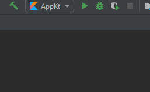
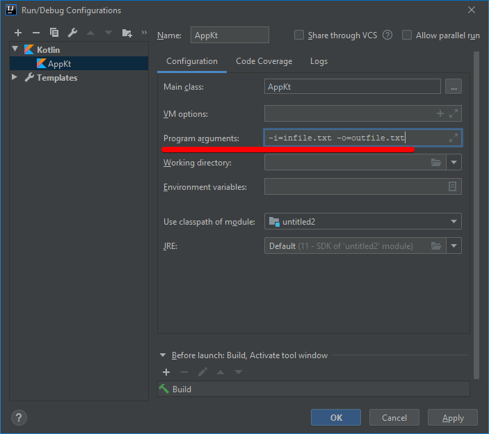
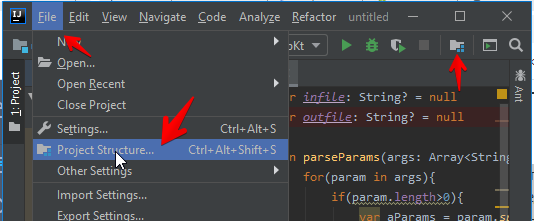
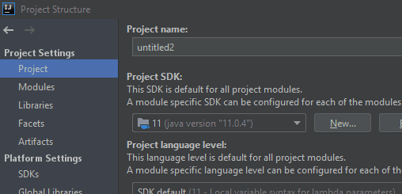
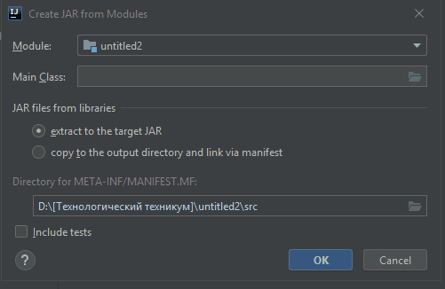
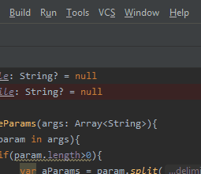
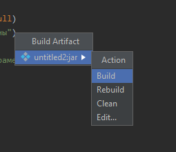
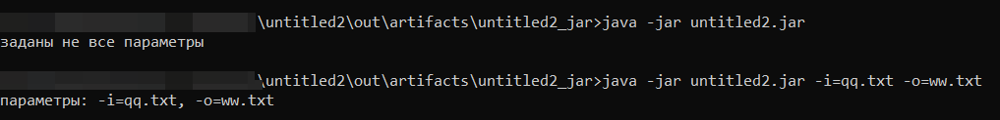

[содержание](/readme.md)  

# Тема 3. Программирование на языке Kotlin</br>Лекция 5

* Кодировки символов: ANSI, UTF-8, UNICODE.
* Консольные программы

<a name="codepages"></a>

## Кодировки символов: ANSI, UTF-8, UNICODE.
Прежде чем разбираться с кодировкой символов разберемся как компьютер вообще хранит информацию.

У нас 10 пальцев, и система — десятичная. То есть, любое, сколь угодно большое число мы можем представить с помощью цифр 0, 1, 2, 3, 4, 5, 6, 7, 8, 9. В зависимости от того, где в числе стоит цифра, она может означать разное: если эта цифра последняя, то она расположена в разряде единиц, предпоследняя — разряд десятков, еще левее — разряд сотен и так далее. По сути, любое число можно расписать в виде суммы цифр, каждая из которых умножена на десять в определенной степени. В случае единиц, эта степень — нулевая.

Например,

1573 = 3\*10<sup>0</sup> + 7\*10<sup>1</sup> + 5\*10<sup>2</sup> + 1\*10<sup>3</sup>

Число, на степень которого умножаются цифры называется базой системы счисления. Для десятичной системы базой, логично, является десятка.

У компьютера пальцев нет, но есть два состояния: условно «ток идет» и «ток не идет», нулик и единичка. Соответственно все числа (да и вообще информация) в памяти компьютера состоят только из двух цифр — 0 и 1. Их расположение, как и в случае десятичной системы счисления, указывает на разряд. Только теперь число можно разложить на сумму цифр, помноженных не на степени десятки, а степени двойки.

0 в двоичной системе = 0</br>
1 в двоичной системе = 1</br> 
2 в двоичной системе = 10</br>
7<sub>10</sub>=111<sub>2</sub></br>

Научитесь переводить из двоичной системы в десятичую. Вы, наверное, уже поняли, как это делается — просто берем цифру числа начиная с самой правой и умножаем её на базу системы счисления в степени, соответствующей её разряду, так с каждым разрядом. Затем складываем все получившиеся таким образом числа.

Пример:

Давайте найдем десятичный аналог двоичного числа 101101<sub>2</sub>

Самая правая единичка = 1\*2<sup>0</sup></br>
Следующий нулик = 0\*2<sup>1</sup></br>
Третья справа единичка = 1\*2<sup>2</sup></br>
Четвертая = 1\*2<sup>3</sup></br>
… и так далее</br>

101101<sub>2</sub> = 1\*2<sup>0</sup> + 0\*2<sup>1</sup> + 1\*2<sup>2</sup> + 1\*2<sup>3</sup> + 0\*2<sup>4</sup> + 1\*2<sup>5</sup> = 1 + 0 + 4 + 8 + 0 + 32 = 45<sub>10</sub>

### Перевод из десятичной системы в двоичную

Тут тоже всё просто, если понимать суть.

Пример:

У нас есть десятичное число 57<sub>10</sub>. Чтобы перевести его в двоичную систему, нужно определить, какая максимальная степень двойки не превосходит это число.

2<sup>6</sup> = 64.  
Это явно многовато.  
А вот 2<sup>5</sup> = 32.  

Мы определили старший разряд. 32<sub>10</sub> = 100000<sub>2</sub>.  
Теперь ищем следующий разряд. 57-32 = 25.  
Теперь для 25 ищем степень двойки, которая не превосходит 25.  
2<sup>4</sup> = 16.  
Значит, следующий разряд у нас тоже равен "1".  
32+16 = 48<sub>10</sub> = 110000<sub>2</sub>.  
57 – 48 = 9.  
2<sup>3</sup> = 8, это больше, чем 9. Значит следующий разряд тоже будет единичкой.

32 + 16 + 8 = 56<sub>10</sub> = 111000<sub>2</sub>.  
57 - 56 = 1, то есть осталась только одна степень 2<sup>0</sup>.  
Таким образом, 57<sub>10</sub> = 111001<sub>2</sub>.

### ASCII

Мы выяснили, что компьютер понимает только нулики и единички, а его память можно представить в виде очень длинной строки из лампочек с выключателями. Как представить цифры в компьютере мы уже поняли. А что делать с остальной информацией? Буквами, картинками?

Скажем, в английском алфавите 26 букв. Теоретически мы можем представить буквы цифрами от 0 до 25, только в двоичной системе. Возникает другой вопрос: а как понять, перед нами строчная буква или прописная? А знаки препинания? Что делать со знаками-«невидимками», вроде пробела? Словом, нужна система кодирования.

В 1960-х годах существовало множество разных схем, кодирующих символы. Отсутствие единообразия довольно быстро переросло в серьёзную проблему, и уже в 1963 году Американский институт стандартизации ANSI разработал и ввел в обиход схему кодировки ASCII (American Standard Code for Information Interchange). 

Каждый символ ASCII состоит из семи разрядов или семи бит, каждый из которых может принимать значение 0 или 1. В 7 бит можно поместить числа от 0 до 127 в двоичной системе, то есть у нас есть 128 чисел для кодирования символов. Казалось бы, достаточно для кодировки письменной английской речи? 

Давайте прикинем: 

a-z — 26 вариантов  
A-Z — еще 26  
0-9 — 10  
,;:~& и прочие знаки пунктуации — 32  
Ещё нам нужен пробел.  
Итого — 95 символов.  

Оставшиеся 33 (128 - 95) вакантных варианта используют для так называемых управляющих символов, вроде перевода строки или возврата каретки.

Важно различать символы "0"-"9" и числовые значения 0-9.
Символы "0"-"9" представлены значениями ASCII 48-57 (0x30-0x39).

Интересно отметить, что крайние правые четыре бита этих значений ASCII представляют собой двоичные представления числовых значений 0-9. Это несколько упрощает способ преобразования между значениями ASCII и их фактическими числовыми значениями (в шестнадцатиричном виде это особенно заметно).

С появлением восьмибитной кодировки, в ASCII смогли закодировать и другие алфавиты. Расширенных кодировок ASCII много - существуют версии для многих национальных алфавитов. При этом первая половина кодировки (значения от нуля до 127) везде одинаковая.

Русский алфавит (кириллица) закодирован в кодировке с названием windows-1251 (Это актуальная кодировка для Windows, но и до неё существовало несколько кодировок. Наиболее распространены были CP866 и КОИ-8r, вы вполне можете с ними столкнуться при работе со старым "железом" или сайтами).


### Кодировка Юникод (Unicode)

Один байт может иметь только 256 значений. Это значит, что в кодировке ASCII можно закодировать 256 символов: цифр, букв, пиктограмм, знаков пунктуации и других различных символов. В то же время существуют письменности, в которых гораздо больше символов, например, китайские или японские иероглифы.

Для решения этой (и некоторых других) проблемы в начале девяностых была создана кодировка Юникод(Unicode). Первоначально все символы юникода занимали два байта. Соответственно, в unicode можно было закодировать 2<sup>16</sup> = 65536 значений. Затем кодовое пространство было расширено до более чем миллиона символов. В результате этого появилось несколько представлений юникода.

Наиболее популярными представлениями юникода являются два: **UTF-8** - используется в интернете и **UTF-16** - используется в Windows (начиная с Windows XP).

Существует две версии UTF-16: UTF-16LE (little-endian) - кодировка с обратным порядком байтов и UTF-16BE (big-endian) - кодировка с прямым порядком байтов. В Windows используется UTF16-LE.

Код символов в юникоде обозначается так: U+hhhh (четыре шестнадцатеричных цифры,h - от hexadecimal - шестнадцатеричный). Например, U+221A - символ квадратного корня - √.

Часть символов в UTF-16 кодируются двумя байтами (первые 63 тысячи). Остальные символы кодируются суррогатными парами. 

В **UTF-8** первые 128 символов кодируются одним байтом. Остальные символы могут кодироваться несколькими байтами (от двух до четырёх). Именно поэтому длина строки в юникоде не равна длине буфера, который эта строка занимает. Это нужно учитывать при обмене данными.

И ещё один момент (самый важный): в юникод закодированы все символы всех современных и многих мёртвых письменностей плюс знаки из различных областей науки и культуры (математические и экономически символы, нотные знаки и многое другое). Именно по этой причине и нужно использовать юникод.

### Кодирование текста в Microsoft Windows (начиная с Windows XP)
В современных версиях Windows существует два способа представления текста: UTF-16 и кодовые страницы (в основном это восьмибитные кодировки). Основной способ - юникод. Кодовые страницы нужны для совместимости со старыми приложениями (в Windows 95, Windows 98 - в основном использовалась ASCII). Кроме того, юникод не понимает одна очень важная программа - консоль.

Пусть вас не смущает новый термин - кодовая страница (code page). В windows так называются все кодировки (character sets или encodings). Т.е. понятие кодировка равнозначно кодовой странице.

Сразу сделаю замечание, которое лучше запомнить. В Windows есть чёткое разделение: вот юникод (UTF-16LE), а вот все остальные кодировки. И юникод, и остальные кодировки в Windows называются кодовыми страницами, но этот термин (кодовые страницы) я буду применять ко всем кодировкам за исключением юникода.

## Консольные программы

### Консольное приложение

Текстовый интерфейс пользователя (англ. Text user interface, TUI; также Character User Interface, CUI) — система средств взаимодействия пользователя с компьютером, основанная на использовании текстового (буквенно-цифрового) режима дисплея или аналогичных устройств — например, *командная строка*. Приложения, использующие текстовый интерфейс, называют консольными программами.

### Особенности текстового интерфейса

На программном уровне для ввода и вывода информации консольные программы используют стандартные устройства ввода-вывода (stdin, stdout, stderr), хотя могут открывать и другие файлы, сетевые соединения и совершать иные действия, доступные в выполняющей их среде. Вывод печатных символов в stdout и stderr приводит к появлению этих символов на устройстве вывода, то есть к их получению пользователем.

В простейшем случае консольная программа использует интерфейс командной строки, однако многие из таких программ с помощью управляющих последовательностей терминалов создают более дружественный интерфейс, приближающийся к графическому (Far в Windows, MC в Linux).

### Реализация текстового интерфейса

В принципе, консольная программа не обязана заботиться о реализации самого взаимодействия с пользователем, ограничиваясь вводом-выводом на стандартные устройства, использованием библиотек типа программных интерфейсов. Собственно взаимодействие с пользователем обычно осуществляет операционная система или иное программное обеспечение.

Классической реализацией текстового интерфейса, восходящей к первой половине XX века, является алфавитно-цифровое устройство ввода-вывода, например, комплект из клавиатуры и АЦПУ (телетайпа). Впоследствии вместо АЦПУ стали применять мониторы, снабжённые знакогенератором, что позволило быстро и удобно организовывать диалог с пользователем. Подобными устройствами снабжён или может быть снабжён почти каждый современный компьютер. Такие комплекты из монитора и клавиатуры (иногда с добавлением мыши) называются консолью компьютера.

В соответствии с традицией использования консольными программами клавиатуры и АЦПУ для ввода и вывода соответственно взаимодействие таких программ с пользователем свелось к чтению из stdin и выводу на stdout. Таким образом, появилась возможность перенаправлять потоки ввода-вывода, осуществляя взаимодействие с пользователем посредством иных устройств, в том числе подключенных через сеть, а также при помощи специальных программ-эмуляторов терминала, например, рисующих окно с текстом в графическом интерфейсе пользователя (текстовое окно).

В 1970-х годы и позднее выпускались даже специальные устройства, реализующие текстовый интерфейс — текстовые терминалы, подключаемые через последовательный порт к компьютеру напрямую или через модем. С распространением персональных компьютеров функции текстового терминала, как правило, выполняет компьютер, тот, на котором выполняется консольная программа, или другой. Программы ssh (а также Интернет или локальную сеть. Программы konsole и многие другие реализуют текстовый интерфейс посредством текстового окна в среде X Window System.

Альтернативный подход к консольному выводу был использован в персональных компьютерах, в частности (хотя не только), IBM PC под управлением памяти, связанной со знакогенератором монитора, приводя к немедленному изменению видимых на мониторе данных. Такие программы могут также работать в среде Microsoft Windows. Более того, Windows имеет поддержку текстовых окон, во многом превосходящую имевшуюся в DOS, в том числе и для приложений собственно Windows.

## Параметры командной строки

*Параметры командной строки* это просто текстовые параметры, которые вводятся после названия команды в командной строке перед запуском программы.

К примеру, консольной программе нужно на вход принять два имени файла - то, откуда читать и то, куда писать.

Разработчик может сказать, мол, сначала напишите имя входного файла, а потом имя выходного. И вам придется вызывать программу следующим образом:

```
software.exe infile.txt outfile.txt
```

А другой разработчик возьмет и подумает - а может сделать чтоб можно было параметры подавать в любом порядке? Вот тут и приходят на помощь "ключи". Например, разработчик будет "парсить" входные параметры консольной программы и если увидит параметр "-i", то следующий за ним будет распарсен как имя входного файла. Аналогично, по параметру "-o" программа поймёт, что дальше следует имя выходного файла. Вот эти вспомогательные параметры и зовутся ключами. По договоренности, обычно используют понятные однобуквенные сокращения с одной черточкой перед ним (-i как input, -o как output) или многобуквенные сокращения с двумя черточками (--input или --output).

И теперь можно вызывать программу как

```
software.exe -i infile.txt -o outfile.txt
```

так и

```
software.exe -o outfile.txt -i infile.txt
```

Для двух параметров эффект не очень заметен, но представьте, что их десяток, и часть из них не являются обязательными. Там уже без ключей тяжело запомнить что в каком порядке подавать.

У функции main (точка входа в приложение) есть параметр **args: Array<String>** - массив параметров командной строки. В примере выше мы, соответственно, получим ["-o", "outfile.txt", "-i", "infile.txt"]. Разбирать такой массив не удобно, лучше ключ и параметр писать через знак "=":

```
software.exe -o=outfile.txt -i=infile.txt
```

Теперь массив параметров будет выглядеть так: ["-o=outfile.txt","-i=infile.txt"]. Мы уже можем предварительно оценить количество параметров.

Если в параметрах нужно получить строку с пробелом, например указать полное имя файла, то такой параметр нужно заключить в кавычки:

```
software.exe -o="..\путь с пробелами\outfile.txt" -i=infile.txt
```

["-o=..\путь с пробелами\outfile.txt","-i=infile.txt"]

Теперь в программе нужно "распарсить" параметры, т.е. понять что нам понаписали в командной строке и присвоить полученные значения внутренним переменным.

Для вышеприведенного формата подходит функция split("=")

## Запуск приложения с параметрыми в Intellij IDEA

Для эмуляции параметров командной строки нужно добавить в настройки:





Там же можно задать рабочий каталог и переменные окружения.

Демонстрация разбора параметров командной строки:

```kt
// глобальные переменные для хранения "разобранных" параметров
var infile: String? = null
var outfile: String? = null

// функция разбора параметров
fun parseParams(args: Array<String>){
    // перебираем массив строк
    for(param in args){
        if(param.length>0){
            // разбиваем текущий параметр на массив ["ключ","значение"]
            var aParams = param.split("=")
            // ищем нужные ключи
            when (aParams[0].toLowerCase()) {
                "-i" -> infile = aParams[1]
                "-o" -> outfile = aParams[1]
            }
        }
    }
}

fun main(args: Array<String>){
    parseParams(args)
    if(infile!=null && outfile!=null)
        println("параметры: -i=$infile, -o=$outfile")
    else
        println("заданы не все параметры")
}
```

## Сохранение jar-программы 

По умолчанию IDEA не сохраняет jar-файлы (это исполняемые файлы JAVA - они содержат байт-код приложения)

Необходимо в структуру проекта добавить *артефакт*:





Указать конфигурацию (Main Class)



И "собрать" (Build) приложение





После этого в каталоге проекта добавится папка out и в ней наш jar-файл, который можно выполнить из командной строки ОС.


Результат выполнения в командной строке:



***
# Контрольные вопросы
* [Кодировки символов](#codepages)
