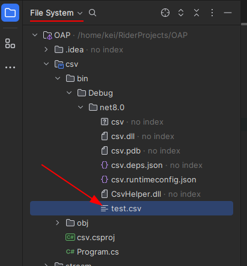

Предыдущая лекция | &nbsp; | Следующая лекция
:----------------:|:----------:|:----------------:
[Работа с файловой системой и файлами.](./t5_files.md) | [Содержание](../readme.md#тема-5-продвинутый-c-функции-лямбды-исключения-работа-с-файлами-многопоточность-регулярные-выражения) | [Регулярные выражения](./t5_regex.md)

>**Задание на дом:**
>
>XML делать не надо, только CSV и JSON. Но для JSON реализовать и сереализацию и десереализацию.

# Форматы файлов

* [CSV](#CSV)
* [XML](#XML)
* [JSON](#JSON)

## CSV

CSV (от англ. Comma-Separated Values — значения, разделённые запятыми) — текстовый формат, предназначенный для представления табличных данных. Строка таблицы соответствует строке текста, которая содержит одно или несколько полей, разделенных запятыми.

Формат CSV стандартизирован не полностью. Идея использовать запятые для разделения полей очевидна, но при таком подходе возникают проблемы, если исходные табличные данные содержат запятые или переводы строк. Возможным решением проблемы запятых и переносов строк является заключение данных в кавычки, однако исходные данные могут содержать кавычки. Помимо этого термином «CSV» могут обозначаться похожие форматы, в которых разделителем является символ табуляции (TSV) или точка с запятой. Многие приложения, которые работают с форматом CSV, позволяют выбирать символ разделителя и символ кавычек.

**Спецификация**

* Каждая строка файла — это одна строка таблицы.
* Разделителем (англ. delimiter) значений колонок является символ запятой (,). Однако на практике часто используются другие разделители, то есть формат путают с DSVruen и TSV (см. ниже).
* Значения, содержащие зарезервированные символы (двойная кавычка, запятая, точка с запятой, новая строка) обрамляются двойными кавычками ("). Если в значении встречаются кавычки — они представляются в файле в виде двух кавычек подряд.

В библиотеке C# нет методов работы с CSV, но можно использовать сторонние библиотеки.

Для загрузки сторонних библиотек есть менеджер NuGet пакетов. Для его открытия в контекстном меню проекта (клик правой кнопкой мыши по названию проекта) выберите пункт Manage NuGet Packeges:


В нижней части экрана появится окно NuGet


В закладке Packages в строке поиска введите CsvHelper и добавьте найденный пакет в свой проект.

>Можно сделать проще: выполнить команду `dotnet add package CsvHelper` в каталоге проекта, но для этого надо знать название пакета.

### Чтение данных из существующего файла

Прежде чем читать данные, надо создать файл.

1. Переключите режим просмотра структуры проекта в "File System":

    "Текущим" каталогом при выполнении программы будет тот, где находится скомпилированная программа. В моём случае это `bin/Debug/net8.0` (зависит о режима сборки и версии .NET)

    

    >Если каталога bin с подкаталогами ещё нет, но нужно "собрать" (build) программу

1. Создайте в каталоге с программой файл `test.csv` c таким содержимым:

    ```csv
    description,value
    "строка с пробелами",123.15
    "строка
    с переносом 
    строки",456
    ```

    В первой строке заголовки столбцов. Далее ДВЕ строки с данными. Обратите внимание: для проверки правильности разбора сложных строк я добавил литералы с переносами строк

Теперь можно писать код:

```cs
using System.Globalization;
using CsvHelper;
using CsvHelper.Configuration;

using (var reader = new StreamReader("./test.csv")) {
    using (var csv = new CsvReader(
        reader, CultureInfo.InvariantCulture))
    {
        var records = csv.GetRecords<Foo>();
        foreach (var record in records) {
            Console.WriteLine("{0}, {1}", record.description, record.value);
        }
    }
}

public class Foo
{
    public string description { get; set; }
    public double value { get; set; }
}
```

* Сначала считывается содержимое файла обычным **StreamReader** (путь `./` означает, что чтение из текущего каталога)
* Затем содержимое отдаётся классу **CsvReader**
* При чтении данных (_GetRecords_) используются класс **Foo** (просто как описание структуры). Классы мы пока не проходили, но тут пока ничего сложного

    В классе у нас определены поля, соответствующие колонкам в нашем файле

* В цикле перебираем записи (строки) нашего файла и выводим содержимое в консоль.

Это вариант по-умолчанию, в котором обязательны заголовки колонок и разделитель запятая. Если у нас данные без заголовков или с другими разделителями, то можно задать конфигурацию:

```cs
...

var config = new CsvConfiguration(
    CultureInfo.InvariantCulture) { 
        Delimiter = ";", 
        HasHeaderRecord = false };

using (var reader = new StreamReader("./test2.csv")) {
    using (var csv = new CsvReader(reader, config))

...
```

### Запись в CSV

```cs
// использую не стандартный формат
var config = new CsvConfiguration(
    CultureInfo.InvariantCulture) { 
        Delimiter = ";", 
        HasHeaderRecord = false };

// создаю тестовые данные
var records = new List<Foo>
{
    new Foo { 
        description ="тест записи\nмногострочного текста",
        value = 12.34 },
    new Foo { 
        description = "просто, текст, с запятыми", 
        value = 0 }
};

using (var writer = new StreamWriter("./test3.csv"))
using (var csv = new CsvWriter(writer, config))
{
    csv.WriteRecords(records);
}
```

Получится такой файл:

```csv
"тест записи
многострочного текста";12.34
просто, текст, с запятыми;0
```

### Различия в культурной среде

В русской культурной среде в качестве разделителя разрядов в числах с плавающей запятой используется запятая. Поэтому вполне может попасться csv файл, в котором в числах разделитель запятая. 

```csv
"строка с пробелами";123,15
"строка
с переносом 
строки";456
```

Разделитель полей мы менять умеем, но как быть с форматом чисел?

Нужно задать нужную культурную среду:

```cs
var config = new CsvConfiguration(
    new CultureInfo("ru-RU")) { 
        Delimiter = ";", 
        HasHeaderRecord = false };
```

## XML

<!-- https://habr.com/ru/post/524288/ -->

XML, в переводе с англ *eXtensible Markup Language* — расширяемый язык разметки. Используется для хранения и передачи данных. Так что увидеть его можно не только в API, но и в коде.

>Как формат передачи данных он устарел, сейчас используется JSON.

### Как устроен XML

Возьмем пример:

```xml
<req>
    <query>Виктор Иван</query>
    <count>7</count>
</req>
```

И разберёмся, что означает эта запись.

#### Теги

В XML каждый элемент должен быть заключен в теги. Тег — это некий текст, обернутый в угловые скобки:

```xml
<tag>
```

Текст внутри угловых скобок — название тега.

Тега всегда два:

* Открывающий — текст внутри угловых скобок `<tag>`
* Закрывающий — тот же текст (это важно!), но добавляется символ «/»: `</tag>`

Бывают еще пустые элементы, у них один тег и открывающий, и закрывающий одновременно. Но об этом чуть позже!

С помощью тегов мы показываем системе «вот тут начинается элемент, а вот тут заканчивается». Это как дорожные знаки:

* На въезде в город написано его название: **Москва**
* На выезде написано то же самое название, но перечеркнутое: **~~Москва~~**

#### Корневой элемент

В любом XML-документе есть корневой элемент. Это тег, с которого документ начинается, и которым заканчивается.

В нашем примере корневой элемент — `<req>`.

Он мог бы называться по другому:

```xml
<main>
<sugg>
```

Да как угодно. Он показывает начало и конец нашего документа, не более того. А вот внутри уже идет тело документа. Те параметры, которые мы передаем внешней системе. Разумеется, они тоже будут в тегах, но уже в обычных, а не корневых.

#### Значение элемента

Значение элемента хранится между открывающим и закрывающим тегами. Это может быть число, строка, или даже вложенные теги!

```xml
<req>
    <query>Виктор Иван</query>
    ^^^^^^^           ^^^^^^^^ вложенный тег
    <count>7</count>
    ^^^^^^^ ^^^^^^^^ аналогично
</req>
```

Внутри тега — значение:

```xml
<query>Виктор Иван</query>
       ^^^^^^^^^^^ значение
```

Обратите внимание:

* Виктор Иван — строка
* 7 — число

Но оба значения идут без кавычек. В XML нам нет нужды брать строковое значение в кавычки.

#### Атрибуты элемента

У элемента могут быть атрибуты — один или несколько. Их мы указываем внутри отрывающегося тега после названия тега через пробел в виде

```
название_атрибута = "значение атрибута"
```

Например:

```xml
<query attr1=“value 1”>
    Виктор Иван
</query>
<query attr1=“value 1” attr2=“value 2”>
    Виктор Иван
</query>
```

Зачем это нужно? Из атрибутов принимающая API-запрос система понимает, что такое ей вообще пришло.

Например, мы делаем поиск по системе, ищем клиентов с именем Олег. Отправляем простой запрос:

```xml
<query>Олег</query>
```

А в ответ получаем целую пачку Олегов! С разными датами рождения, номерами телефонов и другими данными. Допустим, что один из результатов поиска выглядит так:

```xml
<party type="PHYSICAL" sourceSystem="AL" rawId="2">
    <field name="name">
        Олег
    </field>
    <field name="birthdate">
        02.01.1980
    </field>
    <attribute type="PHONE" rawId="AL.2.PH.1">
        <field name="type">
            MOBILE
        </field>
        <field name="number">
            +7 916 1234567
        </field>
    </attribute>
</party>
```

Давайте разберем эту запись. У нас есть основной элемент **party**.

У него есть 3 атрибута:

* `type = "PHYSICAL"` — тип возвращаемых данных. Нужен, если система умеет работать с разными типами: ФЛ, ЮЛ, ИП. Тогда благодаря этому атрибуту мы понимаем, с чем именно имеем дело и какие поля у нас будут внутри. А они будут отличаться! У физика это может быть ФИО, дата рождения ИНН, а у юр лица — название компании, ОГРН и КПП
* `sourceSystem = "AL"` — исходная система. Возможно, нас интересуют только физ лица из одной системы, будем делать отсев по этому атрибуту.
* `rawId = "2"` — идентификатор в исходной системе. Он нужен, если мы шлем запрос на обновление клиента, а не на поиск. Как понять, кого обновлять? По связке sourceSystem + rawId!

Внутри party есть элементы **field**.

У элементов **field** есть атрибут *name*. Значение атрибута — название поля: имя, дата рождения, тип или номер телефона. Так мы понимаем, что скрывается под конкретным **field**.

Это удобно с точки зрения поддержки, когда у вас коробочный продукт и 10+ заказчиков. У каждого заказчика будет свой набор полей: у кого-то в системе есть ИНН, у кого-то нету, одному важна дата рождения, другому нет, и т.д.

Но, несмотря на разницу моделей, у всех заказчиков будет одна XSD-схема (которая описывает запрос и ответ):

* есть элемент **party**;
* у него есть элементы **field**;
* у каждого элемента **field** есть атрибут *name*, в котором хранится название поля.

А вот конкретные названия полей уже можно не описывать в XSD. Их уже *смотрите в ТЗ*. Конечно, когда заказчик один или вы делаете ПО для себя или *вообще для всех*, удобнее использовать именованные поля — то есть *говорящие* теги. Какие плюшки у этого подхода:

* При чтении XSD сразу видны реальные поля. ТЗ может устареть, а код будет актуален.
* Запрос легко дернуть вручную в SOAP Ui — он сразу создаст все нужные поля, нужно только значениями заполнить. Это удобно тестировщику + заказчик иногда так тестирует, ему тоже хорошо.

В общем, любой подход имеет право на существование. Надо смотреть по проекту, что будет удобнее именно вам. У меня в примере неговорящие названия элементов — все как один будут **field**. А вот по атрибутам уже можно понять, что это такое.

Помимо элементов **field** в **party** есть элемент **attribute**. Не путайте xml-нотацию и бизнес-прочтение:

* с точки зрения бизнеса это атрибут физ лица, отсюда и название элемента — **attribute**.
* с точки зрения xml — это **элемент** (не атрибут!), просто его назвали **attribute**. XML все равно (почти), как вы будете называть элементы, так что это допустимо.

У **элемента** **attribute** есть *атрибуты*:

* `type = "PHONE"` — тип атрибута. Они ведь разные могут быть: телефон, адрес, емейл...
* `rawId = "AL.2.PH.1"` — идентификатор в исходной системе. Он нужен для обновления. Ведь у одного клиента может быть несколько телефонов, как без ID понять, какой именно обновляется?

акая вот XML-ка получилась. Причем упрощенная. В реальных системах, где хранятся физ лица, данных сильно больше: штук 20 полей самого физ лица, несколько адресов, телефонов, емейл-адресов…

Но прочитать даже огромную XML не составит труда, если вы знаете, что где. И если она отформатирована — вложенные элементы сдвинуты вправо, остальные на одном уровне. Без форматирования будет тяжеловато…

А так всё просто — у нас есть элементы, заключенные в теги. Внутри тегов — название элемента. Если после названия идет что-то через пробел: это атрибуты элемента.


#### XML пролог

Иногда вверху XML документа можно увидеть что-то похожее:

`<?xml version="1.0" encoding="UTF-8"?>`

Эта строка называется XML прологом. Она показывает версию XML, который используется в документе, а также кодировку. Пролог необязателен, если его нет — это ок. Но если он есть, то это должна быть первая строка XML документа.

UTF-8 — кодировка XML документов по умолчанию.

### Работа с XML в C#

Прежде чем перейти непосредственно к работе с XML-файлами, сначала рассмотрим, что представляет собой xml-документ и как он может хранить объекты, используемые в программе на c#.

Например, у нас есть следующий класс:

```cs
class User
{
    public string Name { get; set; }
    public int Age { get; set; }
    public string Company { get; set; }
}
```

В программе на C# мы можем создать список объектов класса User:

```cs
User user1 = new User { Name = "Bill Gates", Age = 48, Company = "Microsoft" };
User user2 = new User { Name = "Larry Page", Age = 42, Company = "Google" };
List<User> users = new List<User> { user1, user2 };
```

Чтобы сохранить список в формате xml мы могли бы использовать следующий xml-файл:

```xml
<?xml version="1.0" encoding="utf-8" ?>
<users>
  <user name="Bill Gates">
    <company>Microsoft</company>
    <age>48</age>
  </user>
  <user name="Larry Page">
    <company>Google</company>
    <age>48</age>
  </user>
</users>
```

XML-документ должен иметь один единственный корневой элемент, внутрь которого помещаются все остальные элементы. В данном случае таким элементом является элемент `<users>`. Внутри корневого элемента `<users>` задан набор элементов `<user>`. Вне корневого элемента мы не можем разместить элементы user.

Элемент может иметь вложенные элементы и атрибуты. В данном случае каждый элемент **user** имеет два вложенных элемента **company** и **age** и атрибут *name*.

Внутри простых элементов помещается их значение. Например, `<company>Google</company>` - элемент company имеет значение Google.

Названия элементов являются регистрозависимыми, поэтому `<company>` и `<COMPANY>` будут представлять разные элементы.

Таким образом, весь список Users из кода C# сопоставляется с корневым элементом `<users>`, каждый объект User - с элементом `<user>`, а каждое свойство объекта User - с атрибутом или вложенным элементом элемента `<user>`

Что использовать для свойств - вложенные элементы или атрибуты? Это вопрос предпочтений - мы можем использовать как атрибуты, так и вложенные элементы. Так, в предыдущем примере вполне можно использовать вместо атрибута вложенный элемент:

```xml
<?xml version="1.0" encoding="utf-8" ?>
<users>
  <user>
    <name>Bill Gates</name>
    <company>Microsoft</company>
    <age>48</age>
  </user>
  <user>
    <name>Larry Page</name>
    <company>Google</company>
    <age>48</age>
  </user>
</users>
```

Теперь рассмотрим основные подходы для работы с XML, которые имеются в C#.

#### LINQ to XML

Для работы с XML в C# можно использовать несколько подходов. В первых версиях фреймворка основной функционал работы с XML предоставляло пространство имен **System.Xml**. 

Еще один подход к работе с Xml представляет технология **LINQ to XML**. Вся функциональность LINQ to XML содержится в пространстве имен System.Xml.Linq. Рассмотрим основные классы этого пространства имен:

* **XAttribute**: представляет атрибут xml-элемента
* **XComment**: представляет комментарий
* **XDocument**: представляет весь xml-документ
* **XElement**: представляет отдельный xml-элемент

Ключевым классом является **XElement**, который позволяет получать вложенные элементы и управлять ими. Среди его методов можно отметить следующие:

* **Add()**: добавляет новый атрибут или элемент
* **Attributes()**: возвращает коллекцию атрибутов для данного элемента
* **Elements()**: возвращает все дочерние элементы данного элемента
* **Remove()**: удаляет данный элемент из родительского объекта
* **RemoveAll()**: удаляет все дочерние элементы и атрибуты у данного элемента

Итак, используем функциональность LINQ to XML и создадим новый XML-документ:

```cs
XDocument xdoc = new XDocument();
// создаем первый элемент
XElement iphone6 = new XElement("phone");
// создаем атрибут
XAttribute iphoneNameAttr = new XAttribute("name", "iPhone 6");
XElement iphoneCompanyElem = new XElement("company", "Apple");
XElement iphonePriceElem = new XElement("price", "40000");
// добавляем атрибут и элементы в первый элемент
iphone6.Add(iphoneNameAttr);
iphone6.Add(iphoneCompanyElem);
iphone6.Add(iphonePriceElem);
 
// создаем второй элемент
XElement galaxys5 = new XElement("phone");
XAttribute galaxysNameAttr = new XAttribute("name", "Samsung Galaxy S5");
XElement galaxysCompanyElem = new XElement("company", "Samsung");
XElement galaxysPriceElem = new XElement("price", "33000");
galaxys5.Add(galaxysNameAttr);
galaxys5.Add(galaxysCompanyElem);
galaxys5.Add(galaxysPriceElem);

// создаем корневой элемент
XElement phones = new XElement("phones");
// добавляем в корневой элемент
phones.Add(iphone6);
phones.Add(galaxys5);
// добавляем корневой элемент в документ
xdoc.Add(phones);
//сохраняем документ
xdoc.Save("phones.xml");
```

Чтобы создать документ, нам нужно создать объект класса **XDocument**. Это объект самого верхнего уровня в хml-документе.

Элементы создаются с помощью конструктора класса **XElement**. Конструктор имеет ряд перегруженных версий. Первый параметр конструктора передает название элемента, например, phone. Второй параметр передает значение этого элемента.

Создание атрибута аналогично созданию элемента. Затем все атрибуты и элементы добавляются в элементы phone с помощью метода Add().

Так как документ xml должен иметь один корневой элемент, то затем все элементы phone добавляются в один контейнер - элемент phones.

В конце корневой элемент добавляется в объект XDocument, и этот объект сохраняется на диске в xml-файл с помощью метода Save().

Если мы откроем сохраненный файл `phones.xml`, то увидим в нем следующее содержание:

```xml
<?xml version="1.0" encoding="utf-8"?>
<phones>
  <phone name="iPhone 6">
    <company>Apple</company>
    <price>40000</price>
  </phone>
  <phone name="Samsung Galaxy S5">
    <company>Samsung</company>
    <price>33000</price>
  </phone>
</phones>
```

Конструктор класса XElement позволяют задать набор объектов, которые будут входить в элемент. И предыдущий пример мы могли бы сократить следующим способом:

```cs
XDocument xdoc = new XDocument(new XElement("phones",
    new XElement("phone",
        new XAttribute("name", "iPhone 6"),
        new XElement("company", "Apple"),
        new XElement("price", "40000")),
    new XElement("phone",
        new XAttribute("name", "Samsung Galaxy S5"),
        new XElement("company", "Samsung"),
        new XElement("price", "33000"))));
xdoc.Save("phones.xml");
```

#### Выборка элементов в LINQ to XML

Возьмем xml-файл, созданный в прошлой теме:

```xml
<?xml version="1.0" encoding="utf-8"?>
<phones>
  <phone name="iPhone 6">
    <company>Apple</company>
    <price>40000</price>
  </phone>
  <phone name="Samsung Galaxy S5">
    <company>Samsung</company>
    <price>33000</price>
  </phone>
</phones>
```

Переберем его элементы и выведем их значения на консоль:

```cs
XDocument xdoc = XDocument.Load("phones.xml");
foreach (XElement phoneElement in xdoc.Element("phones").Elements("phone"))
{
    XAttribute nameAttribute = phoneElement.Attribute("name");
    XElement companyElement = phoneElement.Element("company");
    XElement priceElement = phoneElement.Element("price");
     
    if (nameAttribute != null && companyElement!=null && priceElement!=null)
    {
        Console.WriteLine($"Смартфон: {nameAttribute.Value}");
        Console.WriteLine($"Компания: {companyElement.Value}");
        Console.WriteLine($"Цена: {priceElement.Value}");
    }
    Console.WriteLine();
}
```

И мы получим следующий вывод:

```
Смартфон: iPhone 6
Компания: Apple
Цена: 40000

Смартфон: Samsung Galaxy S5
Компания: Samsung
Цена: 33000
```

Чтобы начать работу с имеющимся xml-файлом, надо сначала загрузить его с помощью статического метода *XDocument.Load()*, в который передается путь к файлу.

Поскольку xml хранит иерархически выстроенные элементы, то и для доступа к элементам надо идти начиная с высшего уровня в этой иерархии и далее вниз. Так, для получения элементов phone и доступа к ним надо сначала обратиться к корневому элементу, а через него уже к элементам phone: *xdoc.Element("phones").Elements("phone")*

Метод *Element("имя_элемента")* возвращает первый найденный элемент с таким именем. Метод *Elements("имя_элемента")* возвращает коллекцию одноименных элементов. В данном случае мы получаем коллекцию элементов phone и поэтому можем перебрать ее в цикле.

Спускаясь дальше по иерархии вниз, мы можем получить атрибуты или вложенные элементы, например, `XElement companyElement = phoneElement.Element("company")`

Значение простых элементов, которые содержат один текст, можно получить с помощью свойства Value: `string company = phoneElement.Element("company").Value`

Сочетая операторы Linq и LINQ to XML можно довольно просто извлечь из документа данные и затем обработать их. Например, имеется следующий класс:

```cs
class Phone
{
    public string Name { get; set; }
    public string Price { get; set; }
}
```

Создадим на основании данных в xml объекты этого класса:

```cs
XDocument xdoc = XDocument.Load("phones.xml");
var items = from xe in xdoc.Element("phones").Elements("phone")
            where xe.Element("company").Value=="Samsung"
            select new Phone 
            { 
                Name = xe.Attribute("name").Value, 
                Price = xe.Element("price").Value 
            };
 
foreach (var item in items)
    Console.WriteLine($"{item.Name} - {item.Price}");
```

#### Изменение документа в LINQ to XML

Возьмем xml-файл из прошлой темы:

```xml
<?xml version="1.0" encoding="utf-8"?>
<phones>
  <phone name="iPhone 6">
    <company>Apple</company>
    <price>40000</price>
  </phone>
  <phone name="Samsung Galaxy S5">
    <company>Samsung</company>
    <price>33000</price>
  </phone>
</phones>
```

И отредактируем его содержимое:

```cs
using System;
using System.Xml.Linq;
using System.Linq;
 
namespace HelloApp
{
    class Program
    {
        static void Main(string[] args)
        {
            XDocument xdoc = XDocument.Load("phones.xml");
            XElement root = xdoc.Element("phones");
 
            foreach (XElement xe in root.Elements("phone").ToList())
            {
                // изменяем название и цену
                if (xe.Attribute("name").Value == "Samsung Galaxy S5")
                {
                    xe.Attribute("name").Value = "Samsung Galaxy Note 4";
                    xe.Element("price").Value = "31000";
                }
                //если iphone - удаляем его
                else if (xe.Attribute("name").Value == "iPhone 6")
                {
                    xe.Remove();
                }
            }
            // добавляем новый элемент
            root.Add(new XElement("phone",
                        new XAttribute("name", "Nokia Lumia 930"),
                        new XElement("company", "Nokia"),
                        new XElement("price", "19500")));
            xdoc.Save("pnones1.xml");
            // выводим xml-документ на консоль
            Console.WriteLine(xdoc);
 
            Console.Read();
        }
    }
}
```

Для изменения содержимого простых элементов и атрибутов достаточно изменить их свойство Value: `xe.Element("price").Value = "31000"`

Если же нам надо редактировать сложный элемент, то мы можем использовать комбинацию методов Add/Remove для добавления и удаления вложенных элементов.

В результате сформируется и сохранится на диск новый документ:

```xml
<?xml version="1.0" encoding="utf-8"?>
<phones>
  <phone name="Samsung Galaxy Note 4">
    <company>Samsung</company>
    <price>31000</price>
  </phone>
  <phone name="Nokia Lumia 930">
    <company>Nokia</company>
    <price>19500</price>
  </phone>
</phones>
```

#### Сериализация в XML. XmlSerializer

Для удобного сохранения и извлечения объектов из файлов xml может использоваться класс **XmlSerializer**.

**Во-первых**, **XmlSerializer** предполагает некоторые ограничения. Например, класс, подлежащий сериализации, должен иметь стандартный конструктор без параметров. Также сериализации подлежат только открытые члены. Если в классе есть поля или свойства с модификатором private, то при сериализации они будут игнорироваться.

**Во-вторых**, **XmlSerializer** требует указания типа:

```cs
using System;
using System.IO;
using System.Xml.Serialization;
 
namespace Serialization
{
    // класс и его члены объявлены как public
    [Serializable]
    public class Person
    {
        public string Name { get; set; }
        public int Age { get; set; }
 
        // стандартный конструктор без параметров
        public Person()
        { }
 
        public Person(string name, int age)
        {
            Name = name;
            Age = age;
        }
    }
    class Program
    {
        static void Main(string[] args)
        {
            // объект для сериализации
            Person person = new Person("Tom", 29);
            Console.WriteLine("Объект создан");
 
            // передаем в конструктор тип класса
            XmlSerializer formatter = new XmlSerializer(typeof(Person));
 
            // получаем поток, куда будем записывать сериализованный объект
            using (FileStream fs = new FileStream("persons.xml", FileMode.OpenOrCreate))
            {
               formatter.Serialize(fs, person);
 
                Console.WriteLine("Объект сериализован");
            }
 
            // десериализация
            using (FileStream fs = new FileStream("persons.xml", FileMode.OpenOrCreate))
            {
                Person newPerson = (Person)formatter.Deserialize(fs);
 
                Console.WriteLine("Объект десериализован");
                Console.WriteLine($"Имя: {newPerson.Name} --- Возраст: {newPerson.Age}");
            }
 
            Console.ReadLine();
        }
    }
}
```

Итак, класс **Person** **публичный** и имеет публичные свойства, поэтому он может сериализоваться. При создании объекта XmlSerializer передаем в конструктор тип класса. Метод Serialize добавляет данные в файл `persons.xml`. А метод Deserialize извлекает их оттуда.

Если мы откроем `файл persons.xml`, то увидим содержание нашего объекта:

```xml
<?xml version="1.0"?>
<Person xmlns:xsi="http://www.w3.org/2001/XMLSchema-instance" xmlns:xsd="http://www.w3.org/2001/XMLSchema">
  <Name>Tom</Name>
  <Age>29</Age>
</Person>
```

Таким же образом мы можем сериализовать массив или коллекцию объектов, но главное требование состоит в том, чтобы в них был определен стандартный конструктор:

```cs
Person person1 = new Person("Tom", 29);
Person person2 = new Person("Bill", 25);
Person[] people = new Person[] { person1, person2 };
 
XmlSerializer formatter = new XmlSerializer(typeof(Person[]));
 
using (FileStream fs = new FileStream("people.xml", FileMode.OpenOrCreate))
{
    formatter.Serialize(fs, people);
}
 
using (FileStream fs = new FileStream("people.xml", FileMode.OpenOrCreate))
{
    Person[] newpeople = (Person[])formatter.Deserialize(fs);
 
    foreach (Person p in newpeople)
    {
        Console.WriteLine($"Имя: {p.Name} --- Возраст: {p.Age}");
    }
}
```

Но это был простой объект. Однако с более сложными по составу объектами работать так же просто. Например:

```cs
using System;
using System.IO;
using System.Xml.Serialization;
 
namespace Serialization
{
    [Serializable]
    public class Person
    {
        public string Name { get; set; }
        public int Age { get; set; }
        public Company Company { get; set; }
 
        public Person()
        { }
 
        public Person(string name, int age, Company comp)
        {
            Name = name;
            Age = age;
            Company = comp;
        }
    }
 
    [Serializable]
    public class Company
    {
        public string Name { get; set; }
 
        // стандартный конструктор без параметров
        public Company() { }
 
        public Company(string name)
        {
            Name = name;
        }
    }
    class Program
    {
        static void Main(string[] args)
        {
            Person person1 = new Person("Tom", 29, new Company("Microsoft"));
            Person person2 = new Person("Bill", 25, new Company("Apple"));
            Person[] people = new Person[] { person1, person2 };
 
            XmlSerializer formatter = new XmlSerializer(typeof(Person[]));
 
            using (FileStream fs = new FileStream("people.xml", FileMode.OpenOrCreate))
            {
               formatter.Serialize(fs, people);
            }
 
            using (FileStream fs = new FileStream("people.xml", FileMode.OpenOrCreate))
            {
                Person[] newpeople = (Person[])formatter.Deserialize(fs);
 
                foreach (Person p in newpeople)
                {
                    Console.WriteLine($"Имя: {p.Name} --- Возраст: {p.Age} --- Компания: {p.Company.Name}");
                }
            }
            Console.ReadLine();
        }
    }
}
```

Класс Person содержит свойство Company, которое будет хранить объект класса Company. Члены класса Company объявляются с модификатором public, кроме того также присутствует стандартный конструктор без параметров. В итоге после сериализации мы получим следующий xml-документ:

```cs
<?xml version="1.0"?>
<ArrayOfPerson xmlns:xsi="http://www.w3.org/2001/XMLSchema-instance" xmlns:xsd="http://www.w3.org/2001/XMLSchema">
  <Person>
    <Name>Tom</Name>
    <Age>29</Age>
    <Company>
      <Name>Microsoft</Name>
    </Company>
  </Person>
  <Person>
    <Name>Bill</Name>
    <Age>25</Age>
    <Company>
      <Name>Apple</Name>
    </Company>
  </Person>
</ArrayOfPerson>
```

#### Замечания по сериализации массивов

>Подробнее можно посмотреть [тут](https://docs.microsoft.com/ru-ru/dotnet/standard/serialization/controlling-xml-serialization-using-attributes)

Допустим в классе есть свойство типа *массив строк*:

```cs
public string[] SomeField {get; set;}
```

При сериализации такой массив преобразуется в такой XML:

```xml
<string>value1</string>
<string>value1</string>
<string>value1</string>
<string>value1</string>
```

Т.е. названиями тегов элемента массива будет тип данных (string). При сериализации это не принципиально, но если мы принимаем какие-то данные из внешнего источника, то названия тегов могут быть произвольными и не соответствующие каким-то типам данных C#, например:

```xml
<item>1</item>
<item>2</item>
<item>3</item>
<item>4</item>
```

Для десериализации (и сериализации) такого массива нужно добавить перед полем атрибут **XmlArrayItem**, в параметрах которого указать требуемое название тега:

```cs
[XmlArrayItem("item")]
public int[] SomeIntArray;
```

Если нужно поменять и название массива, то используйте атрибут **XmlArray**:

```cs
[XmlArray("ArrayOfInteger")]
[XmlArrayItem("item")]
public int[] SomeIntArray;
```

При сериализации получим такую иерархию тегов:

```xml
<ArrayOfInteger>
    <item>1</item>
    <item>2</item>
    <item>3</item>
    <item>4</item>
</ArrayOfInteger>
```


## JSON

JSON (JavaScript Object Notation). Можно перевести как *способ записи объектов в JavaScript*. Формат оказался настолько удобен, что его стали поддерживать практически все популярные языки программирования.

### Как устроен этот формат

Допустим, у нас есть магазин с системой бонусов, которые начисляются по скидочной карте. Когда продавец считывает карту, он должен получить от сервера такие данные:

* имя,
* фамилию,
* телефон,
* город,
* возраст,
* количество бонусных баллов,
* три предыдущие покупки (чтобы порекомендовать к ним что-то подходящее).

А теперь посмотрите на JSON-ответ, который получит продавец после считывания карты:

```json
{
  "firstname": "Михаил",
  "lastname": "Максимов",
  "phone": "+79201234567",
  "city": "Москва",
  "age": 37,
  "bonus": 2000,
  "prev": [
    "Кроссовки",
    "Турник",
    "Зимняя куртка"
  ]
}
```

Общее правило такое: сначала всегда идёт название какого-то поля, а через двоеточие — его значение. Названия всегда берутся в двойные кавычки, строковые значения — тоже.

Ещё есть такое:

* вложенные объекты берутся в фигурные скобки;
* массивы берутся в прямоугольные скобки;
* после каждой пары «свойство: значение» должна стоять запятая (в самом конце — не ставится).

Так как JSON — универсальный формат передачи данных, то он может работать только с теми данными, которые есть в большинстве языков:

* **строки** — тоже, как и названия, берутся в двойные кавычки;
числа, можно дробные;
* **логические значения** `true` или `false`; 
* **массивы** или **объекты**.

То, что не входит в этот список, JSON не обработает и не выдаст сообщение об ошибке, потому что JSON — это просто формат данных и за его правильностью должен следить программист.

### Newtonsoft.Json

Эта библиотека является стандартом де-факто для работы с JSON в C#.

Пример **сериализации** (преобразование объекта в JSON-строку)

```cs
var person = new Person
{
    name = "Имя",
    age = 18,
    date = "2024-03-07"
};

string json = JsonConvert.SerializeObject(
    person, Formatting.Indented);

Console.WriteLine(json);
```

Должны получить что-то подобное:

```json
{
    "name": "Имя",
    "age":18,
    "date":"2024-03-07"
}
```

### Работа с JSON. DataContractJsonSerializer.

>Этот раздел устаревший (написан под .net framework и не факт, что заведётся в .net core). Лучше использовать библиотеку **Newtonsoft.Json**

Для начала надо подключить пространство имен *System.Runtime.Serialization*


Во-вторых, добавить атрибуты сериализуемому классу:

```cs
[DataContract]
internal class Person
{
    [DataMember]
    public string name;

    [DataMember]
    public int age;

    [DataMember]
    public DateTime date;
}
```

Для того чтобы сериализация объекта стала возможна он должен быть отмечен атрибутом **DataContract**, а его члены подлежащие сериализации атрибутом **DataMember** (причем таким атрибутом может быть помечено даже приватное свойство).

**Сериализация** (Преобразование объекта в JSON-строку)

А дальше просто пишем в файл (или в любой другой поток).

```cs
var PersonList = new List<Person>() {
    new Person {name="Иванов", age=25, date=new DateTime(2021,1,1)},
    new Person {name="Петров", age=35, date=new DateTime(2021,1,2)}
};

// создаем объект сериализатора, указав, что на входе 
// будет МАССИВ объектов Person
var Serializer = new DataContractJsonSerializer(typeof(Person[]));

using (var streamWriter = new StreamWriter("test1.json"))
{
    Serializer.WriteObject(
        streamWriter.BaseStream,
        // Преобразуем список (List) объектов в МАССИВ
        PersonList.ToArray()
    );
}
```

На выходе получим следующее:

```json
[{"age":25,"date":"\/Date(1609448400000+0300)\/","name":"Иванов"},{"age":35,"date":"\/Date(1609534800000+0300)\/","name":"Петров"}]
```

*Замечания по коду:*

Первым параметром метод *Serializer.WriteObject* ждет поток данных (Stream). Передавать ему переменную *streamWriter* нельзя, т.к. у неё другой тип (StreamWriter). 

В инете почему-то для получения потока из файла используют многоступенчатую схему:
* сначала читают содержимое файла в объект типа MemoryStream
* затем передают этот объект в сериализатор

Но при первом же вызове *InteliSense* видно, что у StreamWriter-а есть публичное свойство *BaseStream*, которое вполне можно использовать в сериализаторе.

>Двухступенчатая схема имеет смысл, если исходные данные не в UNICODE, когда исходный поток нужно преобразовать в другую кодировку.
>
>```cs
>var PersonList = (Person[])Serializer.ReadObject(
>    new MemoryStream(
>        Encoding.UTF8.GetBytes(
>            "[{\"name\":\"Иванов\",\"age\":20},{\"name\":\"Петров\",\"age\":20}]"
>        )
>    )
>);
>```            

**Десериализация** (Преобразование JSON-строки в объект)

Прежде чем делать десериализацию внимательно посмотрим на полученный JSON-файл. 

Конструкция `"date":"\/Date(1609448400000+0300)\/"` специфична для C#, в стандарте JSON такого нет и в обычных API дата передается строкой.

И так как нам предстоит общаться как раз с разными АПИ написанными отнюдь не на C#, то рассмотрим как десериализовать дату из строки.

Десериализовать будем такой файл, в нём используется  наиболее распространенный формат даты:

```json
[
    {"age":25,"name":"Иванов","date":"2021-03-21"},
    {"age":35,"name":"Петров","date":"2021-03-22"}
]
```

C# не поддерживает перегрузку свойств, поэтому мы не можем определить одноименные свойства с разными типами.

Решение есть в атрибутах контракта и в том, что сериализатор "видит" и приватные свойства класса:

* `[IgnoreDataMember]` - этот атрибут скрывает отмеченное свойство от сериализатора
* `[DataMember(Name = "альтернативное название")]` - можно задать альтернативное имя для сериализуемого свойства.

Перепишем класс Person с учетом этих атрибутов:

```cs
[DataContract]
internal class Person
{
    // создаем приватную переменную для хранения даты
    private DateTime privateDate;

    [DataMember]
    public string name { get; set; }

    [DataMember]
    public string age { get; set; }

    // создаем ПРИВАТНОЕ СТРОКОВОЕ свойство и с помощью атрибутов меняем ему имя для сериализатора
    [DataMember(Name = "date")]
    private string StringDate {
        get {
            return privateDate.ToString("yyyy-MM-dd");
        }
        set {
            // 2021-03-21
            // 0123456789
            privateDate = new DateTime(
                Convert.ToInt32(value.Substring(0, 4)),
                Convert.ToInt32(value.Substring(5, 2)),
                Convert.ToInt32(value.Substring(8, 2))
            );
        } 
    }

    // публичное свойство "дата" скрываем от сериализатора
    [IgnoreDataMember]
    public DateTime date { 
        get { return privateDate; }
        set { privateDate = value;  } 
    }
}
```

Таким образом при десериализации при задании свойства "дата" будет вызван сеттер свойства *StringDate*. А при использовании объекта **Person** в коде его публичное свойство **date**.

Десериализация делается методом *ReadObject*, который на входе принимает поток с JSON-строкой.

```cs
var Serializer = new DataContractJsonSerializer(typeof(Person[]));
using(var sr = new StreamReader("test.json"))
{
    var PersonList = (Person[])Serializer.ReadObject(sr.BaseStream);
    ...
```

## Вариант попроще

Можно использовать не только "голый" **.NET Framework**, но и библиотеки из других компонентов **Visual Studio**.

В пространстве имён **System.Web.Script.Serialization** есть класс **JavaScriptSerializer**, который выглядит попроще чем классическая реализация:

>В пакет разработки C# не входит библиотека **System.Web.Extensions** (в которой и находится **System.Web.Script.Serialization**). Нужно в "Обозревателе решений" добавить в "Ссылки" библиотеку *Сборки -> Платформа -> System.Web.Extensions*

```cs
// целевые классы нам по прежнему нужны, но уже без всяких аннотаций
internal class MaterialTC
{
    public string Title { get; set; }
    public int Count { get; set; }
}

internal class Notice
{
    public Material[] data;
}

internal class Answer
{
    public Notice notice;
}


// в месте, где нам нужно распарсить JSON создаем сериализатор и разбираем строку
var serializer = new JavaScriptSerializer();
var answer = serializer.Deserialize<Answer>("тут ваша JSON-строка");

// и ВСЁ
```

---

## Задание на дом:

Реализовать примеры из лекции. Привести текст примера и текст результата.

XML делать не надо, только CSV и JSON. Но для JSON реализовать и сереализацию и десереализацию.

(Тут примеры сериализации и десереализации)[https://www.newtonsoft.com/json/help/html/SerializeObject.htm]

Предыдущая лекция | &nbsp; | Следующая лекция
:----------------:|:----------:|:----------------:
[Работа с файловой системой и файлами.](./t5_files.md) | [Содержание](../readme.md#тема-5-продвинутый-c-функции-лямбды-исключения-работа-с-файлами-многопоточность-регулярные-выражения) | [Регулярные выражения](./t5_regex.md)
