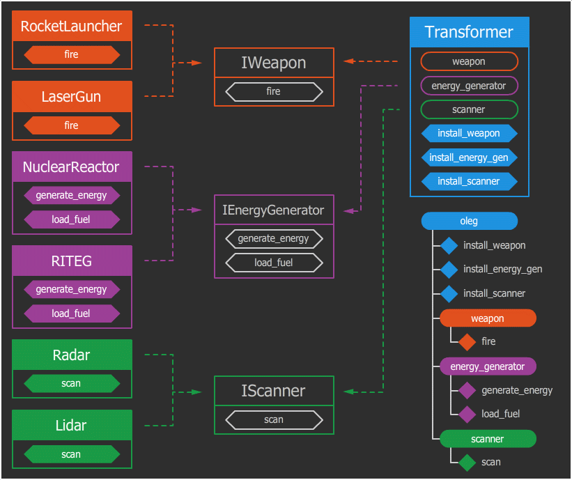

## Базовые понятия: объект, его свойства и методы, класс, интерфейс. 

В силу своей природы, объектно-ориентированное программирование лучше всего объяснять на примерах. [Нашими пациентами будут трансформеры.](https://habr.com/ru/post/463125/)

### Класс и объект

Самое простое объяснение: **класс** — это чертеж трансформера, а экземпляры этого класса — конкретные трансформеры, например, *Оптимус Прайм* или *Олег*. И хотя они и собраны по одному чертежу, умеют одинаково ходить, трансформироваться и стрелять, они оба обладают собственным уникальным состоянием. Состояние — это ряд меняющихся свойств. Поэтому у двух разных объектов одного **класса** мы можем наблюдать разное имя, возраст, местоположение, уровень заряда, количество боеприпасов и т. д. Само наличие этих свойств и их типы описываются в классе.

Таким образом, **класс** — это описание того, какими свойствами и поведением будет обладать объект. А **объект** — это экземпляр с собственным состоянием этих свойств.

Мы говорим «свойства и поведение», но звучит это как-то абстрактно и непонятно. Привычнее для программиста будет звучать так: «переменные и функции». На самом деле «свойства» — это такие же обычные переменные, просто они являются атрибутами какого-то объекта (их называют полями объекта). Аналогично «поведение» — это функции объекта (их называют методами), которые тоже являются атрибутами объекта. Разница между методом объекта и обычной функцией лишь в том, что метод имеет доступ к собственному состоянию через поля.

Итого, имеем методы и свойства, которые являются атрибутами. Как работать с атрибутами? В большинстве ЯП оператор обращения к атрибуту — это точка. Выглядит это примерно вот так:

```cs
// объявление класса с помощью ключевого слова class
class Transformer
{
    public int x

    // объявление метода run
    public void run(){
        // обращение к собственному атрибуту 
        x += 1;
    }

    public Transformer(int x){
        this.x = x;
    }
}

// а теперь клиентский код:

// создаем новый экземпляр трансформера с начальной позицией 0
var optimus = new Transformer(0);

// приказываем Оптимусу бежать
optimus.run();

// выведет 1
Console.WriteLine(optimus.x);

// приказывает Оптимусу еще раз бежать
optimus.run();

// выведет 2
Console.WriteLine(optimus.x);
```

Что мы видим из кода?

1. Объект может обращаться из своих методов к собственным атрибутам (у нас атрибут "**x**"). Обращаю внимание, что только к собственным, то бишь, когда трансформер вызывает свой метод, либо меняет собственное состояние. Если снаружи обращение будет выглядеть так: *optimus.x*, то изнутри, если Оптимус захочет сам обратиться к своему полю "x", в его методе обращение будет звучать так: "x" (или *this.x*), то есть "я (Оптимус) обращаюсь к своему атрибуту x". В большинстве языков для обращения к аттрибутам класса используются ключевые слова this или self.

2. Конструктор — это специальный метод, который автоматически вызывается при создании объекта. Конструктор может принимать любые аргументы, как и любой другой метод. В каждом языке конструктор обозначается своим именем. Где-то это специально зарезервированные имена типа ``__construct`` или ``__init__``, а где-то имя конструктора должно совпадать с именем класса (как раз в C# так и сделано). Назначение конструкторов — произвести первоначальную инициализацию объекта, заполнить нужные поля. Про конструкторы мы подробнее поговорим ниже.

3. В C# для создания экземпляра класса нужно вызвать конструктор класса (как функцию) с ключевым словом **new**. В этот момент создается объект и вызывается конструктор. В нашем примере, конструктору передается "0" в качестве стартовой позиции трансформера (это и есть вышеупомянутая инициализация).

4. Методы *Transformer* (конструктор) и *run* работают с внутренним состоянием, а во всем остальном не отличаются от обычных функций. Даже синтаксис объявления совпадает.

### Интерфейс

Когда мы подходим к автомату с кофе или садимся за руль, мы начинаем взаимодействие с ними. Обычно, взаимодействие происходит с помощью некоторого набора элементов: щель для приёмки монеток, кнопка выбора напитка и отсек выдачи стакана в кофейном автомате; руль, педали, рычаг коробки переключения передач в автомобиле. Всегда существует некоторый ограниченный набор элементов управления, с которыми мы можем взаимодействовать.

**Интерфейс** – это набор методов класса, доступных для использования другими классами. 

Очевидно, что интерфейсом класса будет являться набор всех его публичных методов в совокупности с набором публичных атрибутов. По сути, интерфейс специфицирует класс, чётко определяя все возможные действия над ним. 

Хорошим примером интерфейса может служить приборная панель автомобиля, которая позволяет вызвать такие методы, как увеличение скорости, торможение, поворот, переключение передач, включение фар, и т.п. То есть все действия, которые может осуществить другой класс (в нашем случае – водитель) при взаимодействии с автомобилем.

При описании интерфейса класса очень важно соблюсти баланс между гибкостью и простотой. Класс с простым интерфейсом будет легко использовать, но будут существовать задачи, которые с помощью него решить будет не под силу. В то же время, если интерфейс будет гибким, то, скорее всего, он будет состоять из достаточно сложных методов с большим количеством параметров, которые будут позволять делать очень многое, но использование его будет сопряжено с большими сложностями и риском совершить ошибку, что-то перепутав.

Примером простого интерфейса может служить машина с коробкой-автоматом. Освоить её управление очень быстро сможет любая блондинка, окончившая двухнедельные курсы вождения. С другой стороны, чтобы освоить управление современным пассажирским самолётом, необходимо несколько месяцев, а то и лет упорных тренировок.

## Основные принципы ООП.

Ортодоксальная ООП-церковь проповедует нам фундаментальную троицу — *инкапсуляцию*, *полиморфизм* и *наследование*, на которых зиждется весь объектно-ориентированный подход. 

Разберем их по порядку.

### Наследование

**Наследование** — это механизм системы, который позволяет, как бы парадоксально это не звучало, наследовать одними классами свойства и поведение других классов для дальнейшего расширения или модификации.

Что если, мы не хотим штамповать одинаковых трансформеров, а хотим сделать общий каркас, но с разным обвесом? ООП позволяет нам такую шалость путем разделения логики на сходства и различия с последующим выносом сходств в родительский класс, а различий в классы-потомки. Как это выглядит?

*Оптимус Прайм* и *Мегатрон* — оба трансформеры, но один является автоботом, а второй десептиконом. Допустим, что различия между автоботами и десептиконами будут заключаться только в том, что автоботы трансформируются в автомобили, а десептиконы — в авиацию. Все остальные свойства и поведение не будут иметь никакой разницы. В таком случае можно спроектировать систему наследования так: общие черты (бег, стрельба) будут описаны в базовом классе «Трансформер», а различия (трансформация) в двух дочерних классах «Автобот» и «Десептикон».

```cs
// базовый класс
class Transformer
{ 
    public void run(){
        // код, отвечающий за бег
    }
    public void fire(){
        // код, отвечающий за стрельбу
    }
}

// дочерний класс, наследование от Transformer
class Autobot : Transformer
{ 
    public void transform(){
        // код, отвечающий за трансформацию в автомобиль
    }
}

// дочерний класс, наследование от Transformer
class Decepticon : Transformer
{ 
    public void transform(){
        // код, отвечающий за трансформацию в самолет
    }
}

var optimus = new Autobot();
var megatron = new Decepticon();
```

Этот пример наглядно иллюстрирует, как наследование становится одним из способов избежать дублирования кода с помощью родительского класса, и одновременно предоставляет возможности для мутации в классах-потомках.

#### Перегрузка

Если же в классе-потомке переопределить уже существующий в классе-родителе метод, то сработает перегрузка. Это позволяет не дополнять поведение родительского класса, а модифицировать. В момент вызова метода или обращения к полю объекта, поиск атрибута происходит от потомка к самому корню — родителю. То есть, если у автобота вызвать метод fire(), сначала поиск метода производится в классе-потомке — **Autobot**, а поскольку его там нет, поиск поднимается на ступень выше — в класс **Transformer**, где и будет обнаружен и вызван.

### Полиморфизм

**Полиморфизм** — свойство системы, позволяющее иметь множество реализаций одного интерфейса. Ничего непонятно. Обратимся к трансформерам.

Положим, у нас есть три трансформера: *Оптимус*, *Мегатрон* и *Олег*. Трансформеры боевые, стало быть обладают методом *attack()*. Игрок, нажимая у себя на джойстике кнопку «воевать», сообщает игре, чтобы та вызвала метод *attack()* у трансформера, за которого играет игрок. Но поскольку трансформеры разные, а игра интересная, каждый из них будет атаковать каким-то своим способом. Скажем, Оптимус — объект класса Автобот, а Автоботы снабжаются пушками с плутониевыми боеголовками. Мегатрон — Десептикон, и стреляет из плазменной пушки. Олег — басист, и он обзывается. А в чем польза?

Польза полиморфизма в данном примере заключается в том, что код игры ничего не знает о реализации его просьбы, кто как должен атаковать, его задача просто вызвать метод *attack()*, сигнатура которого одинакова для всех классов персонажей. Это позволяет добавлять новые классы персонажей, или менять методы существующих, не меняя код игры. Это удобно.

### Инкапсуляция

**Инкапсуляция** — это контроль доступа к полям и методам объекта. Под контролем доступа подразумевается не только можно/неможно, но и различные валидации, подгрузки, вычисления и прочее динамическое поведение.

Во многих языках частью инкапсуляции является сокрытие данных. Для этого существуют модификаторы доступа (опишем те, которые есть почти во всех ООП языках):

* **publiс** — к атрибуту может получить доступ любой желающий
* **private** — к атрибуту могут обращаться только методы данного класса
* **protected** — то же, что и **private**, только доступ получают и наследники класса в том числе

```cs
class Transformer 
{
    public Transformer(){ }

    protected void setup(){ }

    private void dance(){ }
}
```

Как правильно выбрать модификатор доступа? В простейшем случае так: если метод должен быть доступен внешнему коду, выбираем **public**. В противном случае — **private**. Если есть наследование, то может потребоваться **protected** в случае, когда метод не должен вызываться снаружи, но должен вызываться потомками.

## Абстрактные классы

Кроме обычных классов в некоторых языках существуют абстрактные классы. От обычных классов они отличаются тем, что нельзя создать объект такого класса. Зачем же нужен такой класс, спросит читатель? Он нужен для того, чтобы от него могли наследоваться потомки — обычные классы, объекты которых уже можно создавать.

Абстрактный класс наряду с обычными методами содержит в себе абстрактные методы без реализации (с названием, но без кода), которые обязан реализовать программист, задумавший создать класс-потомок. Абстрактные классы не обязательны, но они помогают установить контракт, обязующий реализовать определенный набор методов.

## Интерфейсы

Задача **интерфейса** — снизить уровень зависимости сущностей друг от друга, добавив больше абстракции.

Выше мы рассматривали абстрактные классы, затрагивая тему контрактов, обязующих реализовать какие-то абстрактные методы. Так вот интерфейс очень смахивает на абстрактный класс, но является не классом, а просто пустышкой с перечислением абстрактных методов. 

Интерфейсы в C#, однако, могут содержать как абстрактные методы, тик и методы с реализацией (начиная с версии 8.0).

Обычно в языках, в которых есть интерфейсы, нет множественного наследования классов, но есть множественное наследование интерфейсов. Это позволяет классу перечислить интерфейсы, которые он обязуется имплементировать (реализовать).

Классы с интерфейсами состоят в отношении «многие ко многим»: один класс может имплементировать множество интерфейсов, и каждый интерфейс, в свою очередь, может имплементироваться многими классами.

У интерфейса двустороннее применение:

* По одну сторону интерфейса — классы, реализующие данный интерфейс.
* По другую сторону — потребители, которые используют этот интерфейс в качестве описания типа данных, с которым они (потребители) работают.

Например, если какой-то объект помимо основного поведения, может быть сериализован, то пускай он имплементирует интерфейс «Сериализуемый». А если объект можно склонировать, то пусть он имплементирует еще один интерфейс — «Клонируемый». И если у нас есть какой-то транспортный модуль, который передает объекты по сети, он будет принимать любые объекты, имплементирующие интерфейс «Сериализуемый».

Представим, что каркас трансформера оборудован тремя слотами: слот для оружия, для генератора энергии и для какого-нибудь сканера. Эти слоты обладают определенными интерфейсами: в каждый слот можно установить только подходящее оборудование. В слот для оружия можно установить ракетную установку или лазерную пушку, в слот для генератора энергии — ядерный реактор или РИТЭГ (радиоизотопный термоэлектрический генератор), а в слот для сканера — радар или лидар. Суть в том, что каждый слот имеет универсальный интерфейс подключения, а уже конкретные устройства должны соответствовать этому интерфейсу. К примеру, на материнских платах используется несколько типов слотов: слот для процессора позволяет подключать различные процессоры, подходящие под данный сокет, а слот SATA — любой SSD или HDD накопитель или даже CD/DVD.

### Определение интерфейса

Для определения интерфейса используется ключевое слово **interface**. Как правило, названия интерфейсов в C# начинаются с заглавной буквы "I", например, *IComparable*, *IEnumerable* (так называемая венгерская нотация), однако это не обязательное требование, а больше стиль программирования.

```cs
interface IWeapon
{
    void Fire(); // декларация метода без имплементации. Ниже аналогично
}

interface IEnergyGenerator
{
    // тут уже два метода, которые должны будут реализовать классы:
    void GenerateEnergy(); // первый
    void LoadFuel();       // второй
}

interface IScanner
{
    void Scan();
}

// классы, реализующие интерфейсы:

class RocketLauncher : IWeapon
{
    public void Fire()
    {
        // имплементация запуска ракеты
    }
}

class LaserGun : IWeapon
{
    public void Fire()
    {
        // имплементация выстрела лазером
        Console.WriteLine("LaserGun fire");
    }
}

class NuclearReactor : IEnergyGenerator
{
    public void GenerateEnergy()
    {
        // имплементация генерации энергии ядерным реактором
    }

    public void LoadFuel()
    {
        // имплементация загрузки урановых стержней
    }
}

class RITEG : IEnergyGenerator
{
    public void GenerateEnergy()
    {
        // имплементация генерации энергии РИТЭГ
    }

    public void LoadFuel()
    {
        // имплементация загрузки РИТЭГ-пеллет
    }
}

class Radar : IScanner
{
    public void Scan()
    {
        // имплементация использования радиолокации
    }
}

class Lidar : IScanner
{
    public void Scan()
    {
        // имплементация использования оптической локации
    }
}

// класс - потребитель:

class Transformer: IWeapon
{
    // привет, композиция:
    // Интерфейсы указаны в качестве типов данных.
    // Они могут принимать любые объекты,
    // которые имплементируют указанный интерфейс

    private IWeapon SlotWeapon = null;
    private IEnergyGenerator SlotEnergyGenerator = null;
    private IScanner SlotScanner = null;

    /*
    в параметрах методов интерфейс тоже указан как тип данных,
    метод может принимать объект любого класса,
    имплементирующий данный интерфейс:
    */
    public void InstallWeapon(IWeapon weapon)
    {
        SlotWeapon = weapon;
    }

    public void InstallEnergyGenerator(IEnergyGenerator EnergyGenerator)
    {
        SlotEnergyGenerator = EnergyGenerator;
    }

    public void InstallScanner(IScanner Scanner)
    {
        SlotScanner = Scanner;
    }

    public void Fire()
    {
        if (SlotWeapon != null) SlotWeapon.Fire();
    }
}

// фабрика трансформеров

class TransformerFactory
{
    static public Transformer BuildSomeTransformer()
    {
        var transformer = new Transformer();
        var laser_gun = new LaserGun();
        var nuclear_reactor = new NuclearReactor();
        var radar = new Radar();


        transformer.InstallWeapon(laser_gun);
        transformer.InstallEnergyGenerator(nuclear_reactor);
        transformer.InstallScanner(radar);

        return transformer;
    }
}

// использование
class Program
{
    static void Main(string[] args)
    {
        var oleg = TransformerFactory.BuildSomeTransformer();
        oleg.Fire();

        Console.ReadKey();
    }
}
```



Cлой абстракции в виде интерфейсов между слоем реализации (класс) и слоем-потребителем дает возможность абстрагировать одних от других. Вы можете это наблюдать, посмотрев на каждый слой в отдельности: в слое реализации (слева) нет ни слова про класс **Transformer**, а в слое-потребителе (справа) нет ни слова про конкретные реализации (там нет слов **Radar**, **RocketLauncher**, **NuclearReactor** и т. д.)

В таком коде мы можем создавать новые комплектующие к трансформерам, не затрагивая чертежи самих трансформеров. В то же время и наоборот, мы можем создавать новых трансформеров, комбинируя уже существующие комплектующие, либо добавлять новые комплектующие, не меняя существующих.

### ISP

(Interface Segregation Principle / Принцип разделения интерфейса / Четвертый принцип SOLID) призывает не создавать жирные универсальные интерфейсы. Вместо этого интерфейсы нужно разделять на более мелкие и специализированные, это поможет гибче их комбинировать в классах, не заставляя реализовывать лишние методы.
