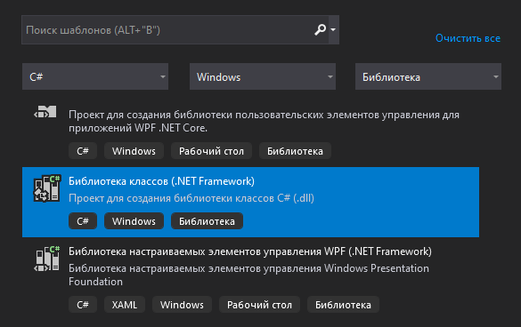
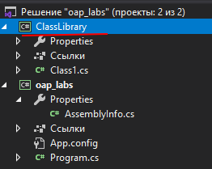
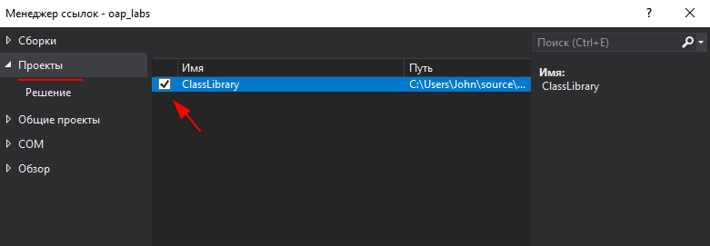

<table style="width: 100%;"><tr><td style="width: 40%;">
<a href="../articles/t6_templates.md">Шаблоны проектирования
</a></td><td style="width: 20%;">
<a href="../readme.md">Содержание
</a></td><td style="width: 40%;">
<a href="../articles/t8_win_app.md">Обзор типов оконных приложений в C#...
</a></td><tr></table>

# Библиотеки классов

>DLL (англ. Dynamic Link Library — «библиотека динамической компоновки», «динамически подключаемая библиотека») в операционных системах Microsoft Windows и IBM OS/2 — динамическая библиотека, позволяющая многократное использование различными приложениями.

## Disclaimer

**Во-первых**, надо отметить, что "классические" **DLL** содержат **функции**. А **.NET**, как мы уже знаем, оперирует **класами** и **пространствами имён**. Поэтому **DLL**, создаваемые в **.NET** не совместимы с обычными. (Но если очень надо, то как-то это реализуется. Технология [Windows Forms](https://ru.wikipedia.org/wiki/Windows_Forms) использует [Win32 API](https://ru.wikipedia.org/wiki/Windows_API))

**Во-вторых**, в рамках нашего курса вообще нет особой необходимости в **DLL** (просто не будет достаточно сложных проектов). 

Но, на демо-экзамене и worldskliis в модуле *тестирование* может встретится задание написать библиотеку классов и unit-тесты для неё. Поэтому надо знать что это такое и уметь реализовать. 

## Содержание

<!-- https://metanit.com/sharp/tutorial/14.3.php -->

* [Создание](#Создание)
* [Подключение](#Подключение)
* [Динамическая загрузка сборок и позднее связывание](#Динамическая-загрузка-сборок-и-позднее-связывание)

Нередко различные классы и структуры оформляются в виде отдельных библиотек, которые компилируются в файлы ***dll*** и затем могут подключать в другие проекты. Благодаря этому мы можем определить один и тот же функционал в виде библиотеки классов и подключать в различные проекты или передавать на использование другим разработчикам.

## Создание 

Возьмем имеющийся проект приложения .NET Framework, например, созданный в прошлых темах. В структуре проекта нажмем правой кнопкой на название решения и далее в появившемся контекстном меню выберем **Добавить -> Создать проект...**

Далее в списке шаблонов проекта найдем пункт **Библиотека классов (.NET Framework)**. Будьте внимательны, в списке шаблонов несколько вариантов "Библиотек классов" под разные платформы:



После создания проекта он появится в решении, в моем случае с названием ClassLibrary:



По умолчанию новый проект имеет один пустой класс **Class1** в файле `Class1.cs`. Мы можем этот файл удалить или переименовать, как нам больше нравится.

```cs
namespace ClassLibrary
{
    public class Class1
    {
    }
}
```

Например, переименуем файл `Class1.cs` в `Person.cs`, а класс **Class1** в **Person**. Определим в классе **Person** простейший код:

```cs
public class Person
{
    public string name;
    public int age;
}
```

>**ОБРАТИТЕ ВНИМАНИЕ!!!** Студия может создать класс без модификатора **public** - установите его, иначе не сможете использовать этот класс в других проектах.

Теперь скомпилируем библиотеку классов. Для этого нажмём правой кнопкой на проект библиотеки классов и в контекстном меню выберем пункт **Собрать**.

После компиляции библиотеки классов в папке проекта в каталоге `bin/Debug` мы сможем найти скомпилированный файл ***dll*** (`ClassLibrary.dll`).

## Подключение

Подключим созданную библиотеку классов в основной проект. Для этого в основном проекте нажмем правой кнопкой на **Ссылки** (раньше этот пункт назывался **Зависимости**) и в контекстном меню выберем пункт **Добавить ссылку...**:

Далее нам откроется окно для добавления библиотек. В этом окне выберем пункт **Проекты -> Решение**, который позволяет увидеть все библиотеки классов из проектов текущего решения и поставим отметку рядом с нашей библиотекой.



Если наша библиотека вдруг представляет файл ***dll***, который не связан ни с каким проектом в нашем решении, то с помощью кнопки **Обзор** мы можем найти местоположение файла ***dll*** и также его подключить.

После успешного подключения библиотеки в главном проекте изменим класс **Program**, чтобы он использовал класс **Person** из библиотеки классов:

```cs
using System;
using ClassLibrary;    // подключение пространства имен из библиотеки классов
 
namespace HelloApp
{
    class Program
    {
        static void Main(string[] args)
        {
            Person tom = new Person { name = "Tom", age = 35 };
            Console.WriteLine(tom.name);
        }
    }
}
```

Такое подключение библиотек назвается статическим.

## Динамическая загрузка сборок и позднее связывание

При создании приложения для него определяется набор сборок, которые будут использоваться. В проекте указываются ссылки на эти сборки, и когда приложение выполняется, при обращении к функционалу этих сборок они автоматически подгружаются.

Но также мы можем сами динамически подгружать другие сборки, на которые в проекте нет ссылок.

Для управления сборками в пространстве имен **System.Reflection** имеется класс **Assembly**. С его помощью можно загружать сборку, исследовать ее.

Чтобы динамически загрузить сборку в приложение, надо использовать статические методы *Assembly.LoadFrom()* или *Assembly.Load()*.

Метод *LoadFrom()* принимает в качестве параметра путь к сборке. Например, исследуем сборку на наличие в ней различных типов:

```cs
static void Main(string[] args)
{
    Assembly asm = Assembly.LoadFrom("MyApp.dll");
 
    Console.WriteLine(asm.FullName);
    // получаем все типы из сборки MyApp.dll
    Type[] types = asm.GetTypes();
    foreach(Type t in types)
    {
        Console.WriteLine(t.Name);
    }
    Console.ReadLine();
}
```

В данном случае для исследования указывается сборка `MyApp.dll`. Здесь использован относительный путь, так как сборка находится в одной папке с приложением. Стоит учитывать, что загрузке подлежат сборки с расширением ***dll***, но не ***exe***.

Метод *Load()* действует аналогично, только в качестве его параметра передается дружественное имя сборки, которое нередко совпадает с именем приложения: `Assembly asm = Assembly.Load("MyApp");`

Получив все типы сборки с помощью метода *GetTypes()*, мы можем исследовать их или применить в своем проекте.

### Исследование типов

Класс **System.Type** представляет изучаемый тип, инкапсулируя всю информацию о нем. С помощью его свойств и методов можно получить эту информацию. Некоторые из его свойств и методов:

* Метод **FindMembers()** возвращает массив объектов **MemberInfo** данного типа
* Метод **GetConstructors()** возвращает все конструкторы данного типа в виде набора объектов **ConstructorInfo**
* Метод **GetEvents()** возвращает все события данного типа в виде массива объектов **EventInfo**
* Метод **GetFields()** возвращает все поля данного типа в виде массива объектов **FieldInfo**
* Метод **GetInterfaces()** получает все реализуемые данным типом интерфейсы в виде массива объектов **Type**
* Метод **GetMembers()** возвращает все члены типа в виде массива объектов **MemberInfo**
* Метод **GetMethods()** получает все методы типа в виде массива объектов **MethodInfo**
* Метод **GetProperties()** получает все свойства в виде массива объектов **PropertyInfo**
* Свойство *Name* возвращает имя типа
* Свойство *Assembly* возвращает название сборки, где определен тип
* Свойство *Namespace* возвращает название пространства имен, где определен тип
* Свойство *IsArray* возвращает **true**, если тип является массивом
* Свойство *IsClass* возвращает **true**, если тип представляет класс
* Свойство *IsEnum* возвращает **true**, если тип является перечислением
* Свойство *IsInterface* возвращает **true**, если тип представляет интерфейс

**Получение типа**

Чтобы управлять типом и получать всю информацию о нем, нам надо сперва получить данный тип. Это можно сделать тремя способами: с помощью ключевого слова **typeof**, с помощью метода *GetType()* класса **Object** и применяя статический метод *Type.GetType()*.

* Получение типа через **typeof**:

    ```cs
    class Program
    {
        static void Main(string[] args)
        {
            Type myType = typeof(User);
            
            Console.WriteLine(myType.ToString());
            Console.ReadLine();
        }
    }
    
    public class User
    {
        public string Name { get; set; }
        public int Age { get; set; }
        public User(string n, int a)
        {
            Name = n;
            Age = a;
        }
        public void Display()
        {
            Console.WriteLine($"Имя: {Name}  Возраст: {Age}");
        }
        public int Payment(int hours, int perhour)
        {
            return hours * perhour;
        }
    }
    ```

    Здесь определен класс **User** с некоторым набором свойств и полей. И чтобы получить его тип, используется выражение `Type myType = typeof(User);`

* Получение типа с помощью метода *GetType* класса **Object**:

    ```cs
    User user = new User("Tom", 30);
    Type myType = user.GetType();
    ```

    В отличие от предыдущего примера здесь, чтобы получить тип, надо создавать экземпляр класса.

* И третий способ получения типа - статический метод *Type.GetType()*:

    ```cs
    Type myType = Type.GetType("TestConsole.User", false, true);
    ```

    Первый параметр указывает на полное имя класса с пространством имен. В данном случае класс **User** находится в пространстве имен **TestConsole**. Второй параметр указывает, будет ли генерироваться исключение, если класс не удастся найти. В данном случае значение **false** означает, что исключение не будет генерироваться. И третий параметр указывает, надо ли учитывать регистр символов в первом параметре. Значение **true** означает, что регистр игнорируется.

    В данном случае класс основной программы и класс **User** находятся в одном проекте и компилируются в одну сборку exe. Однако может быть, что нужный нам класс находится в другой сборке dll. Для этого после полного имени класса через запятую указывается имя сборки:

    ```cs
    Type myType = Type.GetType("TestConsole.User, MyLibrary", false, true);
    ```

### Позднее связывание

С помощью динамической загрузки мы можем реализовать технологию **позднего связывания**. Позднее связывание позволяет создавать экземпляры некоторого типа, а также использовать его во время выполнения приложения.

Использование позднего связывания менее безопасно в том плане, что при жестком кодировании всех типов (ранее связывание) на этапе компиляции мы можем отследить многие ошибки. В то же время позднее связывание позволяет создавать расширяемые приложения, когда дополнительный функционал программы неизвестен, и его могут разработать и подключить сторонние разработчики.

Ключевую роль в позднем связывании играет класс **System.Activator**. С помощью его статического метода *Activator.CreateInstance()* можно создавать экземпляры заданного типа.

Например, динамически загрузим сборку и вызовем у ней некоторый метод. Допустим, загружаемая сборка `MyApp.dll` представляет следующий класс:

```cs
class Program
{
    static void Main(string[] args)
    {
        Console.WriteLine(GetResult(6, 100, 2));
 
        Console.ReadLine();
    }
 
    public static double GetResult(int percent, double capital, int year)
    {
        for (int i = 0; i < year; i++ )
        {
            capital += capital /100 * percent;
        }
        return capital;
    }
}
```

Итак, у нас стандартный класс **Program** с двумя методами. Теперь динамически подключим сборку с этой библиотекой в другой программе и вызовем ее методы.

Пусть наша основная программа будет выглядеть так:

```cs
static void Main(string[] args)
{
    try
    {
        Assembly asm = Assembly.LoadFrom("MyApp.dll");
         
        Type t = asm.GetType("MyApp.Program", true, true);
         
        // создаем экземпляр класса Program
        object obj = Activator.CreateInstance(t);
         
        // получаем метод GetResult
        MethodInfo method = t.GetMethod("GetResult");
         
        // вызываем метод, передаем ему значения для параметров и получаем результат
        object result = method.Invoke(obj, new object[] { 6, 100, 3 });
        Console.WriteLine((result));
    }
    catch(Exception ex)
    {
        Console.WriteLine(ex.Message);
    }
    Console.ReadLine();
}
```

Исследуемую сборку можно получить с помощью выражения `Assembly asm = Assembly.LoadFrom("MyApp.dll")`.

Затем с помощью метода *GetType* получаем тип - класс **Program**, который находится в сборке `MyApp.dll: Type t = asm.GetType("MyApp.Program", true, true);`

Получив тип, создаем его экземпляр: `object obj = Activator.CreateInstance(t)`. Результат создания - объект класса **Program** представляет собой переменную **obj**.

И в конце остается вызвать метод. **Во-первых**, получаем сам метод: `MethodInfo method = t.GetMethod("GetResult");`. И потом с помощью метода *Invoke* вызываем его: `object result = method.Invoke(obj, new object[] { 6, 100, 3 })`. Здесь первый параметр представляет объект, для которого вызывается метод, а второй - набор параметров в виде массива **object[]**.

Так как метод *GetResult* возвращает некоторое значение, то мы можем его получить из метода в виде объекта типа **object**.

Если бы метод не принимал параметров, то вместо массива объектов использовалось бы значение null: `method.Invoke(obj, null)`

В сборке `MyApp.dll` в классе **Program** также есть и другой метод - метод **Main**. Вызовем теперь его:

```cs
Console.WriteLine("Вызов метода Main");
method = t.GetMethod("Main", BindingFlags.DeclaredOnly 
    | BindingFlags.Instance | BindingFlags.NonPublic | BindingFlags.Static);
     
method.Invoke(obj, new object[]{new string[]{}});
```

Так как метод Main является статическим и не публичным, то к нему используется соответствующая битовая маска `BindingFlags.NonPublic | BindingFlags.Static`. И поскольку он в качестве параметра принимает массив строк, то при вызове метода передается соответствующее значение: `method.Invoke(obj, new object[]{new string[]{}})`

<table style="width: 100%;"><tr><td style="width: 40%;">
<a href="../articles/t6_templates.md">Шаблоны проектирования
</a></td><td style="width: 20%;">
<a href="../readme.md">Содержание
</a></td><td style="width: 40%;">
<a href="../articles/t8_win_app.md">Обзор типов оконных приложений в C#...
</a></td><tr></table>
