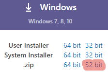
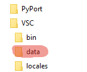
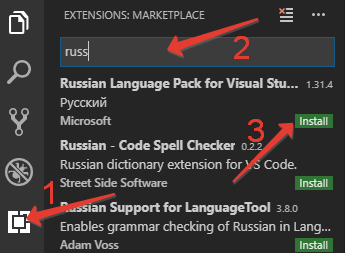
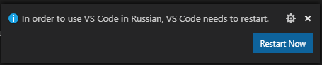
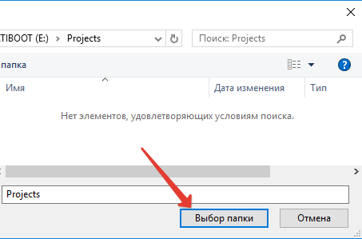
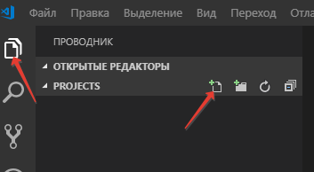
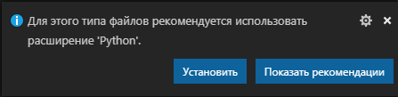
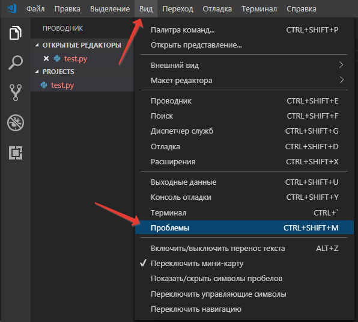
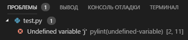
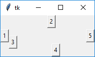

[содержание](/readme.md)  

# Тема 7. Знакомство со средой разработчика Visual Studio Code

Вообще интегрированных средств разработчика (IDE) сделанных специально для Python нет, но в этом и нет особенной необходимости - многие современные IDE поддерживают разработку на нескольких языках.

Мы уже пользовались на занятиях редактором кода VSC: легкий, кроссплатформенный, бесплатный, поддерживает технологию плагинов, т.е. возможности можно наращивать за счет дополнительных модулей. Как раз такие модули и добавляют в VSC поддержку разработки на Python.

Рассмотрим установку и настройку VSC в так называемом переносном режиме (portable). В переносном режиме VSC все настройки хранит в подкаталоге программы, не используя для этого реестр или домашний каталог пользователя. Этот режим позволяет установить VSC на переносной носитель и пользоваться им на любом компьютере (дома, на работе, в дороге на ноутбуке) - не потребуется несколько раз настраивать одно и тоже. А исходный код ваших программ удобно держать в репозитории (VSC поддерживает работу с Git "из коробки").

## Установка
* Скачиваете [дистрибутив](https://code.visualstudio.com/Download) с официальной страницы программы. Обратите внимание, что переносной режим поддерживает только дистрибутив распространяемый в архиве **.zip**. И так как мы не знаем какой разрядности ОС нам может попасться, то скачиваем 32-х разрядную версию.



* Создаете каталог на носителе и распаковываете в него полученный архив.

* Для того чтобы VSC перевести в переносной режим просто создайте в каталоге, в который вы его распаковали, подкаталог **data**



## Первоначальна Настройка VSC
Итак, VSC у нас установлен - запускаем.

Первым делом русифицируем VSC. Он, как и все уважающие себя современные программы, поддерживает установку плагинов из магазина (marketplace):

1. заходим в магазин
2. в строке поиска набираем *russian*
3. в появившемся списке находим и устанавливаем **Russian Language Pack for Visual Studio Code**



После установки плагина программа предложит перезапустить себя - соглашаемся.



## Настройка VSC для разработки на Питоне
VSC считает проектом отдельный каталог - в нем она хранит все настройки этого проекта, в нем ищет репозиторий Git... - создадим новый каталог для наших проектов или откроем существующий, если у вас уже есть какой-то проект. Можно это сделать на окне приветствия (ссылка открыть папку) или через меню *Файл* - *Открыть папку*



Выбираем (создаем, если надо) папку для нашего проекта и жмем кнопку *Выбор папки*

Выбираем режим *проводника* в левой панели и создаем новый файл с расширением .py



VSC автоматически определяет что такое расширение используют для файлов программ Питона и предлагает установить плагин (расширение) Python - соглашаемся



После установки расширения опять предложит перезапустить программу, тоже соглашаемся.

Включим (если оно выключено) дополнительное окно *Проблемы* (меню *Вид* - *Проблемы*)



Наберем в нашем файле не хитрый код и сохраним файл.

```py
for i in range(5):
    print(j)
```

В окне *Проблемы* появится строка ``Undefined variable 'j'``, расширение Python отслеживает ваши ошибки и показывает что за ошибка и где она находится (в нашем случае строка 5, позиция в строке 11)



Действительно, опечатка в названии переменной - меняем, сохраняем файл, теперь все в порядке.

Теперь мы можем выполнить нашу программу, не выходя из VSC, просто нажмите F5 (или через меню *Отладка* - *Запустить отладку*)


Результат выполнения нашей программы видно в окне *Терминал*

>тут еще написать про отладку intellisense и т.д.

## Создание оконных приложений
Со средой проектирования мы освоились, теперь продолжим изучение языка Питон.

Консольные приложения мы уже научились писать, теперь изучим способы создания оконных приложений.

Как обычно для opensource-разработки есть несколько вариантов:

* Tkinter встроенный модуль, который может формировать GUI с помощью Python. Он позволяет вам запускать сценарии на Python в GUI-формате. 
* PyQT (PySide) - основанный на Qt. Qt это кросс-платформенный фреймворк. Он написан на С++. Это очень полная библиотека, включающая много инструментов и API. 
* CEF Python. Этот фреймворк основан на Google Chromium. Основное внимание в нем уделяется облегчению использования встроенного браузера в сторонних приложениях.

И множество других, но мы остановимся на этих трех вариантах. 
* На примере Tkinter мы посмотрим что такое GUI, как оно работает с Питоном. 
* Qt широко распространен, имеет дизайнер форм, что очень поможет при разработке сложных окон.
* При всей "крутости" Qt, человека, умеющего рисовать интерфейс в дизайнере форм еще нужно найти, а Web-дизайн знает каждый второй (не считая первого). И это очень выгодно отличает CEF. Плюс к свободе дизайна можно еще вспомнить, что часть логики приложения можно вынести в js-скрипты. Такой движок незаменим для создания приложений типа "Информационный киоск", по сути содержимое он вообще может брать из интернета.

## Tkinter
Что такое Tkinter?<br/>
Tkinter (от англ. tk interface) - это графическая библиотека, позволяющая создавать программы с оконным интерфейсом. Эта библиотека является интерфейсом к популярному языку программирования и инструменту создания графических приложений tcl/tk. Tkinter, как и tcl/tk, является кроссплатформенной библиотекой и может быть использована в большинстве распространённых операционных систем (Windows, Linux, Mac OS X и др.).

Так как Tkinter является достаточно прозрачным интерфейсом к tcl/tk, то основным источником информации для неё являются **man**-страницы tcl/tk. Эти страницы имеются в любой Unix-системе. Также они доступны онлайн на сайте http://tcl.tk.

Начиная с версии python-3.0 библиотека переименована в соответствии с PEP 8 в tkinter (с маленькой буквы).

Импортируется она как и любая другая библиотека:

``import tkinter``

или

``from tkinter import *``

В Tkinter визуальные контролы называются виджетами (widget, от англ. window gadget) - стандартизированный компонент графического интерфейса, с которым взаимодействует пользователь.

### Класс Tk
Tk является базовым классом любого Tkinter приложения. При создании объекта этого класса запускается интерпретатор tcl/tk и создаётся базовое окно приложения.

Tkinter является событийно-ориентированной библиотекой. В приложениях такого типа имеется главный цикл обработки событий. В Tkinter такой цикл запускается методом mainloop. Для явного выхода из интерпретатора и завершения цикла обработки событий используется метод quit.

Таким образом минимальное приложение на Tkinter будет таким:

```py
from tkinter import *
root = Tk()
root.mainloop()
```

В приложении можно использовать несколько интерпретаторов tcl/tk. Так как после вызова метода mainloop дальнейшие команды python исполняться не будут до выхода из цикла обработки событий, необходимо метод mainloop всех интерпретаторов кроме последнего осуществлять в фоновом режиме. Пример запуска двух интерпретаторов:

```py
from tkinter import *
root1 = Tk()
root2 = Tk()
root1.after(500, root1.mainloop) # первый цикл запускаем в фоне
root2.mainloop()
```

При использовании двух и более интерпретаторов необходимо следить, чтобы объекты, созданные в одном интерпретаторе, использовались только в нём. Например, изображение, созданное в первом интерпретаторе, может быть использовано много раз в этом же интерпретаторе, но не может быть использовано в других интерпретаторах. Необходимость в запуске нескольких интерпретаторов в одном приложении возникает крайне редко. Для создания дополнительного окна приложения в большинстве случаев достаточно виджета Toplevel.

### Общее для всех виджетов
Все виджеты в Tkinter обладают некоторыми общими свойствами. Опишем их, перед тем как перейти к рассмотрению конкретных виджетов. Виджеты создаются вызовом конструктора соответствующего класса. Первый аргумент (как правило неименованный, но можно использовать имя master) это родительский виджет, в который будет упакован (помещён) наш виджет (аналог parent для Дельфи). Родительский виджет можно не указывать, в таком случае будет использовано главное окно приложения. Далее следуют именованные аргументы, конфигурирующие виджет. Это может быть используемый шрифт (font=...), цвет виджета (bg=...), команда, выполняющаяся при активации виджета (command=...) и т.д. Полный список всех аргументов можно посмотреть в man options и man-странице соответствующего виджета (например man button, см. разделы "STANDARD OPTIONS" и "WIDGET-SPECIFIC OPTIONS"). Пример кода:

```py
from tkinter import *

def button_clicked():
    print("Клик!")

root=Tk()
# кнопка по умолчанию
button1 = Button()
button1.pack()
# кнопка с указанием родительского виджета и несколькими аргументами
button2 = Button(root, bg="red", text="Кликни меня!", command=button_clicked)
button2.pack()
root.mainloop()
```

### Методы виджетов
#### configure, config
Виджеты могут быть сконфигурированы во время создания, но иногда необходимо изменить конфигурацию виджета во время исполнения программы. Для этого используется метод configure (или его синоним config). Также можно использовать квадратные скобки (widget['option'] = new_value). Пример, программа выводит текущее время, после клика по кнопке:

```py
from tkinter import *
import time

def button_clicked():
    # изменяем текст кнопки
    button['text'] = time.strftime('%H:%M:%S')

root=Tk()
# создаём виджет
button = Button(root)
# конфигурируем виджет после создания
button.configure(text=time.strftime('%H:%M:%S'), command=button_clicked)
# также можно использовать квадратные скобки:
# button['text'] = time.strftime('%H:%M:%S')
# button['command'] = button_clicked
button.pack()
root.mainloop()
```

В этом коде функция button_clicked вызывается каждый раз, когда пользователь кликает по кнопке.

#### cget
Метод **cget** является обратным к методу configure. Он предназначен для получения информации о конфигурации виджета. Здесь как и в случае с configure можно использовать квадратные скобки (value = widget['option']). Пример, после клика на кнопку программа показывает цвет кнопки и меняет его на другой:

```py
from tkinter import *
from random import random
def button_clicked():
    button['text'] = button['bg'] # показываем предыдущий цвет кнопки
    bg = '#%0x%0x%0x' % (int(random()*16), int(random()*16), int(random()*16))
    button['bg'] = bg
    button['activebackground'] = bg
root=Tk()
button = Button(root, command=button_clicked)
button.pack()
root.mainloop()
```

#### destroy
Уничтожение виджета и всех его потомков. Стоит отметить, что если необходимо только на время спрятать какой-либо виджет, то лучше пользоваться упаковщиком grid и методом grid_remove:

```py
from tkinter import *

def hide_show():
    if label.winfo_viewable():
        label.grid_remove()
    else:
        label.grid()

root=Tk()
label = Label(text='Я здесь!')
label.grid()
button = Button(command=hide_show, text="Спрятать/показать")
button.grid()
root.mainloop()
```

Использование grid_remove позволяет сохранять взаимное расположение виджетов.

#### grab_\*
Методы семейства grab_ предназначены для управления потоком события. Виджет, захвативший поток, будет получать все события окна или приложения.

* grab_set - передать поток данному виджету
* grab_set_global - передать глобальный поток данному виджету. В этом случае все события на дисплее будут передаваться этому виджету. Следует пользоваться очень осторожно, т.к. остальные виджеты всех приложений не будут получать события.
* grab_release - освободить поток
* grab_status - узнать текущий статус потока событий для виджета. Возможные значения: None, "local" или "global".
* grab_current - получить виджет, который получает поток

Пример, приложение захватывает глобальный поток и освобождает его через 10 секунд:

```py
from tkinter import *
root=Tk()
root.after(200, root.grab_set_global)
root.after(10000, root.grab_release)
root.mainloop()
```

#### focus_\*
Методы семейства focus_ используются для управления фокусом ввода с клавиатуры. Виджет, имеющий фокус, получает все события с клавиатуры.

* focus (синоним focus_set) - передать фокус виджету.
* focus_force - передать фокус, даже если приложение не имеет фокуса. Используйте осторожно, поскольку это может раздражать пользователей.
* focus_get - возвращает виджет, на который направлен фокус, либо None, если такой отсутствует.
* focus_displayof - возвращает виджет, на который направлен фокус на том дисплее, на котором размещён виджет, либо None, если такой отсутствует.
* focus_lastfor - возвращает виджет, на который будет направлен фокус, когда окно с этим виджетом получит фокус.
* tk_focusNext - возвращает виджет, который получит фокус следующим (обычно смена фокуса происходит при нажатии клавиши Tab). Порядок следования определяется последовательностью упаковки виджетов.
* tk_focusPrev - то же, что и focusNext, но в обратном порядке.
* tk_focusFollowsMouse - устанавливает, что виджет будет получать фокус при наведении на него мышью. Вернуть нормальное поведение достаточно сложно.

### "Системные" методы
Эти методы не являются виджет-специфичными, т.е. хотя они являются методами виджетов они влияют на работу интерпретатора tcl/tk.

#### after, after_idle и after_cancel
Таймеры. С помощью этих методов вы можете отложить выполнение какого-нибудь кода на определённое время.

* after - принимает два аргумента: время в миллисекундах и функцию, которую надо выполнить через указанное время. Возвращает идентификатор, который может быть использован в after_cancel.
* after_idle - принимает один аргумент - функцию. Эта функция будет выполнена после завершения всех отложенных операций (после того, как будут обработаны все события). Возвращает идентификатор, который может быть использован в after_cancel.
* after_cancel - принимает один аргумент: идентификатор задачи, полученный предыдущими функциями, и отменяет это задание.

Пример, часы:

```py
from tkinter import *
import time

def tick():
    label.after(200, tick)
    label['text'] = time.strftime('%H:%M:%S')

root=Tk()
label = Label(font='sans 20')
label.pack()
label.after_idle(tick)
root.mainloop()
```

Обратите внимание: функция after одноразовая, т.е. для того чтобы она работала с каким-то интервалом ее заново нужно запускать в вызываемой функции.

#### update и update_idletasks
Две функции, для работы с очередью задач. Их выполнение вызывает обработку отложенных задач.

* update_idletasks выполняет задачи, обычно откладываемые "на потом", когда приложение будет простаивать. Это приводит к прорисовке всех виджетов, расчёту их расположения и т.д. Обычно эта функция используется если были внесены изменения в состояние приложения, и вы хотите, чтобы эти изменения были отображены на экране немедленно, не дожидаясь завершения сценария.
* update обрабатывает все задачи, стоящие в очереди. Обычно эта функция используется во время "тяжёлых" расчётов, когда необходимо чтобы приложение оставалось отзывчивым на действия пользователя.

Пример:

```py
from tkinter import *
import math

def hard_job():
    x = 1000
    while True:
        x = math.log(x) ** 2.8
        root.update()

root=Tk()
button = Button()
button.pack()
root.after(500, hard_job)
root.mainloop()
```

#### eval и evalfile
Две недокументированные функции для выполнения кода на tcl. **eval** позволяет выполнить строку на языке программирования tcl, а **evalfile** - выполнить код, записанный в файл. В качестве аргументов принимают соответственно строку и путь к файлу. Данные функции полезны при использовании дополнительных модулей, написанных на tcl. Пример:

```py
from tkinter import *

root=Tk()
root.eval('package require tile; ttk::style theme use clam')
root.eval('ttk::button .b -text {ttk button}; pack .b')
root.mainloop()
```

### Основные виджеты
#### Toplevel
Toplevel - окно верхнего уровня. Обычно используется для создания многооконных программ, а также для диалоговых окон.

##### Методы виджета
* title - заголовок окна
* overrideredirect - указание оконному менеджеру игнорировать это окно. Аргументом является True или False. В случае, если аргумент не указан - получаем текущее значение. Если аргумент равен True, то такое окно будет показано оконным менеджером без обрамления (без заголовка и бордюра). Может быть использовано, например, для создания splashscreen при старте программы.
* iconify / deiconify - свернуть / развернуть окно
* withdraw - "спрятать" (сделать невидимым) окно. Для того, чтобы снова показать его, надо использовать метод deiconify.
* minsize и maxsize - минимальный / максимальный размер окна. Методы принимают два аргумента - ширина и высота окна. Если аргументы не указаны - возвращают текущее значение.
* state - получить текущее значение состояния окна. Может возвращать следующие значения: normal (нормальное состояние), icon (показано в виде иконки), iconic (свёрнуто), withdrawn (не показано), zoomed (развёрнуто на полный экран, только для Windows и Mac OS X)
* resizable - может ли пользователь изменять размер окна. Принимает два аргумента - возможность изменения размера по горизонтали и по вертикали. Без аргументов возвращает текущее значение.
* geometry - устанавливает геометрию окна в формате ``ширина x высота + x + y`` (пример: ``geometry("600x400+40+80")`` - поместить окно в точку с координатам 40,80 и установить размер в 600x400). Размер или координаты могут быть опущены (``geometry("600x400")`` - только изменить размер, ``geometry("+40+80")`` - только переместить окно).
* transient - сделать окно зависимым от другого окна, указанного в аргументе. Будет сворачиваться вместе с указанным окном. Без аргументов возвращает текущее значение.
* protocol - получает два аргумента: название события и функцию, которая будет вызываться при наступлении указанного события. События могут называться WM_TAKE_FOCUS (получение фокуса), WM_SAVE_YOURSELF (необходимо сохраниться, в настоящий момент является устаревшим), WM_DELETE_WINDOW (удаление окна).
* tkraise (синоним lift) и lower - поднимает (размещает поверх всех других окон) или опускает окно. Методы могут принимать один необязательный аргумент: над/под каким окном разместить текущее.
* grab_set - устанавливает фокус на окно, даже при наличии открытых других окон
* grab_release - снимает монопольное владение фокусом ввода с окна

Эти же методы могут быть использованы для корневого (root) окна.

Пример:

```py
from tkinter import *

def window_deleted():
    print('Окно закрыто')
    root.quit() # явное указание на выход из программы

root=Tk()
root.title('Пример приложения')
root.geometry('500x400+300+200') # ширина=500, высота=400, x=300, y=200
root.protocol('WM_DELETE_WINDOW', window_deleted) # обработчик закрытия окна
root.resizable(True, False) # размер окна может быть изменён только по горизонтали
root.mainloop()
```

Таким способом можно предотвратить закрытие окна (например, если закрытие окна приведёт к потере введённых пользователем данных).

#### Button
Виджет Button - самая обыкновенная кнопка, которая используется в тысячах программ. 

Пример кода:

```py
from tkinter import *

root=Tk()
button1=Button(root,text='ok',width=25,height=5,bg='black',fg='red',font='arial 14')
button1.pack()
root.mainloop()
```

Разберем этот небольшой код. За создание, собственно, окна, отвечает класс Tk(), и первым делом нужно создать экземпляр этого класса. Этот экземпляр принято называть root, хотя вы можете назвать его как угодно. Далее создаётся кнопка, при этом мы указываем её свойства (начинать нужно с указания окна, в примере - root). Здесь перечислены некоторые из них:

* text - какой текст будет отображён на кнопке (в примере - ок)
* width,height - соответственно, ширина и длина кнопки.
* bg - цвет кнопки (сокращенно от background, в примере цвет - чёрный)
* fg - цвет текста на кнопке (сокращённо от foreground, в примере цвет - красный)
* font - шрифт и его размер (в примере - arial, размер - 14)

Далее, нашу кнопку необходимо разместить на окне. Для этого, в Tkinter используются специальные упаковщики (pack(), place(), grid()). Поподробнее об упаковщиках узнаем позже. Пока, чтобы разместить несколько виджетов на окне, будем применять самый простой упаковщик pack(). В конце программы, нужно использовать функцию mainloop, иначе окно не будет создано.

#### Label
Label - это виджет, предназначенный для отображения какой-либо надписи без возможности редактирования пользователем. Имеет те же свойства, что и перечисленные свойства кнопки.

#### Entry
Entry - это виджет, позволяющий пользователю ввести одну строку текста. Имеет дополнительное свойство bd (сокращённо от borderwidth), позволяющее регулировать ширину границы.

* **borderwidth** - ширина бордюра элемента
* **bd** - сокращение от **borderwidth**
* **width** - задаёт длину элемента в знакоместах.
* **show** - задает отображаемый символ.

#### Text
Text - это виджет, который позволяет пользователю ввести любое количество текста. Имеет дополнительное свойство **wrap**, отвечающее за перенос (чтобы, например, переносить по словам, нужно использовать значение WORD). Например:

```py
from tkinter import *

root=Tk()
text1=Text(root,height=7,width=7,font='Arial 14',wrap=WORD)
text1.pack()
root.mainloop()
```

Методы **insert**, **delete** и **get** добавляют, удаляют или извлекают текcт. Первый аргумент - место вставки в виде 'x.y', где x – это строка, а y – столбец. 

Например:

```py
text1.insert(1.0,'Добавить Текст\n\ в начало первой строки')
text1.delete('1.0', END)   # Удалить все
text1.get('1.0', END)      # Извлечь все
```

#### Listbox
Listbox - это виджет, который представляет собой список, из элементов которого пользователь может выбирать один или несколько пунктов. Имеет дополнительное свойство **selectmode**, которое, при значении SINGLE, позволяет пользователю выбрать только один элемент списка, а при значении EXTENDED - любое количество. 

Пример:

```py
from tkinter import *

root=Tk()
listbox1=Listbox(root,height=5,width=15,selectmode=EXTENDED)
listbox2=Listbox(root,height=5,width=15,selectmode=SINGLE)
list1=["Москва","Санкт-Петербург","Саратов","Омск"]
list2=["Канберра","Сидней","Мельбурн","Аделаида"]
for i in list1:
    listbox1.insert(END,i)
for i in list2:
    listbox2.insert(END,i)
listbox1.pack()
listbox2.pack()
root.mainloop()
```

Стоит заметить, что в этой библиотеке для того, чтобы использовать русские буквы в строках, нужно использовать Unicode-строки (что для Python 3 естественно и не требует от программиста никаких телодвижений). 

#### Frame
Виджет Frame (рамка) предназначен для организации виджетов внутри окна. Рассмотрим пример:

```py
from tkinter import *

root=Tk()
frame1=Frame(root,bg='green',bd=5)
frame2=Frame(root,bg='red',bd=5)
button1=Button(frame1,text='Первая кнопка')
button2=Button(frame2,text='Вторая кнопка')
frame1.pack()
frame2.pack()
button1.pack()
button2.pack()
root.mainloop()
```

Свойство bd отвечает за толщину края рамки.

#### Checkbutton
Checkbutton - это виджет, который позволяет отметить „галочкой“ определенный пункт в окне. При использовании нескольких пунктов нужно каждому присвоить свою переменную. 

Разберем пример:

```py
from tkinter import *

root=Tk()
var1=IntVar()
var2=IntVar()
check1=Checkbutton(root,text='1 пункт',variable=var1,onvalue=1,offvalue=0)
check2=Checkbutton(root,text='2 пункт',variable=var2,onvalue=1,offvalue=0)
check1.pack()
check2.pack()
root.mainloop()
```

**IntVar()** - специальный класс библиотеки для работы с целыми числами. **variable** - свойство, отвечающее за прикрепление к виджету переменной. **onvalue**, **offvalue** - свойства, которые присваивают прикреплённой к виджету переменной значение, которое зависит от состояния(**onvalue** - при выбранном пункте, **offvalue** - при невыбранном пункте).

#### Radiobutton
Виджет Radiobutton выполняет функцию, схожую с функцией виджета Checkbutton. Разница в том, что в виджете Radiobutton пользователь может выбрать лишь один из пунктов. Реализация этого виджета несколько иная, чем виджета Checkbutton:

```py
from tkinter import *
root=Tk()
var=IntVar()
rbutton1=Radiobutton(root,text='1',variable=var,value=1)
rbutton2=Radiobutton(root,text='2',variable=var,value=2)
rbutton3=Radiobutton(root,text='3',variable=var,value=3)
rbutton1.pack()
rbutton2.pack()
rbutton3.pack()
root.mainloop()
```

В этом виджете используется уже одна переменная. В зависимости от того, какой пункт выбран, она меняет своё значение. Самое интересное, что если присвоить этой переменной какое-либо значение, поменяется и выбранный виджет.

#### Scale
Scale (шкала) - это виджет, позволяющий выбрать какое-либо значение из заданного диапазона. Свойства:

* orient - как расположена шкала на окне. Возможные значения: HORIZONTAL, VERTICAL (горизонтально, вертикально).
* length - длина шкалы.
* from_ - с какого значения начинается шкала.
* to - каким значением заканчивается шкала.
* tickinterval - интервал, через который отображаются метки шкалы.
* resolution - шаг передвижения (минимальная длина, на которую можно передвинуть движок)

Пример кода:

```py
from tkinter import *

root = Tk()
def getV(root):
    a = scale1.get()
    print("Значение", a)

scale1 = Scale(root,orient=HORIZONTAL,length=300,from_=50,to=80,tickinterval=5,
               resolution=5)
button1 = Button(root,text="Получить значение")
scale1.pack()
button1.pack()
button1.bind("<Button-1>",getV)
root.mainloop()
```

Здесь используется специальный метод get(), который позволяет получить значение виджета, и используется не только в Scale.

#### Scrollbar
Этот виджет даёт возможность пользователю "прокрутить" другой виджет (например текстовое поле) и часто бывает полезен. Использование этого виджета достаточно нетривиально. Необходимо сделать две привязки: command полосы прокрутки привязываем к методу xview/yview виджета, а xscrollcommand/yscrollcommand виджета привязываем к методу set полосы прокрутки.

Рассмотрим на примере:

```py
from tkinter import *
root = Tk()
text = Text(root, height=3, width=60)
text.pack(side='left')
scrollbar = Scrollbar(root)
scrollbar.pack(side='left')
# первая привязка
scrollbar['command'] = text.yview
# вторая привязка
text['yscrollcommand'] = scrollbar.set
root.mainloop()
```

### Упаковщики
Упаковщик (менеджер геометрии, менеджер расположения) это специальный механизм, который размещает (упаковывает) виджеты на окне. В Tkinter есть три упаковщика: **pack**, **place**, **grid**. Обратите внимание, что в одном виджете можно использовать только один тип упаковки, при смешивании разных типов упаковки программа, скорее всего, не будет работать.

Разберем каждый из них по порядку:

#### pack()
Упаковщик pack() является самым интеллектуальным (и самым непредсказуемым). При использовании этого упаковщика с помощью свойства side нужно указать к какой стороне родительского виджета он должен примыкать. Как правило этот упаковщик используют для размещения виджетов друг за другом (слева направо или сверху вниз). Пример:

```py
from tkinter import *
root=Tk()
button1 = Button(text="1")
button2 = Button(text="2")
button3 = Button(text="3")
button4 = Button(text="4")
button5 = Button(text="5")
button1.pack(side='left')
button2.pack(side='top')
button3.pack(side='left')
button4.pack(side='bottom')
button5.pack(side='right')
root.mainloop()
```

)

Для создания сложной структуры с использованием этого упаковщика обычно используют Frame, вложенные друг в друга.

##### Аргументы
При применении этого упаковщика можно указать следующие аргументы:

* side ("left"/"right"/"top"/"bottom") - к какой стороне должен примыкать размещаемый виджет.
* fill (None/"x"/"y"/"both") - необходимо ли расширять пространство предоставляемое виджету.
* expand (True/False) - необходимо ли расширять сам виджет, чтобы он занял всё предоставляемое ему пространство.
* in_ - явное указание в какой родительский виджет должен быть помещён.

#### Дополнительные функции
Кроме основной функции у виджетов есть дополнительные методы для работы с упаковщиками.

* pack_configure - синоним для pack.
* pack_slaves (синоним slaves) - возвращает список всех дочерних упакованных виджетов.
* pack_info - возвращает информацию о конфигурации упаковки.
* pack_propagate (синоним propagate) (True/False) - включает/отключает распространении информации о геометрии дочерних виджетов. По умолчанию виджет изменяет свой размер в соответствии с размером своих потомков. Этот метод может отключить такое поведение (pack_propagate(False)). Это может быть полезно, если необходимо, чтобы виджет имел фиксированный размер и не изменял его по прихоти потомков.
* pack_forget (синоним forget) - удаляет виджет и всю информацию о его расположении из упаковщика. Позднее этот виджет может быть снова размещён.

#### grid()
Этот упаковщик представляет собой таблицу с ячейками, в которые помещаются виджеты.

##### Аргументы
* row - номер строки, в который помещаем виджет.
* rowspan - сколько строк занимает виджет
* column - номер столбца, в который помещаем виджет.
* columnspan - сколько столбцов занимает виджет.
* padx / pady - размер внешней границы (бордюра) по горизонтали и вертикали.
* ipadx / ipady - размер внутренней границы (бордюра) по горизонтали и вертикали. 
    Разница между pad и ipad в том, что при указании pad расширяется свободное пространство, а при ipad расширяется помещаемый виджет.
* sticky ("n", "s", "e", "w" или их комбинация) - указывает к какой границе "приклеивать" виджет. Позволяет расширять виджет в указанном направлении. Границы названы в соответствии со сторонами света. "n" (север) - верхняя граница, "s" (юг) - нижняя, "w" (запад) - левая, "e" (восток) - правая.
* in_ - явное указание в какой родительский виджет должен быть помещён.

Для каждого виджета указываем, в какой он находится строке, и в каком столбце. Если нужно, указываем, сколько ячеек он занимает (если, например, нам нужно разместить три виджета под одним, необходимо "растянуть" верхний на три ячейки). Пример:

```py
entry1.grid(row=0,column=0,columnspan=3)
button1.grid(row=1,column=0)
button2.grid(row=1,column=1)
button3.grid(row=1,column=2)
```

##### Дополнительные функции
* grid_configure - синоним для grid.
* grid_slaves (синоним slaves) - см. pack_slaves.
* grid_info - см. pack_info.
* grid_propagate (синоним propagate) - см. pack_propagate.
* grid_forget (синоним forget) - см. pack_forget.
* grid_remove - удаляет виджет из-под управления упаковщиком, но сохраняет информацию об упаковке. Этот метод удобно использовать для временного удаления виджета (см. пример в описании метода destroy).
* grid_bbox (синоним bbox) - возвращает координаты (в пикселях) указанных столбцов и строк.
* grid_location (синоним location) - принимает два аргумента: x и y (в пикселях). Возвращает номер строки и столбца в которые попадают указанные координаты, либо -1 если координаты попали вне виджета.
* grid_size (синоним size) - возвращает размер таблицы в строках и столбцах.
* grid_columnconfigure (синоним columnconfigure) и grid_rowconfigure (синоним rowconfigure) - важные функции для конфигурирования упаковщика. Методы принимают номер строки/столбца и аргументы конфигурации. Список возможных аргументов:
* minsize - минимальная ширина/высота строки/столбца.
* weight - "вес" строки/столбца при увеличении размера виджета. 0 означает, что строка/столбец не будет расширяться. Строка/столбец с "весом" равным 2 будет расширяться вдвое быстрее, чем с весом 1.
* uniform - объединение строк/столбцов в группы. Строки/столбцы имеющие одинаковый параметр uniform будут расширяться строго в соответствии со своим весом.
* pad - размер бордюра. Указывает, сколько пространства будет добавлено к самому большому виджету в строке/столбце.

Пример, текстовый виджет с двумя полосами прокрутки:

```py
from tkinter import *
root=Tk()
text = Text(wrap=NONE)
vscrollbar = Scrollbar(orient='vert', command=text.yview)
text['yscrollcommand'] = vscrollbar.set
hscrollbar = Scrollbar(orient='hor', command=text.xview)
text['xscrollcommand'] = hscrollbar.set
# размещаем виджеты
text.grid(row=0, column=0, sticky='nsew')
vscrollbar.grid(row=0, column=1, sticky='ns')
hscrollbar.grid(row=1, column=0, sticky='ew')
# конфигурируем упаковщик, чтобы текстовый виджет расширялся
root.rowconfigure(0, weight=1)
root.columnconfigure(0, weight=1)
root.mainloop()
```

#### place()
**place** представляет собой простой упаковщик, позволяющий размещать виджет в фиксированном месте с фиксированным размером. Также он позволяет указывать координаты размещения в относительных единицах для реализации "резинового" размещения. При использовании этого упаковщика, нам необходимо указывать координаты каждого виджета. Например:

``button1.place(x=0,y=0)``

Этот упаковщик, хоть и кажется неудобным, предоставляет полную свободу в размещении виджетов на окне.

##### Аргументы
* anchor ("n", "s", "e", "w", "ne", "nw", "se", "sw" или "center") - какой угол или сторона размещаемого виджета будет указана в аргументах x/y/relx/rely. По умолчанию "nw" - левый верхний
* bordermode ("inside", "outside", "ignore") - определяет в какой степени будут учитываться границы при размещении виджета.
* in_ - явное указание в какой родительский виджет должен быть помещён.
* x и y - абсолютные координаты (в пикселях) размещения виджета.
* width и height - абсолютные ширина и высота виджета.
* relx и rely - относительные координаты (от 0.0 до 1.0) размещения виджета.
* relwidth и relheight - относительные ширина и высота виджета.

Относительные и абсолютные координаты (а также ширину и высоту) можно комбинировать. Так например, relx=0.5, x=-2 означает размещение виджета в двух пикселях слева от центра родительского виджета, relheight=1.0, height=-2 - высота виджета на два пикселя меньше высоты родительского виджета.

##### Дополнительные функции
place_slaves, place_forget, place_info - см. описание аналогичных методов упаковщика pack.

### Привязка событий
"Всё это хорошо" - наверное, подумали вы. - "Но как сделать так, чтобы мои виджеты что-то делали, а не просто красовались на окне?".

#### command
Для большинства виджетов, реагирующих на действие пользователя, активацию виджета (например нажатие кнопки) можно привязать с использованием опции command. К таким виджетам относятся: Button, Checkbutton, Radiobutton, Spinbox, Scrollbar, Scale. Выше мы уже неоднократно пользовались этим способом:

``button = Button(command=callback)``

Такой способ является предпочтительным и наиболее удобным способом привязки.

#### bind()
Метод bind привязывает событие к какому-либо действию (нажатие кнопки мыши, нажатие клавиши на клавиатуре и т.д.). bind принимает три аргумента:

* название события
* функцию, которая будет вызвана при наступлении события
* третий аргумент (необязательный) - строка "+" - означает, что эта привязка добавляется к уже существующим. Если третий аргумент опущен или равен пустой строке - привязка замещает все другие привязки данного события к виджету.

Метод bind возвращает идентификатор привязки, который может быть использован в функции unbind.

Обратите внимание, что если bind привязан к окну верхнего уровня, то Tkinter будет обрабатывать события всех виджетов этого окна (см. также bind_all ниже).

**Функция**, которая вызывается при наступлении события, должна принимать один аргумент. Это объект класса Event, в котором описано наступившее событие. Объект класса Event имеет следующие атрибуты (в скобках указаны события, для которых этот атрибут установлен):

* serial - серийный номер события (все события)
* num - номер кнопки мыши (ButtonPress, ButtonRelease)
* focus - имеет ли окно фокус (Enter, Leave)
* height и width - ширина и высота окна (Configure, Expose)
* keycode - код нажатой клавиши (KeyPress, KeyRelease)
* state - состояние события (для ButtonPress, ButtonRelease, Enter, KeyPress, КeyRelease, Leave, Motion - в виде числа; для Visibility - в виде строки)
* time - время наступления события (все события)
* x и y - координаты мыши
* x_root и y_root - координаты мыши на экране (ButtonPress, ButtonRelease, KeyPress, KeyRelease, Motion)
* char - набранный на клавиатуре символ (KeyPress, KeyRelease)
* send_event - см. документацию по X/Windows
* keysym - набранный на клавиатуре символ (KeyPress, KeyRelease)
* keysym_num - набранный на клавиатуре символ в виде числа (KeyPress, KeyRelease)
* type - тип события в виде числа (все события)
* widget - виджет, который получил событие (все события)
* delta - изменение при вращении колеса мыши (MouseWheel)

Эта функция может возвращать строки "continue" и "break". Если функция возвращает "continue" то Tkinter продолжит обработку других привязок этого события, если "break" - обработка этого события прекращается. Если функция ничего не возвращает (если возвращает None), то обработка событий продолжается (т.е. это эквивалентно возвращению "continue").

##### Названия событий
Есть три формы названия событий. Самый простой случай это символ ASCII. Так описываются события нажатия клавиш на клавиатуре:

``widget.bind("z", callback)``

callback вызывается каждый раз, когда будет нажата клавиша "z".

Второй способ длиннее, но позволяет описать больше событий. Он имеет следующий синтаксис:

``<modifier-modifier-type-detail>``

Название события заключено в угловые скобки. Внутри имеются ноль или более модификаторов, тип события и дополнительная информация (номер нажатой клавиши мыши или символ клавиатуры) Поля разделяются дефисом или пробелом. Пример (привязываем одновременное нажатие Ctrl+Shift+q):

``widget.bind("<Control-Shift-KeyPress-q>", callback)``

(в данном примере KeyPress можно убрать).

Третий способ позволяет привязывать виртуальные события - события, которые генерируются самим приложением. Такие события можно создавать самим, а потом привязывать их. Имена таких событий помещаются в двойные угловые скобки: <<Paste>>. Есть некоторое количество уже определённых виртуальных событий.

##### Список модификаторов
* Return - Enter
* Escape - Esc
* Control - Ctrl
* Alt
* Shift
* Lock
* Extended
* Prior - PgUp
* Next - PgDown
* Button1, B1 - нажата первая (левая) кнопка мыши
* Button2, B2 - вторая (средняя) кнопка мыши
* Button3, B3 - третья (правая)
* Button4, B4 - четвёртая
* Button5, B5 - пятая
* Mod1, M1, Command
* Mod2, M2, Option
* Mod3, M3
* Mod4, M4
* Mod5, M5
* Meta, M
* Double - двойной щелчок мыши (например, <Double-Button-1>)
* Triple - тройной
* Quadruple - четверной

##### Типы событий
Здесь перечислены все возможные типы событий, для самых часто используемых дано описание. Более подробно см. man bind.

* Activate, Deactivate
* MouseWheel - прокрутка колесом мыши
* KeyPress, KeyRelease - нажатие и отпускание клавиши на клавиатуре
* ButtonPress, ButtonRelease, Motion - нажатие, отпускание клавиши мыши, движение мышью
* Configure - изменение положения или размера окна
* Map, Unmap - показывание или сокрытие окна (например, в случае сворачивания/разворачивания окна пользователем)
* Visibility
* Expose - событие генерируется, когда необходимо всё окно или его часть перерисовать
* Destroy - закрытие окна
* FocusIn, FocusOut - получение или лишение фокуса
* Enter, Leave - Enter генерируется когда курсор мыши "входит" в окно, Leave - когда "уходит" из окна
* Property
* Colormap
* MapRequest, CirculateRequest, ResizeRequest, ConfigureRequest, Create
* Gravity, Reparent, Circulate

##### Клавиатурные символы (см. man keysyms.)

Примеры

``<Button-1> или <1>`` - нажата левая клавиша мыши.<br/>
``<Alt-Motion>`` - движение мышью с нажатой на клавиатуре клавишей Alt.<br/>
``<Key>` - нажатие любой клавиши на клавиатуре.<br/>

Пример:

```py
from tkinter import *

def leftclick(event):
    print('Вы нажали левую кнопку мыши')

def rightclick(event):
    print('Вы нажали правую кнопку мыши')

root=Tk()
button1=Button(root, text='Нажми')
button1.pack()
button1.bind('<Button-1>', leftclick)
button1.bind('<Button-3>', rightclick)
root.mainloop()
```

##### Дополнительные методы
* bind_all - создаёт привязку для всех виджетов приложения. Отличие от привязки к окну верхнего уровня заключается в том, что в случае привязки к окну привязываются все виджеты этого окна, а этот метод привязывает все виджеты приложения (у приложения может быть несколько окон).
* bind_class - создаёт привязку для всех виджетов данного класса

Пример:

```py
from tkinter import *

def callback(e):
    print('Нажата кнопка', e.widget['text'])

root=Tk()
button1 = Button(root, text='1')
button1.pack()
button2 = Button(root, text='2')
button2.pack()
root.bind_class('Button', '<1>', callback)
root.mainloop()
```

* bindtags - позволяет изменить порядок обработки привязок. По умолчанию порядок следующий: виджет, класс, окно, all; где виджет - привязка к виджету (bind), класс - привязка к классу (bind_class), окно - привязка к окну (root.bind), all - привязка всех виджетов (bind_all).

Пример, меняем порядок обработки привязок на обратный:

```py
from tkinter import *

def callback1(e): print('callback1')
def callback2(e): print('callback2')
def callback3(e): print('callback3')
def callback4(e): print('callback4')

root=Tk()
button = Button(root)
button.pack()
button.bind('<1>', callback1)
root.bind_class('Button', '<1>', callback2)
root.bind('<1>', callback3)
root.bind_all('<1>', callback4)
button.bindtags(('all', root, 'Button', button))
root.mainloop()
```

* unbind - отвязать виджет от события. В качестве аргумента принимает идентификатор, полученный от метода bind.
* unbind_all - то же, что и unbind, только для метода bind_all.
* unbind_class - то же, что и unbind, только для метода bind_class.

## Изображения
Для работы с изображениями в Tkinter имеется два класса BitmapImage и PhotoImage. BitmapImage представляет собой простое двухцветное изображение, PhotoImage - полноцветное изображение.

### BitmapImage
Конструктор класса принимает следующие аргументы:

* background и foreground - цвета фона и переднего плана для изображения. Поскольку изображение двухцветное, то эти параметры определяют соответственно чёрный и белый цвет.
* file и maskfile - пути к файлу с изображением и к маске (изображению, указывающему какие пиксели будут прозрачными).
* data и maskdata - вместо пути к файлу можно указать уже загруженные в память данные изображения. Данная возможность удобна для встраивания изображения в программу.

Пример:

```py
from tkinter import *
data = '''#define image_width 15
#define image_height 15
static unsigned char image_bits[] = {
   0x00, 0x00, 0x00, 0x00, 0x00, 0x00, 0x38, 0x1c, 0x30, 0x0c, 0x60, 0x06,
   0x60, 0x06, 0xc0, 0x03, 0xc0, 0x03, 0x60, 0x06, 0x60, 0x06, 0x30, 0x0c,
   0x38, 0x1c, 0x00, 0x00, 0x00, 0x00 };'''

root=Tk()
image = BitmapImage(data=data, background='red', foreground='green')
button=Button(root, image=image)
button.pack()
root.mainloop()
```

### PhotoImage
PhotoImage позволяет использовать полноцветное изображение. Кроме того у этого класса есть несколько (достаточно примитивных) методов для работы с изображениями. PhotoImage гарантированно понимает формат GIF.

#### Аргументы конструктора:
* file - путь к файлу с изображением.
* data - вместо пути к файлу можно указать уже загруженные в память данные изображения. Изображения в формате GIF могут быть закодированы с использованием base64. Данная возможность удобна для встраивания изображения в программу.
* format - явное указание формата изображения.
* width, height - ширина и высота изображения.
* gamma - коррекция гаммы.
* palette - палитра изображения.

## ttk
**ttk** (themed tk) это расширение tcl/tk с новым набором виджетов. В **ttk** используется новый движок для создания виджетов. Этот движок обладает поддержкой тем и стилей оформления. Благодаря этому виджеты ttk выглядят более естественно в различных операционных системах.

В **ttk** включены следующие виджеты, которые можно использовать вместо соответствующих виджетов tk: Button, Checkbutton, Entry, Frame, Label, LabelFrame, Menubutton, PanedWindow, Radiobutton, Scale и Scrollbar. Кроме того имеется несколько новых виджетов: Combobox, Notebook, Progressbar, Separator, Sizegrip и Treeview.

С точки зрения программиста главное отличие новых виджетов от старых заключается в том, что у виджетов **ttk** отсутствуют опции для конфигурирования его внешнего вида. Сравните, например, количество STANDARD OPTIONS для старого и нового виджета button. Конфигурация внешнего вида виджетов ttk осуществляется через темы и стили. В остальном использование виджетов ttk аналогично соответствующим виджетам tk.

**ttk** имеет четыре встроенных темы: default, classic, alt, clam. Кроме того дополнительно под Windows есть темы winnative, xpnative и vista, а под Mac OS X - aqua.

### Style
Style это класс для работы со стилями и темами. Именно этот класс надо использовать для конфигурирования внешнего вида виджетов. Основные методы класса:

#### configure
Конфигурирование внешнего вида виджетов. В качестве аргументов принимает название стиля виджета (например "TButton") и список опций конфигурирования. Пример:

```py
style.configure("TButton", padding=6, relief="flat", background="#ccc")
```

### map
Конфигурирование внешнего вида виджетов в зависимости от их состояний (active, pressed, disabled и т.д.). В качестве аргументов принимает название стиля виджета и список опций конфигурирования, где опции представлены в виде списка. Пример:

```py
style.map("C.TButton",
    foreground=[('pressed', 'red'), ('active', 'blue')],
    background=[('pressed', '!disabled', 'black'), ('active', 'white')]
    )
```

### lookup
Возвращает соответствующую опцию конфигурирования. Пример:

```py
style.lookup("TButton", "font")
```

### layout
Изменяет layout (схему) виджета. Виджеты **ttk** состоят из отдельных элементов, опций конфигурирования и других вложенных layouts. Следующий пример иллюстрирует применение метода layout:

```py
style.layout("TMenubutton", [
   ("Menubutton.background", None),
   ("Menubutton.button", {"children":
       [("Menubutton.focus", {"children":
           [("Menubutton.padding", {"children":
               [("Menubutton.label", {"side": "left", "expand": 1})]
           })]
       })]
   }),
])
```

### element_create
Создаёт новый элемент темы.

### element_names
Возвращает список элементов текущей темы.

### element_options
Возвращает список опций (конфигурацию), указанного в аргументе элемента.

### theme_create
Создаёт новую тему. Аргументы те же, что и в theme_settings.

### theme_settings
Конфигурирует существующую тему. Первый аргумент - название темы, второй аргумент - словарь, ключами которого являются названия стилей (TButton и т.п.), а значениями - layout соответствующего стиля.

### theme_names
Возвращает список доступных тем.

### theme_use
Изменяет текущую тему на указанную в аргументе.

### Combobox
Виджет Combobox предназначен для отображения списка значений, их выбора или изменения пользователем. В версии tk ему подобен виджет Listbox. Разница заключается в том, что Combobox имеет возможность сворачиваться подобно свитку, а Listbox будет отображаться всегда открытым. Что бы отобразить Combobox с заранее заданными значениями в форме, достаточно сделать следующее:

```py
import tkinter as tk
import tkinter.ttk as ttk
root = tk.Tk()
frame = tk.Frame(root)
frame.grid()
combobox = ttk.Combobox(frame,values = ["ОДИН","ДВА","ТРИ"],height=3)
combobox.set(u"ОДИН")#с помощью этой строчки мы установим Combobox в значение ОДИН изначально
combobox.grid(column=0,row=0)#Позиционируем Combobox на форме
root.mainloop()
```

* frame - задает родительский виджет, на его территории будет располагаться Combobox
* values - задает набор значений, которые будут содержаться в Combobox изначально
* height - задает высоту выпадающего списка. Если число элементов списка меньше 11, то можно не задавать.<br/>
   Если не задано при количестве элементов больше 10, то с правой стороны появится полоса прокрутки.<br/>
   Если в нашем примере задать значение height меньше трех, то с правой стороны появится полоса прокрутки, но она будет недоступна, а все элементы будут отображаться одновременно.


### Progressbar
Виджет отображает уровень загрузки.

* length - длина полосы.
* start - Запускает бесконечный цикл загрузки. Шаг длиною 1 выполняется один раз в указанное время (в миллисекундах).
* stop - Останавливает цикл загрузки.
* step - Продвигает загрузку на заданное количество шагов.

```py
import tkinter as tk
import tkinter.ttk as ttk

root = tk.Tk()
pb = ttk.Progressbar(root, length=100)
pb.pack()
pb.start(100)
root.mainloop()
```

[содержание](/readme.md)  