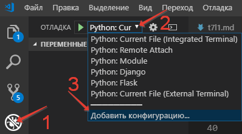
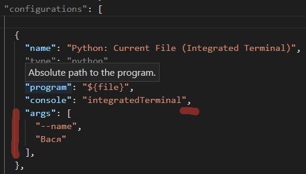

[содержание](/readme.md)  

# Тема 7.<br/>Лекция 3

## Параметры командной строки
Мы забыли про один важный момент, передачу параметров консольной программе через командную строку.

До этого мы параметры получали в интерактивном режиме командой input, но реально этот способ получения параметров используется редко, только в образовательных целях. Чаще всего параметры берутся из файла настроек (ini) или из командной строки.

Первый способ (ini-файлы) подходит если параметры задаются один раз при настройке программы и не изменяются при последующей работе. 

Второй способ - передача параметров при вызове программы через командную строку - используется, когда параметры вызова заранее не известны и применяются в скриптах или при запуске программы через командную строку.

Путь для начала у нас есть простейший скрипт на Python. Для определенности назовем скрипт coolprogram.py, это будет классический Hello World, над которым мы будем работать в дальнейшем.

```py
if __name__ == "__main__":
    print ("Привет, мир!")
```

Мы завершили эту сложнейшую программу и отдали ее заказчику, он доволен, но просит добавить в нее возможность указывать имя того, кого приветствуем, причем этот параметр может быть не обязательным. Т.е. программа может использоваться двумя путями:

``python coolprogram.py``

или

``python coolprogram.py Вася``

Первое, что приходит на ум при решении такой задачи, просто воспользоваться переменной argv из модуля sys. Эта переменная содержит список параметров, переданных программе через командную строку, причем нулевой элемент списка - это имя нашего скрипта. Т.е. если у нас есть следующий скрипт с именем params.py:

```py
import sys

if __name__ == "__main__":
    for param in sys.argv:
        print (param)
```

и мы запускаем его с помощью команды

``python params.py``

то в консоль будет выведена единственная строка:

```
params.py
```

Если же мы добавим несколько параметров,

```
python params.py param1 param2 param3
```

то эти параметры мы увидим в списке sys.argv, начиная с первого элемента:

```
params.py
param1
param2
param3
```

Здесь можно обратить внимание на то, что ссылка на интерпретатор Python в список этих параметров не входит, хотя он также присутствует в строке вызова нашего скрипта.

>Так как мы пишем и отлаживаем наш код на VSC, то сразу расскажу как добавить параметры командной строки в отладчик:
>1. Перейдите в режим отладки 
>2. Откройте выпадающий список конфигураций отладчика
>3. Выберите пункт "добавить конфигурацию"
>
>
>
>а затем, в блок настроек "Python: Current File (Integrated Terminal)" (Текущий файл (интегрированный терминал)), добавьте массив **args**, не забыв поставить перед ним запятую. Обратите внимание: каждый параметр нужно записывать отдельным элементом массива.
>
>


Вернемся к нашей задаче. Погрузившись в код на неделю, мы могли бы выдать заказчику следующий скрипт:

```py
import sys

if __name__ == "__main__":
    if len (sys.argv) > 1:
        print ("Привет, {}!".format (sys.argv[1] ) )
    else:
        print ("Привет, мир!")
```
Теперь, если программа вызывается с помощью команды

``python coolprogram.py``

то результат будет прежний

``Привет, мир!``

а если мы добавим параметр:

``python coolprogram.py Вася``

то программа поприветствует некоего Васю:

``Привет, Вася!``

Пока все легко и никаких проблем не возникает. Теперь предположим, что требования заказчика вновь изменились, и на этот раз он хочет, чтобы имя приветствуемого человека передавалось после именованного параметра --name или -n, причем нужно следить, что в командной строке передано только одно имя. С этого момента у нас начнется вермишель из конструкций if.

```py
import sys

if __name__ == "__main__":
    if len (sys.argv) == 1:
        print ("Привет, мир!")
    else:
        if len (sys.argv) < 3:
            print ("Ошибка. Слишком мало параметров.")
            sys.exit (1)

        if len (sys.argv) > 3:
            print ("Ошибка. Слишком много параметров.")
            sys.exit (1)

        param_name = sys.argv[1]
        param_value = sys.argv[2]

        if (param_name == "--name" or
                param_name == "-n"):
            print ("Привет, {}!".format (param_value) )
        else:
            print ("Ошибка. Неизвестный параметр '{}'".format (param_name) )
            sys.exit (1)
```

Здесь мы проверяем ситуацию, что мы вообще не передали ни одного параметра, потом проверяем, что дополнительных параметров у нас ровно два, что они называются именно --name или -n, и, если нас все устраивает, выводим приветствие.

Как видите, код превратился в тихий ужас. Изменить логику работы в нем в дальнейшем будет очень сложно, а при увеличении количества параметров нужно будет срочно применять объектно-ориентированные меры по отделению логики работы программы от разбора командной строки. Разбор командной строки мы могли бы выделить в отдельный класс (или классы), но мы этого здесь делать не будем, поскольку все уже сделано в стандартной библиотеке Python, которая называется **argparse**.

### Использование библиотеки **argparse**
Как как было сказано выше, стандартная библиотека **argparse** предназначена для облегчения разбора командной строки. На нее можно возложить проверку переданных параметров: их количество и обозначения, а уже после того, как эта проверка будет выполнена автоматически, использовать полученные параметры в логике своей программы.

Основа работы с командной строкой в библиотеке **argparse** является класс **ArgumentParser**. У его конструктора и методов довольно много параметров, все их рассматривать не будем, поэтому в дальнейшем рассмотрим работу этого класса на примерах, попутно обсуждая различные параметры.

Простейший принцип работы с **argparse** следующий:

* Создаем экземпляр класса ArgumentParser.
* Добавляем в него информацию об ожидаемых параметрах с помощью метода add_argument (по одному вызову на каждый параметр).
* Разбираем командную строку помощью метода parse_args, передавая ему полученные параметры командной строки (кроме нулевого элемента списка sys.argv).
* Начинаем использовать полученные параметры.

Для начала перепишем программу coolprogram.py с единственным параметром так, чтобы она использовала библиотеку argparse. Напомню, что данном случае мы ожидаем следующий синтаксис параметров:

``python coolprogram.py [Имя]``

Здесь [Имя] является необязательным параметром.

Наша программа с использованием **argparse** может выглядеть следующим образом:

```py
import sys
import argparse
 
def createParser ():
    parser = argparse.ArgumentParser()
    parser.add_argument ('name', nargs='?')
    return parser
 
if __name__ == '__main__':
    parser = createParser()
    namespace = parser.parse_args()

    # print (namespace)
       
    if namespace.name:
        print ("Привет, {}!".format (namespace.name) )
    else:
        print ("Привет, мир!")
```

На первый взгляд эта программа работает точно так же, как и раньше, хотя есть отличия, но мы их рассмотрим чуть позже. Пока разберемся с тем, что мы понаписали в программе.

Создание парсера вынесено в отдельную функцию, поскольку эта часть программы в будущем будет сильно изменяться и разрастаться. Сначала мы создали экземпляр класса ArgumentParser с параметрами по умолчанию. Что это за параметры, опять же, поговорим чуть позже.

Далее мы добавили ожидаемый параметр в командной строке с помощью метода add_argument. При этом такой параметр будет считаться позиционным, т.е. он должен стоять именно на этом месте и у него не будет никаких предварительных обозначений (мы их добавим позже в виде '-n' или '--name'). Если бы мы не добавили именованный параметр nargs='?', то этот параметр был бы обязательным. nargs может принимать различные значения. Если бы мы ему присвоили целочисленное значение больше 0, то это бы означало, что мы ожидаем ровно такое же количество передаваемых параметров (точнее, считалось бы, что первый параметр ожидал бы список из N элементов, разделенных пробелами, этот случай мы рассмотрим позже). Также этот параметр может принимать значение '?', '+', '*' и argparse.REMAINDER. Мы их не будем рассматривать, поскольку они важны в сочетании с необязательными именованными параметрами, которые могут располагаться как до, так и после нашего позиционного параметра. Тогда этот параметр будет показывать как интерпретировать список параметров, где будет заканчиваться один список параметров и начинаться другой.

Итак, мы создали парсер, после чего можно вызвать его метод parse_args для разбора командной строки. Если мы не укажем никакого параметра, это будет означать равносильно тому, что мы передадим в него все параметры из sys.argv кроме нулевого, который содержит имя нашей программы. т.е.

``parser.parse_args (sys.argv[1:])``

В качестве результата мы получим экземпляр класса Namespace, который будет содержать в качестве члена имя нашего параметра. Теперь можно раскомментировать строку 
``# print (namespace)`` 
в приведенном выше примере, чтобы посмотреть, чему же равны наши параметры.

Если мы это сделаем и запустим программу с переданным параметром

``python coolprogram.py Вася``

, то увидим его в пространстве имен.

``Namespace(name='Вася')``

Если же теперь мы запустим программу без дополнительных параметров, то это значение будет равно None:

``Namespace(name=None)``

Мы можем изменить значение по умолчанию, что позволит нам несколько сократить программу. Пусть по умолчанию используется слово 'мир', ведь мы его приветствуем, если параметры не переданы. Для этого воспользуемся дополнительным именованным параметром default в методе add_argument.

```py
import sys
import argparse
  
def createParser ():
    parser = argparse.ArgumentParser()
    parser.add_argument ('name', nargs='?', default='мир')
    return parser
 
if __name__ == '__main__':
    parser = createParser()
    namespace = parser.parse_args (sys.argv[1:])
    print ("Привет, {}!".format (namespace.name) )
```

Программа продолжает работать точно также, как и раньше. Вы, наверное, заметили, что в предыдущем примере в метод parse_args передаются параметры командной строки из sys.argv. Это сделано для того, чтобы показать, что список параметров мы можем передавать явно, при необходимости мы его можем предварительно обработать, хотя это вряд ли понадобится, ведь почти всю обработку можно возложить на плечи библиотеки **argparse**.

### Добавляем именованные параметры
Теперь снова переделаем нашу программу таким образом, чтобы использовать именованные параметры. Напомню, что согласно последнему желанию заказчика имя приветствуемого человека должно передаваться после параметра --name или -n. С помощью argparse сделать это проще простого - достаточно в качестве первых двух параметров метода add_argument передать эти имена параметров.

```py
import sys
import argparse
 
def createParser ():
    parser = argparse.ArgumentParser()
    parser.add_argument ('-n', '--name', default='мир')
    return parser
 
if __name__ == '__main__':
    parser = createParser()
    namespace = parser.parse_args()
    print ("Привет, {}!".format (namespace.name) )
```

Теперь, если мы запустим программу без параметров, то увидим знакомое "Привет, мир!", а если мы запустим программу с помощью команды

``python coolprogram.py -n Вася``

или

``python coolprogram.py --name Вася``

То приветствовать программа будет Васю. Обратите внимание, что теперь в методе add_argument мы убрали параметр nargs='?' , поскольку все именованные параметры считаются необязательными. А если они не обязательные, то возникает вопрос, как поведет себя argparse, если этот параметр не передан? Для этого уберем параметр default в add_argument.

```py
import sys
import argparse
 
def createParser ():
    parser = argparse.ArgumentParser()
    parser.add_argument ('-n', '--name')
    return parser
 
if __name__ == '__main__':
    parser = createParser()
    namespace = parser.parse_args()
    print ("Привет, {}!".format (namespace.name) )
```    

Если теперь запустить программу без параметров, то увидим приветствие великого None:

``Привет, None!``

Таким образом, если значение по умолчанию не указано, то оно считается равным None.

>Раньше мы на это не обращали внимание, но нужно все-таки сказать, что argparse по умолчанию заточен для создания интерфейса командной строки именно в стиле UNIX, где именованные параметры начинаются с символов "-" или "--". Если такой параметр попытаться называть в стиле Windows (например, "/name"), то будет брошено исключение:
>
>``ValueError: invalid option string '/name': must start with a character '-'``
>
>На самом деле буквально с помощью одного параметра мы можем заставить работать argparse в стиле Windows, достаточно в параметры конструктора добавить **prefix_chars**: 
>
>``parser = argparse.ArgumentParser(prefix_chars='/')``


До этого мы задавали два имени для одного и того же параметра: длинное имя, начинающееся с "--" (--name) и короткое сокращение, начинающееся с "-" (-n). При этом получение значение параметра из пространства имен осуществляется по длинному имени:

``print ("Привет, {}!".format (namespace.name) )``

Если мы не зададим длинное имя, то придется обращаться к параметру через его короткое имя (n):

```py
import sys
import argparse
 
def createParser ():
    parser = argparse.ArgumentParser()
    parser.add_argument ('-n')
    return parser
 
if __name__ == '__main__':
    parser = createParser()
    namespace = parser.parse_args()
    print (namespace)
    print ("Привет, {}!".format (namespace.n) )
```

При этом пространство имен будет выглядеть как:

``Namespace(n='Вася')``

Хорошо, с уменьшением количества имен параметров разобрались, но мы можем еще и увеличить количество имен, например, мы можем добавить для того же параметра еще новое имя --username, для этого достаточно его добавить следующим параметром метода add_argument:

```py
import sys
import argparse
 
def createParser ():
    parser = argparse.ArgumentParser()
    parser.add_argument ('-n', '--name', '--username')
    return parser
 
if __name__ == '__main__':
    parser = createParser()
    namespace = parser.parse_args()
    print (namespace)
    print ("Привет, {}!".format (namespace.name) )
```

Теперь мы можем использовать три варианта передачи параметров:

``python coolprogram.py -n Вася``<br/>
``python coolprogram.py --name Вася``<br/>
``python coolprogram.py --username Вася``<br/>

Все три варианта равнозначны, при этом надо обратить внимание, что при получении значения этого параметра используется первое длинное имя, т.е. name. Пространство имен при использовании всех трех вариантов вызова программы будет выглядеть одинаково:

``Namespace(name='Вася')``

### Параметры как списки
До сих пор мы ожидали, что в качестве значения параметра выступает строка, но бывают ситуации, когда необходимо, чтобы в качестве значения параметра принимался список строк. Например, пусть нам теперь нужно изменить программу так, чтобы мы могли приветствовать нескольких человек. Первое, что приходит на ум - это вручную разобрать строку после имени параметра, т.е.

```py
import sys
import argparse
 
def createParser ():
    parser = argparse.ArgumentParser()
    parser.add_argument ('-n', '--name', default='мир')
    return parser
 
if __name__ == '__main__':
    parser = createParser()
    namespace = parser.parse_args()
 
    print (namespace)
 
    for name in namespace.name.split():
        print ("Привет, {}!".format (name) )
```

Но это не самое лучшее решение, поскольку если пользователь захочет передать несколько параметров после --name, то ему придется оборачивать список имен в кавычки:

``python coolprogram.py --name "Вася Оля Петя"``

Поскольку, если написать просто

``python coolprogram.py --name Вася Оля Петя``

, то argparse решит, что "Оля Петя" - это отдельные параметры, имя для которых не задано, и напишет ошибку:

``error: unrecognized arguments: Оля Петя``

Чтобы указать библиотеке argparse, что значений параметров у нас может быть несколько, вспомним уже используемый нами параметр nargs. Но если в прошлый раз в качестве его значения мы использовали значение "?", обозначающее, что у нас может быть 0 или 1 значение, то теперь мы будем использовать значение nargs='+', обозначающее, что мы ожидаем одно или более значение (по аналогии с регулярными выражениями).

```py
import sys
import argparse
 
def createParser ():
    parser = argparse.ArgumentParser()
    parser.add_argument ('-n', '--name', nargs='+', default=['мир'])
    return parser
 
 
if __name__ == '__main__':
    parser = createParser()
    namespace = parser.parse_args()
    print (namespace)
    for name in namespace.name:
        print ("Привет, {}!".format (name) )
```

Обратите внимание, что здесь в качестве значения по умолчанию используется список из одного слова.

Теперь, если мы выполним эту программу с помощью команды

``python coolprogram.py --name Вася Оля Петя``

То программа нам выведет:

```
Namespace(name=['Вася', 'Оля', 'Петя'])
Привет, Вася!
Привет, Оля!
Привет, Петя!
```

Таким образом, мы возложили задачу разделения параметров на плечи argparse. Напомню, что nargs может принимать и другие значения, в том числе целое число N, обозначающее, что мы ожидаем ровно N значений.

### Выбор из вариантов
Представим себе еще один случай. Пусть у нас есть консольная программа, наподобие ImageMagick, то есть работающая с графикой. Наверняка эта программа будет поддерживать ограниченное количество форматов графических файлов. В этом случае может понадобиться ограничить значения некоторого параметра заранее заданным списком значений (например, gif, png, jpg). Разумеется, такую несложную проверку мы могли бы сделать и сами, но лучше пусть этим займется argparse. Для этого достаточно в метод add_argument передать еще один параметр - choices, который принимает список возможных значений параметра.

Чтобы не удаляться от наших предыдущих примеров, изменим последнюю программу таким образом, чтобы она могла приветствовать только лишь заранее очерченных круг лиц (неких Васю, Олю или Петю). Сделать это абсолютно несложно:

```py
import sys
import argparse
 
def createParser ():
    parser = argparse.ArgumentParser()
    parser.add_argument ('-n', '--name', choices=['Вася', 'Оля', 'Петя'], default='Оля')
    return parser
 
if __name__ == '__main__':
    parser = createParser()
    namespace = parser.parse_args()
    print (namespace)
    print ("Привет, {}!".format (namespace.name) )
```

Теперь, если мы передадим в качестве параметра одно из перечисленных имен, то программа будет работать, как и прежде, однако незнакомых людей она откажется приветствовать:

``python coolprogram.py --name Вася``

```
Namespace(name='Вася')
Привет, Вася!
```

``python coolprogram.py --name Иван``

```
usage: coolprogram.py [-h] [-n {Вася,Оля,Петя}]
coolprogram.py: error: argument -n/--name: invalid choice: 'Иван' (choose from 'Вася', 'Оля', 'Петя')
```

### Указание типов параметров
До сих пор мы в качестве входных параметров использовали строки, что логично, поскольку на самом нижнем уровне все входные параметры считаются строками. Однако часто на практике в качестве параметров хотелось бы использовать другие типы: целые числа или числа с плавающей точкой. Конечно, не проблема вручную преобразовать строку в нужный тип или написать ошибку в случае, если этого сделать невозможно. Однако, даже такую мелочь можно переложить на argparse. Для этого достаточно добавить еще один именованный параметр в метод add_argument, а именно параметр type, который будет указывать ожидаемый тип значения параметра. Изменим пример таким образом, чтобы в качестве входного параметра с именем -c или --count принималось целое число, которое обозначает, сколько раз нужно вывести строку "Привет, мир!" (временно забудем про параметры -n и --name).

```py
import sys
import argparse
 
def createParser ():
    parser = argparse.ArgumentParser()
    parser.add_argument ('-c', '--count', default=1, type=int)
    return parser
 
if __name__ == '__main__':
    parser = createParser()
    namespace = parser.parse_args()
    print (namespace)
    for _ in range (namespace.count):
        print ("Привет, мир!")
```

Нас здесь больше всего интересует строка, где мы указали ожидаемый тип параметра. Обратите внимание, что в качестве значения параметра type мы передали не строку, а тип ожидаемых данных. В остальном там нет никаких особенностей.

В следующем блоке показан пример работы этой программы:

```
python coolprogram.py --count 5

Namespace(count=5)
Привет, мир!
Привет, мир!
Привет, мир!
Привет, мир!
Привет, мир!
```

Здесь мы видим, что в пространстве имен параметр count сразу записан как целое число (без кавычек). Если же мы попытаемся передать в качестве параметра какую-то строку, которую преобразовать в целое число невозможно, то мы получим ошибку:

```
python coolprogram.py --count Абырвалг

usage: coolprogram.py [-h] [-c COUNT]
coolprogram.py: error: argument -c/--count: invalid int value: 'Абырвалг'
```

### Имена файлов как параметры
Но это не все возможности параметра type. Во многих программах в качестве входных параметров используются имена файлов, которые нужно прочитать. При этом имена файлов передают обычно не просто так, эти файлы или читают, или в них что-то пишут, а, как известно, открытие файла - это лотерея, может быть он откроется, а может и нет, здесь всегда надо ловить исключения. А раз это такая частая операция, то argparse позволяет и это автоматизировать.

Для примера напишем программу, которая просто выводит содержимое текстового файла, имя которого задается после именованного параметра -n или --name Для работы программы понадобится дополнительный файл "text.txt" для простоты в кодировке UTF-8.

Для того, чтобы указать argparse, что в качестве входного параметра мы ожидаем файл, который должен быть открыт для чтения, в метод add_argument нужно передать параметр type, равный open (опять же, это стандартная функция для открытия файла, а не строка). Использование этого параметра показано ниже:

```py
import sys
import argparse
 
def createParser ():
    parser = argparse.ArgumentParser()
    parser.add_argument ('-n', '--name', type=open)
    return parser
 
if __name__ == '__main__':
    parser = createParser()
    namespace = parser.parse_args()
    print (namespace)
    text = namespace.name.read()
    print (text)
```

Если вы запустите этот пример, то кроме содержимого файла, переданного в качестве параметра --name, увидите, что пространство имен namespace будет содержать уже открытый файл:

```
python coolprogram.py --name text.txt

Namespace(name=<_io.TextIOWrapper name='text.txt' mode='r' encoding='UTF-8'>)
Содержимое текстового файла
```

Если же мы укажем имя несуществующего файла, то получим исключение:

```
python coolprogram.py --name invalid.txt
 
Traceback (most recent call last):
  File "coolprogram.py", line 16, in <module>
    namespace = parser.parse_args(sys.argv[1:])
  File "/usr/lib/python3.3/argparse.py", line 1714, in parse_args
    args, argv = self.parse_known_args(args, namespace)
  File "/usr/lib/python3.3/argparse.py", line 1746, in parse_known_args
    namespace, args = self._parse_known_args(args, namespace)
  File "/usr/lib/python3.3/argparse.py", line 1952, in _parse_known_args
    start_index = consume_optional(start_index)
  File "/usr/lib/python3.3/argparse.py", line 1892, in consume_optional
    take_action(action, args, option_string)
  File "/usr/lib/python3.3/argparse.py", line 1804, in take_action
    argument_values = self._get_values(action, argument_strings)
  File "/usr/lib/python3.3/argparse.py", line 2247, in _get_values
    value = self._get_value(action, arg_string)
  File "/usr/lib/python3.3/argparse.py", line 2276, in _get_value
    result = type_func(arg_string)
FileNotFoundError: [Errno 2] No such file or directory: 'invalid.txt'
```

Как видно из строк 4-5, исключение будет брошено при попытке разобрать параметры с помощью метода parse_args. Сначала кажется странным, что argparse не обрабатывает такую простую ситуацию, бросая такое некрасивое исключение. Казалось бы, почему бы библиотеке самой его не обработать и не вывести ошибку, как это было сделано при использовании параметра type=int?

Несмотря на то, что использование параметра type=open описано в документации, на мой взгляд его лучше не использовать в таком виде, поскольку argparse предлагает более красивое решение этой проблемы. Достаточно в качестве параметра type передать не функцию open, а экземпляр класса, полученного с помощью функции argparse.FileType, предназначенной для безопасной попытки открытия файла.

Функция argparse.FileType выглядит следующим образом и напоминает упрощенную версию функции open:

``argparse.FileType(mode='r', bufsize=-1, encoding=None, errors=None)``

Здесь первый параметр задает режим открытия файла ('r' - чтение, 'w' - запись и т.д. по аналогии с функцией open), второй задает размер буфера, если нужно использовать буферизированое чтение, третий параметр задает кодировку открываемого файла, а последний - действие в случае ошибки декодирования файла. Эта функция создает экземпляр класса, предназначенного для работы с файлами.

Таким образом, мы можем исправить предыдущий пример:

```py
import sys
import argparse
 
def createParser ():
    parser = argparse.ArgumentParser()
    parser.add_argument ('-n', '--name', type=argparse.FileType())
    return parser
 
if __name__ == '__main__':
    parser = createParser()
    namespace = parser.parse_args()
    print (namespace)
    text = namespace.name.read()
    print (text)
```

Теперь, если пользователь попытается передать имя несуществующего файла, то он увидит не большой страшный листинг исключения, а внятную ошибку:

```
python coolprogram.py --name invalid.txt

usage: coolprogram.py [-h] [-n NAME]
coolprogram.py: error: argument -n/--name: can't open 'invalid.txt': [Errno 2] No such file or directory: 'invalid.txt'
```

Аналогично мы можем принимать имя файла для записи, при этом только надо не забыть передать в фукнцию argparse.FileType в качестве первого параметра строку 'w'.

### Обязательные именованные параметры
До сих пор мы говорили, что позиционные параметры у нас обязательные. Напомню, что позиционными считаются те параметры, имена которых не начинаются с символов "-" или "--". Почему они называются позиционными, поговорим чуть позже, когда перейдем к разделу про разбор нескольких параметров.

Т.е. следующая программа у нас должна обязательно получить один параметр:

```py
import sys
import argparse
 
def createParser ():
    parser = argparse.ArgumentParser()
    parser.add_argument ('name')
    return parser
 
if __name__ == '__main__':
    parser = createParser()
    namespace = parser.parse_args()
    print (namespace)
    print ("Привет, {}!".format (namespace.name) )
```

А поскольку параметр у нас не именованный (не начинается с символов "-" или "--"), то мы не должны в командной строке указывать имя параметра. Если же мы не укажем обязательный позиционный параметр, то argparse нам выведет понятную ошибку, а не будет бросать исключения. В следующем блоке показаны два случая использования этого скрипта: с переданным параметром и без него.

```
python coolprogram.py Вася

Namespace(name='Вася')
Привет, Вася!
```

```
python coolprogram.py

usage: coolprogram.py [-h] name
coolprogram.py: error: the following arguments are required: name
```

Теперь вернемся к примеру, где мы этот параметр сделали именованным:

```py
import sys
import argparse
 
def createParser ():
    parser = argparse.ArgumentParser()
    parser.add_argument ('-n', '--name')
    return parser
 
if __name__ == '__main__':
    parser = createParser()
    namespace = parser.parse_args()
    print (namespace)
    print ("Привет, {}!".format (namespace.name) )
```

Именованные параметры по умолчанию считаются необязательными, если мы его не укажем, то получим в качестве результата работы:

```
Namespace(name=None)
Привет, None!
```

Если же нас такое поведение не устраивает, мы можем указать, что этот параметр является обязательным, для этого достаточно в метод add_argument добавить параметр required=True

```py
import sys
import argparse
 
def createParser ():
    parser = argparse.ArgumentParser()
    parser.add_argument ('-n', '--name', required=True)
    return parser
 
if __name__ == '__main__':
    parser = createParser()
    namespace = parser.parse_args()
    print (namespace)
    print ("Привет, {}!".format (namespace.name) )
```

Теперь при попытке запустить программу без параметров пользователь увидит ошибку:

```
python coolprogram.py

usage: coolprogram.py [-h] -n NAME
coolprogram.py: error: the following arguments are required: -n/--name
```

### Параметры как флаги
Иногда может возникнуть желание добавить параметры, которые должны работать как флаги, т.е. они или были указаны, или нет. Например, пусть у нас есть простейшая программа "Hello World", но если мы ей укажем параметр "--goodbye" или "-g", то программа не только поздоровается, но и попрощается с миром. :)

```
python coolprogram.py

Привет, мир!
```

```
python coolprogram.py --goodbye

Привет, мир!
Прощай, мир!
```

Для того, чтобы смоделировать такое поведение нам понадобится еще один параметр метода add_argument, который мы до этого не использовали. Этот аргумент называется action, который предназначен для выполнения некоторых действий над значениями переданного параметра. Мы не будем подробно рассматривать все возможные действия, поскольку многие из них довольно специфические и требуют подробного рассмотрения, и в двух словах их не объяснишь, поэтому рассмотрим только один из вариантов использования этого параметра.

С формальной точки зрения, если мы явно не указываем значения параметра action, то он равен строке "store", это означает, что парсер должен просто хранить полученные значения переменных, это происходило во всех приведенных выше примерах.

Для начала мы воспользуемся другим значением параметра action, а именно строкой "store_const", которая обозначает, что если данный параметр указан, то он всегда будет принимать значение, указанное в другом параметре метода add_argument - const. Если этот параметр указан не будет, то его значение будет равно None.

Напишем наш новый Hello/goodbye World:

```py
import sys
import argparse
 
def createParser ():
    parser = argparse.ArgumentParser()
    parser.add_argument ('-g', '--goodbye', action='store_const', const=True)
    return parser
 
if __name__ == '__main__':
    parser = createParser()
    namespace = parser.parse_args()
    print (namespace)
    print ("Привет, мир!")
    if namespace.goodbye:
        print ("Прощай, мир!")
```

Теперь посмотрим, как он работает, и проследим за значением параметра goodbye:

```
python coolprogram.py

Namespace(goodbye=None)
Привет, мир!
```

```
python coolprogram.py --goodbye

Namespace(goodbye=True)
Привет, мир!
Прощай, мир!
```

Если нас смущает, что без указания параметра --goodbye его значение равно None, а не False, то мы можем воспользоваться уже знакомым нам параметром default:

```py
import sys
import argparse
 
def createParser ():
    parser = argparse.ArgumentParser()
    parser.add_argument ('-g', '--goodbye', action='store_const', const=True, default=False)
    return parser
 
if __name__ == '__main__':
    parser = createParser()
    namespace = parser.parse_args()
    print (namespace)
    print ("Привет, мир!")
    if namespace.goodbye:
        print ("Прощай, мир!")
```

Теперь, если этот параметр не указан, то он будет равен False, в остальном поведение не изменилось:

```
python coolprogram.py

Namespace(goodbye=False)
Привет, мир!
```

```
python coolprogram.py --goodbye

Namespace(goodbye=True)
Привет, мир!
Прощай, мир!
```

Может возникнуть вопрос, почему бы просто не использовать параметр default, зачем нужен еще action? Но одним default мы не обойдемся, поскольку action со значением store (значение по умолчанию для него) подразумевает, что если параметр (в данном случае --goodbye) указан, то после него должно идти какое-то значение, а параметр default позволит указать значение этого параметра только при отсутствии --goodbye.

Поскольку используемый выше прием для создания флагов довольно часто используется, предусмотрено значение параметра action, позволяющее не указывать значение const для булевых значений: store_true и store_false. При использовании этих значений указанный параметр командной строки будет принимать соответственно True или False, если он указан. В данном случае мы можем воспользоваться значением action="store_true":

```py
import sys
import argparse
 
def createParser ():
    parser = argparse.ArgumentParser()
    parser.add_argument ('-g', '--goodbye', action='store_true', default=False)
    return parser
 
if __name__ == '__main__':
    parser = createParser()
    namespace = parser.parse_args()
    print (namespace)
    print ("Привет, мир!")
    if namespace.goodbye:
        print ("Прощай, мир!")
```

Результат работы скрипта не изменится.

### Использование нескольких параметров
До сих пор во всех примерах мы задавали лишь один параметр, обязательный или необязательный, поскольку нас интересовало в первую очередь то, какие свойства могут быть у параметров. В этом разделе мы рассмотрим случаи, когда программа ожидает несколько параметров, что чаще всего и бывает.

Для добавления второго, третьего и т.д. параметра необходимо повторно вызвать метод add_argument класса ArgumentParser, описав с помощью переданных значений свойства ожидаемого параметра.

Например, следующий скрипт ожидает два позиционных параметра - имя приветствуемого человека и число, обозначающее, сколько раз его нужно поприветствовать. В данном случае оба позиционных параметра будут являться обязательными. Причем, первый параметр всегда задает имя, а второй - количество, в данном примере поменять местами мы их не можем, отсюда и название таких параметров - "позиционные".

```py
import sys
import argparse
 
def createParser ():
    parser = argparse.ArgumentParser()
    parser.add_argument ('name')
    parser.add_argument ('count', type=int)
    return parser
 
if __name__ == '__main__':
    parser = createParser()
    namespace = parser.parse_args()
    print (namespace)
    for _ in range (namespace.count):
        print ("Привет, {}!".format (namespace.name) )
```

Различные способы запуска такой программы показано ниже. В пером случае все задано корректно, а в остальных случаях есть ошибки: сначала аргументы перепутаны местами, вследствие чего второй параметр не удалось преобразовать в целое число, затем забыли передать один из параметров:

```
python coolprogram.py Петя 3

Namespace(count=3, name='Петя')
Привет, Петя!
Привет, Петя!
Привет, Петя!
```

```
python coolprogram.py 3 Петя

usage: coolprogram.py [-h] name count
coolprogram.py: error: argument count: invalid int value: 'Петя'
```

```
python coolprogram.py Петя

usage: coolprogram.py [-h] name count
coolprogram.py: error: the following arguments are required: count
```

Лично я недолюбливаю позиционные параметры как раз из-за того, что надо запоминать, в каком порядке они идут. Давайте сделаем их оба именованными, в этом случае порядок их передачи будет не важен, правда, при этом придется больше вводить символов, поскольку нужно будет вводить имена параметров.

```py
import sys
import argparse
 
def createParser ():
    parser = argparse.ArgumentParser()
    parser.add_argument ('-n', '--name')
    parser.add_argument ('-c', '--count', type=int, default=1)
    return parser
 
if __name__ == '__main__':
    parser = createParser()
    namespace = parser.parse_args()
    print (namespace)
    for _ in range (namespace.count):
        print ("Привет, {}!".format (namespace.name) )
```

Теперь параметры можно менять местами, ведь имена параметров все-равно заданы.

```
python coolprogram.py --name Петя --count 3

Namespace(count=3, name='Петя')
Привет, Петя!
Привет, Петя!
Привет, Петя!
```

```
python coolprogram.py --count 3 --name Петя

Namespace(count=3, name='Петя')
Привет, Петя!
Привет, Петя!
Привет, Петя!
```

А как быть, если у нас имеются и позиционные, и необязательные именованные параметры?

```py
import sys
import argparse
 
def createParser ():
    parser = argparse.ArgumentParser()
    parser.add_argument ('name')
    parser.add_argument ('-c', '--count', type=int, default=1)
    return parser
 
if __name__ == '__main__':
    parser = createParser()
    namespace = parser.parse_args()
    print (namespace)
    for _ in range (namespace.count):
        print ("Привет, {}!".format (namespace.name) )
```

В каком порядке мы должны передавать параметры? Сначала позиционные параметры, а потом именованные или наоборот? На самом деле это не важно, оба варианта будут работать:

```
python coolprogram.py Петя --count 3

Namespace(count=3, name='Петя')
Привет, Петя!
Привет, Петя!
Привет, Петя!
```

```
python coolprogram.py --count 3 Петя

Namespace(count=3, name='Петя')
Привет, Петя!
Привет, Петя!
Привет, Петя!
```

### Использование подпарсеров
Как вы уже поняли, библиотека argparse - достаточно мощная штука, выполняющая практически полностью разбор параметров командной строки и их проверку. Мы рассмотрели достаточно много примеров ее использования, но нельзя не упомянуть об еще одной возможности, а именно о подпарсерах (subparsers). Понять, что это такое проще на примере других программ.

Наверняка вы постоянно пользуетесь какой-нибудь системой контроля версий вроде svn, git, bzr или чем-то подобным. И хотя для них написано множество графических оболочек, надеюсь, вы хоть раз запускали их из консоли. Какие особенности у этих программ с точки зрения командной строки? А особенность заключается в том, что у них в качестве первого параметра всегда выступает имя команды, за которой следуют параметры, специфические именно для этой команды. Например:

```
git add -A
git commit -a -m "Текст коммита"
```

Причем для каждой такой команды свои параметры, они могут иметь одинаковые имена, но обозначать разные вещи. Вот такое разделение на команды и позволяют сделать подпарсеры.

Изменим нашу программу для вывода "Hello / goodbye world" таким образом, чтобы команда hello говорила программе, что нужно поприветствовать тех людей, список которых передан в параметре --names или -n, а команда goodbye указывала программе, что нужно попрощаться с миром столько раз, какое число передано с помощью параметра --count или -c. Поскольку у нас для каждой команды используется только один параметр, возможно, стоило бы его сделать позиционным, чтобы не набирать его имя, но именованные параметры более наглядны, особенно для демонстрации.

Чтобы реализовать таое поведение нужно выполнить несколько шагов:

* Создать экземпляр класса ArgumentParser (назовем его корневым парсером).
* Создать хранилище подпарсеров с помощью метода add_subparsers класса ArgumentParser (результатом будет экземпляр внутреннего класса _SubParsersAction).
* Создать вложенный парсер с помощью метода add_parser класса хранилища парсеров. Результатом вызова каждого метода add_parser будет экземпляр класса ArgumentParser, уже знакомый нам.
* Для каждого созданного вложенного парсера заполнить информацию об ожидаемых параметров с помощью все того же метода add_argument.
* Получить пространство имен с помощью метода parse_args класса ArgumentParser (корневого парсера).
* Использовать полученное пространство имен так же, как и раньше с той лишь разницей, что в нем будет храниться имя переданной команды и параметры, специфические для нее.

Вот как выглядит текст программы для описанного чуть выше "Hello / goodbye world":

```py
import sys
import argparse
 
def createParser ():
    parser = argparse.ArgumentParser()
    subparsers = parser.add_subparsers (dest='command')
 
    hello_parser = subparsers.add_parser ('hello')
    hello_parser.add_argument ('--names', '-n', nargs='+', default=['мир'])
 
    goodbye_parser = subparsers.add_parser ('goodbye')
    goodbye_parser.add_argument ('-c', '--count', type=int, default=1)
 
    return parser
 
 
def run_hello (namespace):
    """
   Выполнение команды hello
   """
    for name in namespace.names:
        print ("Привет, {}!".format (name) )
 
def run_goodbye (namespace):
    """
   Выполнение команды goodbye
   """
    for _ in range (namespace.count):
        print ("Прощай, мир!")
 
if __name__ == '__main__':
    parser = createParser()
    namespace = parser.parse_args()
 
    print (namespace)
 
    if namespace.command == "hello":
        run_hello (namespace)
    elif namespace.command == "goodbye":
        run_goodbye (namespace)
    else:
        print ("Что-то пошло не так...")
```

В реальной программе каждую команду неплохо было бы обернуть в отдельный класс, но здесь для простоты мы обойдемся обычной функцией.

Думаю, что код достаточно лаконичный, чтобы по нему не было особых вопросов. Единственное, на что хочется обратить внимание, это то, что при создании хранилища подпарсеров с помощью метода add_subparsers мы использовали именованный параметр dest = 'command', который указывает, что имя переданной команды в пространстве имен будет храниться под именем command. В принципе, этот параметр является необязательным, и если его не указать, то имя переданной команды не попадет в пространство имен, но в этом случае получить имя команды будет затруднительно.

Давайте теперь посмотрим, как работает приведенная выше программа, особенно обратите внимание на содержимое пространства имен:

```
python coolprogram.py hello --names Татьяна Александр Иван

Namespace(command='hello', names=['Татьяна', 'Александр', 'Иван'])
Привет, Татьяна!
Привет, Александр!
Привет, Иван!
```

```
python coolprogram.py goodbye --count 3

Namespace(command='goodbye', count=3)
Прощай, мир!
Прощай, мир!
Прощай, мир!
```

```
python coolprogram.py

Namespace(command=None)
Что-то пошло не так...
```

### Оформление справки
До сих пор мы старались как можно больше работы возложить на argparse и при этом радовались, что эта стандартная библиотека может сама проверять переданные параметры на ошибки, и в случае их возникновения выдавать нам сообщения о них. Но, честно говоря, эти сообщения по умолчанию не особо информативны для конечного пользователя. К тому же он не всегда может помнить о требуемых параметрах. В этом случае правильный пользователь вызывает справку по программе. Так уж исторически сложилось, что в UNIX-подобных операционных системах для вызова справки по программе помимо знаменитой программы man используется специальный параметр командной строки --help или -h, причем эти справки как правило выглядят примерно одинаково по оформлению. Чтобы было понятно, о чем я говорю, вызовем такую справку для программы htop:

```
htop -h

htop 1.0.2 - (C) 2004-2011 Hisham Muhammad
Released under the GNU GPL.

-C --no-color               Use a monochrome color scheme
-d --delay=DELAY            Set the delay between updates, in tenths of seconds
-h --help                   Print this help screen
-s --sort-key=COLUMN        Sort by COLUMN (try --sort-key=help for a list)
-u --user=USERNAME          Show only processes of a given user
-p --pid=PID,[,PID,PID...]  Show only the given PIDs
-v --version          Print version info

Long options may be passed with a single dash.

Press F1 inside htop for online help.
See 'man htop' for more information.
```

В эту справку входит название программы, ее версия, копирайт, возможно, описание того, что она делает, и список ожидаемых параметров командной строки - обязательные и не очень.

Нам, как программистам, будет приятно узнать, что библиотека argparse для любой программы, ее использующей, автоматически создает такую справку, правда, по умолчанию она выглядит не самым впечатляющим образом, но ее можно (нужно) доработать напильником.

Далее мы будем заниматься оформлением нашего последнего скрипта. Даже если мы ничего не будем для этого предпринимать, то справка все-равно будет создана, чтобы ее увидеть запустим скрипт с параметром --help (можно и просто -h):

```
python coolprogram.py --help

usage: coolprogram.py [-h] {hello,goodbye} ...

positional arguments:
  {hello,goodbye}

optional arguments:
  -h, --help       show this help message and exit
```

Мы также можем получить справку о каждой команде (подпарсере):

```
python coolprogram.py hello --help

usage: coolprogram.py hello [-h] [--names NAMES [NAMES ...]]

optional arguments:
  -h, --help            show this help message and exit
  --names NAMES [NAMES ...], -n NAMES [NAMES ...]
```

```
python coolprogram.py goodbye --help

usage: coolprogram.py goodbye [-h] [-c COUNT]

optional arguments:
  -h, --help            show this help message and exit
  -c COUNT, --count COUNT
```  

Для того, чтобы повлиять на внешний вид выводимой справки, используются дополнительные параметры конструкторе ArgumentParser, а также в методах add_argument, add_subparsers и add_parser.

Прежде чем браться за код, сведем в один список основные параметры, влияющие на внешний вид справки.

* Чтобы изменить выводимое имя программы, используется параметр prog конструктора класса ArgumentParser. Если этот параметр не указан, в качестве имени программы берется значение sys.argv[0].
* Чтобы добавить краткое описание программы, используется параметр description конструктора класса ArgumentParser.
* Чтобы добавить пояснения после списка всех возможных параметров, используется параметр epilog конструктора класса ArgumentParser.
* Чтобы добавить описание параметра, используется параметр help метода add_argument.
* Чтобы изменить имя аргумента параметра (не имя самого параметра!), используется параметр metavar метода add_argument.
* Чтобы добавить описание к группе подпарсеров (мы до сих пор использовали только одну группу подпарсеров, создаваемых с помощью метода add_subparsers, но, в принципе, их может быть несколько), используется параметр description метода add_subparsers.
* Чтобы изменить заголовок группы подпарсеров (по умолчанию используется имя "subcommands"), используется параметр title метода add_subparsers.
* Чтобы изменить оформление списка возможных команд подпарсера, используется параметр metavar метода add_subparsers. По умолчанию список команд выводится в фигурных скобках: {command1, command2, ...}

Это еще не полный список того, как можно изменять внешний вид справки, но это основные моменты, которые понадобятся в первую очередь.

Давайте постепенно изменять нашу программу и смотреть на полученный результат. Сначала добавим описание для программы в целом.

Чтобы не отвлекаться на реализацию отдельных команд, далее приведен только код создания парсера, остальная часть программы осталась неизменной.

```py
def createParser ():
    parser = argparse.ArgumentParser(
            prog = 'coolprogram',
            description = '''Это очень полезная программа,
которая позволяет поприветствовать нужных людей,
или попрощаться... со всеми.''',
            epilog = '''(c) Jenyay 2014. Автор программы, как всегда,
не несет никакой ответственности ни за что.'''
            )
    subparsers = parser.add_subparsers (dest='command')
 
    hello_parser = subparsers.add_parser ('hello')
    hello_parser.add_argument ('--names', '-n', nargs='+', default=['мир'])
 
    goodbye_parser = subparsers.add_parser ('goodbye')
    goodbye_parser.add_argument ('-c', '--count', type=int, default=1)
 
    return parser
```

Посмотрим, как теперь выглядит справка по программе:

```
python coolprogram.py -h
usage: coolprogram [-h] {hello,goodbye} ...

Это очень нужная программа, которая позволяет поприветствовать нужных людей,
или попрощаться... со всеми.

positional arguments:
  {hello,goodbye}

optional arguments:
  -h, --help       show this help message and exit

(c) Jenyay 2014. Автор программы, как всегда, не несет никакой ответственности ни за что.
```

Оставим в стороне философский вопрос о том, на каком языке писать справку по программе, для простоты и наглядности мы будем везде использовать русский язык. Еще можно обратить внимание на то, что при выводе описаний были проигнорированы все переносы строк внутри многострочной конструкции '''...''', так что можно смело разбивать описания на несколько строк, а не писать их в одну строку в тысячу сто символов.

Теперь добавим описания команд и их параметров.

```py
def createParser ():
    parser = argparse.ArgumentParser(
            prog = 'coolprogram',
            description = '''Это очень полезная программа,
которая позволяет поприветствовать нужных людей,
или попрощаться... со всеми.''',
            epilog = '''(c) Jenyay 2014. Автор программы, как всегда,
не несет никакой ответственности ни за что.'''
            )
    subparsers = parser.add_subparsers (dest = 'command',
            title = 'Возможные команды',
            description = 'Команды, которые должны быть в качестве первого параметра %(prog)s')
 
    hello_parser = subparsers.add_parser ('hello')
    hello_parser.add_argument ('--names', '-n', nargs='+', default=['мир'],
            help = 'Список приветствуемых людей')
 
    goodbye_parser = subparsers.add_parser ('goodbye')
    goodbye_parser.add_argument ('-c', '--count', type=int, default=1,
            help = 'Сколько раз попрощаться с миром')
 
    return parser
```

Теперь справка по программе и по ее командам выглядит следующим образом:

```
python coolprogram.py -h
usage: coolprogram [-h] {hello,goodbye} ...

Это очень полезная программа, которая позволяет поприветствовать нужных людей, или попрощаться... со всеми.

optional arguments:
  -h, --help       show this help message and exit

Возможные команды:
  Команды, которые должны быть в качестве первого параметра coolprogram

  {hello,goodbye}

(c) Jenyay 2014. Автор программы, как всегда, не несет никакой ответственности ни за что.
```

```
python coolprogram.py hello -h
usage: coolprogram hello [-h] [--names NAMES [NAMES ...]]

optional arguments:
  -h, --help            show this help message and exit
  --names NAMES [NAMES ...], -n NAMES [NAMES ...]
                        Список приветствуемых людей
```

```
python coolprogram.py goodbye -h
usage: coolprogram goodbye [-h] [-c COUNT]

optional arguments:
  -h, --help            show this help message and exit
  -c COUNT, --count COUNT
                        Сколько раз попрощаться с миром
```

В коде выше мы использовали специальный символ подстановки %(prog)s, который заменяется в тексте на имя программы, указанное с помощью параметра prog конструктора ArgumentParser.

Теперь обратим свой взор на имена значений параметров. По умолчанию они совпадают с именем параметра, но написаны заглавными буквами. В данной программе еще можно понять, что под этими названиями подразумевается, но лучше дать им более осмысленные имена. Для этого воспользуемся параметром metavar.

```py
def createParser ():
    parser = argparse.ArgumentParser(
            prog = 'coolprogram',
            description = '''Это очень полезная программа,
которая позволяет поприветствовать нужных людей,
или попрощаться... со всеми.''',
            epilog = '''(c) Jenyay 2014. Автор программы, как всегда,
не несет никакой ответственности ни за что.'''
            )
    subparsers = parser.add_subparsers (dest = 'command',
            title = 'Возможные команды',
            description = 'Команды, которые должны быть в качестве первого параметра %(prog)s')
 
    hello_parser = subparsers.add_parser ('hello')
    hello_parser.add_argument ('--names', '-n', nargs='+', default=['мир'],
            help = 'Список приветствуемых людей',
            metavar = 'ИМЯ')
 
    goodbye_parser = subparsers.add_parser ('goodbye')
    goodbye_parser.add_argument ('-c', '--count', type=int, default=1,
            help = 'Сколько раз попрощаться с миром',
            metavar = 'КОЛИЧЕСТВО')
 
    return parser
```    

Теперь справка стала чуть более симпатичной:

```
python coolprogram.py hello -h

usage: coolprogram hello [-h] [--names ИМЯ [ИМЯ ...]]

optional arguments:
  -h, --help            show this help message and exit
  --names ИМЯ [ИМЯ ...], -n ИМЯ [ИМЯ ...]
                        Список приветствуемых людей
```

```
python coolprogram.py goodbye -h

usage: coolprogram goodbye [-h] [-c КОЛИЧЕСТВО]

optional arguments:
  -h, --help            show this help message and exit
  -c КОЛИЧЕСТВО, --count КОЛИЧЕСТВО
                        Сколько раз попрощаться с миром
```

Однако, что-то справку все-таки портит. Мы практически все русифицировали, остались непереведенными только фразы "usage" и "optional arguments". Займемся сейчас второй фразой.

Ее перевести будет уже чуть сложнее, но не сильно. На самом деле все параметры по умолчанию не только принадлежат какому-то парсеру, но и могут объединяться по группам. Если группы явно не заданы, то параметры попадают в одну из групп: "positional arguments" или "optional arguments". Но мы можем создать и свою группу с помощью метода add_argument_group. Этот метод возвращает экземпляр класса группы (экземпляр внутреннего класса _ArgumentGroup), после чего мы должны, как и прежде, вызывать метод add_argument для добавления параметров, но уже не парсера, а группы. Это показано в следующем примере:

```py
def createParser ():
    parser = argparse.ArgumentParser(
            prog = 'coolprogram',
            description = '''Это очень полезная программа,
которая позволяет поприветствовать нужных людей,
или попрощаться... со всеми.''',
            epilog = '''(c) Jenyay 2014. Автор программы, как всегда,
не несет никакой ответственности ни за что.'''
            )
    subparsers = parser.add_subparsers (dest = 'command',
            title = 'Возможные команды',
            description = 'Команды, которые должны быть в качестве первого параметра %(prog)s')
 
    hello_parser = subparsers.add_parser ('hello')
    hello_group = hello_parser.add_argument_group (title='Параметры')
 
    hello_group.add_argument ('--names', '-n', nargs='+', default=['мир'],
            help = 'Список приветствуемых людей',
            metavar = 'ИМЯ')
 
    goodbye_parser = subparsers.add_parser ('goodbye')
    goodbye_group = goodbye_parser.add_argument_group (title='Параметры')
 
    goodbye_group.add_argument ('-c', '--count', type=int, default=1,
            help = 'Сколько раз попрощаться с миром',
            metavar = 'КОЛИЧЕСТВО')
 
    return parser
```

Теперь справка по параметрам будет выглядеть следующим образом:

```
python coolprogram.py hello -h

usage: coolprogram hello [-h] [--names ИМЯ [ИМЯ ...]]

optional arguments:
  -h, --help            show this help message and exit

Параметры:
  --names ИМЯ [ИМЯ ...], -n ИМЯ [ИМЯ ...]
                        Список приветствуемых людей
```

Уже лучше, однако группа "optional arguments" никуда не делась, поскольку параметр --help / -h был добавлен библиотекой еще до того, как мы создали группу. Выход из этой ситуации простой. Во-первых, надо сказать классу ArgumentParser, что нам его встроенная справка не нужна, для этого в конструктор передадим еще один параметр add_help=False. Также надо не забыть добавить параметр add_help = False в метод add_parser для каждого подпарсера. Затем добавим параметр --help / -h вручную. Самим нам оформлять справку не придется, поскольку при добавлении этого параметра мы передадим в метод add_argument параметр action='help', который указывает, что при получении этого параметра нужно отобразить справку.

Теперь наш код создания парсера выглядит следующим образом:

```py
def createParser ():
    # Создаем класс парсера
    parser = argparse.ArgumentParser(
            prog = 'coolprogram',
            description = '''Это очень полезная программа,
которая позволяет поприветствовать нужных людей,
или попрощаться... со всеми.''',
            epilog = '''(c) Jenyay 2014. Автор программы, как всегда,
не несет никакой ответственности ни за что.''',
            add_help = False
            )
 
    # Создаем группу параметров для родительского парсера,
    # ведь у него тоже должен быть параметр --help / -h
    parent_group = parser.add_argument_group (title='Параметры')
 
    parent_group.add_argument ('--help', '-h', action='help', help='Справка')
 
    # Создаем группу подпарсеров
    subparsers = parser.add_subparsers (dest = 'command',
            title = 'Возможные команды',
            description = 'Команды, которые должны быть в качестве первого параметра %(prog)s')
 
    # Создаем парсер для команды hello
    hello_parser = subparsers.add_parser ('hello',
            add_help = False)
 
    # Создаем новую группу параметров
    hello_group = hello_parser.add_argument_group (title='Параметры')
 
    # Добавляем параметры
    hello_group.add_argument ('--names', '-n', nargs='+', default=['мир'],
            help = 'Список приветствуемых людей',
            metavar = 'ИМЯ')
 
    hello_group.add_argument ('--help', '-h', action='help', help='Справка')
 
    # Создаем парсер для команды goodbye
    goodbye_parser = subparsers.add_parser ('goodbye', add_help = False)
 
    # Создаем новую группу параметров
    goodbye_group = goodbye_parser.add_argument_group (title='Параметры')
 
    # Добавляем параметры
    goodbye_group.add_argument ('-c', '--count', type=int, default=1,
            help = 'Сколько раз попрощаться с миром',
            metavar = 'КОЛИЧЕСТВО')
 
    goodbye_group.add_argument ('--help', '-h', action='help', help='Справка')
 
    return parser
```

Выглядит почти идеально:

```
python coolprogram.py hello -h

usage: coolprogram hello [--names ИМЯ [ИМЯ ...]] [--help]

Параметры:
  --names ИМЯ [ИМЯ ...], -n ИМЯ [ИМЯ ...]
                        Список приветствуемых людей
  --help, -h            Справка
```

```
python coolprogram.py goodbye -h

usage: coolprogram goodbye [-c КОЛИЧЕСТВО] [--help]

Параметры:
  -c КОЛИЧЕСТВО, --count КОЛИЧЕСТВО
                        Сколько раз попрощаться с миром
  --help, -h            Справка
```

Не забыли мы и про справку для корневого парсера:

```
python coolprogram.py -h
usage: coolprogram [--help] {hello,goodbye} ...

Это очень полезная программа, которая позволяет поприветствовать нужных людей, или попрощаться... со всеми.

Параметры:
  --help, -h       Справка

Возможные команды:
  Команды, которые должны быть в качестве первого параметра coolprogram

  {hello,goodbye}

(c) Jenyay 2014. Автор программы, как всегда, не несет никакой ответственности ни за что.
```

Осталось сделать самую малость - добавить описания для команд. Для этого воспользуемся параметрами help и description метода add_parser.

```py
def createParser ():
    # Создаем класс парсера
    parser = argparse.ArgumentParser(
            prog = 'coolprogram',
            description = '''Это очень полезная программа,
которая позволяет поприветствовать нужных людей,
или попрощаться... со всеми.''',
            epilog = '''(c) Jenyay 2014. Автор программы, как всегда,
не несет никакой ответственности ни за что.''',
            add_help = False
            )
 
    # Создаем группу параметров для родительского парсера,
    # ведь у него тоже должен быть параметр --help / -h
    parent_group = parser.add_argument_group (title='Параметры')
 
    parent_group.add_argument ('--help', '-h', action='help', help='Справка')
 
 
    # Создаем группу подпарсеров
    subparsers = parser.add_subparsers (dest = 'command',
            title = 'Возможные команды',
            description = 'Команды, которые должны быть в качестве первого параметра %(prog)s')
 
    # Создаем парсер для команды hello
    hello_parser = subparsers.add_parser ('hello',
            add_help = False,
            help = 'Запуск в режиме "Hello, world!"',
            description = '''Запуск в режиме "Hello, world!".
В этом режиме программа приветствует список людей, переданных в качестве параметра.''')
 
    # Создаем новую группу параметров
    hello_group = hello_parser.add_argument_group (title='Параметры')
 
    # Добавляем параметры
    hello_group.add_argument ('--names', '-n', nargs='+', default=['мир'],
            help = 'Список приветствуемых людей',
            metavar = 'ИМЯ')
 
    hello_group.add_argument ('--help', '-h', action='help', help='Справка')
 
 
    # Создаем парсер для команды goodbye
    goodbye_parser = subparsers.add_parser ('goodbye',
            add_help = False,
            help = 'Запуск в режиме "Goodbye, world!"',
            description = '''В этом режиме программа прощается с миром.''')
 
    # Создаем новую группу параметров
    goodbye_group = goodbye_parser.add_argument_group (title='Параметры')
 
    # Добавляем параметры
    goodbye_group.add_argument ('-c', '--count', type=int, default=1,
            help = 'Сколько раз попрощаться с миром',
            metavar = 'КОЛИЧЕСТВО')
 
    goodbye_group.add_argument ('--help', '-h', action='help', help='Справка')
 
    return parser
```

Теперь справка выглядит полностью законченной:

```
python coolprogram.py -h

usage: coolprogram [--help] {hello,goodbye} ...

Это очень полезная программа, которая позволяет поприветствовать нужных людей, или попрощаться... со всеми.

Параметры:
  --help, -h       Справка

Возможные команды:
  Команды, которые должны быть в качестве первого параметра coolprogram

  {hello,goodbye}
    hello          Запуск в режиме "Hello, world!"
    goodbye        Запуск в режиме "Goodbye, world!"

(c) Jenyay 2014. Автор программы, как всегда, не несет никакой ответственности ни за что.
```

```
python coolprogram.py hello -h

usage: coolprogram hello [--names ИМЯ [ИМЯ ...]] [--help]

Запуск в режиме "Hello, world!". В этом режиме программа приветствует список
людей, переданных в качестве параметра.

Параметры:
  --names ИМЯ [ИМЯ ...], -n ИМЯ [ИМЯ ...]
                        Список приветствуемых людей
  --help, -h            Справка
```

```
python coolprogram.py goodbye -h

usage: coolprogram goodbye [-c КОЛИЧЕСТВО] [--help]

В этом режиме программа прощается с миром.

Параметры:
  -c КОЛИЧЕСТВО, --count КОЛИЧЕСТВО
                        Сколько раз попрощаться с миром
  --help, -h            Справка
```

И чтобы окончательно навести порядок, не мешало бы добавить еще один параметр в родительский парсер, а именно параметр --version для показа текущей версии программы. Это легко реализуется благодаря параметру action='version' метода add_argument.


```py
import sys
import argparse
 
version = "1.2.1"
  
def createParser ():
    # Создаем класс парсера
    parser = argparse.ArgumentParser(
            prog = 'coolprogram',
            description = '''Это очень полезная программа,
которая позволяет поприветствовать нужных людей,
или попрощаться... со всеми.''',
            epilog = '''(c) Jenyay 2014. Автор программы, как всегда,
не несет никакой ответственности ни за что.''',
            add_help = False
            )
 
    # Создаем группу параметров для родительского парсера,
    # ведь у него тоже должен быть параметр --help / -h
    parent_group = parser.add_argument_group (title='Параметры')
 
    parent_group.add_argument ('--help', '-h', action='help', help='Справка')
 
    parent_group.add_argument ('--version',
            action='version',
            help = 'Вывести номер версии',
            version='%(prog)s {}'.format (version))
```

Для наглядности номер версии будет храниться в глобальной переменной version, а воспользуемся мы ей опять используя символ подстановки %(prog)s, который, напомню, обозначает имя программы, после которого мы добавим номер версии. Воспользуемся этим параметром:

```
python coolprogram.py --version

coolprogram 1.2.1
```

А справка по параметрам теперь выглядит следующим образом:

```
python coolprogram.py -h

usage: coolprogram [--help] [--version] {hello,goodbye} ...

Это очень полезная программа, которая позволяет поприветствовать нужных людей, или попрощаться... со всеми.

Параметры:
  --help, -h       Справка
  --version        Вывести номер версии

Возможные команды:
  Команды, которые должны быть в качестве первого параметра coolprogram

  {hello,goodbye}
    hello          Запуск в режиме "Hello, world!"
    goodbye        Запуск в режиме "Goodbye, world!"

(c) Jenyay 2014. Автор программы, как всегда, не несет никакой ответственности ни за что.
```

И последнее, что нам осталось научиться делать со справкой - это принудительно ее выводить, например, при вводе пользователем каких-то неправильных комбинаций параметров (в том числе, когда он вводит взаимоисключающие параметры).

Сейчас у нас в случае, если пользователь не вводит никакую команду, выводится текст: "Что-то пошло не так...", но буквально одной строкой мы изменим это поведение таким образом, чтобы в этом случае выводилась справка. Для этого достаточно вызвать метод print_help класса ArgumentParser:

```py
if __name__ == '__main__':
    parser = createParser()
    namespace = parser.parse_args()
    print (namespace)
    if namespace.command == "hello":
        run_hello (namespace)
    elif namespace.command == "goodbye":
        run_goodbye (namespace)
    else:
        parser.print_help()
```

В остальном програма осталась без изменений. Попробуем запустить ее без параметров:

```
python coolprogram.py

Namespace(command=None)
usage: coolprogram [--help] [--version] {hello,goodbye} ...

Это очень полезная программа, которая позволяет поприветствовать нужных людей, или попрощаться... со всеми.

Параметры:
  --help, -h       Справка
  --version        Вывести номер версии

Возможные команды:
  Команды, которые должны быть в качестве первого параметра coolprogram

  {hello,goodbye}
    hello          Запуск в режиме "Hello, world!"
    goodbye        Запуск в режиме "Goodbye, world!"

(c) Jenyay 2014. Автор программы, как всегда, не несет никакой ответственности ни за что.
```

Как видите, оформление справки занимает довольно много места, но по сути в этом нет ничего сложного, нужно просто заполнить нужные параметры.

[содержание](/readme.md)  