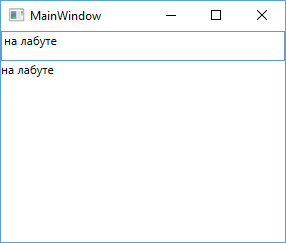
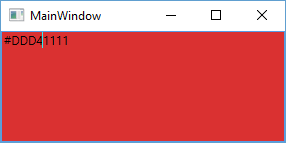
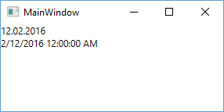
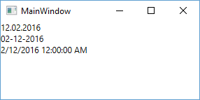

[Обзор типов оконных приложений в C#](./t8_win_app.md) | [Содержание](../readme.md#тема-8-оконные-приложения) | [Элементы управления](./t8_elements.md)

# Привязка (Binding). Интерфейс INotifyPropertyChanged. Форматирование значений привязки и конвертеры значений.

<!-- https://metanit.com/sharp/wpf/11.php -->

## Введение в привязку данных

В WPF привязка (**binding**) является мощным инструментом программирования, без которого не обходится ни одно серьёзное приложение.

Привязка подразумевает взаимодействие двух объектов: источника и приемника. Объект-приемник создает привязку к определенному свойству объекта-источника. В случае модификации объекта-источника, объект-приемник также будет модифицирован. Например, простейшая форма с использованием привязки:

```xml
<StackPanel>
    <TextBox 
        x:Name="myTextBox" 
        Height="30" />
    <TextBlock 
        x:Name="myTextBlock" 
        Text="{Binding 
            ElementName=myTextBox,
            Path=Text}"
        Height="30" />
</StackPanel>
```



Для определения привязки используется выражение типа:

```
{Binding ElementName=Имя_объекта-источника, Path=Свойство_объекта-источника}
```

То есть в данном случае у нас элемент **TextBox** (поле ввода) является источником, а **TextBlock** (простой текст) - приемником привязки. Свойство *Text* элемента **TextBlock** привязывается к свойству *Text* элемента **TextBox**. В итоге при осуществлении ввода в текстовое поле синхронно будут происходить изменения в текстовом блоке.

### Работа с привязкой в C#

Ключевым объектом при создании привязки является объект **System.Windows.Data.Binding**. Используя этот объект мы можем получить уже имеющуюся привязку для элемента:

```cs
Binding binding = BindingOperations.GetBinding(myTextBlock, TextBlock.TextProperty);
```

В данном случае получаем привязку для свойства зависимостей _TextProperty_ элемента _myTextBlock_.

Также можно полностью установить привязку в коде C#:

```cs
public MainWindow()
{
    InitializeComponent();
  
    Binding binding = new Binding();
 
    // элемент-источник
    binding.ElementName = "myTextBox"; 

    // свойство элемента-источника
    binding.Path = new PropertyPath("Text"); 

    // установка привязки для элемента-приемника
    myTextBlock.SetBinding(TextBlock.TextProperty, binding); 
}
```

Если в дальнейшем нам станет не нужна привязка, то мы можем воспользоваться классом **BindingOperations** и его методами **ClearBinding()**(удаляет одну привязку) и **ClearAllBindings()** (удаляет все привязки для данного элемента)

```cs
BindingOperations.ClearBinding(myTextBlock, TextBlock.TextProperty);
```

или

```cs
BindingOperations.ClearAllBindings(myTextBlock);
```

Некоторые свойства класса **Binding**:

* **ElementName**: имя элемента, к которому создается привязка
* **IsAsync**: если установлено в **True**, то использует асинхронный режим получения данных из объекта. По умолчанию равно **False**
* **Mode**: режим привязки
* **Path**: ссылка на свойство объекта, к которому идет привязка
* **TargetNullValue**: устанавливает значение по умолчанию, если привязанное свойство источника привязки имеет значение **null**
* **RelativeSource**: создает привязку относительно текущего объекта
* **Source**: указывает на объект-источник, если он не является элементом управления.
* **XPath**: используется вместо свойства path для указания пути к xml-данным

### Режимы привязки

Свойство **Mode** объекта **Binding**, которое представляет режим привязки, может принимать следующие значения:

* **OneWay**: свойство объекта-приемника изменяется после модификации свойства объекта-источника.
* **OneTime**: свойство объекта-приемника устанавливается по свойству объекта-источника только один раз. В дальнейшем изменения в источнике никак не влияют на объект-приемник.
* **TwoWay**: оба объекта - применки и источник могут изменять привязанные свойства друг друга.
* **OneWayToSource**: объект-приемник, в котором объявлена привязка, меняет объект-источник.
* **Default**: по умолчанию (если меняется свойство **TextBox.Text**, то имеет значение **TwoWay**, в остальных случаях **OneWay**).

Применение режима привязки:

```xml
<StackPanel>
    <TextBox 
        x:Name="textBox1" 
        Height="30" />
    <TextBox 
        x:Name="textBox2" 
        Height="30" 
        Text="{Binding 
            ElementName=textBox1, 
            Path=Text, 
            Mode=TwoWay}" />
</StackPanel>
```

### Обновление привязки. UpdateSourceTrigger

Односторонняя привязка от источника к приемнику практически мгновенно изменяет свойство приемника. Но если мы используем двустороннюю привязку в случае с текстовыми полями (как в примере выше), то при изменении приемника свойство источника не изменяется мгновенно. Так, в примере выше, чтобы текстовое поле-источник изменилось, нам надо перевести фокус с текстового поля-приемника. И в данном случае в дело вступает свойство *UpdateSourceTrigger* класса **Binding**, которое задает, как будет присходить обновление. Это свойство в качестве принимает одно из значений перечисления **UpdateSourceTrigger**:

* **PropertyChanged**: источник привязки обновляется сразу после обновления свойства в приемнике
* **LostFocus**: источник привязки обновляется только после потери фокуса приемником
* **Explicit**: источник не обновляется до тех пор, пока не будет вызван метод **BindingExpression.UpdateSource()**
* **Default**: значение по умолчанию. Для большинства свойств это значение **PropertyChanged**. А для свойства **Text** элемента **TextBox** это значение **LostFocus**

В данном случае речь идет об обновлении источника привязки после изменения приемника в режимах **OneWayToSource** или **TwoWay**. То есть чтобы у нас оба текстовых поля, которые связаны режимом **TwoWay**, моментально обновлялись после изменения одного из них, надо использовать значение **UpdateSourceTrigger.PropertyChanged**:

```xml
<StackPanel>
    <TextBox 
        x:Name="textBox1" 
        Height="30" />
    <TextBox 
        x:Name="textBox2" 
        Height="30"
        Text="{Binding 
            ElementName=textBox1, 
            Path=Text, 
            Mode=TwoWay, 
            UpdateSourceTrigger=PropertyChanged}" />
</StackPanel>
```

### Свойство Source

>Модель WPF предлагает очень удобный функционал: возможность хранить данные как ресурс, локально для элемента управления, локально для всего окна либо глобально для всего приложения. Данные могут быть любыми по факту, начиная от текущей информации, заканчивая иерархией элементов WPF. Это позволяет разместить данные в одном месте и после этого использовать их в разных местах, что может пригодится при разработке.
>
>Этот функционал часто используется для работы со стилями и шаблонами, которые мы еще будем обсуждать в руководстве, но, как будет показано в этой главе - область применения ресурсов очень широкая. 
>
>Ресурсы в WPF имеют ключ (атрибут `x:Key`), с помощью которого становится возможным сослаться на эти ресурсы из любой другой части приложения, используя ключ с выражением разметки _StaticResource_. В этом примере я просто сохранил строку в ресурсах, которую позже использовал в двух разных элементах **TextBlock**.

Свойство **Source** позволяет установить привязку даже к тем объектам, которые не являются элементами управления WPF. Например, определим класс **Phone**:

```cs
class Phone
{
    public string Title { get; set; }
    public string Company { get; set; }
    public int Price { get; set; }
}
```

Теперь создадим объект этого класса и определим к нему привязку:

```xml
<Window.Resources>
    <local:Phone 
        x:Key="nexusPhone" 
        Title="Nexus X5" 
        Company="Google" 
        Price="25000" />
</Window.Resources>
<Grid Background="Black">
    <Grid.RowDefinitions>
        <RowDefinition />
        <RowDefinition />
    </Grid.RowDefinitions>
    <Grid.ColumnDefinitions>
        <ColumnDefinition />
        <ColumnDefinition />
    </Grid.ColumnDefinitions>
    <TextBlock 
        Text="Модель:" 
        Foreground="White"/>
    <TextBlock 
        x:Name="titleTextBlock" 
        Text="{Binding 
            Source={StaticResource nexusPhone}, 
            Path=Title}"
        Foreground="White" 
        Grid.Column="1"/>
    <TextBlock 
        Text="Цена:" 
        Foreground="White" 
        Grid.Row="1"/>
    <TextBlock 
        x:Name="priceTextBlock" 
        Text="{Binding 
            Source={StaticResource nexusPhone}, 
            Path=Price}"
        Foreground="White" 
        Grid.Column="1" 
        Grid.Row="1"/>
</Grid>
```

В примере выше ресурсы расположены на уровне окна (Window), так, что будем в состоянии их использовать с любого места в окне.

Если Вы нуждаетесь в ресурсе лишь для одного выбранного элемента - можете сделать это локально, путем добавления ресурса к элементу управления, а не всему окну. Это работает так же, как и ресурсы для окна, разница состоит в том, можно ли будет "достучаться" до них с уровня элемента, в котором вы сохранили ресурс.

```xml
<StackPanel>
    <StackPanel.Resources>
        <sys:String 
            x:Key="ComboBoxTitle">Items:
        </sys:String>
    </StackPanel.Resources>
    <Label 
        Content="{StaticResource ComboBoxTitle}" />
</StackPanel>
```

В этом случае, мы добавили ресурс в **StackPanel** и, после, использовали его с уровня дочернего элемента - **Label**. Другие элементы внутри **StackPanel** также смогут его использовать, как и дочерние элементы **Label**. А вот элементы вне **StackPanel** не будут иметь доступа к введенным ресурсам.

Если Вам необходимо иметь доступ к ресурсу с разных окон - это тоже возможно. Файл `App.xaml` может содержать ресурсы так же как и окна (и другие типы элементов). Но когда Вы храните ресурсы в этом файле, то они становятся глобально доступными во всех окнах и UserControl'ах в проекте. Это работает также как и при хранении ресурсов в Window:

```xml
<Application ...>
    <Application.Resources>
        <sys:String
            x:Key="ComboBoxTitle">
            Items:
        </sys:String>
    </Application.Resources>
</Application>
```

### Свойство TargetNullValue

На случай, если свойство в источнике привязки вдруг имеет значение **null**, то есть оно не установлено, мы можем задать некоторое значение по умолчанию. Например:

```xml
<Window.Resources>
    <local:Phone 
        x:Key="nexusPhone" 
        Company="Google" 
        Price="25000" />
</Window.Resources>
<StackPanel>
    <TextBlock 
        x:Name="titleTextBlock"
        Text="{Binding 
            Source={StaticResource nexusPhone}, 
            Path=Title, 
            TargetNullValue=Текст по умолчанию}" />
</StackPanel>
```

В данном случае у ресурса *nexusPhone* не установлено свойство **Title**, поэтому текстовый блок будет выводить значение по умолчанию, указанное в параметре **TargetNullValue**.

### Свойство RelativeSource

Свойство **RelativeSource** позволяет установить привязку относительно элемента-источника, который связан какими-нибудь отношениями с элементом-приемником. Например, элемент-источник может быть одним из внешних контейнеров для элемента-приемника. Либо источником и приемником может быть один и тот же элемент.

Для установки этого свойства используется одноименный объект **RelativeSource**. У этого объекта есть свойство **Mode**, которое задает способ привязки. Оно принимает одно из значений перечисления **RelativeSourceMode**:

* **Self**: привязка осуществляется к свойству этого же элемента. То есть элемент-источник привязки в то же время является и приемником привязки.
* **FindAncestor**: привязка осуществляется к свойству элемента-контейнера.

Например, совместим источник и приемник привязке в самом элементе:

```xml
<TextBox Text="{Binding 
    RelativeSource={RelativeSource Mode=Self}, 
    Path=Background, 
    Mode=TwoWay, 
    UpdateSourceTrigger=PropertyChanged}" />
```



Здесь текст и фоновый цвет текстового поля связаны двусторонней привязкой. В итоге мы можем увидеть в поле числовое значение цвета, поменять его, и вместе с ним изменится и фон поля.

Привязка к свойствам контейнера:

```xml
<Grid Background="Black">
    <TextBlock 
        Foreground="White"
        Text="{Binding 
            RelativeSource={RelativeSource 
                Mode=FindAncestor,
                AncestorType={x:Type Grid}}, 
            Path=Background}" />
</Grid>
```

При использовании режима **FindAncestor**, то есть привязке к контейнеру, необходимо еще указывать параметр **AncestorType** и передавать ему тип контейнера в виде выражения `AncestorType={x:Type Тип_элемента-контейнера}`. При этом в качестве контейнера мы могли бы выбрать любой контейнер в дереве элементов, в частности, в данном случае кроме **Grid** таким контейнером также является элемент **Window**.

### Свойство DataContext

У объекта **FrameworkElement**, от которого наследуются элементы управления, есть интересное свойство **DataContext**. Оно позволяет задавать для элемента и вложенных в него элементов некоторый контекст данных. Тогда вложенные элементы могут использовать объект **Binding** для привязки к конкретным свойствам этого контекста. Например, используем ранее определенный класс **Phone** и создадим контекст данных из объекта этого класса:

Для WPF этого достаточно, а для Avalonia ещё нужно добавить тип данных: `x:DataType="local:Phone"`

```xml
<Window.Resources>
    <local:Phone 
        x:Key="nexusPhone" 
        Title="Nexus X5" 
        Company="Google" 
        Price="25000" />
</Window.Resources>
<Grid 
    DataContext="{StaticResource nexusPhone}" 
    x:DataType="local:Phone"
>
    <Grid.ColumnDefinitions>
        <ColumnDefinition />
        <ColumnDefinition />
        <ColumnDefinition />
    </Grid.ColumnDefinitions>
    <Grid.RowDefinitions>
        <RowDefinition />
        <RowDefinition />
    </Grid.RowDefinitions>
    <TextBlock 
        Text="Модель" />
    <TextBlock 
        Text="{Binding Title}" 
        Grid.Row="1" />
    <TextBlock 
        Text="Производитель" 
        Grid.Column="1"/>
    <TextBlock 
        Text="{Binding Company}" 
        Grid.Column="1" 
        Grid.Row="1" />
    <TextBlock 
        Text="Цена" 
        Grid.Column="2" />
    <TextBlock 
        Text="{Binding Price}" 
        Grid.Column="2" 
        Grid.Row="1" />
</Grid>
```

Таким образом мы задаем свойству **DataContext** некоторый динамический или статический ресурс. Затем осуществляем привязку к этому ресурсу.

## Интерфейс INotifyPropertyChanged.

Выше использовался объект **Phone** для привязки к текстовым блокам. Однако если мы изменим его, содержимое текстовых блоков не изменится. Например, добавим в окно приложения кнопку:

```xml
<Window.Resources>
    <local:Phone 
        x:Key="nexusPhone" 
        Title="Nexus X5" 
        Company="Google" 
        Price="25000" />
</Window.Resources>
<Grid 
    DataContext="{StaticResource nexusPhone}" 
    x:DataType="local:Phone"
    >
    <Grid.ColumnDefinitions>
        <ColumnDefinition />
        <ColumnDefinition />
        <ColumnDefinition />
    </Grid.ColumnDefinitions>
    <Grid.RowDefinitions>
        <RowDefinition />
        <RowDefinition />
        <RowDefinition />
    </Grid.RowDefinitions>
    <TextBlock 
        Text="Модель" />
    <TextBlock 
        Text="{Binding Title}" 
        Grid.Row="1" />
    <TextBlock 
        Text="Производитель" 
        Grid.Column="1"/>
    <TextBlock 
        Text="{Binding Company}" 
        Grid.Column="1" 
        Grid.Row="1" />
    <TextBlock 
        Text="Цена" 
        Grid.Column="2" />
    <TextBlock 
        Text="{Binding Price}" 
        Grid.Column="2" 
        Grid.Row="1" />

    <Button 
        Content="Изменить" 
        Click="Button_Click" 
        Grid.Column="2" 
        Grid.Row="2" />
</Grid>
```

И в файле кода для этой кнопки определим обработчик, в котором будет меняться свойства ресурса:

```cs
private void Button_Click(object sender, RoutedEventArgs e)
{
    Phone phone = (Phone)this.Resources["nexusPhone"];
    phone.Company = "LG"; // Меняем с Google на LG
}
```

Сколько бы мы не нажимали на кнопку, текстовые блоки, привязанные к ресурсу, не изменятся. Чтобы объект мог полноценно реализовать механизм привязки, нам надо реализовать в его классе интерфейс **INotifyPropertyChanged**. И для этого изменим класс **Phone** следующим образом:

```cs
using System.ComponentModel;
 
class Phone : INotifyPropertyChanged
{
    private string title;
    private string company;
    private int price;
 
    public string Title
    {
        get { return title; }
        set
        {
            title = value;
            OnPropertyChanged("Title");
        }
    }
    public string Company
    {
        get { return company; }
        set
        {
            company = value;
            OnPropertyChanged("Company");
        }
    }
    public int Price
    {
        get { return price; }
        set
        {
            price = value;
            OnPropertyChanged("Price");
        }
    }
 
    public event PropertyChangedEventHandler PropertyChanged;
    public void OnPropertyChanged(string prop = "")
    {
        if (PropertyChanged != null)
            PropertyChanged(this, new PropertyChangedEventArgs(prop));
    }
}
```

Когда объект класса изменяет значение свойства, то он через событие **PropertyChanged** извещает систему об изменении свойства. А система обновляет привязанные объекты.

## Форматирование значений привязки и конвертеры значений

### Форматирование значений

Привязка представляет очень простой механизм, однако иногда этому механизму требуется некоторая кастомизация (настройка). Так, нам может потребоваться небольшое форматирование значения. Для примера возьмем класс **Phone**:

```cs
class Phone
{
    public string Title { get; set; }
    public string Company { get; set; }
    public int Price { get; set; }
}
```

Допустим, нам надо в текстовый блок вывести не только цену, но и еще какой-нибудь текст:

```xml
<Window.Resources>
    <local:Phone 
        x:Key="nexusPhone" 
        Title="Nexus X5" 
        Company="Google" 
        Price="25000" />
</Window.Resources>
<Grid>
    <TextBlock 
        Text="{Binding 
            StringFormat=Итоговая цена {0} рублей, 
            Source={StaticResource nexusPhone}, 
            Path=Price}" />
</Grid>
```


Свойство **StringFormat** получает набор параметров в фигурных скобках. Фигурные скобки (`{0}`) передают собственно то значение, к которому идет привязка. Можно сказать, что действие свойства **StringFormat** аналогично методу *String.Format()*, который выполняет форматирование строк.

При необходимости мы можем использовать дополнительные опции форматирования, например, `{0:C}` для вывода валюты, `{0:P}` для вывода процентов и т.д.:

```xml
<TextBlock 
    Text="{Binding 
        StringFormat={}{0:C}, 
        Source={StaticResource nexusPhone}, 
        Path=Price}" />
```

При этом если у нас значение в **StringFormat** начинается с фигурных скобок, например, `{0:C}`, то перед ними ставятся еще пара фигурных скобок, как в данном случае. По сути они ничего важно не несут, просто служат для корректной интерпретации строки.

Либо в этом случае нам надо экранировать скобки слешами:

```xml
<TextBlock 
    Text="{Binding 
        StringFormat=\{0:C\}, 
        Source={StaticResource nexusPhone}, 
        Path=Price}" />
```

В зависимости от типа элемента доступны различные типы форматировщиков значений:

* **StringFormat**: используется для класса **Binding**

* **ContentStringFormat**: используется для классов **ContentControl**, **ContentPresenter**, **TabControl**

* **ItemStringFormat**: используется для класса **ItemsControl**

* **HeaderStringFormat**: используется для класса **HeaderContentControl**

* **ColumnHeaderStringFormat**: используется для классов **GridView**, **GridViewHeaderRowPresenter**

* **SelectionBoxItemStringFormat**: используется для классов **ComboBox**, **RibbonComboBox**

Их применение аналогично. Например, так как **Button** представляет **ContentControl**, то для этого элемента надо использовать **ContentStringFormat**:

```xml
<Button 
    ContentStringFormat="{}{0:C}"
    Content="{Binding 
        Source={StaticResource nexusPhone}, 
        Path=Price}" />
```

### Конвертеры значений

Конвертеры значений (_value converter_) также позволяют преобразовать значение из источника привязки к типу, который понятен приемнику привязки. Так как не всегда два связываемых привязкой свойства могут иметь совместимые типы. И в этом случае как раз и нужен конвертер значений.

Допустим, нам надо вывести дату в определенном формате. Для этой задачи создадим в проекте класс конвертера значений:

```cs
public class DateTimeToDateConverter : IValueConverter
{
    public object Convert(
        object value, 
        Type targetType, 
        object parameter, 
        CultureInfo culture)
    {
        return ((DateTime)value).ToString("dd.MM.yyyy");
    }
     
    public object ConvertBack(
        object value, 
        Type targetType, 
        object parameter, 
        CultureInfo culture)
    {
        return DependencyProperty.UnsetValue;
    }  
}
```

Конвертер значений должен реализовать интерфейс **System.Windows.Data.IValueConverter**. Этот интерфейс определяет два метода: *Convert()*, который преобразует пришедшее от привязки значение в тот тип, который понимается приемником привязки, и *ConvertBack()*, который выполняет противоположную операцию.

Оба метода принимают четыре параметра:

* **object value**: значение, которое надо преобразовать

* **Type targetType**: тип, к которому надо преобразовать значение **value**

* **object parameter**: вспомогательный параметр

* **CultureInfo culture**: текущая культура приложения

В данном случае метод **Convert** возвращает строковое представление даты в формате "*dd.MM.yyyy*". То есть мы ожидаем, что в качестве параметра **value** будет передаваться объект **DateTime**.

Метод **ConvertBack** в данном случае не имеет значения, поэтому он просто возвращает пустое значение для свойста. В другоим случае мы бы здесь получали строковое значение и преобразовывали его в **DateTime**.

Теперь применим этот конвертер в xaml:

```XML
<Window.Resources>
    <sys:DateTime x:Key="myDate">
        2/12/2016
    </sys:DateTime>
    <local:DateTimeToDateConverter 
        x:Key="myDateConverter" />
</Window.Resources>
<StackPanel>
    <TextBlock 
        Text="{Binding 
            Source={StaticResource myDate},
            Converter={StaticResource myDateConverter}}" />
    <TextBlock 
        Text="{Binding 
            Source={StaticResource myDate}}" />
</StackPanel>
```

Здесь искомая дата, которая выводится в текстовые блоки, задана в ресурсах. Также в ресурсах задан конвертер значений. Чтобы применить этот конвертер в конструкции привязки используется параметр **Converter** с указанием на ресурс: `Converter={StaticResource myDateConverter}`

Для сравнения здесь определено два текстовых блока. Но поскольку к одному из них применяется конвертер, то отображение даты будет отличаться:



Немного изменим код конвертера и используем передаваемый параметр:

```cs
public class DateTimeToDateConverter : IValueConverter
{
    public object Convert(
        object value, 
        Type targetType, 
        object parameter, 
        CultureInfo culture)
    {
        if(parameter!=null && parameter.ToString()=="EN")
            return ((DateTime)value).ToString("MM-dd-yyyy");
         
        return ((DateTime)value).ToString("dd.MM.yyyy");
    }
         
    public object ConvertBack(
        object value, 
        Type targetType, 
        object parameter, 
        CultureInfo culture)
    {
        return DependencyProperty.UnsetValue;
    }
}
```

В качестве параметра может передаваться любой объект. Если параметр в xaml не используется, то передается null. В данном случае мы проверяем, равен ли параметр строке "EN", то есть мы ожидаем, что параметр будет передавать строковое значение. И если равен, то возвращаем дату немного в другом формате.

Для применения параметра изменим код xaml:

```xml
<StackPanel>
    <TextBlock 
        Text="{Binding 
            Source={StaticResource myDate},
            Converter={StaticResource myDateConverter}}" />
    <TextBlock 
        Text="{Binding 
            Source={StaticResource myDate}, 
            ConverterParameter=EN, 
            Converter={StaticResource myDateConverter}}" />
    <TextBlock 
        Text="{Binding 
            Source={StaticResource myDate}}" />
</StackPanel>
```

Параметр привязки задается с помощью свойства **ConverterParameter**. Итак, у нас тут три текстовых блока, и применя конвертер, мы получим три разных отображения даты:



Также мы можем использовать передаваемые в конвертер параметры культуры и типа, к которому надо преобразовать. Например, мы можем смотреть на тип целевого значения и в зависимости от результатов производить определенные действия:

```cs
public class DateTimeToDateConverter : IValueConverter
{
    public object Convert(
        object value, 
        Type targetType, 
        object parameter, 
        CultureInfo culture)
    {
        if (targetType != typeof(Brush))
        {
            //....
        }
//...................
```

В данном случае предполагается, что тип объекта, к которому надо преобразовать, представляет тип **Brush**.

[Обзор типов оконных приложений в C#](./t8_win_app.md) | [Содержание](../readme.md#тема-8-оконные-приложения) | [Элементы управления](./t8_elements.md)
