<table style="width: 100%;"><tr><td style="width: 40%;">
<a href="../articles/t8_binding.md">Привязка (Binding)
</a></td><td style="width: 20%;">
<a href="../readme.md">Содержание
</a></td><td style="width: 40%;">
<a href="../articles/wpf_template.md">Каркас приложения. Модель данных. Привязка данных. Табличный вывод.
</a></td><tr></table>

# Элементы управления

## Обзор элементов управления и их свойств

Чтобы как-то взаимодействовать с пользователем, получать от пользователя ввод с клавиатуры или мыши и использовать введенные данные в программе, нам нужны элементы управления. WPF предлагает нам богатый стандартный набор элементов управления

Все элементы управления могут быть условно разделены на несколько подгрупп:

* Элементы управления содержимым, например кнопки (Button), метки (Label)

* Специальные контейнеры, которые содержат другие элементы, но в отличие от элементов **Grid** или **Canvas** не являются контейнерами компоновки - **ScrollViewer**, **GroupBox**

* Декораторы, чьё предназначение создание определенного фона вокруг вложенных элементов, например, **Border** или **Viewbox**.

* Элементы управления списками, например, **ListBox**, **ComboBox**.

* Текстовые элементы управления, например, **TextBox**, **RichTextBox**.

* Элементы, основанные на диапазонах значений, например, **ProgressBar**, **Slider**.

* Элементы для работ с датами, например, **DatePicker** и **Calendar**.

* Остальные элементы управления, которые не вошли в предыдущие подгруппы, например, **Image**.

Рассмотрим некоторые из основных свойств, которые наследуются элементами управления.

**Name**

Наверное важнейшее свойство. По установленному имени впоследствии можно будет обращаться к элементу, как в коде, так и в xaml разметке. Например, в xaml-коде у нас определена следующая кнопка:

```xml
<Button 
    x:Name="button1" 
    Width="60" 
    Height="30" 
    Content="Текст" 
    Click="button1_Click" />
```

Здесь у нас задан атрибут *Click* с названием метода обработчика *button1_Click*, который будет определен в файле кода C# и будет вызываться по нажатию кнопки. Тогда в связанном файле кода C# мы можем обратиться к этой кнопке:

```cs
private void button1_Click(object sender, RoutedEventArgs e)
{
    button1.Content = "Привет!";
}
```

Поскольку свойство **Name** имеет значение **button1**, то через это значение мы можем обратиться к кнопке в коде.

**FieldModifier**

Свойство **FieldModifier** задает модификатор доступа к объекту:

```xml
<StackPanel>
    <Button 
        x:FieldModifier="private" 
        x:Name="button1" 
        Content="Hello World" />
    <Button 
        x:FieldModifier="internal" 
        x:Name="button2" 
        Content="Hello WPF" />
</StackPanel>
```

В качестве значения используются стандартные модификатора доступа языка C#: **private**, **protected**, **internal**, **protected internal** и **public**. В данном случае объявление кнопок с модификаторами будет равноценно следующему их определению в коде:

```cs
private Button button1;
internal Button button2;
```

Если для элемента не определен атрибут **x:FieldModifier**, то по умолчанию он равен "protected internal".

**Visibility**

Это свойство устанавливает параметры видимости элемента и может принимать одно из трех значений:

* **Visible** - элемент виден и участвует в компоновке.
* **Collapsed** - элемент не виден и не участвует в компоновке.
* **Hidden** - элемент не виден, но при этом участвует в компоновке.

Различия между **Collapsed** и **Hidden** можно продемонстрировать на примере:

```xml
<Grid>
    <Grid.ColumnDefinitions>
        <ColumnDefinition Width="*" />
        <ColumnDefinition Width="*" />
    </Grid.ColumnDefinitions>
    <StackPanel 
        Grid.Column="0" 
        Background="Lavender">
        <Button 
            Visibility="Collapsed" 
            Content="Панель Collapsed" />
        <Button 
            Height="20" 
            Content="Visible Button" />
    </StackPanel>
    <StackPanel 
        Grid.Column="1" 
        Background="LightGreen">
        <Button 
            Visibility="Hidden" 
            Content="Панель Hidden" />
        <Button 
            Height="20" 
            Content="Visible Button" />
    </StackPanel>
</Grid>
```

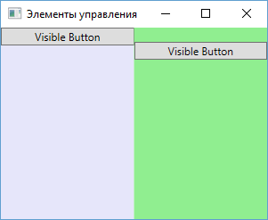

**Свойства настройки шрифтов**

* **FontFamily** - определяет семейство шрифта (например, Arial, Verdana и т.д.)

* **FontSize** - определяет высоту шрифта

* **FontStyle** - определяет наклон шрифта, принимает одно из трех значений - **Normal**, **Italic**, **Oblique**.

* **FontWeight** - определяет толщину шрифта и принимает ряд значений, как **Black**, **Bold** и др.

* **FontStretch** - определяет, как будет растягивать или сжимать текст, например, значение **Condensed** сжимает текст, а **Expanded** - растягивает.

Например:

```xml
<Button 
    Content="Hello World!" 
    FontFamily="Verdana" 
    FontSize="13" 
    FontStretch="Expanded" />
```

**Cursor**

Это свойство позволяет нам получить или установить курсор для элемента управления в одно из значений, например, **Hand**, **Arrow**, **Wait** и др. Например, установка курсора в коде c#: `button1.Cursor=Cursors.Hand;`

**FlowDirection**

Данное свойство задает направление текста. Если оно равно **RightToLeft**, то текст начинается с правого края, если - **LeftToRight**, то с левого.

```xml
<StackPanel>
    <TextBlock FlowDirection="RightToLeft">RightToLeft</TextBlock>
    <TextBlock FlowDirection="LeftToRight">LeftToRight</TextBlock>
</StackPanel>
```

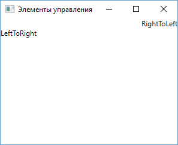

**Цвета фона и шрифта**

Свойства **Background** и **Foreground** задают соответственно цвет фона и текста элемента управления.

Простейший способ задания цвета в коде xaml: `Background="#ffffff"`. В качестве значения свойство **Background** (**Foreground**) может принимать запись в виде шестнадцатеричного значения в формате `#rrggbb`, где rr - красная составляющая, gg - зеленая составляющая, а bb - синяя. Также можно задать цвет в формате `#aarrggbb`.

Либо можно использовать названия цветов напрямую:

```xml
<Button 
    Width="60" 
    Height="30" 
    Background="LightGray" 
    Foreground="DarkRed" 
    Content="Цвет" />
```

## Элементы управления содержимым

Элементы управления содержимым (content controls) представляют такие элементы управления, которые содержат в себе другой элемент.

К элементам управления содержимым относятся такие элементы как **Button**, **Label**, **ToggleButton**, **ToolTip**, **RadioButton**, **CheckBox**, **GroupBox**, **TabItem**, **Expander**, **ScrollViewer**. Также элементом управления содержимым является и главный элемент окна - **Window**.

Отличительной чертой всех этих элементов является наличие свойства **Content**, которое и устанавливает вложенный элемент. В этом элементы управления содержимым схожи с контейнерами компоновки. Только контейнеры могут иметь множество вложенных элементов, а элементы управления содержимым только один.

Свойство **Content** может представлять любой объект, который может относиться к одному из двух типов:

* Объект класса, не наследующего от **UIElement**. Для такого объекта вызывается метод **ToString()**, который возвращает строковое преставление объекта. Затем эта строка устанавливается в качестве содержимого.

* Объект класса, наследующего от **UIElement**. Для такого объекта вызывается метод *UIElement.OnRender()*, который выполняет отрисовку внутри элемента управления содержимым.

Рассмотрим на примере кнопки, которая является элементом управления содержимым:

```xml
<Button Content="Hello World!" />
```

В качестве содержимого устанавливается обычная строка. Этот же пример мы можем в XAML прописать иначе:

```xml
<Button>
    <Button.Content>
        Hello World!
    </Button.Content>
</Button>
```

Либо мы можем использовать сокращенное неявное определения свойства **Content**:

```xml
<Button>
    Hello World!
</Button>
```

Возьмем другой пример. Определим кнопку с именем *button1*:

```xml
<Window x:Class="ControlsApp.MainWindow"
        xmlns="http://schemas.microsoft.com/winfx/2006/xaml/presentation"
        xmlns:x="http://schemas.microsoft.com/winfx/2006/xaml"
        xmlns:d="http://schemas.microsoft.com/expression/blend/2008"
        xmlns:mc="http://schemas.openxmlformats.org/markup-compatibility/2006"
        xmlns:local="clr-namespace:ControlsApp"
        mc:Ignorable="d"
        Title="Элементы управления" Height="250" Width="300">
    <StackPanel>
        <Button x:Name="button1" />
    </StackPanel>
</Window>
```

А в файле кода `MainWindow.xaml.cs` присвоим её свойству **Content** какой-либо объект:

```cs
using System;
using System.Windows;
 
namespace ControlsApp
{
    public partial class MainWindow : Window
    {
        public MainWindow()
        {
            InitializeComponent();
            double d = 5.6;
            button1.Content = d;
        }
    }
}
```

В итоге число конвертируется в строку и устанавливается в качесте содержимого.

Иначе все будет работать, если мы в качестве содержимого используем объект, унаследованный от **UIElement**:

```xml
<Button x:Name="button1">
    <Button Content="Hello" />
</Button>
```

Теперь в качестве содержимого будет использоваться другая кнопка, для которой при визуализации будет вызываться метод *OnRender()*:

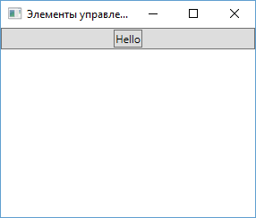

В отличие от контейнеров компоновки для элементов управления содержимым мы можем задать только один вложенный элемент. Если же нам надо вложить в элемент управления содержимым несколько элементов, то мы можем использовать те же контейнеры компоновки:

```xml
<Button x:Name="button1">
    <StackPanel>
        <TextBlock Text="Набор кнопкок" />
        <Button Background="Red" Height="20" Content="Red" />
        <Button Background="Yellow" Height="20" Content="Yellow" />
        <Button Background="Green" Height="20" Content="Green" />
    </StackPanel>
</Button>
```

## Позиционирование контента

Выравнивание содержимого внутри элемента задается свойствами *HorizontalContentAlignment* (выравнивание по горизонтали) и *VerticalContentAlignment* (выравнивание по вертикали), аналогичны свойствам *VerticalAlignment/HorizontalAlignment*. Свойство *HorizontalContentAlignment* принимает значения **Left**, **Right**, **Center** (положение по центру), **Stretch** (растяжение по всей ширине). Например:

```xml
<StackPanel>
    <Button 
        Margin="5" 
        HorizontalContentAlignment="Left" 
        Content="Left" 
        Height="90" 
        Width="500" />
    <Button 
        Margin="5" 
        HorizontalContentAlignment="Right" 
        Content="Right" 
        Height="90" 
        Width="500" />
    <Button 
        Margin="5" 
        HorizontalContentAlignment="Center" 
        Content="Center" 
        Height="90" 
        Width="500" />
</StackPanel>
```

**VerticalContentAlignment** принимает значения **Top** (положение в верху), **Bottom** (положение внизу), **Center** (положение по центру), **Stretch** (растяжение по всей высоте)

**Padding**

С помощью свойства **Padding** мы можем установить отступ содержимого элемента:

```xml
<StackPanel>
    <Button 
        x:Name="button1" 
        Padding="50 30 0 40" 
        HorizontalContentAlignment="Left">
        Hello World
    </Button>
    <Button 
        x:Name="button2" 
        Padding="60 20 0 30" 
        HorizontalContentAlignment="Center">
        Hello World
    </Button>
</StackPanel>
```

Свойство **Padding** задаётся в формате `Padding="отступ_слева отступ_сверху отступ_справа отступ_снизу"`.

Если со всех четырех сторон предполагается один и тот же отступ, то, как и в случае с **Margin**, мы можем задать одно число:

```xml
<Button 
    x:Name="button2" 
    Padding="20"  
    Content="Hello World" />
```

Важно понимать, от какой точки задается отступ. В случае с первой кнопкой в ней контект выравнивается по левому краю, поэтому отступ слева будет предполагать отступ от левого края элемента **Button**. А вторая кнопка располагается по центру. Поэтому для нее отступ слева предполагает отступ от той точки, в которой содержимое бы находилось при центрировании без применения **Padding**.

Комбинация значений свойств *HorizontalContentAlignment/VerticalContentAlignment* и *Padding* позволяет оптимальным образом задать расположение содержимого.

## Кнопки

В WPF кнопки представлены целым рядом классов, которые наследуются от базового класса ButtonBase:

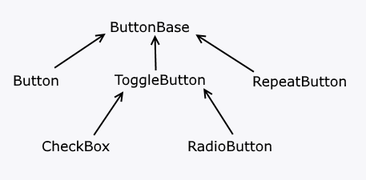

**Button**

Элемент **Button** представляет обычную кнопку:

```xml
<Button 
    x:Name="button1" 
    Width="60" 
    Height="30" 
    Background="LightGray" />
```

От класса **ButtonBase** кнопка наследует ряд событий, например, **Click**, которые позволяют обрабатывать пользовательский ввод.

Чтобы связать кнопку с обработчиком события нажатия, нам надо определить в самой кнопке атрибут **Click**. А значением этого атрибута будет название обработчика в коде C#. А затем в самом коде C# определить этот обработчик.

Например, код xaml:

```xml
<Button 
    x:Name="button1" 
    Width="60" 
    Height="30" 
    Content="Нажать" 
    Click="Button_Click" />
```

И обработчик в коде C#:

```cs
private void Button_Click(object sender, RoutedEventArgs e)
{
    MessageBox.Show("Кнопка нажата");
}
```

Либо можно не задавать обработчик через атрибут, а стандартным образом для C# прописать в коде: `button1.Click+=Button_Click;`

К унаследованным свойствам кнопка имеет такие свойства как **IsDefault** и **IsCancel**, которые принимают значения **true** и **false**.

Если свойство **IsDefault** установлено в **true**, то при нажатии клавиши Enter будет вызываться обработчик нажатия этой кнопки.

Аналогично если свойство **IsCancel** будет установлено в **true**, то при нажатии на клавишу Esc будет вызываться обработчик нажатия этой кнопки.

Например, определим код xaml:

```xml
<Window x:Class="ControlsApp.MainWindow"
        xmlns="http://schemas.microsoft.com/winfx/2006/xaml/presentation"
        xmlns:x="http://schemas.microsoft.com/winfx/2006/xaml"
        xmlns:d="http://schemas.microsoft.com/expression/blend/2008"
        xmlns:mc="http://schemas.openxmlformats.org/markup-compatibility/2006"
        xmlns:local="clr-namespace:ControlsApp"
        mc:Ignorable="d"
        Title="Элементы управления" Height="250" Width="300">
    <StackPanel>
        <Button 
            x:Name="acceptButton" 
            Content="ОК" 
            IsDefault="True" 
            Click="acceptButton_Click" />
        <Button 
            x:Name="escButton" 
            Content="Выход" 
            IsCancel="True" 
            Click="escButton_Click" />
    </StackPanel>
</Window>
```

А в коде `MainWindow.xaml.cs` определим следующий код C#:

```cs
using System.Windows;
 
namespace ControlsApp
{
    public partial class MainWindow : Window
    {
        public MainWindow()
        {
            InitializeComponent();
        }
 
        private void acceptButton_Click(object sender, RoutedEventArgs e)
        {
            MessageBox.Show("Действие выполнено");
        }
 
        private void escButton_Click(object sender, RoutedEventArgs e)
        {
            this.Close(); // закрытие окна
        }
    }
}
```

Теперь при нажатии на клавишу **Enter** будет отображаться сообщение, а при нажатии на **Esc** будет происходить выход из приложения и закрытие окна.

**RepeatButton**

Отличительная особенность элемента **RepeatButton** - непрерывная генерация события **Click**, пока нажата кнопка. Интервал генерации события корректируется свойствами **Delay** и **Interval**.

Сам по себе элемент **RepeatButton** редко используется, однако он может служить основой для создания ползунка в элементах **ScrollBar** и **ScrollViewer**, в которых нажатие на ползунок инициирует постоянную прокрутку.

**ToggleButton**

Представляет элементарный переключатель. Может находиться в трех состояниях - **true**, **false** и "нулевом" (неотмеченном) состоянии, а его значение представляет значение типа **bool?** в языке C#. Состояние можно установить или получить с помощью свойства *IsChecked*. Также добавляет три события - **Checked** (переход в отмеченное состояние), **Unchecked** (снятие отметки) и **Intermediate** (если значение равно null). Чтобы отрабатывать все три события, надо установить свойство `IsThreeState="True"`

**ToggleButton**, как правило, сам по себе тоже редко используется, однако при этом он служит основой для создания других более функциональных элементов, таких как **checkbox** и **radiobutton**.

**CheckBox**

Элемент **CheckBox** представляет собой обычный флажок. Данный элемент является производным от класса **ToggleButton** и поэтому может принимать также три состояния: **Checked**, **Unchecked** и **Intermediate**.

Чтобы получить или установить определенное состояние, надо использовать свойство **IsChecked**, которое также унаследовано от **ToggleButton**:

```xml
<StackPanel x:Name="stackPanel">
    <CheckBox 
        x:Name="checkBox1" 
        IsThreeState="True" 
        IsChecked="False" 
        Height="20" 
        Content="Неотмечено" />
    <CheckBox 
        x:Name="checkBox2" 
        IsThreeState="True" 
        IsChecked="True" 
        Height="20" 
        Content="Отмечено" />
    <CheckBox 
        x:Name="checkBox3" 
        IsThreeState="True" 
        IsChecked="{x:Null}" 
        Height="20" 
        Content="Неопределено"/>
</StackPanel>
```

Установка свойства `IsChecked="{x:Null}"` задает неопределенное состояние для элемента **checkbox**. Остальные два состояния задаются с помощью **True** и **False**. В данном примере также привязан к двум флажкам обработчик события **Checked**. Это событие возникает при установке **checkbox** в отмеченное состояние.

А атрибут `IsThreeState="True"` указывает, что флажок может находиться в трех состояниях.

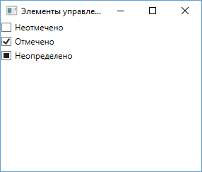

Ключевыми событиями флажка являются события **Checked** (генерируется при установке флажка в отмеченное состояние), **Unchecked** (генерируется при снятии отметки с флажка) и **Indeterminate** (флажок переведен в неопределенное состояние). Например, определим флажок:

```xml
<CheckBox 
    x:Name="checkBox" 
    IsChecked="False" 
    Height="20" 
    Content="Флажок"
    IsThreeState="True"
    Unchecked="checkBox_Unchecked"
    Indeterminate="checkBox_Indeterminate"
    Checked="checkBox_Checked" />
```

А в файле кода C# пропишем для него обработчики:

```cs
private void checkBox_Checked(object sender, RoutedEventArgs e)
{
    MessageBox.Show(checkBox.Content.ToString() + " отмечен");
}
 
private void checkBox_Unchecked(object sender, RoutedEventArgs e)
{
    MessageBox.Show(checkBox.Content.ToString() + " не отмечен");
}
 
private void checkBox_Indeterminate(object sender, RoutedEventArgs e)
{
    MessageBox.Show(checkBox.Content.ToString() + " в неопределенном состоянии");
}
```

**RadioButton**

Элемент управления, также производный от **ToggleButton**, представляющий переключатель. Главная его особенность - поддержка групп. Несколько элементов **RadioButton** можно объединить в группы, и в один момент времени мы можем выбрать из этой группы только один переключатель. Например,

```xml
<StackPanel x:Name="stackPanel">
    <RadioButton 
        GroupName="Languages" 
        Content="C#" 
        IsChecked="True" />
    <RadioButton 
        GroupName="Languages" 
        Content="VB.NET" />
    <RadioButton 
        GroupName="Languages" 
        Content="C++" />
    <RadioButton 
        GroupName="Technologies" 
        Content="WPF" 
        IsChecked="True" />
    <RadioButton 
        GroupName="Technologies" 
        Content="WinForms" />
    <RadioButton 
        GroupName="Technologies" 
        Content="ASP.NET" />
</StackPanel>
```

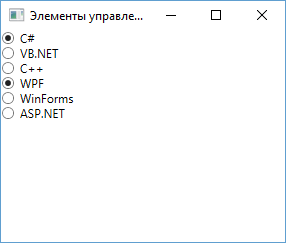

Чтобы включить элемент в определенную группу, используется свойство **GroupName**. В данном случае у нас две группы - **Languages** и **Technologies**. Мы можем отметить не более одного элемента **RadioButton** в пределах одной группы, зафиксировав тем самым выбор из нескольких возможностей.

Чтобы проследить за выбором того или иного элемента, мы также можем определить у элементов событие **Checked** и его обрабатывать в коде:

```xml
<RadioButton 
    GroupName="Languages" 
    Content="VB.NET" 
    Checked="RadioButton_Checked" />
```

Обработчик в файле кода:

```cs
private void RadioButton_Checked(object sender, RoutedEventArgs e)
{
    RadioButton pressed = (RadioButton)sender;
    MessageBox.Show(pressed.Content.ToString());
}
```

## Текстовые элементы управления

**TextBox**

Этот элемент представляет поле для ввода текстовой информации.

Он имеет свойства **TextWrapping**, **TextAlignment** и **TextDecorations**.

* Свойство **TextWrapping** позволяет переносить текст при установке этого свойства `TextWrapping="Wrap"`. По умолчанию это свойство имеет значение **NoWrap**, поэтому текст не переносится.

* Свойство **TextAlignment** выравнивает текст по центру (значение **Center**), правому (**Right**) или левому краю (**Left**): `<TextBlock TextAlignment="Right">`

* Для декорации текста используется свойство **TextDecorations**, например, если `TextDecorations="Underline"`, то текст будет подчеркнут.

* С помощью свойства **MaxLength** можно задать предельное количество вводимых символов.

```xml
<TextBox 
    MaxLength="250" 
    TextChanged="TextBox_TextChanged">
    Начальный текст
</TextBox>
```

В коде C# мы можем обработать событие изменения текста:

```cs
private void TextBox_TextChanged(object sender, TextChangedEventArgs e)
{
    TextBox textBox = (TextBox)sender;
    MessageBox.Show(textBox.Text);
}
```

По умолчанию, если вводимый текст превышает установленные границы поля, то текстовое поле растет, чтобы вместить весь текст. Но визуально это не очень хорошо выглядит. Поэтомуo мы можем перенести непомещающийся текст на новую строку, установив свойство `TextWrapping="Wrap"`.

Чобы переводить по нажатию на клавишу **Enter** курсор на следующую строку, нам надо установить свойство `AcceptsReturn="True"`.

Также мы можем добавить полю возможность создавать табуляцию с помощью клавиши **Tab**, установив свойство `AcceptsTab="True"`

Если нам вдруг потребуется перенести текст на другую строку, то тогда мы можем использовать элемент **LineBreak**:

```xml
<TextBox>
    Однажды в студеную зимнюю пору
    <LineBreak />
    Я из лесу вышел
</TextBox>
```

Для отображения полос прокрутки TextBox поддерживает свойства **VerticalScrollBarVisibility** и **НоrizontalScrollBarVisibility**:

```xml
<TextBox 
    AcceptsReturn="True" 
    Height="100" 
    VerticalScrollBarVisibility="Auto"
    HorizontalScrollBarVisibility="Auto">
    Начальный текст
</TextBox>
```

Возможно, при создании приложения нам потребуется сделать текстовое поле недоступным для ввода (на время в зависимости от условий или вообще), тогда для этого нам надо установить свойство `IsReadOnly="True"`.

Для выделения текста есть свойства **SelectionStart**, **SelectionLength** и **SelectionText**. Например, выделим программно текст по нажатию кнопки:

```xml
<StackPanel>
    <TextBox 
        x:Name="textBox1" 
        Height="100" SelectionBrush="Blue" />
    <Button 
        Content="Выделить текст" 
        Height="30" 
        Width="100" 
        Click="Button_Click" 
        Margin="10" />
</StackPanel>
```

Обработчик нажатия кнопки:

```cs
private void Button_Click(object sender, RoutedEventArgs e)
{
    textBox1.SelectionStart = 5;
    textBox1.SelectionLength = 10;
    textBox1.Focus();
    // данное выражение эквивалентно
    //textBox1.Select(5, 10);
}
```

**Проверка орфографии**

**TextBox** обладает встроенной поддержкой орфографии. Чтобы ее задействовать, надо установить свойство `SpellCheck.IsEnabled="True"`. Кроме того, по умолчанию проверка орфографии распространяется только на английский язык, поэтому, если приложение заточено под другой язык, нам надо его явным образом указать через свойство **Language**:

```xml
<DockPanel>
    <TextBox 
        SpellCheck.IsEnabled="True" 
        Language="ru-ru">
        Привет, как дила?
    </TextBox>
</DockPanel>
```

**Метка (Label)**

Главной особенностью меток является поддержка мнемонических команд-клавиш быстрого доступа, которые передают фокус связанному элементу. Например,

```xml
<Label 
    Target="{Binding ElementName=TextBox1}">
    _привет
</Label>
<TextBox 
    Name="TextBox1" 
    Margin="0 30 0 0" 
    Height="30" 
    Width="100" />
```

Теперь, нажав на клавишу "п", мы переведем фокус на связанное текстовое поле. При вызове приложения подчеркивание не отображается, чтобы отображать подчеркивание, надо нажать на клавишу **Alt**. Тогда чтобы перевести фокус на связанное текстовое поле необходимо будет нажать сочетание `Alt + "п"`.

**PasswordBox**

Элемент предназначен для ввода парольной информации. По сути это тоже текстовое поле, только для ввода символов используется маска. Свойство **PasswordChar** устанавливает символ маски, отображаемый при вводе пароля. Если это свойство не задано, то по умолчанию для маски символа используется черная точка. Свойство **Password** устанавливает парольную строку, отображаемую по умолчанию при загрузке окна приложения.

```xml
<StackPanel>
    <PasswordBox 
        PasswordChar="*" 
        MinHeight="30" />
    <PasswordBox 
        MinHeight="30" />
</StackPanel>
```

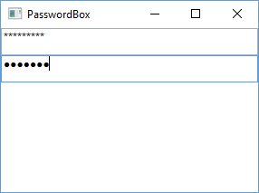

**RichTextBox**

Для вывода текстового содержимого, насыщенного форматированием, графикой, предназначен **RichTextBox**. Можно даже сказать, что он выводит не просто текст, а документы с более сложным форматированием, чем обычный **TextBox**. Более подробно о нем, а также как на его основе создать простой текстовый редактор, мы поговорим в лекции, посвященной документам.

## Элементы управления списками

Эти элементы представлены в WPF довольно широко. Все они являются производными от класса ItemsControl. Все они содержат коллекцию элементов. Элементы могут быть напрямую добавлены в коллекцию, возможна также привязка некоторого массива данных к коллекции.

Возьмем простейший элемент-список - **ListBox**:

```xml
<Window x:Class="ControlsApp.MainWindow"
        xmlns="http://schemas.microsoft.com/winfx/2006/xaml/presentation"
        xmlns:x="http://schemas.microsoft.com/winfx/2006/xaml"
        xmlns:d="http://schemas.microsoft.com/expression/blend/2008"
        xmlns:mc="http://schemas.openxmlformats.org/markup-compatibility/2006"
        xmlns:local="clr-namespace:ControlsApp"
        xmlns:sys="clr-namespace:System;assembly=mscorlib"
        mc:Ignorable="d"
        Title="ListBox" Height="200" Width="300">
    <Grid>
        <ListBox Name="list">
            <sys:String>Lumia 950</sys:String>
            <sys:String>iPhone 6S Plus</sys:String>
            <sys:String>Xiaomi Mi5</sys:String>
            <sys:String>Nexus 5X</sys:String>
        </ListBox>
    </Grid>
</Window>
```

Все элементы, размещенные внутри спискового элемента **ListBox**, представляют элементы списка.

Коллекция объектов внутри элемента-списка доступна в виде свойства **Items**. Для управления элементами из этой коллекции мы можем использовать следующие методы:

* **Add(object item)**: добавление элемента
* **Clear()**: полная очистка коллекции
* **Insert(int index, object item)**: вставка элемента по определенному индексу в коллекции
* **Remove(object item)**: удаление элемента
* **RemoveAt(int index)**: удаление элемента по индексу

А свойство **Count** позволяет узнать, сколько элементов в коллекции.

Например, применительно к вышеопределенному списку мы бы могли написать в коде C#:

```cs
list.Items.Add("LG G5");
list.Items.RemoveAt(1); // удаляем второй элемент
```

Нам необязательно вручную заполнять значения элемента управления списком, так как мы можем установить свойство **ItemsSource**, задав в качестве параметра коллекцию, из которой будет формироваться элемент управления списком. Например, в коде xaml-разметки определим пустой список:

```xml
<Grid>
    <ListBox Name="list" />
</Grid>
```

А в файле отделенного кода выполним наполнение списка:

```cs
public partial class MainWindow : Window
{
    public MainWindow()
    {
        InitializeComponent();
 
        string[] phones = { "iPhone 6S", "Lumia 950", "Nexus 5X", "LG G4", "Xiaomi MI5", "HTC A9" };
        list.ItemsSource = phones;
    }
}
```

Свойство **ItemsSource** в качестве значения принимает массив, хотя это моет быть и список типа **List**. И каждый элемент этого массива переходит в **ListBox**.

Еще одно важное свойство списковых элементов - это свойство **DisplayMemberPath**. Оно позволяет выбирать для отображения элементов значение одного из свойств объекта. Например, создадим в коде новый класс **Phone**:

```cs
class Phone
{
    public string Title { get; set; }
    public string Company { get; set; }
    public int Price { get; set; }
}
```

Теперь создадим в xaml набор объектов этого класса **Phone** и выведем в списке значение свойства **Title** этих объектов:

```xml
<Window x:Class="ControlsApp.MainWindow"
        xmlns="http://schemas.microsoft.com/winfx/2006/xaml/presentation"
        xmlns:x="http://schemas.microsoft.com/winfx/2006/xaml"
        xmlns:d="http://schemas.microsoft.com/expression/blend/2008"
        xmlns:mc="http://schemas.openxmlformats.org/markup-compatibility/2006"
        xmlns:local="clr-namespace:ControlsApp"
        mc:Ignorable="d"
        Title="ListBox" Height="220" Width="300">
    <Grid Background="Lavender">
        <ListBox 
            Name="list" 
            DisplayMemberPath="Title">
            <local:Phone 
                Title="iPhone 6S" 
                Company="Apple" 
                Price="54990" />
            <local:Phone 
                Title="Lumia 950" 
                Company="Microsoft" 
                Price="39990" />
            <local:Phone 
                Title="Nexus 5X" 
                Company="Google" 
                Price="29990" />
        </ListBox>
    </Grid>
</Window>
```

Поскольку мы используем класс, определенный в текущем проекте, то соответственно у нас обязательно должно быть подключено пространство имен проекте: `xmlns:local="clr-namespace:ControlsApp"`. В принципе по умолчанию WPF уже его подключает. Кроме того, чтобы не возникало проблем с разметкой XAML, желательно сделать перестроение проекта. И в итоге окно нам выведет только названия смартфонов:

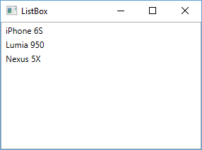


То же самое мы бы могли сделать программным способом:

```cs
list.ItemsSource = new List<Phone>
{
    new Phone { Title="iPhone 6S", Company="Apple", Price=54990 },
    new Phone {Title="Lumia 950", Company="Microsoft", Price=39990 },
    new Phone {Title="Nexus 5X", Company="Google", Price=29990 }
};
list.DisplayMemberPath = "Title";
```

Все элементы управления списками поддерживают выделение входящих элементов. Выделенный элемент(ы) можно получить с помощью свойств **SelectedItem**(**SelectedItems**), а получить индекс выделенного элемента - с помощью свойства **SelectedIndex**. Свойство **SelectedValue** позволяет получить значение выделенного элемента.

При выделении элемента в списке генерируется событие **SelectionChanged**, которое мы можем обработать. Например, возьмем предыдущий список:

```xml
<ListBox 
    Name="list" 
    DisplayMemberPath="Title" 
    SelectionChanged="list_Selected">
    <local:Phone 
        Title="iPhone 6S" 
        Company="Apple" 
        Price="54990" />
    <local:Phone 
        Title="Lumia 950" 
        Company="Microsoft" 
        Price="39990" />
    <local:Phone 
        Title="Nexus 5X" 
        Company="Google" 
        Price="29990" />
</ListBox>
```

А в файле кода определим обработчик для этого события:

```cs
private void list_Selected(object sender, RoutedEventArgs e)
{
    Phone p = (Phone)list.SelectedItem;
    MessageBox.Show(p.Title);
}
```

Важно учитывать, что так как в разметке xaml в списке определены элементы **Phone**, то в коде мы можем привести объект *list.SelectedItem* к типу **Phone**.

**ComboBox**

**ComboBox** содержит коллекцию элементов и образует выпадающий список:

```xml
<ComboBox 
    Name="phonesList" 
    Height="30" 
    VerticalAlignment="Top">
    <TextBlock>LG Nexus 5X</TextBlock>
    <TextBlock>Huawai Nexus 6P</TextBlock>
    <TextBlock>iPhone 6S</TextBlock>
    <TextBlock>iPhone 6S Plus</TextBlock>
    <TextBlock>Microsoft Lumia 950</TextBlock>
</ComboBox>
```


**ComboBoxItem**

В качестве элементов в **ComboBox**-e мы можем использовать различные компоненты, но наиболее эффективным является применение элемента **ComboBoxItem**. **ComboBoxItem** представляет элемент управления содержимым, в который через свойство **Content** мы можем поместить другие элементы. Например:

```xml
<ComboBox Height="50" Width="150" VerticalAlignment="Top">
    <ComboBoxItem IsSelected="True">
        <StackPanel Orientation="Horizontal">
            <Image Source="cats.jpg"  Width="60" />
            <TextBlock>cats.jpg</TextBlock>
        </StackPanel>
    </ComboBoxItem>
    <StackPanel Orientation="Horizontal">
        <Image Source="windowcat.jpg" Width="60" />
        <TextBlock>windowcat.jpg</TextBlock>
    </StackPanel>
    <StackPanel Orientation="Horizontal">
        <Image Source="234.jpg" Width="60" />
        <TextBlock>234.jpg</TextBlock>
    </StackPanel>
</ComboBox>
```

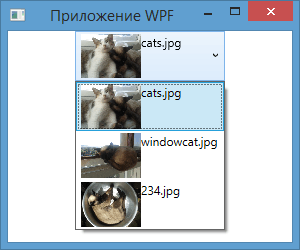

Для создания первого элемента использовался элемент **ComboBoxItem**. Для второго и третьего такие элементы создаются неявно. Однако использование **ComboBoxItem** имеет преимущество, так как мы можем выделить данный элемент, установив свойство `IsSelected="True"`, либо можем сделать недоступным с помощью установки свойства `IsEnabled="False"`.

**Событие SelectionChanged**

Обрабатывая событие **SelectionChanged**, мы можем динамически получать выделенный элемент:

```xml
<ComboBox Height="25" Width="150" SelectionChanged="ComboBox_Selected">
<!-- остальное содержимое списка-->
</ComboBox>
```

Обработка события в коде C#:

```cs
private void ComboBox_Selected(object sender, RoutedEventArgs e)
{
    ComboBox comboBox = (ComboBox)sender;
    ComboBoxItem selectedItem = (ComboBoxItem)comboBox.SelectedItem;
    MessageBox.Show(selectedItem.Content.ToString());
}
```

Правда, для элементов со сложным содержимым подобный способ может не пройти, и если мы захотим получить текст, до него придется добираться, спускаясь по дереву вложенных элементов.

**Свойства**

Установка свойства `IsEditable="True"` позволяет вводить в поле списка начальные символы, а затем функция автозаполнения подставит подходящий результат. По умолчанию свойство имеет значение **False**.

Это свойство работает в комбинации со свойством **IsReadOnly**: оно указывает, является поле ввода доступным только для чтения. По умолчанию имеет значение **False**, поэтому если `IsEditable="True"`, то мы можем вводить туда произвольный текст.

Еще одно свойство **StaysOpenOnEdit** при установке в **True** позволяет сделать список раскрытым на время ввода значений в поле ввода.

## DataGrid

**DataGrid** во многом похож на **ListView**, но более сложный по характеру и допускает редактирование содержимого таблицы.

В разделе о **ListView** мы создали класс Phone, объекты которого выводили в список:


```cs
public class Phone
{
    public string Title { get; set; }
    public string Company { get; set; }
    public int Price { get; set; }
}
```

Теперь же выведем объекты в таблицу **DataGrid**. Чтобы **DataGrid** автоматически разбивал таблицу на столбцы, установим свойство `AutoGenerateColumns="True"` (вроде можно и не устанавливать - оно по-умолчанию включено):

```xml
<Window x:Class="ControlsApp.MainWindow"
        xmlns="http://schemas.microsoft.com/winfx/2006/xaml/presentation"
        xmlns:x="http://schemas.microsoft.com/winfx/2006/xaml"
        xmlns:d="http://schemas.microsoft.com/expression/blend/2008"
        xmlns:mc="http://schemas.openxmlformats.org/markup-compatibility/2006"
        xmlns:local="clr-namespace:ControlsApp"
        xmlns:col="clr-namespace:System.Collections;assembly=mscorlib"
         
        mc:Ignorable="d"
        Title="DataGrid" Height="220" Width="300">
    <Grid Background="Lavender">
        <DataGrid 
            x:Name="phonesGrid" 
            AutoGenerateColumns="True" 
            ItemsSource="{DynamicResource ResourceKey=phones}">
            <DataGrid.Resources>
                <col:ArrayList x:Key="phones">
                    <local:Phone 
                        Title="iPhone 6S" 
                        Company="Apple" 
                        Price="54990" />
                    <local:Phone 
                        Title="Lumia 950" 
                        Company="Microsoft" 
                        Price="39990" />
                    <local:Phone 
                        Title="Nexus 5X" 
                        Company="Google" 
                        Price="29990" />
                </col:ArrayList>
            </DataGrid.Resources>
        </DataGrid>
    </Grid>
</Window>
```

В данном случае префикс **local** ссылается на пространство имен текущего проекта, в котором определен класс **Phone** (`xmlns:local="clr-namespace:Controls"`), а **col** - префикс-ссылка на пространство имен **System.Collections** (`xmlns:col="clr-namespace:System.Collections;assembly=mscorlib"`). И это даст в итоге следующий вывод:

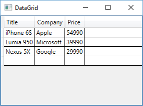

Программная установка источника для **DataGrid**:

```cs
List<Phone> phonesList = new List<Phone>
{
    new Phone { Title="iPhone 6S", Company="Apple", Price=54990 },
    new Phone {Title="Lumia 950", Company="Microsoft", Price=39990 },
    new Phone {Title="Nexus 5X", Company="Google", Price=29990 }
};
phonesGrid.ItemsSource = phonesList;
```

**Некоторые полезные свойства *DataGrid***

&nbsp;|&nbsp;
--|-- 
RowBackground и AlternatingRowBackground | Устанавливают фон строки. Если установлены оба свойства, цветовой фон чередуется: RowBackground - для нечетных строк и AlternatingRowBackground - для четных
ColumnHeaderHeight | Устанавливает высоту строки названий столбцов.
ColumnWidth | Устанавливает ширину столбцов.
RowHeight | Устанавливает высоту строк.
GridLinesVisibility | Устанавливает видимость линий, разделяющих столбцы и строки. Имеет четыре значения - All - видны все линии, Horizontal - видны только горизонтальные линии, Vertical - видны только вертикальные линии, None - линии отсутствуют
HeadersVisibility | Задает видимость заголовков
HorizontalGridLinesBrush и VerticalGridLinesBrush | Задает цвет горизонтальных и вертикальных линий соответственно

Хотя предыдущий пример довольно прост, в нем есть несколько недочетов. Во-первых, у нас нет возможности повлиять на расстановку столбцов. Во-вторых, заголовки определены по названиям свойств, которые на английском языке, а хотелось бы на русском. В этом случае мы должны определить свойства отображения столбцов сами. Для этого надо воспользоваться свойством *DataGrid.Columns* и определить коллекцию столбцов для отображения в таблице.

Причем можно задать также и другой тип столбца, отличный от текстового. DataGrid поддерживает следующие варианты столбцов:

&nbsp;|&nbsp;
--|-- 
DataGridTextColumn | Отображает элемент TextBlock или TextBox при редактировании
DataGridHyperlinkColumn | Представляет гиперссылку и позволяет переходить по указанному адресу
DataGridCheckBoxColumn | Отображает элемент CheckBox
DataGridComboBoxColumn | Отображает выпадающий список - элемент ComboBox
DataGridTemplateColumn | Позволяет задать специфичный шаблон для отображения столбца

Перепишем предыдущий пример с учетом новой информации:

```xml
<DataGrid 
    x:Name="phonesGrid" 
    AutoGenerateColumns="False" 
    HorizontalGridLinesBrush="DarkGray"
    RowBackground="LightGray" 
    AlternatingRowBackground="White">
            
    <DataGrid.Items>
        <local:Phone 
            Title="iPhone 6S" 
            Company="Apple" 
            Price="54990" />
        <local:Phone 
            Title="Lumia 950" 
            Company="Microsoft" 
            Price="39990" />
        <local:Phone 
            Title="Nexus 5X" 
            Company="Google" 
            Price="29990" />
    </DataGrid.Items>
    <DataGrid.Columns>
        <DataGridTextColumn 
            Header="Модель" 
            Binding="{Binding Path=Title}" 
            Width="90" />
        <DataGridHyperlinkColumn 
            Header="Компания" 
            Binding="{Binding Path=Company}" 
            Width="80" />
        <DataGridTextColumn 
            Header="Цена" 
            Binding="{Binding Path=Price}" 
            Width="50" />
    </DataGrid.Columns>
</DataGrid>
```

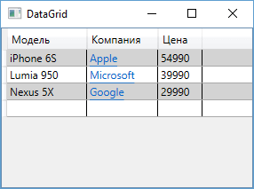

Среди свойств **DataGrid** одним из самых интересных является *RowDetailsTemplate*. Оно позволяет задать шаблон отображения дополнительной информации касательно данной строки. Изменим элемент **DataGrid**:

```xml
<DataGrid 
    x:Name="phonesGrid" 
    AutoGenerateColumns="False" 
    HorizontalGridLinesBrush="DarkGray"
    RowBackground="LightGray" 
    AlternatingRowBackground="White">
            
    <DataGrid.Items>
        <local:Phone 
            Title="iPhone 6S" 
            Company="Apple" 
            Price="54990" />
        <local:Phone 
            Title="Lumia 950" 
            Company="Microsoft" 
            Price="39990" />
        <local:Phone 
            Title="Nexus 5X" 
            Company="Google" 
            Price="29990" />
    </DataGrid.Items>
    <DataGrid.Columns>
        <DataGridTextColumn 
            Header="Модель" 
            Binding="{Binding Path=Title}" 
            Width="90" />
        <DataGridHyperlinkColumn 
            Header="Компания" 
            Binding="{Binding Path=Company}" 
            Width="80" />
        <DataGridTextColumn 
            Header="Цена" 
            Binding="{Binding Path=Price}" 
            Width="50" />
    </DataGrid.Columns>
     
    <DataGrid.RowDetailsTemplate>
        <DataTemplate>
            <StackPanel Orientation="Horizontal">
                <TextBlock Text="{Binding Path=Price}" />
                <TextBlock Text=" рублей по скидке" />
            </StackPanel>
        </DataTemplate>
    </DataGrid.RowDetailsTemplate>
     
</DataGrid>
```

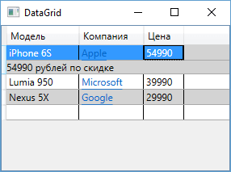

## Работа с изображениями. Image и InkCanvas

**Элемент Image**

Элемент **Image** предназначен для работы с изображениями. Свойство *Source* позволяет задать путь к изображению, например:


```xml
<Image Source="myPhoto.jpg" />
```

WPF поддерживает различны форматы изображений: .bmp, .png, .gif, .jpg и т.д.

Также элемент позволяет проводить некоторые простейшие транформации с изображениями. Например, с помощью объекта *FormatConvertedBitmap* и его свойства *DestinationFormat* можно получить новое изображение:

```xml
<Grid Background="Black">
    <Grid.ColumnDefinitions>
        <ColumnDefinition Width="2.5*" />
        <ColumnDefinition Width="*" />
    </Grid.ColumnDefinitions>
    <Image Grid.Column="0" x:Name="mainImage">
        <Image.Source>
            <FormatConvertedBitmap Source="3.jpg"
                DestinationFormat="Gray32Float" />
        </Image.Source>
    </Image>
    <StackPanel Grid.Column="1">
        <Image Source="1.jpg" />
        <Image Source="2.jpg" />
        <Image Source="4.jpg" />
        <Image Source="3.jpg" />
    </StackPanel>
</Grid>
```

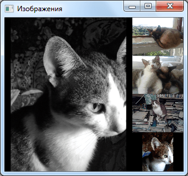

**InkCanvas**

**InkCanvas** представляет собой полотно, на котором можно рисовать. Первоначально оно предназначалось для стилуса, но в WPF есть поддержка также и для мыши для обычных ПК. Его очень просто использовать:

```xml
<InkCanvas Background="LightCyan" />
```

Либо мы можем вложить в InkCanvas какое-нибудь изображение и на нем уже рисовать:

```xml
<InkCanvas>
    <Image Source="2.jpg"  Width="300" Height="250"  />
</InkCanvas>
```

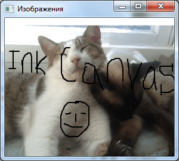

Все рисование в итоге представляется в виде штрихов - элементов класса **System.Windows.Ink.Stroke** и хранится в коллекции **Strokes**, определенной в классе **InkCanvas**.

**Режим рисования**

**InkCanvas** имеет несколько режимов, они задаются с помощью свойства **EditingMode**, значения для которого берутся из перечисления **InkCanvasEditingMode**.. Эти значения бывают следующими:

* **Ink**: используется по умолчанию и предполагает рисование стилусом или мышью
* **InkAndGesture**: рисование с помощью мыши/стилуса, а также с помощью жестов (Up, Down, Tap и др.)
* **GestureOnly**: рисование только с помощью жестов пользователя
* **EraseByStroke**: стирание всего штриха стилусом
* **EraseByPoint**: стирание только части штриха, к которой прикоснулся стилус
* **Select**: выделение всех штрихов при касании
* **None**: отсутствие какого-либо действия

Используя эти значения и обрабатывая события **InkCanvas**, такие как **StrokeCollected** (штрих нарисован), **StrokeErased** (штрих стерли) и др., можно управлять набором штрихов и создавать более функциональные приложения на основе **InkCanvas**.

<table style="width: 100%;"><tr><td style="width: 40%;">
<a href="../articles/t8_binding.md">Привязка (Binding)
</a></td><td style="width: 20%;">
<a href="../readme.md">Содержание
</a></td><td style="width: 40%;">
<a href="../articles/wpf_template.md">Каркас приложения. Модель данных. Привязка данных. Табличный вывод.
</a></td><tr></table>
