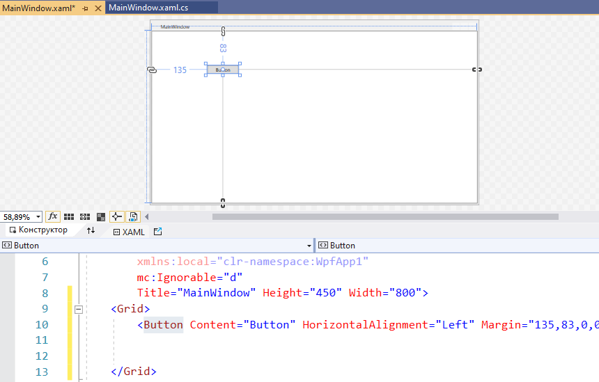

# Обзор типов оконных приложений в C#. Знакомство со структорой проекта WPF. Grid.

В C# есть несколько технологий для созданий оконных приложений:

* Windows Forms - разработка "классических" приложений Windows (а-ля XP), считается устаревшей

    **Windows Forms** — интерфейс программирования приложений (API), отвечающий за графический интерфейс пользователя и являющийся частью Microsoft .NET Framework. Данный интерфейс упрощает доступ к элементам интерфейса Microsoft Windows за счет создания обёртки для существующего **Win32 API** в управляемом коде. Причём управляемый код — классы, реализующие API для Windows Forms, не зависят от языка разработки.
    
    То есть программист одинаково может использовать Windows Forms как при написании ПО на C#, С++, так и на VB.Net, J# и др.

    Внутри .NET Framework, Windows Forms реализуется в рамках пространства имён *System.Windows.Forms*.

    Приложение Windows Forms представляет собой событийно-ориентированное приложение, поддерживаемое Microsoft .NET Framework. В отличие от консольных программ, большая часть времени тратится на ожидание от пользователя каких-либо действий, как, например, ввод текста в текстовое поле или клика мышкой по кнопке.

* WPF (Window Presentation Foundation) - основной фреймворк, на котором мы дальше и будем работать

    **Windows Presentation Foundation (WPF)** ― это система следующего поколения для построения клиентских приложений Windows с визуально привлекательными возможностями взаимодействия с пользователем. С помощью WPF можно создавать широкий спектр как автономных, так и размещенных в браузере приложений.
    
    В основе WPF лежит векторная система визуализации, не зависящая от разрешения и созданная с расчетом на возможности современного графического оборудования. WPF расширяет базовую систему полным набором функций разработки приложений, в том числе Extensible Application Markup Language (XAML), элементами управления, привязкой данных, макетом, 2-D- и 3-D-графикой, анимацией, стилями, шаблонами, документами, мультимедиа, текстом и оформлением. WPF входит в состав Microsoft .NET Framework и позволяет создавать приложения, включающие другие элементы библиотеки классов .NET Framework.

    Windows Presentation Foundation (WPF) ― это система следующего поколения для построения клиентских приложений Windows с визуально привлекательными возможностями взаимодействия с пользователем. С помощью WPF можно создавать широкий спектр как автономных, так и размещенных в браузере приложений. 

* UWP (Universal Windows Platform) - вроде как "последний писк", рассчитанный на разработку универсальных приложений под Windows Phone, Windows 8 и.т.д

## Создание оконного приложения

Запустите *Microsoft Visual Studio* (MVS) и создайте новое приложение:

Тип приложения: WPF (.NET Framework)


При создании задаете *Имя проекта* и, если нужно, *Расположение*. Остальные параметры оставляем по-умолчанию.

>Название проекта должно отражать предметную область или название компании (за это есть отдельные баллы на WorldSkills-е и демо-экзамене)

По-умолчанию IDE *Visual Studio* разбито на 3 части:


* слева *панель элементов* - список визуальных элементов (кнопки, токстовые поля и т.п.)
* в центре основное окно, предназначенное для редактирования исходного кода. При отображении файлов XAML (читается как "замл") разбито на две части: визуальное отображение и текст разметки
* справа *Обозреватель решений* и структура проекта: Properties (Свойства); Ссылки (Зависимости); App.config - настройки проекта; App.xaml - разметка проекта и MainWindow.xaml - разметка окна.

Если каких-то панелей нет на экране, то можно их найти в меню **Вид**.

**Основные типы файлов проекта:**

* **.XAML** eXtended Application Markup Languale - язык разметки, очень похож на XML
* **.cs** - файлы с исходным кодом на C#

 ## Визуальные элементы

Для добавления элемента на форму достаточно перетащить его мышкой из *Панели инструментов* (например, кнопку)



Обратите внимание, элемент появляется и на форме и в разметке XAML.

Размеры, положение и другие свойства окна и любых его компонентов можно менять несколькими способами:

* непосредственно в окне визуального редактора - подходит только для грубого позиционирования;
* в разметке XAML - наиболее быстрый способ
* в свойствах элемента - если не помните название свойства

>Сейчас модно делать "адаптивную" верстку, когда контент (содержимое) подстраивается под размер окна. Но, естественно, есть минимальный размер окна, при котором компоненты ещё помещаются и меньше которого смысла менять нет. Хорошим тоном считается задать минимальные размеры окна:
>
>```xml
><Window 
>   ...
>   Title="MainWindow" Height="450" Width="800" 
>   MinHeight="400" MinWidth="500">

Кроме самого элемента на форме отображаются еще какие-то линии с цифрами - это расстояние до края окна (границы) и выравнивание

```xml
<Grid>
    <Button Content="Button" 
        HorizontalAlignment="Left" 
        Margin="335,169,0,0" 
        VerticalAlignment="Top" 
        Width="75"/>
</Grid>
```


