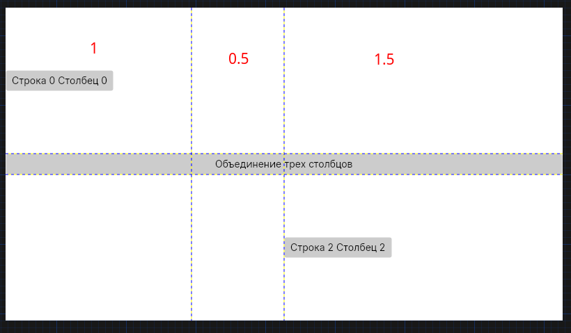

[Библиотеки классов](./t7_dll.md) | [Содержание](../readme.md#тема-8-оконные-приложения) | [Привязка (Binding)](./t8_binding.md)

# Обзор типов оконных приложений в C#. Знакомство со структурой проекта WPF/Avalonia. Компоновка.

>Содрано [отсюда](https://metanit.com/sharp/wpf/1.php)

## Технологии создания оконных приложений

В C# есть несколько технологий для созданий оконных приложений:

* **Windows Forms** - разработка "классических" приложений Windows, считается устаревшей

    **Windows Forms** — интерфейс программирования приложений (API), отвечающий за графический интерфейс пользователя и являющийся частью *Microsoft .NET Framework*. Данный интерфейс упрощает доступ к элементам интерфейса Microsoft Windows за счет создания обёртки для существующего *Win32 API* в управляемом коде. Причём управляемый код — классы, реализующие API для **Windows Forms**, не зависят от языка разработки.

* WPF (Window Presentation Foundation) - более современный фреймворк для .NET Framework, но заточен только под Windows (отрисовку реализует через **DirectX**)

    >Стоит отметить, что *.NET Framework* считается устаревшей технологией и на смену ей пришла кроссплатформенная библиотека *.NET Core*. Для неё есть аналог **WPF** - **Avalonia**, совместимый, на уровне разметки, фреймворк, работающий на **OpenGL**.

* UWP (Universal Windows Platform) - вроде как "последний писк", рассчитанный на разработку универсальных приложений под Windows Phone, Windows 8 и.т.д

**Avalonia** являеся практически калькой с **WPF**, поэтому далее я их рассматриваю одновременно.

## Особенности платформ WPF/Avalonia

Если при создании традиционных приложений на основе **Windows Forms** за отрисовку элементов управления и графики отвечали такие части ОС Windows, как **User32** и **GDI+**, то приложения **WPF** основаны на **DirectX** (**Avalonia**, соответственно, на **OpenGL**). В этом состоит ключевая особенность рендеринга графики: используя **WPF/Avalonia**, значительная часть работы по отрисовке графики, как простейших кнопочек, так и сложных 3D-моделей, ложиться на графический процессор на видеокарте, что также позволяет воспользоваться аппаратным ускорением графики.

Одной из важных особенностей является использование языка декларативной разметки интерфейса XAML, основанного на XML: вы можете создавать насыщенный графический интерфейс, используя или декларативное объявление интерфейса, или код C#, либо совмещать и то, и другое.

### Преимущества WPF/Avalonia

Что вам, как разработчику, предлагает **WPF/Avalonia**?

* Использование традиционных языков .NET-платформы - C# для создания логики приложения

* Возможность декларативного определения графического интерфейса с помощью специального языка разметки XAML, основанном на XML и представляющем альтернативу программному созданию графики и элементов управления, а также возможность комбинировать XAML и C#

* Независимость от разрешения экрана: поскольку в WPF/Avalonia все элементы измеряются в независимых от устройства единицах, приложения на WPF/Avalonia легко масштабируются под разные экраны с разным разрешением.

* Новые возможности, которых сложно было достичь в **Windows Forms**, например, создание трехмерных моделей, привязка данных, использование таких элементов, как стили, шаблоны, темы и др.

* Хорошее взаимодействие с **Windows Forms** (только **WPF**), благодаря чему, например, в приложениях **WPF** можно использовать традиционные элементы управления из **Windows Forms**.

* Богатые возможности по созданию различных приложений: это и мультимедиа, и двухмерная и трехмерная графика, и богатый набор встроенных элементов управления, а также возможность самим создавать новые элементы, создание анимаций, привязка данных, стили, шаблоны, темы и многое другое

* Аппаратное ускорение графики - вне зависимости от того, работаете ли вы с 2D или 3D, графикой или текстом, все компоненты приложения транслируются в объекты, понятные Direct3D/OpenGL, и затем визуализируются с помощью процессора на видеокарте, что повышает производительность, делает графику более плавной.

## Установка Avalonia

Далее мы будем использовать Avalonia, но так как он не входит в .NET, то нужно его установить:

1. В основном окне **Rider** выбрать вкладку *Configure -> Plugins*:

    

    И установите `AvaloniaRider` (в строке поиска введите "avalonia")

    При установке может выдать сообщение, что плагин разработан не в **JetBrains** и использовать на свой страх - соглашаемся (**Accept**)

1. После установки плагина перезагрузите IDE и установите шаблоны проектов для **Avalonia**. В консоли выполните команду: 

    ```
    dotnet new install Avalonia.Templates
    ```

    >Для .NET 6.0 и более ранних версий замените install на --install.
    >Версию .NET можно узнать выполнив в консоли команду `dotnet --version`

## Создание оконного приложения

Запустите **Rider** и создайте новое решение:

Если шаблоны установлены нормально, то в окне создания нового проекта появится секция *Other*:

Выберите **Avalonia .NET Core App** 

При создании задаете *Название решения*, *Имя проекта* и, если нужно, *Расположение*. Остальные параметры оставляем по-умолчанию.

>Название проекта должно отражать предметную область или название компании (за это есть отдельные баллы на чемпионате и демо-экзамене)

**Основные типы файлов проекта:**

* **.AXAML** (Avalonia eXtended Application Markup Languale) - язык разметки, очень похож на XML. В таких файлах хранится описание внешнего вида окна. 
* **.cs** - файлы с исходным кодом на C# для окна.

## Структура проекта

В структуре проекта следует выделить следующие моменты:

**Во-первых**, в проекте имеется файл `App.axaml` и связанный с ним файл кода `App.axaml.cs` - это глобальные файлы для всего приложения, позже мы о них поговорим подробнее. А пока только следует знать, что в `App.axaml.cs` задается класс главного окна программы, которое будет открываться при запуске приложения. Если вы откроете этот файл, то можете найти в нем строку `desktop.MainWindow = new MainWindow();` - то есть в данном случае, когда мы запустим приложение, главным будет окно из класса `MainWindow`.

Далее в структуре определены файл разметки `MainWindow.axaml` и файл связанного кода `MainWindow.axaml.cs`. Файл `MainWindow.axaml` и представляет определение окна приложения, которое мы увидим при запуске.

## Введение в язык XAML

**AXAML (Avalonia eXtensible Application Markup Language)** - язык разметки, используемый для инициализации объектов в технологиях на платформе .NET. Применительно к **Avalonia** данный язык используется прежде всего для создания пользовательского интерфейса декларативным путем, наподобие HTML в веб-программировании.

**AXAML** - не является обязательной частью приложения, мы вобще можем обходиться без него, создавая все элементы в файле связанного с ним кода на языке C#. Однако использование AXAML все-таки несет некоторые преимущества:

* Возможность отделить графический интерфейс от логики приложения, благодаря чему над разными частями приложения могут относительно автономно работать разные специалисты: над интерфейсом - дизайнеры, над кодом логики - программисты.

* Компактность, понятность, код на AXAML относительно легко поддерживать.

При компиляции приложения код в axaml-файлах также компилируется в бинарное представление кода axaml. И затем это бинарное представление встраивается в финальную сборку приложения - exe или dll-файл.

### Структура и пространства имен AXAML

При создании нового проекта он уже содержит файлы с кодом axaml. Так, создаваемый по умолчанию в проекте файл `MainWindow.axaml` будет иметь следующую разметку:

```xml
<Window 
    xmlns="https://github.com/avaloniaui"
    xmlns:x="http://schemas.microsoft.com/winfx/2006/xaml"
    xmlns:d="http://schemas.microsoft.com/expression/blend/2008"
    xmlns:mc="http://schemas.openxmlformats.org/markup-compatibility/2006"
    mc:Ignorable="d" 
    d:DesignWidth="800" 
    d:DesignHeight="450"
    x:Class="AvaloniaFirst.MainWindow"
    Title="AvaloniaFirst"
>
    Welcome to Avalonia!
</Window>
```

Если вы совершенно не знакомы с axaml и с xml, то даже этот небольшой минимальный код окна может вызывать затруднения.

Подобно структуре веб-страничке на html, здесь есть некоторая иерархия элементов. Элементом верхнего уровня является тег **Window**, который представляет собой окно приложения. При создании других окон в приложении нам придется всегда начинать объявление интерфейса с элемента **Window**, поскольку это элемент самого верхнего уровня.

Кроме **Window** существует еще два элемента верхнего уровня:

* Page
* Application

Элемент **Window** имеет вложенный текст (Welcome to Avalonia!), а также подобно html-элементам ряд атрибутов (*Title*, *DesignWidth*, *DesignHeight*) - они задают заголовок, ширину и высоту окна соответственно.

### Пространства имен AXAML

При создании кода на языке C#, чтобы нам были доступны определенные классы, мы подключаем пространства имен с помощью директивы using, например, `using Avalonia.Controls;`.

Чтобы задействовать элементы в AXAML, мы также подключаем пространства имен. Аттрибуты **xmlns** как раз и представляют собой пространства имен, подключаемые в проект.

Так, пространство имен **https://github.com/avaloniaui** содержит описание и определение большинства элементов управления. Так как является пространством имен по умолчанию, то объявляется без всяких префиксов.

**http://schemas.microsoft.com/winfx/2006/xaml** - это пространство имен, которое определяет некоторые свойства AXAML, например свойство _Name_ или _Key_. Используемый префикс `x` в определении `xmlns:x` означает, что те свойства элементов, которые заключены в этом пространстве имен, будут использоваться с префиксом x - `x:Name` или `x:Key`. Это же пространство имен используется уже в аттрибуте `x:Class="AvaloniaFirst.MainWindow"` - здесь создается ссылка на класс **MainWindow** и соответствующий ему файл кода, куда будет прописываться логика для данного окна приложения.

Это два основных пространства имен. Рассмотрим остальные:

**xmlns:d="http://schemas.microsoft.com/expression/blend/2008"**: предоставляет поддержку атрибутов в режиме дизайнера. Это пространство имен преимущественно предназначено для другого инструмента по созданию дизайна на XAML - Microsoft Expression Blend

**xmlns:mc="http://schemas.openxmlformats.org/markup-compatibility/2006"**: обеспечивает режим совместимости разметок XAML.

Важно понимать, что эти пространства имен не эквивалентны тем пространствам имен, которые подключаются при помощи директивы **using** в c#. 

### Элементы и их атрибуты

XAML предлагает очень простую и ясную схему определения различных элементов и их свойств. Каждый элемент, как и любой элемент XML, должен иметь открывающий и закрывающий теги, как в случае с элементом Window:

```xml
<Window></Window>
```

Либо элемент может иметь сокращенню форму с закрывающим слешем в конце, наподобие:

```xml
<Window />
```

Но в отличие от элементов xml каждый элемент в XAML соответствует определенному классу C#. Например, элемент **Button** соответствует классу **Avalonia.Controls.Button**. А свойства этого класса соответствуют атрибутам элемента **Button**.

Например, добавим кнопку в создаваемую по умолчанию разметку окна:

```xml
<Window 
    ...
>
    <Button 
        x:Name="button1"  
        Width="100" 
        Height="30" 
        Content="Кнопка" />
</Window>
```

Сначала идет элемент самого высшего уровня - **Window** (я содержимое вырезал, чтобы не засорять код) и в нем уже определен элемент **Button**, представляющий кнопку.

Для кнопки мы можем определить свойства в виде атрибутов. Здесь определены атрибуты `x:Name` (имя кнопки), `Width`, `Height` и `Content`. 

Подобным образом мы можем определить и другие атрибуты, которые нам нужны. Либо мы можем не определять атрибуты, и тогда они будут использовать значения по умолчанию.

Определив разметку xaml, мы можем запустить проект, и нам отобразится графически весь код xaml - то есть наша кнопка.


### Специальные символы

При определении интерфейса в XAML мы можем столкнуться с некоторыми ограничениями. В частности, мы не можем использовать специальные символы, такие как знак амперсанда `&`, кавычки `"` и угловые скобки `<` и `>`. Например, мы хотим, чтобы текст кнопки был следующим: `<"Hello">`. У кнопки есть свойство *Content*, которое задает содержимое кнопки. И можно предположить, что нам надо написать так:

```xml
<Button 
    Content="<"Hello">" 
/>
```

Но такой вариант ошибочен и даже не скомпилирутся. В этом случае нам надо использовать специальные коды символов:

Символ | Код
:--:|:--:
`<` | `&lt;`
`>` | `&gt;`
`&` | `&amp;`
`"` | `&quot;`

Например:

```xml
<Button 
    Content="&lt;&quot;Hello&quot;&gt;" 
/>
```

Еще одна проблема, с которой мы можем столкнуться в XAML - добавление пробелов. Возьмем, к примеру, следующее определение кнопки:

```xml
<Button>
    Hello         World
</Button>
```

Здесь свойство *Content* задается неявно в виде содержимого между тегами `<Button>....</Button>`. Но несмотря на то, что у нас несколько пробелов между словами "Hello" и "World", XAML по умолчанию будет убирать все эти пробелы. И чтобы сохранить пробелы, нам надо использовать атрибут `xml:space="preserve"`:

```xml
<Button 
    xml:space="preserve"
>
    Hello         World
</Button>
```

## Файлы отделённого кода

При создании нового проекта в дополнение к создаваемому файлу `MainWindow.axaml` создается также файл отделённого кода `MainWindow.axaml.cs`, где, как предполагается, должна находится логика приложения связанная с разметкой из `MainWindow.axaml`. Файлы XAML позволяют нам определить интерфейс окна, но для создания логики приложения, например, для определения обработчиков событий элементов управления, нам все равно придется воспользоваться кодом C#.

По умолчанию в разметке окна используется атрибут `x:Class`:

```xml
<Window 
    x:Class="AvaloniaFirst.MainWindow" 
    ...
```

Атрибут `x:Class` указывает на класс, который будет представлять данное окно и в который будет компилироваться код в XAML при компиляции. То есть во время компиляции будет генерироваться класс **AvaloniaFirst.MainWindow**, унаследованный от класса **Avalonia.Controls**.

Кроме того в файле отделенного кода `MainWindow.axaml.cs`, который **Rider** создает автоматически, мы также можем найти класс с тем же именем - в данном случае класс **MainWindow**. По умолчанию он имеет некоторый код:

```cs 
using Avalonia.Controls;

namespace AvaloniaFirst;

public partial class MainWindow : Window
{
    public MainWindow()
    {
        InitializeComponent();
    }
}
```

По сути пустой класс, но этот класс уже выполняет некоторую работу. Во время компиляции этот класс объединяется с классом, сгенерированном из кода XAML. Чтобы такое слияние классов во время компиляции произошло, класс **MainWindow** определяется как частичный с модификатором **partial**. А через метод *InitializeComponent* класс **MainWindow** вызывает скомпилированный ранее код XAML, разбирает его и по нему строит графический интерфейс окна.

>Здесь проявляется основное отличие **Windows Forms** и **WPF/Avalonia**: в **Windows Forms** код первичен, т.е. при старте приложения **императивно** создаётся интерфейс (вызовами Windows API), а в **WPF** первичен интерфейс, в котором **декларативно** описан внешний вид и при запуске приложения запускается класс окна, который мы можем расширить (инициализировать источники данных и описать логику работы).

### Взаимодействие кода C# и XAML

В приложении часто требуется обратиться к какому-нибудь элементу управления. Для этого надо установить у элемента в XAML свойство **Name**.

Еще одной точкой взаимодействия между xaml и C# являются события. С помощью атрибутов в XAML мы можем задать события, которые будут связанны с обработчиками в коде C#.

Итак, в разметке главного окна определим два элемента: кнопку и текстовое поле.

>В теге **Window** может быть только один вложенный элемент. Обычно используют **Grid** (подробнее о нём поговорим ниже)

```xml
<Grid>
    <TextBox 
        x:Name="textBox1" 
        Width="150" 
        Height="30" 
        VerticalAlignment="Top" 
        Margin="20" />
    <Button 
        x:Name="button1"  
        Width="100" 
        Height="30" 
        Content="Кнопка" 
        Click="Button1_OnClick" />
</Grid>
```

И изменим класс **MainWindow** добавив в него обработчик нажатия кнопки *Button1_OnClick*:

```cs
public partial class MainWindow : Window
{
    public MainWindow()
    {
        InitializeComponent();
    }

    private void Button1_OnClick(
        object? sender, 
        RoutedEventArgs e)
    {
        string text = textBox1.Text;
        if (text != "")
        {
            MessageBoxManager
                .GetMessageBoxStandard(
                    "Caption", 
                    text,
                    ButtonEnum.Ok)
                .ShowAsync();
        }
    }
}
```

>В **Avalonia** нет встроенного класса **MessageBox**. Нужно через **NuGet** установить библиотеку `MessageBox.Avalonia`

Определив имена элементов в XAML, затем мы можем к ним обращаться в коде c#: `var text = textBox1.Text`.

В обработчике нажатия кнопки просто выводится сообщение, введенное в текстовое поле. После определения обработчика мы его можем связать с событием нажатия кнопки в xaml через атрибут _Click_: `Click="Button1_OnClick"`. В результате после нажатия на кнопку мы увидим в окне введенное в текстовое поле сообщение.

### Пространства имен из C# в XAML

По умолчанию в XAML подключается предустановленный набор пространств имен xml. Но мы можем задействовать любые другие пространства имен и их функциональность в том числе и стандартные пространства имен платформы .NET, например, **System** или **System.Collections**.

Например, подключим локальное пространство имен:

```xml
<Window
    ...
    xmlns:local="clr-namespace:AvaloniaFirst"
```

Локальное пространство имен позволяет подключить все классы, которые определены в коде C# в нашем проекте. Например, добавим в проект следующий класс (напоминаю правило: каждый класс создаётся в отдельном файле):

```cs
namespace AvaloniaFirst;

public class Phone
{
    public string Name { get; set; }
    public int Price { get; set; }
      
    public override string ToString()
    {
        return $"Смартфон {this.Name}; цена: {this.Price}";
    }
}
```

Используем этот класс в коде xaml:

```xml
<Button 
    x:Name="phoneButton"  
    Width="250" 
    Height="40"
    >
    <local:Phone
        Name="Lumia 950" 
        Price="700" />
</Button>
```

Так как пространство имен проекта проецируется на префикс `local`, то все классы проекта можно использовать в форме `local:Название_Класса`. Так в данном случае в качестве содержимого кнопки устанавливается объект **Phone**. 


Для вывода содержимого любого объекта используется метод *ToString*. Этот метод объявлен в классе **Object** и по-умолчанию выводит просто название класса, в нашем случае **AvaloniaFirst.Phone**. Для того, чтобы получить нужную нам информацию об объекте необходимо переопределить метод *ToString*.

Мы можем подключить любые другие пространства имен, классы которых мы хотим использовать в приложении. Например:

```cs
<Window 
    ...
    xmlns:col="clr-namespace:System.Collections;assembly=mscorlib"
    xmlns:sys="clr-namespace:System;assembly=mscorlib"
    ^^^^^^^^^^^^^^^^^^^^^^^^^^^^^^^^^^^^^^^^^^^^^^^^^^^^^^^^^^^^^^    
>
    <Window.Resources>
        <col:ArrayList x:Key="days">
            <sys:String>Понедельник</sys:String>
            <sys:String>Вторник</sys:String>
            <sys:String>Среда</sys:String>
            <sys:String>Четверг</sys:String>
            <sys:String>Пятница</sys:String>
            <sys:String>Суббота</sys:String>
            <sys:String>Воскресенье</sys:String>
        </col:ArrayList> 
    </Window.Resources>
</Window>
```

Здесь определены два дополнительных пространства имен:

```
xmlns:col="clr-namespace:System.Collections;assembly=mscorlib"
xmlns:sys="clr-namespace:System;assembly=mscorlib"
```

Благодаря этому нам становятся доступными объекты из пространств имен **System.Collections** и **System**. И затем используя префикс, мы можем использовать объекты, входящие в данные пространства имен: `<col:ArrayList....`

Общий синтаксис подключения пространств имен следующий: `xmlns:Префикс="clr-namespace:Пространство_имен;assembly=имя_сборки"`. Так в предыдущем случае мы подключили пространство имен **System.Collections**, классы которого находятся в сборке **mscorlib**. И данное подключенное пространство имен у нас отображено на префикс col.

## Компоновка

Чтобы перейти уже непосредственно к созданию красивых интерфейсов и их компонентов, сначала необходимо познакомиться с компоновкой. 

Компоновка (**layout**) представляет собой процесс размещения элементов внутри контейнера. Возможно, вы обращали внимание, что одни программы и веб-сайты на разных экранах с разным разрешением выглядят по-разному: где-то лучше, где-то хуже. В большинстве своем такие программы используют жестко закодированные в коде размеры элементов управления. WPF/Avalonia уходят от такого подхода в пользу так называемого "резинового дизайна", где весь процесс позиционирования элементов осуществляется с помощью компоновки.

Благодаря компоновке мы можем удобным образом настроить элементы интерфейса, позиционировать их определенным образом. Например, элементы компоновки в WPF/Avalonia позволяют при ресайзе (сжатии или растяжении) масштабировать элементы, что очень удобно, а визуально не создает всяких шероховатостей типа незаполненных пустот на форме.

В WPF/Avalonia компоновка осуществляется при помощи специальных контейнеров. Фреймворк предоставляет нам следующие контейнеры: **Grid**, **UniformGrid**, **StackPanel**, **WrapPanel**, **DockPanel** и **Canvas**.

Различные контейнеры могут содержать внутри себя другие контейнеры. Кроме данных контейнеров существует еще ряд элементов, такие как **TabPanel**, которые могут включать другие элементы и даже контейнеры компоновки, однако на саму компоновку не столь влияют в отличие от выше перечисленных. Кроме того, если нам не хватает стандартных контейнеров, мы можем определить свои с нужной нам функциональностью.

Контейнеры компоновки позволяют эффективно распределить доступное пространство между элементами, найти для него наиболее предпочтительные размеры.

В WPF/Avalonia при компоновке и расположении элементов внутри окна нам надо придерживаться следующих принципов:

* Нежелательно указывать явные размеры элементов (за исключеним минимальных и максимальных размеров). Размеры должны определяться контейнерами.

* Нежелательно указывать явные позицию и координаты элементов внутри окна. Позиционирование элементов всецело должно быть прерогативой контейнеров. И контейнер сам должен определять, как элемент будет располагаться. Если нам надо создать сложную систему компоновки, то мы можем вкладывать один контейнер в другой, чтобы добиться максимально удобного расположения элементов управления.

## Grid (сетка)

Это наиболее мощный и часто используемый контейнер, напоминающий обычную таблицу. Он содержит столбцы и/или строки, количество которых задает разработчик. Для определения строк используется свойство *RowDefinitions*, а для определения столбцов - свойство *ColumnDefinitions*:

```xml
<Grid>
    <Grid.RowDefinitions>
        <RowDefinition />
        <RowDefinition />
        <RowDefinition />
    </Grid.RowDefinitions>
    <Grid.ColumnDefinitions>
        <ColumnDefinition />
        <ColumnDefinition />
        <ColumnDefinition />
    </Grid.ColumnDefinitions>
</Grid>
```

Каждая строка задается с помощью вложенного элемента *RowDefinition*. При этом задавать дополнительную информацию необязательно. То есть в данном случае у нас определено в гриде 3 строки.

Каждая столбец задается с помощью вложенного элемента *ColumnDefinition*. Таким образом, здесь мы определили 3 столбца. То есть в итоге у нас получится таблица 3х3.

Для визуального отображения ячеек сетки можно добавить свойство `ShowGridLines="True"`


Чтобы задать позицию элемента управления с привязкой к определенной ячейке **Grid**-а, в разметке элемента нужно прописать значения свойств *Grid.Column* и *Grid.Row*, тем самым указывая, в каком столбце и строке будет находиться элемент. Кроме того, если мы хотим растянуть элемент управления на несколько строк или столбцов, то можно указать свойства *Grid.ColumnSpan* и *Grid.RowSpan*, как в следующем примере:

```xml
<Grid ShowGridLines="True">
    <Grid.RowDefinitions>
        <RowDefinition />
        <RowDefinition />
        <RowDefinition />
    </Grid.RowDefinitions>
    <Grid.ColumnDefinitions>
        <ColumnDefinition />
        <ColumnDefinition />
        <ColumnDefinition />
    </Grid.ColumnDefinitions>
    <Button 
        Content="Строка 0 Столбец 0"  />
    <Button 
        Grid.Column="0" 
        Grid.Row="1" 
        Content="Объединение трех столбцов" 
        Grid.ColumnSpan="3"  />
    <Button 
        Grid.Column="2" 
        Grid.Row="2" 
        Content="Строка 2 Столбец 2"  />
</Grid>
```

То есть у нас получится следующая картина:

Испольуя **WPF**:


Испольуя **Avalonia**:


Почему приложения выглядят по-разному, код же одинаковый?

Дело в том, что в WPF стили настроены так, что элементы занимают всё доступное в контейнере место, а в Avalonia по размеру содержимого.

Можно настроить выравнивание так, как это нужно используя атрибуты:

* _HorizontalAlignment_, _VerticalAlignment_ - для позиционирования элемента в контейнере
* _HorizontalContentAlignment_, _VerticalContentAlignment_ - для позиционирования содержимого элемента

```xml
<Button 
    Grid.Column="0" 
    Grid.Row="1" 
    Content="Объединение трех столбцов" 
    Grid.ColumnSpan="3" 
    HorizontalAlignment="Stretch"
    VerticalAlignment="Stretch"
    HorizontalContentAlignment="Center"
    VerticalContentAlignment="Center"/>
```


### Установка размеров

Но если в предыдущем случае у нас строки и столбцы были равны друг другу, то теперь попробуем настроить столбцы по ширине, а строки - по высоте. Есть несколько вариантов настройки размеров.

#### Автоматические размеры

Здесь столбец или строка занимает то место, которое им нужно (по содержимому)

```xml
<ColumnDefinition Width="Auto" />
...
<RowDefinition Height="Auto" />
```

#### Абсолютные размеры

В данном случае высота и ширина указываются в единицах, независимых от устройства:

```xml
<ColumnDefinition Width="150" />
...
<RowDefinition Height="150" />
```

Также абсолютные размеры можно задать в пикселях, дюймах, сантиметрах или точках (только в WPF, Avalonia этого не поддерживает):

* _пиксели_: px
* _дюймы_: in
* _сантиметры_: cm
* _точки_: pt (точка в вёрстке это не точка на экране, а 1/72 дюйма)

#### Пропорциональные размеры.

Например, ниже задаются два столбца, второй из которых имеет ширину в четверть от ширины первого:

```xml
<ColumnDefinition Width="*" />
<ColumnDefinition Width="0.25*" />
```

Если строка или столбец имеет высоту, равную `*`, то данная строка или столбец будет занимать все оставшееся место. Если у нас есть несколько сток или столбцов, высота которых равна `*`, то всё доступное место делится поровну между всеми такими сроками и столбцами. Использование коэффициентов (`0.25*`) позволяет уменьшить или увеличить выделенное место на данный коэффициент. При этом все коэффициенты складываются (коэффициент `*` аналогичен `1*`) и затем все пространство делится на сумму коэффициентов.

Например, если у нас три столбца:

```xml
<ColumnDefinition Width="*" />
<ColumnDefinition Width="0.5*" />
<ColumnDefinition Width="1.5*" />
```

В этом случае сумма коэффициентов равна `1 + 0.5 + 1.5 = 3`. Если у нас грид имеет ширину `300` единиц, то коэфициент `1` будет соответствовать пространству `300 / 3 = 100` единиц. Поэтому первый столбец будет иметь ширину в `100` единиц, второй - `100*0.5=50` единиц, а третий - `100 * 1.5 = 150` единиц.



Можно комбинировать все типы размеров. В этом случае от ширины/высоты грида отнимается ширина/высота столбцов/строк с абсолютными или автоматическими размерами, и затем оставшееся место распределяется между столбцами/строками с пропорциональными размерами:


### GridSplitter

Элемент **GridSplitter** помогает создавать интерфейсы наподобие элемента **SplitContainer** в **WinForms**, только более функциональные. Он представляет собой некоторый разделитель между столбцами или строками, путем сдвига которого можно регулировать ширину столбцов и высоту строк во время выполнения программы. В качестве примера можно привести стандартный интерфейс проводника в Windows, где разделительная полоса отделяет древовидный список папок от панели со списком файлов. Например,

```xml
<Grid>
    <Grid.ColumnDefinitions>
        <ColumnDefinition Width="*" />
        <ColumnDefinition Width="Auto" />
        <ColumnDefinition Width="*" />
    </Grid.ColumnDefinitions>
    <Button 
        Grid.Column="0" 
        Content="Левая кнопка" />
    <GridSplitter
        Grid.Column="1" 
        Width="3" />
    <Button 
        Grid.Column="2" 
        Content="Правая кнопка" />
</Grid>
```


Двигая центральную линию, разделяющую правую и левую части, мы можем устанавливать их ширину.

Итак, чтобы использовать элемент **GridSplitter**, нам надо поместить его в ячейку в **Grid**-e. По сути это обычный элемент, такой же, как кнопка. Как выше, у нас три ячейки (так как три столбца и одна строка), и **GridSplitter** помещен во вторую ячейку. Обычно строка или столбец, в которые помещают элемент, имеет для свойств _Height_ или _Width_ значение `Auto`.

Если у нас несколько строк, и мы хотим, чтобы разделитель распространялся на несколько строк, то мы можем задать свойство _Grid.RowSpan_:

```xml
<Grid.ColumnDefinitions>
    <ColumnDefinition Width="*" />
    <ColumnDefinition Width="Auto" />
    <ColumnDefinition Width="*" />
</Grid.ColumnDefinitions>
<Grid.RowDefinitions>
    <RowDefinition></RowDefinition>
    <RowDefinition></RowDefinition>
</Grid.RowDefinitions>
<GridSplitter 
    Grid.Column="1" 
    Grid.RowSpan="2" 
    ShowsPreview="False" 
    Width="3"
    HorizontalAlignment="Center" 
    VerticalAlignment="Stretch" />
```

В случае, если мы задаем горизонтальный разделитель, то тогда соответственно надо использовать свойство *Grid.ColumnSpan*

Затем нам надо настроить свойства. Во-первых, надо настроить ширину (_Width_) для вертикальных сплитеров и высоту (_Height_) для горизонтальных. Если не задать соответствующее свойство, то сплитер мы не увидим, так как он изначально очень мал.

Затем нам надо задать выравнивание. Если мы хотим, что сплитер заполнял всю высоту доступной области (то есть если у нас вертикальный сплитер), то нам надо установить для свойства *VerticalAlignment* значение `Stretch`.

Если же у нас горизонтальный сплитер, то надо установить свойство *HorizontalAlignment* в `Stretch`

Также в примере выше используется свойство *ShowsPreview*. Если оно равно `False`, то изменение границ кнопок будет происходить сразу же при перемещении сплитера. Если же оно равно `True`, тогда изменение границ будет происходить только после того, как перемещение сплитера завершится, и при перемещении сплиттера мы увидим его проекцию.

## StackPanel

Это более простой элемент компоновки. Он располагает все элементы в ряд либо по горизонтали, либо по вертикали в зависимости от ориентации. Например,

```xml
<Grid>
    <StackPanel>
        <Button 
            Background="Blue" 
            Content="1" />
        <Button 
            Background="White" 
            Content="2" />
        <Button 
            Background="Red" 
            Content="3" />
    </StackPanel>
</Grid>
```

В данном случае для свойства *Orientation* по умолчанию используется значение `Vertical`, то есть **StackPanel** создает вертикальный ряд, в который помещает все вложенные элементы сверху вниз. Мы также можем задать горизонтальный стек. Для этого нам надо указать свойство `Orientation="Horizontal"`:

```xml
<StackPanel Orientation="Horizontal">
    <Button 
        Background="Blue" 
        MinWidth="30" 
        Content="1" />
    <Button 
        Background="White" 
        MinWidth="30" 
        Content="2" />
    <Button 
        Background="Red" 
        MinWidth="30" 
        Content="3" />
</StackPanel>
```

При горизонтальной ориентации все вложенные элементы располагаются слева направо. Если мы хотим, чтобы наполнение стека начиналось справа налево, то нам надо задать свойство *FlowDirection*: `<StackPanel Orientation="Horizontal" FlowDirection="RightToLeft">`. По умолчанию это свойство имеет значение `LeftToRight` - то есть слева направо.

## WrapPanel

Эта панель, подобно **StackPanel**, располагает все элементы в одной строке или колонке в зависимости от того, какое значение имеет свойство *Orientation* - `Horizontal` или `Vertical`. Главное отличие от **StackPanel** - если элементы не помещаются в строке или столбце, создаются новые столбец или строка для не поместившихся элементов. Это очень удобно для формирования горизонтального меню.

```xml
<WrapPanel>
    <Button 
        Background="AliceBlue" 
        Content="Кнопка 1" />
    <Button 
        Background="Blue" 
        Content="Кнопка 2" />
    <Button 
        Background="Aquamarine" 
        Content="Кнопка 3" 
        Height="30"/>
    <Button 
        Background="DarkGreen" 
        Content="Кнопка 4" 
        Height="20"/>
    <Button 
        Background="LightGreen" 
        Content="Кнопка 5"/>
    <Button 
        Background="RosyBrown" 
        Content="Кнопка 6" 
        Width="80" />
    <Button 
        Background="GhostWhite" 
        Content="Кнопка 7" />
</WrapPanel>
```


В горизонтальном стеке те элементы, у которых явным образом не установлена высота, будут автоматически принимать высоту самого высокого элемента в строке.

Вертикальный **WrapPanel** делается аналогично:

```xml
<WrapPanel Orientation="Vertical">
    <Button 
        Background="AliceBlue" 
        Content="Кнопка 1" 
        Height="50" />
    <Button 
        Background="Blue" 
        Content="Кнопка 2" />
    <Button 
        Background="Aquamarine" 
        Content="Кнопка 3" 
        Width="60"/>
    <Button 
        Background="DarkGreen" 
        Content="Кнопка 4" 
        Width="80"/>
    <Button 
        Background="LightGreen" 
        Content="Кнопка 5"/>
    <Button 
        Background="RosyBrown" 
        Content="Кнопка 6" 
        Height="80" />
    <Button 
        Background="GhostWhite" 
        Content="Кнопка 7" />
    <Button 
        Background="Bisque" 
        Content="Кнопка 8" />
</WrapPanel>
```


В вертикальном стеке элементы, у которых явным образом не указана ширина, автоматически принимают ширину самого широкого элемента в колонке.

Мы также можем установить для всех вложенных элементов какую-нибудь определенную ширину (с помощью свойства _ItemWidth_) или высоту (свойство _ItemHeight_):

```xml
<WrapPanel 
    ItemHeight="30" 
    ItemWidth="80" 
    Orientation="Horizontal"
>
    <Button 
        Background="AliceBlue" 
        Content="1" />
    <Button 
        Background="Blue" 
        Content="2" />
    <Button 
        Background="Aquamarine" 
        Content="3"/>
    <Button 
        Background="DarkGreen" 
        Content="4"/>
    <Button 
        Background="LightGreen" 
        Content="5"/>
    <Button 
        Background="AliceBlue" 
        Content="6"  />
    <Button 
        Background="Blue" 
        Content="7" />
</WrapPanel>
```


## Image

Для добавления ресурсов в проект можно создать в нём каталог (кликнуть правой кнопкой мышки на название проекта и выбрать *Добавить - Создать папку*) и скопировать в него нужный ресурс, в нашем случае картинку.

И добавим картинку в сетку:

```xml
<Grid ShowGridLines="True">
    <Grid.ColumnDefinitions>
        <ColumnDefinition Width="100"/>
        <ColumnDefinition/>
    </Grid.ColumnDefinitions>
    <StackPanel 
        Orientation="Vertical"
        VerticalAlignment="Bottom" 
    >
        <Image 
            Source="img/latte-800x800.jpeg"/>
    </StackPanel>
</Grid>
```

Если попытаться запустить проект, то Avalonia выдаст ошибку "Не найден ресурс".

Для того, чтобы добавить картинку в ресурс есть два варианта:

1. В контекстном меню файла картинки в дереве проекта выбрать пункт **Properties** и в поле **Build action** выбрать `AvaloniaResource`

1. Если в проекте много картинок, то проще добавить весь каталог с картинками в ресурсы. Для этого в файл проекта (в режиме просмотра файловой системы открыть файл `<Название проекта>.csproj`)  и в тег **ItemGroup** добавить запись

    ```xml
    <ItemGroup>
        <AvaloniaResource Include="img\**"/>
    </ItemGroup>
    ```

    

Атрибут **VerticalAlignment** устанавливает вертикальное выравнивание.

Атрибут **Grid.ColumnSpan** (есть и **RowSpan**) позволяет разместить элемент не в одной ячейке Grid-a, а "размазать" на несколько. Например, можно сделать фоновую картинку (как в примере ниже) или горизонтальное меню в верхней строке.

```xml
<Image 
    Source="./img/simon.png" 
    VerticalAlignment="Top" 
    Grid.ColumnSpan="3"/>
```

---

## Задание на дом

Реализовать все примеры из лекции. В репозиторий добавить скриншоты результатов работы.

Напоминаю, что для добавления в **MarkDown** картинок используется синтаксис: ``

Использовать относительные пути и соблюдать регистр символов (у вас на Windows разницы не будет, но на сервере Linux и имена файлов регистрзависимые).

Например:

```

```

[Библиотеки классов](./t7_dll.md) | [Содержание](../readme.md#тема-7-библиотеки-классов) | [Привязка (Binding)](./t8_binding.md)
