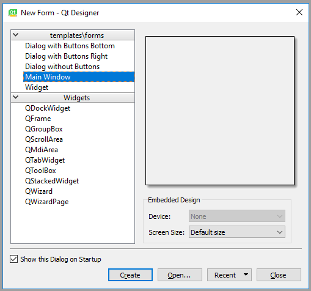
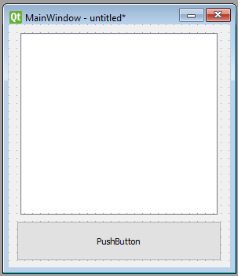
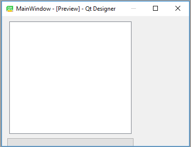
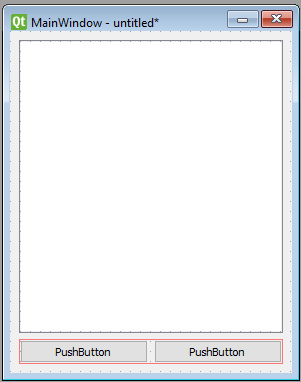
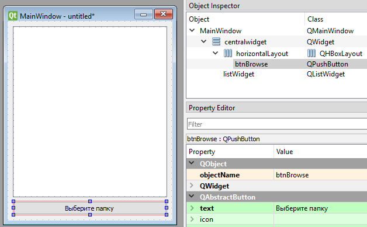

[содержание](/readme.md)  

# Тема 8.<br/>Лекция 1 Python GUI: создаём простое приложение с PyQt и Qt Designer

Мы уже познакомились с созданием оконных приложений с помощью встроенного модуля **tkinter**. Но, как показал опыт, этот модуль достаточно ограничен в возможностях, имеет устаревший внешний вид и не содержит визуального дизайнера окон.

Всем этим условиям удовлетворяет PyQT. Это кроссплатформенный графический фреймворк включающий в себя:
* набор виджетов графического интерфейса;
* стили виджетов;
* доступ к базам данных с помощью SQL (ODBC, MySQL, PostgreSQL, Oracle);
* QScintilla, основанный на Scintilla виджет текстового редактора;
* поддержку интернационализации (i18n);
* парсер XML;
* поддержку SVG;
* интеграцию с WebKit, движком рендеринга HTML;
* поддержку воспроизведения видео и аудио.

Устанавливается он просто: ``pip install pyqt5``

Интерфейс можно "нарисовать" прямо в программе, как и в tkinter: 

```py
import sys
from PyQt5.QtWidgets import QApplication, QWidget

if __name__ == '__main__':
    app = QApplication(sys.argv)
    w = QWidget()
    w.resize(250, 150)
    w.move(300, 300)
    w.setWindowTitle('Simple')
    w.show()
    app.exec_()
```    

И возможно мы еще вернемся к этому, но пока попробуем создать интерфейс в QD Designer.

Запустим Qt Designer, при запуске увидим диалог новой формы, выбераем Main Window и нажмаем Create.



После этого у нас должна появиться форма — шаблон для окна, размер которого можно менять и куда можно вставлять объекты из окна виджетов и т.д.

Теперь давайте немного изменим размер нашего главного окна, т.к. нам не нужно, чтобы оно было таким большим. А ещё давайте уберём автоматически добавленное меню и строку состояния, поскольку в нашем приложении они не пригодятся.

Все элементы формы и их иерархия по умолчанию отображаются в правой части окна Qt Designer под названием Object Inspector. Вы с лёгкостью можете удалять объекты, кликая по ним правой кнопкой мыши в этом окне. Или же вы можете выбрать их в основной форме и нажать клавишу DEL на клавиатуре.

В итоге мы имеем почти пустую форму. Единственный оставшийся объект — centralwidget, но он нам понадобится, поэтому с ним мы ничего не будем делать.

Теперь перетащите куда-нибудь в основную форму List Widget (не List View) и Push Button из Widget Box. Получится что-то подобное:




Теперь в меню Qt Designer нажмите Form, затем выберите Preview и увидите что-то похожее на скриншот выше. Выглядит хорошо, не так ли? Но вот что случится, когда мы изменим размер окна:



Наши объекты остались на тех же местах и сохранили свои размеры, несмотря на то что размер основного окна изменился и кнопку почти не видно. Вот поэтому в большинстве случаев стоит использовать макеты. Конечно, бывают случаи, когда вам, например, нужна фиксированная или минимальная/максимальная ширина объекта. Но вообще при разработке приложения лучше использовать макеты.

**Макеты** представляют собой контейнеры для виджетов, которые будут удерживать их на определённой позиции относительно других элементов. Поэтому при изменении размера окна размер виджетов тоже будет меняться.

Основное окно уже поддерживает макеты, поэтому нам ничего не нужно добавлять в нашу форму. Просто кликните правой кнопкой мыши по Main Window в Object Inspector и выберите Lay out → Lay out vertically. Также вы можете кликнуть правой кнопкой по пустой области в форме и выбрать те же опции.

Так как мы использовали вертикальное размещение, все элементы, которые мы добавим, будут располагаться вертикально (причем автоматически изменятся и размеры и поля элементов). Можно комбинировать размещения для получения желаемого результата. Например, горизонтальное размещение двух кнопок в вертикальном будет выглядеть так:



>У меня вновь созданный горизонтальный Layout показывался тонкой красной линией, в которую кнопкой попасть невозможно. В этом случае кнопку можно помещать не на форму, а на название нужного Layout в Object Inspector - результат будет тот же.

Название объектов, текст на кнопках и еще многое другое можно менять в окне Propery Editor.

Сразу приучитесь давать понятные имена переменным, желательно в венгерской нотации, например, нашу кнопку назовем btnBrowse.



Сохраним получившийся дизайн как ``design.ui`` в папке проекта. Это обычный XML-файл.

## Превращаем дизайн в код
Конечно, можно использовать .ui-файлы напрямую из Python-кода, однако есть и другой путь, который может показаться легче. Можно конвертировать код .ui-файла в Python-файл, который мы потом сможем импортировать и использовать. Для этого мы используем команду pyuic5 из терминала/командной строки.

Чтобы конвертировать .ui-файл в Python-файл с названием design.py, используйте следующую команду:

``pyuic5 path/to/design.ui -o output/path/to/design.py``

## Пишем код
Теперь у нас есть файл design.py с нужной частью дизайна нашего приложения и мы можем начинать работу над созданием его логики.

Создайте файл main.py в папке, где находится design.py.

Так как файл с дизайном будет полностью перезаписываться каждый раз при изменении дизайна, мы не будем изменять его. Вместо этого мы создадим новый класс ExampleApp, который объединим с кодом дизайна для использования всех его функций:

```py
import sys
from PyQt5 import QtWidgets
import design

class ExampleApp(QtWidgets.QMainWindow, design.Ui_MainWindow):
    def __init__(self):
        # Это здесь нужно для доступа к переменным, методам
        # и т.д. в файле design.py
        super().__init__()
        self.setupUi(self)  # Это нужно для инициализации нашего дизайна

if __name__ == '__main__':
    app = QtWidgets.QApplication(sys.argv)  # Новый экземпляр QApplication
    window = ExampleApp()  # Создаём объект класса ExampleApp
    window.show()  # Показываем окно
    sys.exit( app.exec_() )   # запускаем очередь событий
```

Если запустить этот код, то наше приложение запустится! Но нажатие на кнопку ничего не дает, это и понятно - никаких действий мы ей не назначили.

## Добавляем функциональность в наше Python GUI приложение

>Весь дальнейший код пишется внутри класса ExampleApp.

Начнём с кнопки "Выберите папку". Привязать к функции событие вроде нажатия на кнопку можно следующим образом:

```py
self.btnBrowse.clicked.connect(self.browse_folder)
```

Добавьте эту строку в метод \_\_init\_\_ класса ExampleApp, чтобы выполнить привязку при запуске приложения. А теперь взглянем на неё поближе:

* ``self.btnBrowse``: здесь btnBrowse — имя объекта, который мы определили в Qt Designer. self говорит само за себя и означает принадлежность к текущему классу;
clicked — событие, которое мы хотим привязать. У разных элементов разные события, например, у виджетов списка есть itemSelectionChanged и т.д.;
* connect() — метод, который привязывает событие к вызову переданной функции;
* self.browse_folder — просто функция (метод), которую мы сейчас добавим в классе ExampleApp.

Для открытия диалога выбора папки мы можем использовать встроенный метод 
QtWidgets.QFileDialog.getExistingDirectory:
```
directory = QtWidgets.QFileDialog.getExistingDirectory(self, "Выберите папку")
```
Если пользователь выберет директорию, переменной directory присвоится абсолютный путь к выбранной директории, в противном случае она будет равна None. Чтобы не выполнять код дальше, если пользователь закроет диалог, мы используем команду ``if directory:``.

Для отображения содержимого директории нам нужно импортировать os:

``import os``

И получить список содержимого следующим образом:

``os.listdir(directory)``

Для добавления элементов в listWidget мы используем метод addItem(), а для удаления всех элементов у нас есть self.listWidget.clear().

В итоге метод browse_folder должен выглядеть так:

```py
def browse_folder(self):
    self.listWidget.clear()  # На случай, если в списке уже есть элементы
    directory = QtWidgets.QFileDialog.getExistingDirectory(self, "Выберите папку")
    # открыть диалог выбора директории и установить значение переменной
    # равной пути к выбранной директории

    if directory:  # не продолжать выполнение, если пользователь не выбрал директорию
        for file_name in os.listdir(directory):  # для каждого файла в директории
            self.listWidget.addItem(file_name)   # добавить файл в listWidget
```

Теперь, если запустить приложение, нажать на кнопку и выбрать директорию, мы увидим список файлов в выбранном каталоге.

Так выглядит весь код нашего приложения:

```py
import sys, os
from PyQt5 import QtWidgets
import design

class ExampleApp(QtWidgets.QMainWindow, design.Ui_MainWindow):
    def __init__(self):
        # Это здесь нужно для доступа к переменным, методам
        # и т.д. в файле design.py
        super().__init__()
        # Это нужно для инициализации нашего дизайна
        self.setupUi(self)  
        # привязываем "клик" кнопки к методу 
        self.btnBrowse.clicked.connect(self.browse_folder)

    def browse_folder(self):
        # На случай, если в списке уже есть элементы
        self.listWidget.clear()  

        # открыть диалог выбора директории и установить значение переменной
        # равной пути к выбранной директории
        directory = QtWidgets.QFileDialog.getExistingDirectory(self, "Выберите папку")

        # не продолжать выполнение, если пользователь не выбрал директорию
        if directory:  
            # для каждого файла в директории
            for file_name in os.listdir(directory):  
                # добавить файл в listWidget
                self.listWidget.addItem(file_name)   


if __name__ == '__main__':
    # Новый экземпляр QApplication
    app = QtWidgets.QApplication(sys.argv)  
    # Создаём объект класса ExampleApp
    window = ExampleApp()  
    # Показываем окно
    window.show()  
    # запускаем приложение (очередь событий)
    sys.exit( app.exec_() )
```

По умолчанию, если мы закрываем приложение, QWidget закрывается без вопросов. Иногда мы хотим изменить это поведение по умолчанию, например, если у нас есть открытый файл, в котором мы сделали некоторые изменения. Мы показываем окно с сообщением для подтверждения действия.

Для этого в класс нашего приложения нужно добавить метод closeEvent (на самом деле мы переопределяем виртуальный метод Qt):

```py
def closeEvent(self, event):
    reply = QtWidgets.QMessageBox.question(self, 'Message',
        "Are you sure to quit?", 
        QtWidgets.QMessageBox.Yes | QtWidgets.QMessageBox.No, 
        QtWidgets.QMessageBox.No)

    if reply == QtWidgets.QMessageBox.Yes:
        event.accept()
    else:
        event.ignore()
```

## Прямая загрузка .ui-файлов
Собственно код меняется не сильно:

```py
# в импорт добавить класс uic
from PyQt5 import QtWidgets, uic
# import design - убираем ненужный теперь design
...

# соответственно в предках нашего класса остается только QMainWindow
class ExampleApp(QtWidgets.QMainWindow):
        # super().__init__()
        # self.setupUi(self)

        # и вместо двух предыдущих строчек пишем:
        QtWidgets.QMainWindow.__init__(self)
        uic.loadUi('design.ui', self)
```

И ВСЕ! Не нужно конвертировать ui в py и таскать с собой лишний файл (на самом деле количество файлом не изменится, просто вместо .py будет .ui)

>С обычными виджетами поиграемся на практике, а теперь посмотрим что у QT с выводом графиков. В платной версии есть компонент QtCharts (вроде недавно его и в бесплатную включили), но мы поищем халяву. В инете основные ссылки про работу с графиками ведут на [QCustomPlot](https://www.qcustomplot.com/index.php/download), попробуем его установить и подключить.
>
>Скачиваем дистрибутив (нам нужны только исходники, достаточно скачать третий из списка)
>
>
>
>Из всей библиотеки нам потребуется только два файла: **qcustomplot.cpp** и **qcustomplot.h**, скопируем их в каталог нашего проекта
>
не дописано...

[содержание](/readme.md)  
