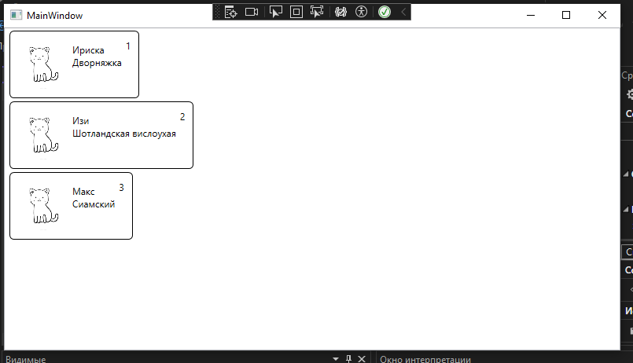
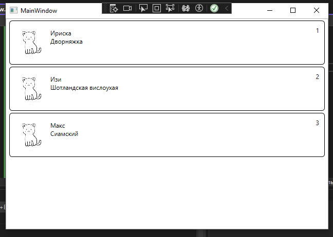
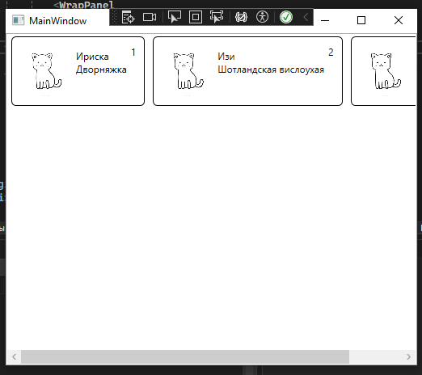
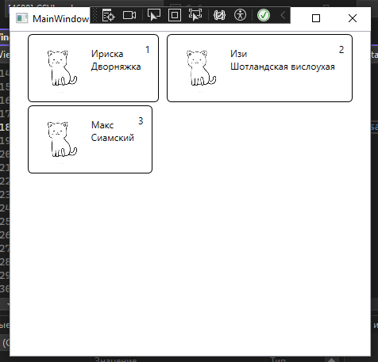
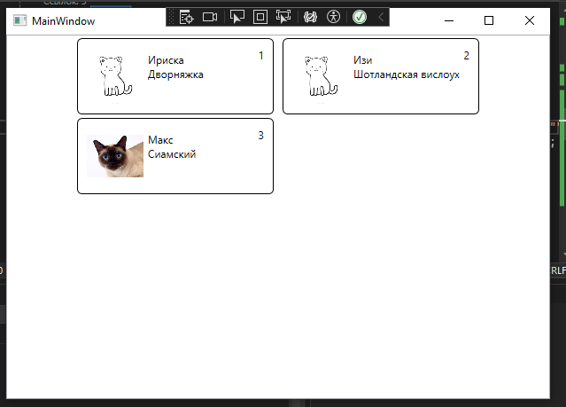

Предыдущая лекция | &nbsp; | Следующая лекция
:----------------:|:----------:|:----------------:
[Поиск, сортировка](./articles/wpf_search_sort.md) | [Содержание](../readme.md#тема-8-оконные-приложения) | &nbsp;

# Вывод данных согласно макета (ListBox, Image).

В реальных проектах **DataGrid** используется редко. Обычно используется компонент **ListBox**. Пример из задания одного из прошедших демо-экзаменов:


Вверху уже знакомый нам **WrapPanel**, а вот основная информация выводится в виде блоков

Для создания такого макета используется элемент **ListBox**

В разметке вместо **DataGrid** вставляем **ListBox**:

```xml
<ListBox 
    Grid.Row="1"
    Background="White"
    ItemsSource="{Binding catList}">
    <!-- 
        сюда потом вставить ListBox.ItemTemplate 
    -->
</ListBox>
```

Внутри него вставляем шаблон для элемента списка (*ListBox.ItemTemplate*): пока у нас только прямоугольная рамка со скруглёнными углами (в этом макете вроде скрулять не надо, возможно осталось от другого шаблона)

```xml
<ListBox.ItemTemplate>
    <DataTemplate>
        <Border 
            BorderThickness="1" 
            BorderBrush="Black" 
            CornerRadius="5">

            <!-- сюда потом вставить содержимое: grid из трёх колонок -->

        </Border>
    </DataTemplate>
</ListBox.ItemTemplate>  
```

Внутри макета вставляем **Grid** из трёх колонок: для картинки, основного содержимого и ещё чего-нибудь.

```xml
<Grid 
    Margin="10" 
    HorizontalAlignment="Stretch">

    <Grid.ColumnDefinitions>
        <ColumnDefinition Width="64"/>
        <ColumnDefinition Width="*"/>
        <ColumnDefinition Width="auto"/>
    </Grid.ColumnDefinitions>

    <!-- сюда потом вставить колонки -->

</Grid>
```

**В первой** колонке выводим изображение:

```xml
<Image
    Width="64" 
    Height="64"
    Source="{Binding ImageBitmap,TargetNullValue={StaticResource defaultImage}}" />
```

Обратите внимание, в классе **Cat** нет поля *ImageBitmap*. Для получения картинки я использую вычисляемое свойство *ImageBitmap* - в геттере проверяю есть ли такая картинка, т.к. наличие названия в модели не означает наличие файла на диске. Если файла нет, то возвращается `null` и рисуется картинка по-умолчанию, которую надо зашить в ресурсы приложения.

Изображение по-умолчанию задается в ресурсах окна (первый элемент окна)

```xml
<Window.Resources>
    <BitmapImage 
        x:Key='defaultImage' 
        UriSource='./Images/picture.png' />
</Window.Resources>
```

тут, как раз, указывается путь к изображению в ресурсах (в моём случае в приложении создан каталог `Images`)

>В реальных проектах, конечно, изображения получают с сервера, но на демо-экзамене на реализацию этого функционала времени нет, поэтому картинки кладутся в каталог с проектом (не в ресурсы, а в каталог с исполняемым файлом). Нам нужно найти картинки для нашей предметной области и добавить в поле _photo_

Добавьте в класс **Cat** вычисляемое свойство:  

```cs
public class Cat
{
    public Uri? ImageBitmap {
        get {
            var imageName = Environment.
                CurrentDirectory + "img/" + (photo ?? "");
            return System.IO.File.
                Exists(imageName) ? 
                new Uri(imageName) : null;
        }
    }
}
```

**Во второй** колонке вывожу основную информацию о кошке: _кличку_ и _породу_.

Так как данные выводятся в несколько строк, то заворачиваю их в **StackPanel** (тут можно использовать и **Grid**, но их и так уже много в разметке)

```xml
<StackPanel
    Grid.Column="1"
    Margin="5"
    Orientation="Vertical">

    <TextBlock 
        Text="{Binding name}"/>

    <TextBlock 
        Text="{Binding breed}"/>
</StackPanel>
```

**В третьей** колонке выводим возраст

```xml
<TextBlock 
    Grid.Column="2"
    Text="{Binding age}"/>
```

На данный момент приложение выглядит примерно так



Видно, что размер элемента зависит от содержимого.

Чтобы это исправить нужно добавить в **ListView** стиль для элемента контейнера, в котором задать горизонтальное выравнивание по ширине:

```xml
<ListView
    Grid.Row="1"
    Grid.Column="1"
    ItemsSource="{Binding ProductList}"
>
    <ListView.ItemContainerStyle>
        <Style 
            TargetType="ListViewItem">
            <Setter 
                Property="HorizontalContentAlignment"
                Value="Stretch" />
        </Style>
    </ListView.ItemContainerStyle>
    ...
```

Теперь окно должно выглядеть как положено:



# Вывод данных "плиткой"

Такое задание было на одном из прошлых чемпионатов, вполне вероятно что появится и на демо-экзамене.

Компоненты **ListBox** и **ListView** по умолчанию инкапсулируют все элементы списка в специальную панель **VirtualizingStackPanel**, которая располагает все элементы по вертикали. Но с помощью свойства **ItemsPanel** можно переопределить панель элементов внутри списка. 

Мы будем использовать уже знакомую вам **WrapPanel**:

```xml
<ListView.ItemsPanel>
    <ItemsPanelTemplate>
        <WrapPanel 
            HorizontalAlignment="Center" />
    </ItemsPanelTemplate>
</ListView.ItemsPanel>
```

>Атрибут *HorizontalAlignment* используем, чтобы "плитки" центрировались.



Как видим, элементы отображаются горизонтальным списком, но нет переноса. Для включения переноса элементов нужно в **ListView** отключить горизонтальный скролл, добавив атрибут `ScrollViewer.HorizontalScrollBarVisibility="Disabled"`:



Свойство *ItemContainerStyle* уже не нужно и его можно убрать.

Размеры наших элементов по-прежнему зависят от содержимого - тут надо править шаблон (ширина элемента **Grid** в **DataTemplate**).



Итоговая разметка для вывода "плиткой" должна выглядеть примерно так:

```xml
<ListView
    ItemsSource="{Binding catList}"
    ScrollViewer.HorizontalScrollBarVisibility="Disabled" 
>
    <ListView.ItemsPanel>
        <ItemsPanelTemplate>
            <WrapPanel 
                HorizontalAlignment="Center" />
        </ItemsPanelTemplate>
    </ListView.ItemsPanel>
    
    <ListView.ItemTemplate>
        <DataTemplate>
            <Grid
                Width="200"
                ...
```

```xml
```

Предыдущая лекция | &nbsp; | Следующая лекция
:----------------:|:----------:|:----------------:
[Поиск, сортировка](./articles/wpf_search_sort.md) | [Содержание](../readme.md#тема-8-оконные-приложения) | &nbsp;