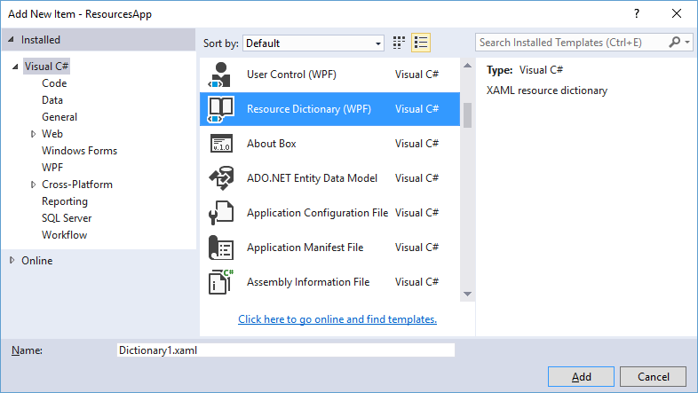

Предыдущая лекция | &nbsp; | Следующая лекция
:----------------:|:----------:|:----------------:
[Обзор типов оконных приложений в C#. Знакомство со структурой проекта WPF/Avalonia. Компоновка. Image. Ресурсы.](./t8_win_app.md) | [Содержание](../readme.md#тема-8-оконные-приложения) | [Привязка (Binding). Интерфейс INotifyPropertyChanged. Форматирование значений привязки и конвертеры значений.](./t8_binding.md)


# Ресурсы

## Концепция ресурсов в WPF

В WPF важное место занимают **ресурсы**. В данном случае под ресурсами подразумеваются не дополнительные файлы (или **физические ресурсы**), как, например, аудиофайлы, файлы с изображениями, которые добавляются в проект. Здесь речь идет о **логических ресурсах**, которые могут представлять различные объекты - элементы управления, кисти, коллекции объектов и т.д. Логические ресурсы можно установить в коде XAML или в коде C# с помощью свойства Resources. Данное свойство опредлено в базовом классе **FrameworkElement**, поэтому его имеют большинство классов WPF.

В чем смысл использования ресурсов? Они повышают эффективность: мы можем определить один раз какой-либо ресурс и затем многократно использовать его в различных местах приложения. В связи с этим улучшается поддержка - если возникнет необходимость изменить ресурс, достаточно это сделать в одном месте, и изменения произойдут глобально в приложении.

Свойство _Resources_ представляет объект **ResourceDictionary** или словарь ресурсов, где каждый хранящийся ресурс имеет определенный ключ.

### Определение ресурсов

Определим ресурс окна и ресурс кнопки:

```xml
<Window
    ..
>
    <Window.Resources>
        <SolidColorBrush 
            x:Key="redStyle" 
            Color="BlanchedAlmond" />
         
        <LinearGradientBrush 
            x:Key="gradientStyle" 
            StartPoint="0.5,1" 
            EndPoint="0.5,0">
            <GradientStop 
                Color="LightBlue" 
                Offset="0" />
            <GradientStop 
                Color="White" 
                Offset="1" />
        </LinearGradientBrush>
    </Window.Resources>

    <Grid 
        Background="{StaticResource redStyle}">

        <Button 
            x:Name="button1" 
            MaxHeight="40" 
            MaxWidth="120" 
            Content="Ресурсы в WPF" 
            Background="{StaticResource gradientStyle}">
            <Button.Resources>
                <SolidColorBrush 
                    x:Key="darkStyle" 
                    Color="Gray" />
            </Button.Resources>
        </Button>
    </Grid>
</Window>
```

Здесь у окна определяются два ресурса: **redStyle**, который представляет объект **SolidColorBrush**, и **gradientStyle**, который представляет кисть с линейным градиентом. У кнопки определен один ресурс **darkStyle**, представляющий кисть **SolidColorBrush**. Причем каждый ресурс обязательно имеет свойство `x:Key`, которое и определяе ключ в словаре.

А в свойствах _Background_ соответственно у грида и кнопки мы можем применить эти ресурсы: `Background="{StaticResource gradientStyle}"` - здесь после выражения **StaticResource** идет ключ применяемого ресурса.

### Управление ресурсами в коде C#

Добавим в словарь ресурсов окна градиентную кисть и установим ее для кнопки:

```cs
// определение объекта-ресурса
LinearGradientBrush gradientBrush = new LinearGradientBrush();
gradientBrush.GradientStops.Add(new GradientStop(Colors.LightGray, 0));
gradientBrush.GradientStops.Add(new GradientStop(Colors.White, 1));
 
// добавление ресурса в словарь ресурсов окна
this.Resources.Add("buttonGradientBrush", gradientBrush);
 
// установка ресурса у кнопки
button1.Background = (Brush)this.TryFindResource("buttonGradientBrush");
// или так
//button1.Background = (Brush)this.Resources["buttonGradientBrush"];
```

С помощью свойства _Add()_ объект кисти и его произвольный ключ добавляются в словарь. Далее с помощью метода _TryFindResource()_ мы пытаемся найти ресурс в словаре и установить его в качестве фона. Причем, так как этот метод возвращает object, необходимо выполнить приведение типов.

Всего у **ResourceDictionary** можно выделить следующие методы и свойства:

* Метод **Add(string key, object resource)** добавляет объект с ключом **key** в словарь, причем в словарь можно добавить любой объект, главное ему сопоставить ключ

* Метод **Remove(string key)** удаляет из словаря ресурс с ключом **key**

* Свойство **Uri** устанавливает источник словаря

* Свойство **Keys** возвращает все имеющиеся в словаре ключи

* Свойство **Values** возвращает все имеющиеся в словаре объекты

Для поиска нужного ресурса в коллекции ресурсов у каждого элемента определены методы **FindResource()** и **TryFindResource()**. Она оба возвращают ресурс, соответствующий определенному ключу. Единственное различие между ними состоит в том, что **FindResource()** генерирует исключение, если ресурс с нужным ключом не был найден. А метод **TryFindResource()** в этом случае просто возвращает `null`.

### Разделяемые ресурсы

Когда один и тот же ресурс используется в разных местах, то фактически мы используем один и тот же объект. Однако это не всегда желательно. Иногда необходимо, чтобы примение ресурса к разным объектам различалось. То есть нам необходимо, чтобы при каждом применении создавался отдельный объект ресурса. В этом случае мы можем изспользовать выражение `x:Shared="False"`:

```xml
<SolidColorBrush 
    x:Shared="False" 
    x:Key="redStyle" 
    Color="BlanchedAlmond" />
```

### Примеры использования ресурсов

Рассмотрим еще пару примеров применения ресурсов. К примеру, если мы хотим, чтобы ряд кнопок обладал одинаковыми свойствами, то мы можем определить одну общую кнопку в качестве ресурса:

```xml
<Window 
    ...
>
    <Window.Resources>
        <SolidColorBrush 
            x:Key="redStyle" 
            Color="BlanchedAlmond" />
 
        <LinearGradientBrush 
            x:Key="gradientStyle" 
            StartPoint="0.5,1" 
            EndPoint="0.5,0">
            <GradientStop 
                Color="LightBlue" 
                Offset="0" />
            <GradientStop 
                Color="White" 
                Offset="1" />
        </LinearGradientBrush>

        <Button 
            x:Key="resButton" 
            Background="{StaticResource gradientStyle}">
            <TextBlock 
                Text="OK" 
                FontSize="16" />
        </Button>
    </Window.Resources>

    <Grid 
        Background="{StaticResource redStyle}">
        <Button 
            Width="80" 
            Padding="0" 
            Height="40" 
            HorizontalContentAlignment="Stretch" VerticalContentAlignment="Stretch" 
            Content="{StaticResource resButton}" />
    </Grid>
</Window>
```

Другой пример - определение списка объектов для списковых элементов:

```xml
<Window
    ...         
    xmlns:sys="clr-namespace:System;assembly=mscorlib"
    xmlns:col="clr-namespace:System.Collections;assembly=mscorlib"
>
    <Window.Resources>
        <col:ArrayList x:Key="phones">
            <sys:String>iPhone 6S</sys:String>
            <sys:String>Nexus 6P</sys:String>
            <sys:String>Lumia 950</sys:String>
            <sys:String>Xiaomi MI5</sys:String>
        </col:ArrayList>
    </Window.Resources>
    <Grid>
        <ListBox ItemsSource="{StaticResource phones}" />
    </Grid>
</Window>
```

## Статические и динамические ресурсы в WPF

Ресурсы могут быть статическими и динамическими. Статические ресурсы устанавливается только один раз. А динамические ресурсы могут меняться в течение работы программы. Например, у нас есть ресурс кисти:

```xml
<SolidColorBrush 
    Color="LightGray" 
    x:Key="buttonBrush" />
```

Для установки ресурса в качестве статического используется выражение **StaticResource**:

```xml
<Button 
    MaxWidth="80" 
    MaxHeight="40" 
    Content="OK" 
    Background="{StaticResource buttonBrush}" />
```

А для установки ресурса как динамического применяется выражение **DynamicResource**:

```xml
<Button 
    MaxWidth="80" 
    MaxHeight="40" 
    Content="OK" 
    Background="{DynamicResource buttonBrush}" />
```

Причем один и тот же ресурс может быть и статическим и динамическим. Чтобы посмотреть различие между ними, добавим к кнопке обработчик нажатия:

```xml
<Button 
    x:Name="button1" 
    MaxWidth="80" 
    MaxHeight="40" 
    Content="OK"
    Background="{DynamicResource buttonBrush}"  
    Click="Button_Click" />
```

А в файле кода определим в этом обработчике изменение ресурса:

```cs
private void Button_Click(object sender, RoutedEventArgs e)
{
    this.Resources["buttonBrush"] = new SolidColorBrush(Colors.LimeGreen);
}
```

И если после запуска мы нажмем на кнопку, то ресурс изменит свой цвет, что приведет к изменению цвета кнопки. Если бы ресурс был бы определен как статический, то изменение цвета кисти никак бы не повлияло на цвет фона кнопки.

В то же время надо отметить, что мы все равно может изменить статический ресурс - для этого нужно менять не сам объект по ключу, а его отдельные свойства:

```cs
private void Button_Click(object sender, RoutedEventArgs e)
{
    // данное изменение будет работать и со статическими ресурсами
    SolidColorBrush buttonBrush = (SolidColorBrush)this.TryFindResource("buttonBrush");
    buttonBrush.Color = Colors.LimeGreen;
}
```

### Иерархия ресурсов

Еще одно различие между статическими и динамическими ресурсами касается поиска системой нужного ресурса. Так, при определении статических ресурсов ресурсы элемента применяются только к вложенным элементам, но не к внешним контейнерам. Например, ресурс кнопки мы не можем использовать для грида, а только для тех элементов, которые будут внутри этой кнопки. Поэтому, как правило, большинство ресурсов определяются в коллекции **Window.Resources** в качестве ресурсов всего окна, чтобы они были доступны для любого элемента данного окна.

В случае с динамическими ресурсами такого ограничения нет.

### Установка динамических ресурсов в коде C#

Ранее мы рассмотрели, как устанавливать в коде C# статические ресурсы:

```cs
LinearGradientBrush gradientBrush = new LinearGradientBrush();
gradientBrush.GradientStops.Add(new GradientStop(Colors.LightGray, 0));
gradientBrush.GradientStops.Add(new GradientStop(Colors.White, 1));
this.Resources.Add("buttonGradientBrush", gradientBrush);
 
button1.Background = (Brush)this.TryFindResource("buttonGradientBrush");
```

Установка динамического ресурса призводится немного иначе:

```cs
LinearGradientBrush gradientBrush = new LinearGradientBrush();
gradientBrush.GradientStops.Add(new GradientStop(Colors.LightGray, 0));
gradientBrush.GradientStops.Add(new GradientStop(Colors.White, 1));
this.Resources.Add("buttonGradientBrush", gradientBrush);
 
button1.SetResourceReference(Button.BackgroundProperty, "buttonGradientBrush");
```

Для установки применяется метод **SetResourceReference()**, который есть у большинства элементов WPF. Первым параметром в него передается свойство зависимости объекта, для которого предназначен ресурс, а вторым - ключ ресурса. Общая форма установки:

```
объект.SetResourceReference(Класс_объекта.Свойство_КлассаProperty, ключ_ресурса);
```

### Элементы StaticResource и DynamicResource

В ряде случае в разметке XAML бывает удобнее использовать не расширения разметки тип `"{StaticResource}"`, а полноценные элементы **DynamicResource** и **StaticResource**. Например:

```xml
<Window ...>
    <Window.Resources>
        <SolidColorBrush 
            Color="LimeGreen" 
            x:Key="buttonBrush" />
    </Window.Resources>

    <Grid>
        <Button 
            x:Name="button1" 
            MaxWidth="80" 
            MaxHeight="40" 
            Content="OK">
            <Button.Background>
                <DynamicResource 
                    ResourceKey="buttonBrush" />
            </Button.Background>
        </Button>
    </Grid>
</Window>
```

Элементы **StaticResource** и **DynamicResource** имеют свойство _ResourceKey_, которое позволяет установить ключ применяемого ресурса.

Особенно это эффективно может быть с контейнерами:

```xml
<Window ...>
    <Window.Resources>
        <Button 
            x:Key="buttonRes" 
            x:Shared="False" 
            Content="OK" 
            MaxHeight="40" 
            MaxWidth="80" 
            Background="Azure" />
    </Window.Resources>

    <StackPanel>
        <StaticResource ResourceKey="buttonRes" />
        <StaticResource ResourceKey="buttonRes" />
        <StaticResource ResourceKey="buttonRes" />
        <StaticResource ResourceKey="buttonRes" />
    </StackPanel>
</Window>
```

## Словари ресурсов

Мы можем определять ресурсы на уровне отдельных элементов окна, например, как ресурсы элементов Window, Grid и т.д. Однако есть еще один способ определения ресурсов, который предполагает использование **словаря ресурсов**.

Нажмем правой кнопкой мыши на проект и в контекстном меню выберем `Add -> New Item...`, И в окне добавления выберем пункт `Resource Dictionary (WPF)`:




Оставим у него название по умолчанию `Dictionary1.xaml` и нажмем на кнопку OK.

После этого в проект добавляется новый файл. Он представляет собой обычный xaml-файл с одним корневым элементом **ResourceDictionary**:

```xml
<ResourceDictionary 
    xmlns="http://schemas.microsoft.com/winfx/2006/xaml/presentation"
    xmlns:x="http://schemas.microsoft.com/winfx/2006/xaml"
    xmlns:local="clr-namespace:ResourcesApp">
     
</ResourceDictionary>
```

Изменим его код, добавив какой-нибудь ресурс:

```xml
<ResourceDictionary 
    xmlns="http://schemas.microsoft.com/winfx/2006/xaml/presentation"
    xmlns:x="http://schemas.microsoft.com/winfx/2006/xaml"
    xmlns:local="clr-namespace:ResourcesApp">
    <LinearGradientBrush 
        x:Key="buttonBrush">
        <GradientStopCollection>
            <GradientStop 
                Color="White" 
                Offset="0" />
            <GradientStop 
                Color="Blue" 
                Offset="1" />
        </GradientStopCollection>
    </LinearGradientBrush>
</ResourceDictionary>
```

После определения файла ресурсов его надо подсоединить к ресурсам приложения. Для этого откроем файл `App.xaml`, который есть в проекте по умолчанию и изменим его:

```xml
<Application 
    x:Class="ResourcesApp.App"
    xmlns="http://schemas.microsoft.com/winfx/2006/xaml/presentation"
    xmlns:x="http://schemas.microsoft.com/winfx/2006/xaml"
    xmlns:local="clr-namespace:ResourcesApp"
    StartupUri="MainWindow.xaml">
    <Application.Resources>
        <ResourceDictionary>
            <ResourceDictionary.MergedDictionaries>
                <ResourceDictionary 
                    Source="Dictionary1.xaml" />
            </ResourceDictionary.MergedDictionaries>
        </ResourceDictionary>
    </Application.Resources>
</Application>
```

Элемент `ResourceDictionary.MergedDictionaries` здесь представляет колекцию объектов **ResourceDictionary**, то есть словарей ресурсов, которые добавляются к ресурсам приложения. Затем в любом месте приложения мы сможем сослаться на этот ресурс:

```xml
<Button 
    Content="OK" 
    MaxHeight="40" 
    MaxWidth="80" 
    Background="{StaticResource buttonBrush}" />
```

При этом одновременно мы можем добавлять в коллекцию ресурсов приложения множество других словарей или параллельно с ними определять еще какие-либо ресурсы:

```xml
<Application 
    x:Class="ResourcesApp.App"
    xmlns="http://schemas.microsoft.com/winfx/2006/xaml/presentation"
    xmlns:x="http://schemas.microsoft.com/winfx/2006/xaml"
    xmlns:local="clr-namespace:ResourcesApp"
    StartupUri="MainWindow.xaml">

    <Application.Resources>
        <ResourceDictionary>
            <ResourceDictionary.MergedDictionaries>
                <ResourceDictionary 
                    Source="Dictionary1.xaml" />
                <ResourceDictionary 
                    Source="Dictionary2.xaml" />
                <ResourceDictionary 
                    Source="ButtonStyles.xaml" />
                <SolidColorBrush 
                    Color="LimeGreen" 
                    x:Key="limeButton" />
            </ResourceDictionary.MergedDictionaries>
        </ResourceDictionary>
    </Application.Resources>
</Application>
```

### Загрузка словаря ресурсов

Нам необязательно добавлять словарь ресурсов через ресурсы приложения. У объекта **ResourceDictionary** имеется свойство _Source_, через которое мы можем связать ресурсы конкретного элемента со словарем:

```xml
<Window ...>
    <Window.Resources>
        <ResourceDictionary 
            Source="Dictionary1.xaml" />
    </Window.Resources>
    <Grid>
        <Button 
            Content="OK" 
            MaxHeight="40" 
            MaxWidth="80" 
            Background="{StaticResource buttonBrush}" />
    </Grid>
</Window>
```

Предыдущая лекция | &nbsp; | Следующая лекция
:----------------:|:----------:|:----------------:
[Обзор типов оконных приложений в C#. Знакомство со структурой проекта WPF/Avalonia. Компоновка. Image. Ресурсы.](./t8_win_app.md) | [Содержание](../readme.md#тема-8-оконные-приложения) | [Привязка (Binding). Интерфейс INotifyPropertyChanged. Форматирование значений привязки и конвертеры значений.](./t8_binding.md)
