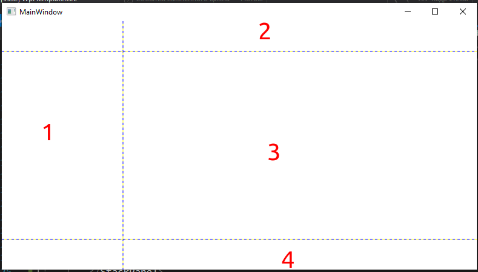
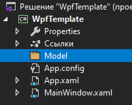
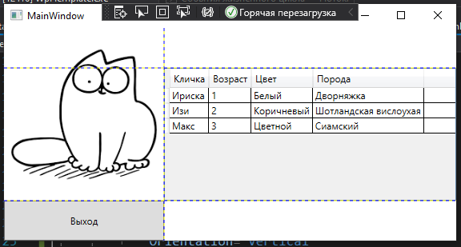

<table style="width: 100%;"><tr><td style="width: 40%;">
<a href="../articles/t8_elements.md">Элементы управления
</a></td><td style="width: 20%;">
<a href="../readme.md">Содержание
</a></td><td style="width: 40%;">
<a href="../articles/t8_elements.md">Элементы управления
</a></td><tr></table>

# Каркас приложения. Модель данных. Привязка данных. Табличный вывод.

## Каркас приложения.

На прошлых занятиях и лекциях мы разработали каркас для наших будущих приложений. Рассмотрим его ещё раз:



* В левой колонке **(1)** у нас будет элемент **StackPanel**, объединяющий все три строки. В нём будут находится логотип компании и основное меню приложения. Эта колонка имеет фиксированную ширину.

* В верхней строке правой колонки **(2)** будет расположено контекстное меню для элементов фильтрации, поиска и т.д. Эта строка имеет высоту "Auto", т.е. будет зависеть от содержимого.

* В середине второй колонки (3) будет расположен основной список с данными: элементы **DataGrid** или **ListView**

* В нижней строке второй колонки (4) будем располагать счётчики, пагинаторы и т.п.

Разметка выглядит так:

```xml
<Grid ShowGridLines="True">
    <Grid.RowDefinitions>
        <RowDefinition Height="auto"/>
        <RowDefinition />
        <RowDefinition Height="50"/>
    </Grid.RowDefinitions>
    <Grid.ColumnDefinitions>
        <ColumnDefinition Width="200"/>
        <ColumnDefinition/>
    </Grid.ColumnDefinitions>

    <!-- типа логотип компании -->
    <Image 
            Source="./Img/simon.png" 
            Grid.RowSpan="2"/>

    <StackPanel 
        Orientation="Vertical"
        Grid.RowSpan="3"
        VerticalAlignment="Bottom">
        <Button 
            x:Name="ExitButton"
            Content="Выход" 
            Click="ExitButton_Click"
            Height="50"/>
    </StackPanel>

    <WrapPanel
        Orientation="Horizontal"
        Grid.Column="1"
        MinHeight="50">
        <!-- минимальную высоту я тут поставил, чтобы верхнюю строку сетки было видно. В реальном приложении она не нужна -->
    </WrapPanel>
</Grid>
```

## Модель данных

В следующем году мы будем получать данные из базы данных, а пока будем экспериментировать на "кошках". Заодно оформим получение данных в виде интерфейса.

>В заданиях WorldSkills есть требование логически выделять модели. Поэтому создадим в проекте папку **Model** (в контекстном меню *решения* выбрать *добавить - создать папку*)
>
>

1. Создадим класс **Кошка** (в контекстном меню папки *Model* выбрать *Добавить - класс*):

    ```cs
    namespace WpfTemplate.Model
    {
        public class Cat
        {
            public string Name { get; set; }
            public int Age{ get; set; }
            public string Color { get; set; }
            // порода
            public string Breed { get; set; }
            public string Photo { get; set; }
        }
    }    
    ```

    >Студия не добавляет модификатор доступа классам - допишите **public**

2. Для работы с данными создадим интерфейс **IDataProvider** (поставщик данных) и класс **LocalDataProvider**, реализующий этот интерфейс

    В интерфейсе нам пока нужен только один метод: получение списка кошек

    ```cs
    namespace WpfTemplate.Model
    {
        interface IDataProvider
        {
            IEnumerable<Cat> GetCats();
        }
    }
    ```

    Метод *GetCats* класса **LocalDataProvider** возвращает список кошек, созданный программно

    ```cs
    public class LocalDataProvider : IDataProvider
    {
        public IEnumerable<Cat> GetCats()
        {
            return new Cat[]{
                new Cat{Age=1,Breed="Дворняжка", Color="Белый", Name="Ириска"},
                new Cat{Age=2,Breed="Шотландская вислоухая", Color="Коричневый", Name="Изи"},
                new Cat{Age=3,Breed="Сиамский", Color="Цветной", Name="Макс"}
            };
        }
    }
    ```

3. В простарнстве имен проекта создадим класс **Globals**, в котором объявим публичную статическую переменную *dataProvider* типа **IDataProvider**:

    ```cs
    class Globals
    {
        public static IDataProvider dataProvider;
    }
    ```

    Это нужно, чтобы поставщик данных был виден в любом месте проекта. 

4. В конструкторе главного окна (`MainWindow.xaml.cs`) присвоим глобальной переменной *dataProvider* экземпляр класса **LocalDataProvider** и сохраним список кошек в свойстве **CatList**

    ```cs
    public IEnumerable<Cat> CatList { get; set; }
   
    public MainWindow()
    {
        InitializeComponent();
        DataContext = this;
        Globals.dataProvider = new LocalDataProvider();
        CatList = Globals.dataProvider.GetCats();
    }

    private void ExitButton_Click(object sender, RoutedEventArgs e)
    {
        Application.Current.Shutdown();
    }
    ```

## Привязка данных. Табличный вывод

Теперь, имея данные для отображения, мы можем разместить в разметке элемент **DataGrid** и "привязать" к нему данные:

```xml
 <DataGrid
    Grid.Row="1"
    Grid.Column="1"
    CanUserAddRows="False"
    AutoGenerateColumns="False"
    ItemsSource="{Binding CatList}">
    <DataGrid.Columns>
        <DataGridTextColumn
            Header="Кличка"
            Binding="{Binding Name}"/>
        <DataGridTextColumn
            Header="Возраст"
            Binding="{Binding Age}"/>
        <DataGridTextColumn
            Header="Цвет"
            Binding="{Binding Color}"/>
        <DataGridTextColumn
            Header="Порода"
            Binding="{Binding Breed}"/>
    </DataGrid.Columns>
</DataGrid>
```

* Атрибут *CanUserAddRows="False"* запрещает элементу **DataGrid** добавлять строки с таблицу

* Атриут *AutoGenerateColumns="False"* запрещает автоматическое формирование столбцов таблицы - мы вручную описываем те столбцы, которые хотим видеть.

* Атрибут *ItemsSource="{Binding CatList}"* "привязывает" к таблице источник данных - наш список кошек. 

* В колонках таблицы мы уже "привязываемся" к свойствам класса источника данных

Приложение должно выглядеть примерно так:

