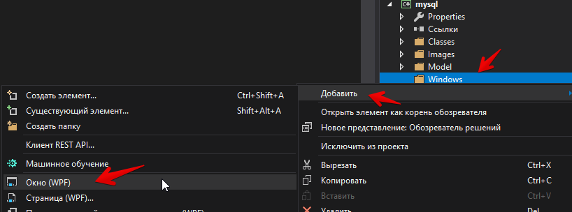

Предыдущая лекция | &nbsp; | Следующая лекция
:----------------:|:----------:|:----------------:
[Стили, триггеры и темы](./wpf_style.md) | [Содержание](../readme.md#тема-8-оконные-приложения) | [Создание окон. Модальные окна](./wpf_window.md)

# Создание окна

Более менее сложные проекты не помещаются в одно окно. WPF позволяет добавлять дополнительные окна в проект, либо использовать технологию со страницами (а-ля браузер). 

На этой лекции реализуем первый вариант - создание дополнительного окна и выведем в него подробную информацию об объекте.

>Вспоминаем, что мы должны соблюдать файловую структуру проекта, т.е. все однотипные объекты распихивать по соответствующим папкам. 
    
Создадим папку `Windows` в проекте и в неё добавим окно:



Название окна должно быть осмысленным и с суффиксом *Window*. У меня получилось *DetailWindow*

>Можно в каталог `Windows` перетащить и главное окно **MainWindow**. Только в этом случае надо в разметке приложения (`App.xaml`) добавить название каталога:
>
>```xml
><Application 
>   x:Class="mysql.App"
>   xmlns="http://schemas.microsoft.com/winfx/2006/xaml/presentation"
>   xmlns:x="http://schemas.microsoft.com/winfx/2006/xaml"
>   xmlns:local="clr-namespace:mysql"
>   StartupUri="Windows/MainWindow.xaml">
>               ^^^^^^^^
>...

Опять же, все окна должны иметь нормальные заголовки. В разметке окна поменяйте атрибут *Title* элемента **Window** (это надо сделать и для основного окна)

Верстку я расписывать не буду - придумайте сами (при выводе списка объектов "плиткой" мы показываем только основную информацию об объекте, в окне с детальной информацией можно показать всё).

В коде окна `DetailWindow.xaml.cs` в конструктор добавьте параметр:

```cs
// для получения данных из класса окна нам 
// нужно СВОЙСТВО, определяем его 
public Cat currentCat {get; set;}

// конструктор класса окна
public DetailWindow(Cat currentCat)
                    ^^^^^^^^^^^^^^
{
    // и инициализируем в конструкторе
    this.currentCat = currentCat;

    InitializeComponent();
}
```

Для открытия окна с детальной информацией будем использовать двойной клик на элементе списка в основном окне (обработчик события _MouseDoubleClick_ добавьте в **ListBox** самостоятельно)

```cs
private void caListBox_MouseDoubleClick(
    object sender, 
    MouseButtonEventArgs e)
{
    // в создаваемое окно передаем выбранного котика
    var detailWindow = new DetailWindow(
        catListBox.SelectedItem as Cat);

    detailWindow.ShowDialog();
}
```

Метод _ShowDialog_ открывает **модальное** окно (пока оно открыто фокус ввода не может вернуться на основное окно).

Если модальность не важна (логика задачи допускает открытие нескольких окон), то можно использовать метод _Show_.

Добавьте в окно с детальной информацией кнопку "OK" и добавьте ей свойство `IsCancel="true"`, чтобы окно закрывалось по клавише "Escape".